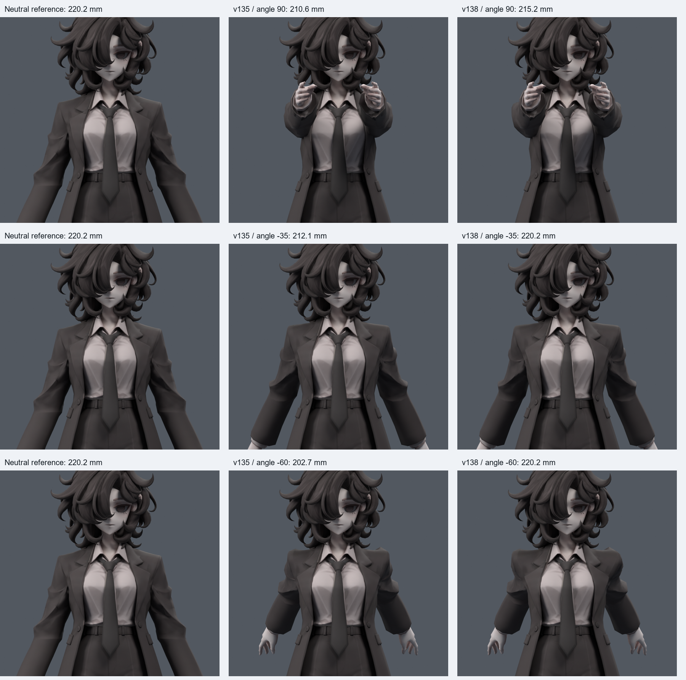
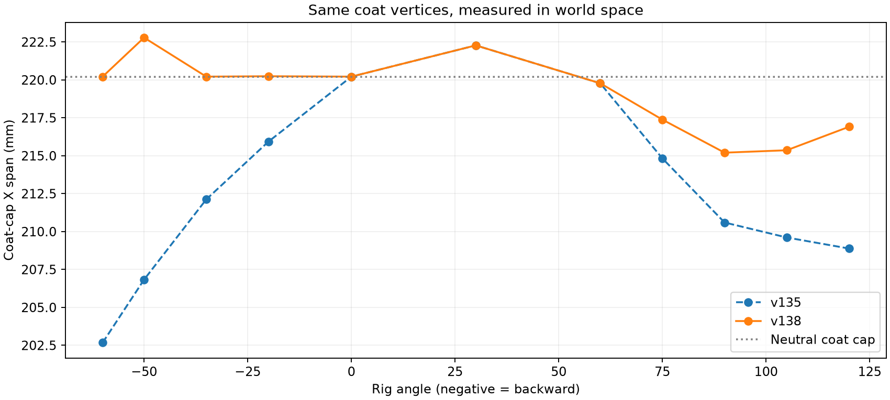
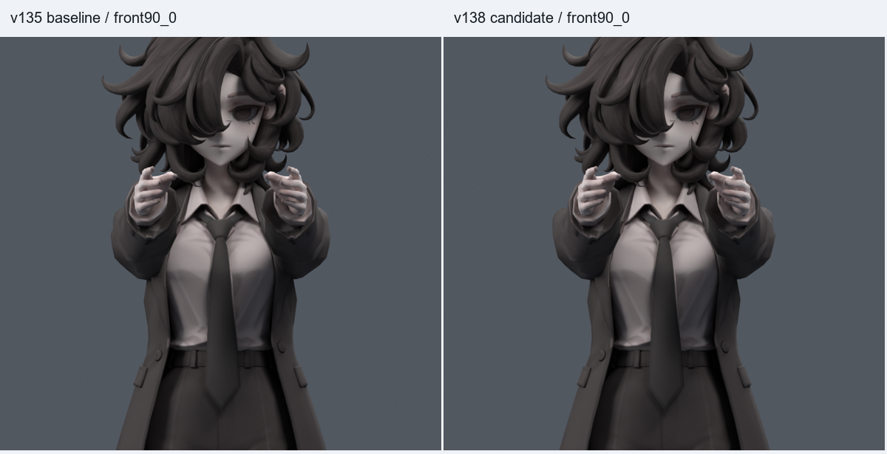
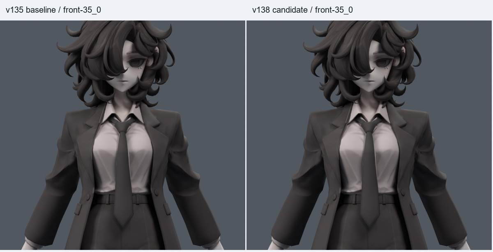
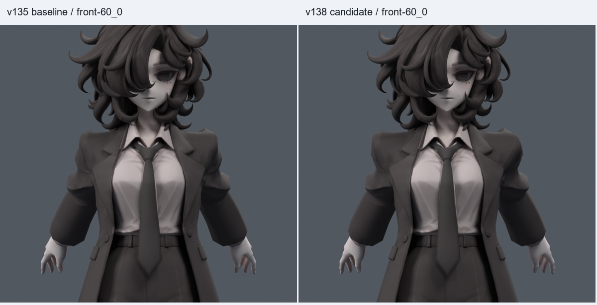

> **기록 시점 안내:** 아래는 해당 단계 당시의 보고서입니다. 후속 결정은 [최신 상태](../../STATUS.md)를 기준으로 읽어주세요. 모델·원본 텍스처·검증 원시 데이터는 이 문서 공유본에 포함하지 않습니다.

# v138 — 앞뒤 팔 동작의 어깨 폭 비교·수정

**코트 어깨·소매 연결부가 좁아지는 현상을 확인하고 별도 사본에서 보정했다. 골격 자체의 축소와 구분해야 한다. v138은 검수 후보이며 원본 또는 사용자 채택본을 덮어쓰지 않았다.**

[**추가: 뒤·사선·측면에서 기본 자세와 앞들기 비교**](extra_views/README.md)

## 확인할 파일

- 정적 검수 모델 (공유본 미포함: `bianca_SHOULDER_REVIEW.blend`)
- 동작 검수 모델 (공유본 미포함: `bianca_SHOULDER_MOTION_REVIEW.blend`):421프레임/24fps/36표식.
- [모션 미리보기](WIDTH_PREVIEW.gif)

|프레임|내용|
|---|---|
|1 / 397 / 421|기본 자세|
|73 / 373|양팔 앞90|
|385|앞120|
|313 / 325|한쪽/양쪽 뒤35|
|409|양팔 뒤60 스트레스 자세|
|25 / 37|옆120 / 옆 비틀림 보존|

## 무엇이 줄었나

v135에서 상완 관절 사이 간격은 기본166.0→앞90에서165.103mm로0.897mm 줄었다. 반면 동일한 코트 연결부 정점들의 가로 폭은220.215→210.598mm로약4.37% 감소했다. 뒤35에서도 관절 간격166mm는 그대로인데 코트 연결부는212.121mm로 줄었다. 어깨 윗부분만 따로 보면 앞들기에서 오히려 약간 넓어진다. 어깨 전체가 균일하게 축소된 것은 아니다.

기존 앞 보정키를 꺼도 앞90 폭은211.788mm에 그쳤고, 쇄골을 고정해도211.904mm였다. 기존 스키닝과 상완 회전으로 바깥쪽 소매캡 정점이 안쪽/앞으로 이동하는 영향이 크다. 원래 폭의 끝점들은 상완 웨이트약94.3%이며, 앞들기에서는 다른 정점이 폭의 끝점이 된다. 웨이트 하나가 잘못됐다는 단독 증명은 아니다. [v136의 전체 진단·자료](../v136_shoulder_width/REVIEW.md).

## 어떻게 수정했나

기존 메시의 소매캡 가로 두께를 부드럽게 보충하는 자세 보정을 만들었다. 각 정점을 원래 X로 강제 복귀시키는 초안은15mm 이상 움직이고 새 교차가 생겨 제외했다. 골격/손의 위치를 벌려서 폭을 맞추지 않았다. 앞90·120과뒤35·60의 좌우 독립 목표를 사용한다.

추가된 키는 V137 4개와 V138 4개, 총8개다. **기존 코트의 고유 정점 265개**에만 변화가 있다. v135의 기존8개 키/표현식,32773정점·17647면·106본·정지 좌표·UV·텍스처·노멀·기본 웨이트는 보존했다. 새 메시·리메시·캐릭터 교체는 하지 않았다. 총 키는 Basis를 제외하고16개다.

원래 연결부 폭은 재킷 인상을 보존하는 저작 기준으로 썼다. 실제 사람의 어깨 폭이 모든 자세에서 정확히 같아야 한다는 생체역학 규칙은 아니다. 중간 자세의 겹침을 막기 위해 실패한 면과 주변의 보정량을 제한했으므로 회복 정도는 각도마다 다르다.

## 기본·앞·뒤 폭 비교

기준 중립 폭: **220.215mm**. 정지 코트 |X|65–130mm,Z755–825mm의 고정 정점 집합을 추적한 maxX−minX이며 팔·손을 포함한 전체 bounding box가 아니다. 음수는뒤들기다.

|조작 각도|v135 폭 mm|v138 폭 mm|줄었던 폭의 회복률|
|---|---:|---:|---:|
|-60|202.673|220.215|100.0%|
|-50|206.833|222.787|119.2%|
|-35|212.121|220.215|100.0%|
|-20|215.933|220.241|100.6%|
|0|220.215|220.215|—|
|30|222.276|222.276|—|
|60|219.777|219.779|0.3%|
|75|214.827|217.382|47.4%|
|90|210.598|215.202|47.9%|
|105|209.610|215.362|54.2%|
|120|208.883|216.908|70.8%|

조작 각도는 A포즈에서 설정한 프로젝트 표식이며 임상 가동각과 같다고 할 수 없다. 회복률은 중립보다 좁아졌던 양에 대한 비율이고,100%는 그 표본에서 원래 폭을 회복했다는 뜻이다. 뒤50에서는 목표 자세 사이 보정이 겹치면서 중립 폭을 약1.17% 초과한다. 모든 중간 각도가 정확히 같은 폭은 아니다.

[앞120](BOARD_front120_0.png) · [앞90 측면](BOARD_front90_100.png) · [뒤35 측면](BOARD_front-35_100.png) · [뒤60 측면](BOARD_front-60_100.png) · [뒤35 후측면](BOARD_front-35_155.png) · [뒤60 후측면](BOARD_front-60_155.png) · [기본 자세](BOARD_front0_0.png) · [옆120](BOARD_side120_0.png)

## 회귀 검사

|난수 seed|기본+난수 자세|보정 활성|새/해소 면적 경고|새/해소 교차|
|---|---:|---:|---|---|
|1380913|39+400=439|144|0/1|0/3|
|1380914|39+400=439|114|0/1|0/2|

기본39는13각도×3비틀림으로 검사군마다 반복되므로 독립 표본으로 중복 합산하지 않는다. 새8키만off/on해 동일한 v135 자세와 비교했다. 난수는 앞뒤−65..125,좌/우/양팔,흉곽·허리·팔꿈치 혼합이다.

- 최종 저장 모션의 정수/반 프레임 **841개**에서 새 면적 경고0/새 교차0. 유한 좌표·팔 본 길이·드라이버 유효성을 확인하고 검사 SHA를 최종 모션 SHA와 대조했다. 기존 교차가 모두0이라는 뜻은 아니다.
- 36개 저장 표식 재현 차이0. v135의 비전방23개 저장 표식 차이0, 별도 옆들기15자세 보존.
- 중립과 옆120은 동일 카메라의600000픽셀 전부 일치.
- 4목표×몸통게이트10조건=40검사, quaternion 배율.6/1.3/−1검사. 이전373→385의회전부호연속화도 유지했다.
- v038 SMALL과v135를 포함한 이전14개 모델 파일의SHA보존. 새로운 전신1377자세 검사를 했다고 주장하지 않는다.

|자세|2배초과 늘어남 면적%|반이하 압축면적%|면적 경고|원래면 교차쌍|
|---|---|---|---|---|
|-60|0.705→0.789|2.667→2.455|6→6|99→99|
|-35|0.015→0.015|0.694→0.672|0→0|79→79|
|90|5.323→5.323|3.153→3.099|6→6|363→363|
|120|7.678→7.678|5.072→4.993|11→11|334→334|

폭 회복이 모든 표면 변형 수치의 개선을 뜻하지는 않는다. 뒤60에서는 2배 초과 늘어남의 면적 비율이0.705→0.789%로 소폭 늘었고, 반 이하 압축은2.667→2.455%로 줄었다. 앞120은 2배 초과 늘어남7.678%가 그대로 남는다. 전체 옷 품질 통과로 해석하지 않는다.

## 제한과 남은 작업

폭을 늘리는 과정에서 기존 접힘 주변에 새 경고가 생기는 후보는 그대로 반영하지 않았다. 앞쪽에 보정을 제한한 부분은 원래 폭까지 완전히 회복되지 않을 수 있다. 위 표의 실제 수치를 우선한다. 기존의 큰 겨드랑이/소매뿌리 접힘과 정지 관절 깊이 문제까지 해결한 것은 아니다.

보정은 해당 앞/뒤 자세 근처에서 작동한다. 상완 범위는V13730도/V13825도,쇄골8도,몸통15도다. 큰 비틀림이나 몸통 회전으로 이 범위를 벗어나면 원래 변형으로 돌아간다. 모든 복합 자세에서 폭을 고정하는 리그라고 하지 않는다.

Unity/VRChat PC에서 Blender 드라이버를 재현하는 경로와 실제 런타임 검증은 별도다. Quest는 범위 밖이다.

## 재현 자료

- [v136 진단/수동 목표](../v136_shoulder_width/REVIEW.md), [v137 앞90·뒤35 제한 과정](../v137_width_correction/REVIEW.md).
- 원형/폭/옆들기 검사 (공유본 미포함: `INVARIANTS.json`), 최종 파일 감사 (공유본 미포함: `FINAL_AUDIT.json`), 게이트 (공유본 미포함: `GATE_CHECK.json`), 경로 (공유본 미포함: `MOTION_PATH_CHECK.json`).
- 초기 RAW/G1/G2/G3/G4 검사와 GUARD JSON을 보존했다. G4 정적 검사가 통과한 뒤에도 첫 저장 모션에서 새 면적 경고 0 / 접촉 23건(표본별 합산)이 나왔다. 그 정적·모션·검사 파일은 rejected_motion/에 보존하고, 관련 면에 겹쳐 작동하는 V137/V138 보정 모두를 제한한 뒤 최종 모션을 다시 검사했다. 후보의 존재를 사용자 채택으로 해석하지 않는다.

공유 문서 저장소는v119 상태다. 이번 결과는 작업 저장소에 기록한다.
