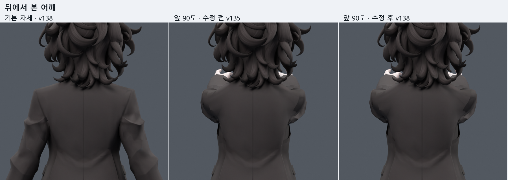
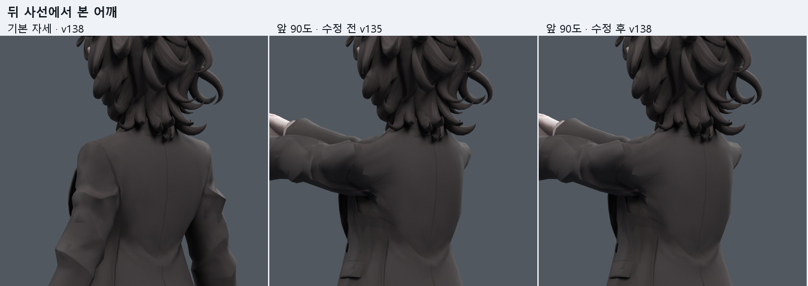
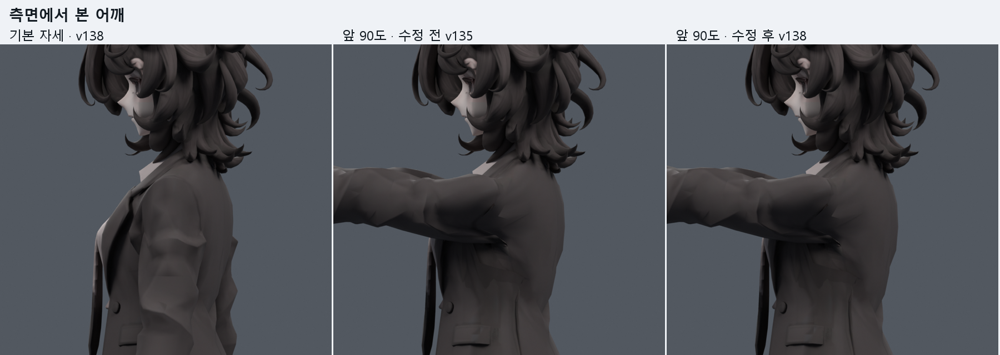
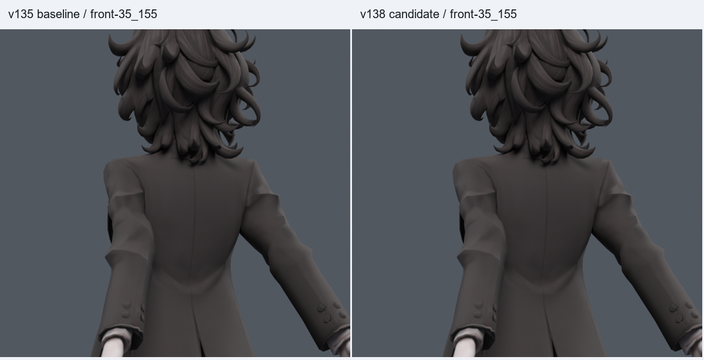
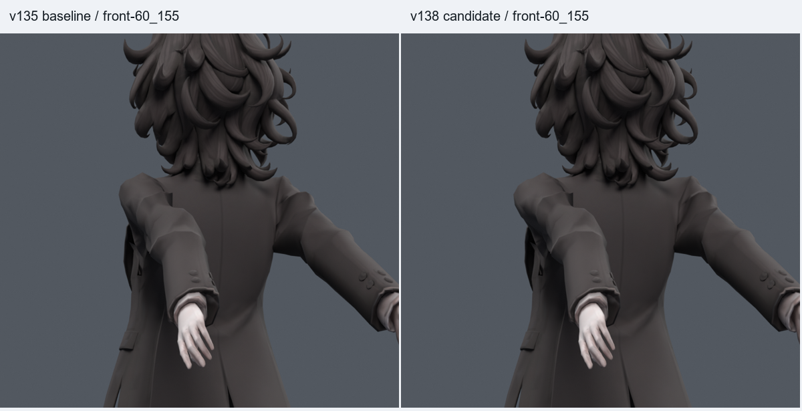

> **기록 시점 안내:** 아래는 해당 단계 당시의 보고서입니다. 후속 결정은 [최신 상태](../../../STATUS.md)를 기준으로 읽어주세요. 모델·원본 텍스처·검증 원시 데이터는 이 문서 공유본에 포함하지 않습니다.

# v138 어깨 — 뒤·사선·측면 추가 비교

팔을 앞으로 든 자세의 어깨가 정면에서는 가려져 추가 촬영했다. 각 그림은 **왼쪽 기본 자세 / 가운데 수정 전 v135 / 오른쪽 수정 후 v138**이다. 한 그림 안에서는 카메라·배율·조명이 동일하다. 코트가 잘 보이도록 어깨 주변을 확대했으며 모델 파일은 수정하지 않았다.

## 뒤에서

## 뒤 사선에서

## 측면에서

앞 90도 소매캡 폭은210.6→215.2mm이며 기본220.2mm까지 완전히 회복된 것은 아니다. 측면에 남은 큰 겨드랑이 접힘도 함께 확인할 수 있다.

## 팔을 뒤로 든 자세

아래는 앞 90도가 아닌 **뒤들기** 비교이며 왼쪽 v135 / 오른쪽 v138이다.

[전체 검수 문서와 Blender 파일](../START_HERE.md)
