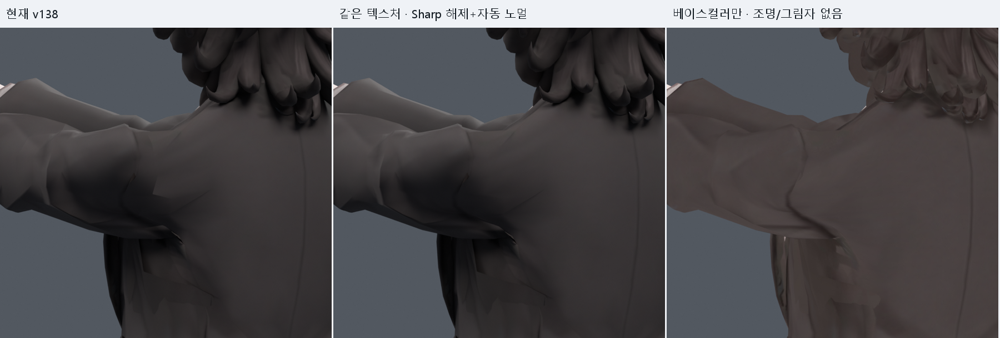
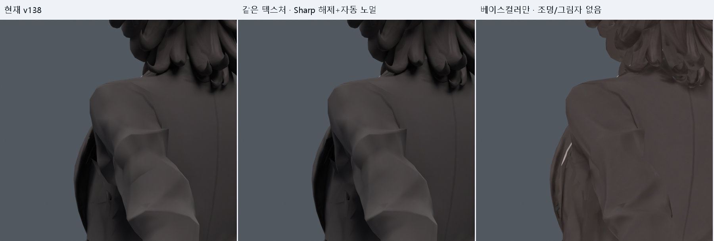
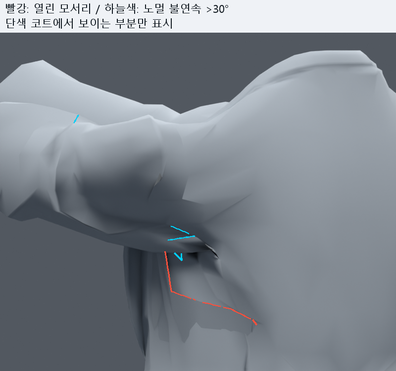

> **기록 시점 안내:** 아래는 해당 단계 당시의 보고서입니다. 후속 결정은 [최신 상태](../../STATUS.md)를 기준으로 읽어주세요. 모델·원본 텍스처·검증 원시 데이터는 이 문서 공유본에 포함하지 않습니다.

# v139 — 팔 앞뒤 동작의 끊긴 선·텍스처·음영 원인 진단

**결론: 팔이 몸통에서 통째로 떨어진 것이 아니다. Sharp 모서리의 음영 단절, 베이스컬러에 이미 들어 있는 어두운 선, 실제 겨드랑이 접힘이 겹쳐 보인다.** 이번 단계는 최신 v138을 대상으로 한 조사와 원인 분리다. 아래 자동 노멀 화면은 진단용이며 최종 수정본으로 채택하지 않았다. 메시·리그·원본 텍스처 파일을 수정하거나 새 캐릭터를 생성하지 않았다.

## 가장 먼저 볼 비교

왼쪽은 현재 v138, 가운데는 **같은 텍스처를 유지하면서 코트 Sharp를 해제하고 노멀을 자동 계산한 진단**, 오른쪽은 베이스컬러를 발광 셰이더로 출력해 조명·그림자를 배제한 화면이다. 같은 자세·카메라·배율이다.

[뒤60 같은 비교](B60_COLOR_DIAG.png) · [앞90 단색 비교](F90_NORMAL_DIAG.png) · [뒤35 단색 비교](B35_NORMAL_DIAG.png) · [뒤60 단색 비교](B60_NORMAL_DIAG.png)

가운데에서 줄어드는 넓고 각진 패치 경계는 음영 문제다. 오른쪽에도 남는 어깨 둘레의 어두운 곡선은 현재 조명이 만드는 그림자가 아니라 베이스컬러 내용이다. 겨드랑이의 깊은 홈은 단색·자동 노멀에서도 남으므로 형상 문제를 별도로 다뤄야 한다.

## 1. 음영 경계 — 주된 즉시 수정 대상

최신 코트는 1,736정점·1,934면으로 이루어진 하나의 연결 성분이다. 모든 코트 면은 Smooth이지만 **Sharp 모서리 102개**가 남아 있다. 따라서 ‘Shade Smooth 상태이니 음영 이음은 없다’고 판단하면 안 된다. Blender는 실제 형상을 바꾸지 않고 노멀 보간 방식으로 표면의 부드러움을 표현한다. [Blender 공식 Shading 설명](https://docs.blender.org/manual/en/latest/scene_layout/object/editing/shading.html).

원인을 분리하기 위해 세 가지를 따로 비교했다.

|조작|앞90 결과|판단|
|---|---|---|
|커스텀 노멀만 자동값으로 초기화, Sharp 유지|원본 대비 최대 채널 차이 1/255, 평균 약0.00058/255|유의한 시각 개선은 거의 없음|
|Sharp만 해제, 기존 커스텀 노멀 데이터 유지|최대28/255, 평균0.16331/255; 넓은 각진 경계 완화|이 진단에서 주된 차이를 만든 요인|
|Sharp 해제+자동 노멀|Sharp만 해제한 결과와 매우 유사|커스텀 데이터 초기화 자체가 핵심은 아님|

뒤35·60에서도 같은 경향이었다. 픽셀 차이는 조작 영향의 확인용이며 화질 점수나 개선률이 아니다. 원자료 (공유본 미포함: `ISOLATION_PIXEL_CHECK.json`).

특히 앞90의 **실제 모서리 46193, 정점6717–28807, 원래 면15405/15408**은 이웃 면 법선 사이가 약2.0도인데, 같은 끝점에서 렌더에 사용하는 코너 노멀 차이는 약72.9도였다. 면이 거의 이어지는 곳에도 강한 밝기 경계가 나타날 수 있는 구체적인 사례다. 나머지 뒤쪽 후보 모서리10795·47313·45428·46507은 전체 모서리 감사 (공유본 미포함: `SEAM_AUDIT.json`)에서 위치와 각도를 확인할 수 있다. 각 모서리를 무조건 제거 대상으로 확정한 것은 아니다.

‘custom normals가 존재한다’는 사실만으로 손상이라고 단정하지 않았다. v051에서도 코트 Sharp102개를 확인한 이력이 있으며, v138은 기존 노멀을 보존한 폭 보정이었다. 이번 폭 보정이 새로102개를 만든 것은 아니다. [이전 진단](../v051_pose_normals/REVIEW.md).

## 2. 텍스처 — 실제 이미지에 남아 있는 어두운 선

실제로 연결된 노드는 `FINAL_V005_BASECOLOR → Principled BSDF Base Color`이며, 이미지 이름은 `Bianca_reference_basecolor_v005`, 크기는4096×4096이다. **Principled Normal 입력에는 노멀맵이 연결돼 있지 않다.** 이번 선을 손상된 노멀맵 텍스처 때문이라고 부르면 부정확하다. 재질 노드 감사 (공유본 미포함: `MATERIAL_AUDIT.json`), 소스 이미지 정보 (공유본 미포함: `TEXTURE_SOURCE.json`).

원래 이미지의 어깨 관련 UV 영역을 확대하면 어두운 사선과 그라데이션이 이미 그려져 있다. 생성/베이크 과정 중 어느 단계에서 만들어졌는지까지 이번 검사만으로 단정하지 않는다.

베이스컬러 원본 픽셀 확대 (공유본 미포함: `TEXTURE_PATCHES.png`)

이 선은 팔을 움직일 때 표면을 따라 늘어나지만 조명 방향이나 실제 접힘에 맞춰 새로 계산되지는 않는다. 실제 음영과 겹치면 깊은 절단선처럼 느껴질 수 있다. 캐릭터의 의도적인 봉제선과 과한 고정 그림자를 구분해 수정해야 한다. 앞면 레퍼런스만으로 등쪽의 정확한 봉제선 디자인까지 확정할 수는 없다.

UV도 확인했다. 조사 영역에는 UV가 나뉜 모서리604개가 있지만, UV 분할은 곧 메시 분리나 잘못된 색 이음을 뜻하지 않는다. 뒤35에서 관찰한 대표 경계6726–6727(원래 면3295/16523)은 UV가 다른 섬으로 나뉘지만 경계 양쪽의 근접 픽셀 색 차이는 작은 편이었다(4표본 평균 sRGB 벡터 차이 약0.00196). 인접 경계6727–6728도 약0.00375였다. **이 대표 곡선을 큰 UV 색 불일치가 주원인인 이음새라고 확정할 증거는 부족하다.** 표본은 최근접 텍셀·면 중심 쪽0.5% 안쪽 값이며 전체 UV 경계/밉맵 검증은 아니다. UV 측정 (공유본 미포함: `UV_SEAMS.json`).

## 3. 실제 연결·접힘 — 별도 형상 문제

코트 전체는 하나로 연결돼 있고, 같은 위치로 묶이는 중복 코트 정점은1µm 반올림 기준0그룹이다. 검사 영역에서 3면 이상이 붙은 모서리0개, 코트 전체에서 공유 모서리 방향이 모순되는 면 쌍0개였다. ‘분리된 팔을 전부 Merge by Distance 하면 해결’이라는 접근은 현재 근거와 맞지 않는다.

다만 코트에 열린 모서리 자체는 있다. 전체59개가53개와6개의 두 경계를 이룬다. 이 중 조사 영역에19개가 있다. 큰 경계의 일부가 앞여밈·겨드랑이 근처로 이어지므로 이를 전부 사고로 생긴 구멍으로 취급하고 막아서는 안 된다. 6변 경계는 정지 Z639–656mm의 더 아래쪽이다. **한 연결 성분이라는 사실만으로 완전히 닫힌 메시라고 주장하지 않는다.** 경계 성분 (공유본 미포함: `BOUNDARY_COMPONENTS.json`).

빨강은 실제 열린 모서리, 하늘색은 같은 정점의 코너 노멀 차이가30도 넘는 공유 모서리다. 코트만 남긴 화면에서 가시성이 확인되는 부분만 표시했다. 30도 이하 음영 경계도 있을 수 있다. 모든 검은 선이 빨간 열린 모서리와 일치하지 않는다. [뒤35 표시](B35_EDGE_OVERLAY.png).

정지 위치 기준 코트 |X|45–160mm, Z690–840mm의 공유 모서리1,307개를 동일하게 추적했다.

|조작 각도|이웃 면 법선 차이 >90도|코너 노멀 불연속 >30도|
|---|---:|---:|
|0|41|39|
|90|85|55|
|-35|38|35|
|-60|42|44|

기본 자세에도 옷의 접힌 안쪽 면이 있으므로 이 개수를 모두 결함으로 세지 않는다. 하지만 앞90에서 큰 꺾임이 늘고, 자동 노멀로도 겨드랑이 홈이 남는 사실은 형상/스키닝 문제가 별개라는 근거다. 기존 v135가 기록한 압축 면15406 등도 여전히 후속 수정 대상이다. [이전 형상 진단과 계획](../v135_transport_review/NEXT_WORK.md).

## 조사한 해결책과 적용 순서

### 먼저: 어깨 주변 Sharp를 국소 정리

기존 v138 사본에서 어깨캡·몸판 연결의 잘못된 Sharp만 선별 해제하고, 그 주변의 노멀을 다시 평가한다. 실제 봉제선 전체와 옷깃의 각까지 지우는 전역 평활화는 최종안으로 삼지 않는다. 이번 전체 코트 Sharp 해제는 원인 확인용이다. 정지·앞30/60/90/120·뒤15/35/60·옆90/120과 단측/양측, 서로 다른 조명에서 비교한다. 메시 좌표·웨이트·UV·16보정키는 그대로 유지할 수 있는 수정이다.

Weighted Normal은 면적/각도 가중치로 음영을 조절하고 그룹 제한·Keep Sharp를 지원한다. 그러나 잘못된 Sharp를 유지한 채 옵션만 추가하면 원하는 경계가 그대로 남을 수 있다. 현재는 모디파이어 추가보다 Sharp 선별이 먼저다. [Blender 공식 Weighted Normal](https://docs.blender.org/manual/id/3.6/modeling/modifiers/modify/weighted_normal.html).

### 다음: 고정 그림자가 강한 텍스처 선만 완화

기존 베이스컬러의 별도 파일에서 어깨·암홀의 검은 띠와 그림자 농도를 국소 조정한다. 봉제선 자체를 모두 지우거나 얼굴·머리·옷 색을 다시 생성하지 않는다. UV 섬 양쪽을 함께 칠하고, 경계 여백과 축소 표시도 확인한다. 기존 색과 봉제 디자인을 살리면서 절단선처럼 보이는 강도만 줄이는 방향이다.

Blender의 Diffuse 베이크는 Color만 선택하면 표면 색을, Direct/Indirect까지 선택하면 조명 기여가 섞인 결과를 낼 수 있다. **이미 색 이미지 안에 그려진 그림자는 Color만 다시 베이크해도 자동 제거되지 않으므로 원본 색 보정이 선행돼야 한다.** UV 경계는 Margin의 Extend/Adjacent Faces를 검토한다. [Blender 공식 Render Baking](https://docs.blender.org/manual/en/latest/render/cycles/baking.html).

### 그 뒤: 실제 접힘을 웨이트·자세 보정으로 수정

음영을 정리한 단색 화면에서 남는 홈에 집중한다. 몸판–소매의 가중치 전이를 국소 비교하고 Normalize All로 합을 보존한다. 자동으로 넓게 Smooth하기보다 변형 시 면 흐름이 이어지는 범위를 선택해야 한다. [Blender 공식 Weight Paint 편집](https://docs.blender.org/manual/en/5.2/sculpt_paint/weight_paint/editing.html).

웨이트/본을 바꿀 경우 기존16개 보정키가 목표로 한 변형도 함께 재평가해야 한다. Blender Studio의 Pose Shape Keys는 최종 자세 형상을 기준으로 웨이트 변경 뒤 보정키를 다시 계산하는 접근을 설명한다. 이 프로젝트에서도 기존 메시 사본을 목표로 삼는 방법은 가능하지만, 애드온을 설치하거나 적용했다고 주장하지 않는다. [Blender Studio 워크플로](https://studio.blender.org/tools/pipeline-overview/asset-creation/rigging), [Pose Shape Keys 설명](https://studio.blender.org/tools/addons/pose_shape_keys).

Corrective Smooth는 Armature 뒤의 찌그러짐을 줄이고 정지 좌표/Bind 좌표, 영역 제한, Pin Boundaries를 제공한다. 다만 부피 손실 가능성이 있고 v048/v133의 넓은 보정 실패가 있으므로 기본 해결 버튼으로 취급하지 않는다. 이번 조사에서는 새 형상 실험으로 적용하지 않았다. [Blender 공식 Corrective Smooth](https://docs.blender.org/manual/en/4.2/modeling/modifiers/deform/corrective_smooth.html).

Preserve Volume도 회전 시 축소를 줄일 수 있지만 현재 문제의 텍스처 선이나 Sharp 표시를 고치지는 않는다. 기존 v122 전체 적용 실패가 있어 단독 재적용을 우선하지 않는다. [Blender 공식 Armature](https://docs.blender.org/manual/en/latest/modeling/modifiers/deform/armature.html).

### Unity/VRChat PC에서 확인할 항목

Blender에서 결정한 노멀을 Import할지 Unity에서 Calculate할지, Blend Shape Normals를 같은 기준으로 처리할지 실제 엔진에서 비교한다. 셰이더 그림자와 밉맵까지 포함해야 최종 음영 판정이 가능하다. 아직 Unity 검증은 수행하지 않았다. [Unity 공식 Model Import 설명](https://docs.unity3d.com/cn/6000.0/Manual/FBXImporter-Model.html). Quest는 고려 대상이 아니다.

## 이번에 완료한 것과 미완료인 것

- 최신 v138 실제 MCP 점검, 기본/앞90/뒤35/뒤60 연결·모서리·노멀 검사.
- 24개 렌더로 텍스처 유지/제거, Sharp만 해제, 커스텀 노멀만 초기화, 둘 다 변경, 베이스컬러 단독 출력을 분리 비교. 모델 좌표 변화0 확인.
- 원본 베이스컬러 픽셀과 실제 UV 경계 표본 확인. 이미지 파일 경로는 오래된 경로이지만 Blender에 패킹된 이미지가 실제 사용 중임을 확인.
- 문서·이미지·감사 자료 저장. 원본 및 v138 모델 파일은 보존.
- **미완료:** 국소 Sharp 선별을 반영한 최종 파일, 텍스처 부분 보정, 실제 홈 수정, Unity 런타임 검사. 이번 문서는 그 순서를 확정하는 진단이다.

참고 자료는 공식 문서와 Blender Studio의 공개 설명을 확인했다. 일부 문서 직접 열기가 실패하여 검색 도구에 제공된 공식 본문을 함께 사용했다. 유료 강좌나 링크된 영상 전체를 시청했다고 주장하지 않는다.
