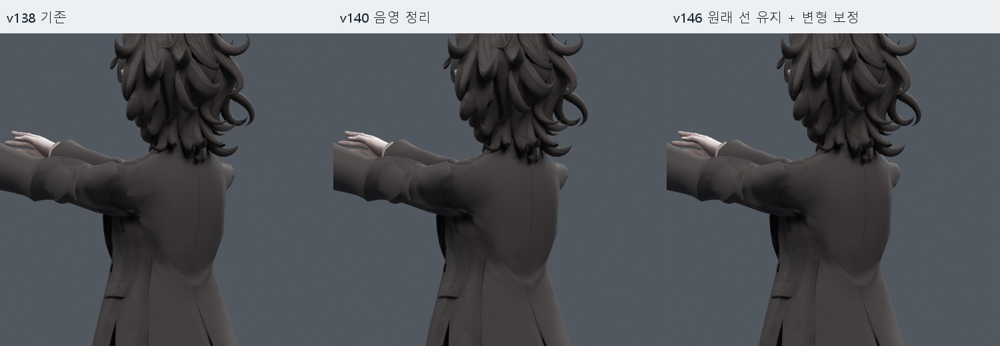
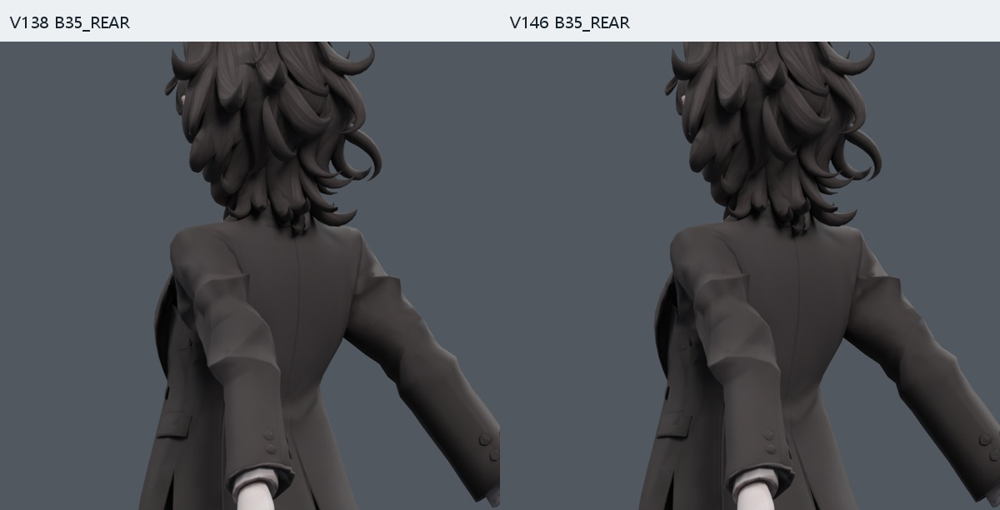
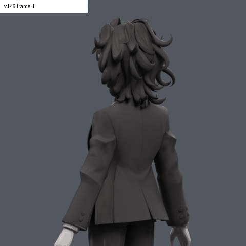
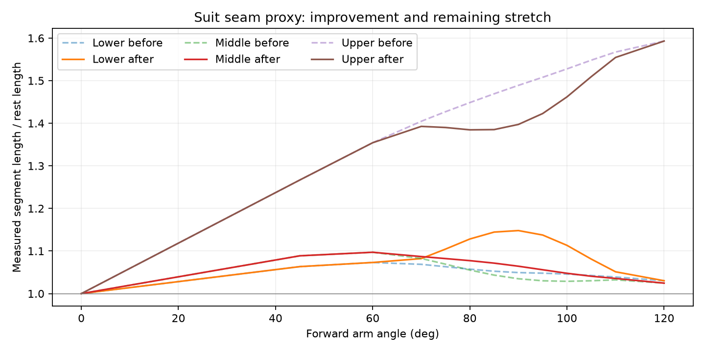

> **기록 시점 안내:** 아래는 해당 단계 당시의 보고서입니다. 후속 결정은 [최신 상태](../../STATUS.md)를 기준으로 읽어주세요. 모델·원본 텍스처·검증 원시 데이터는 이 문서 공유본에 포함하지 않습니다.

# v146 — 정장 어깨선 보존·변형·대각선 검수

**원래 정장 어깨선과 텍스처를 유지한 별도 검수본이다.** 선 주변의 과한 늘어남을 줄이고, 작은 변화로 사각형 내부 대각선이 바뀌던 문제를 국소 수정했다. 어깨 전체가 해결된 최종 아바타나 사용자 채택 완료를 뜻하지 않는다.

## 바로 확인할 파일

- 정적 모델 (공유본 미포함: `bianca_SEAM_REVIEW.blend`)
- 동작 모델 (공유본 미포함: `bianca_SEAM_MOTION_REVIEW.blend`) — 421프레임,24fps. 앞90은73/373, 옆120은25, 뒤35는325, 뒤60은409. 전체 36표식 목록 (공유본 미포함: `MOTION.json`).
- 정적 검사와 각도별 수치 (공유본 미포함: `FINAL_STATIC_AUDIT.json`)
- [원인 측정·웨이트 실험](../v144_seam_transport/START_HERE.md)

`bianca_SEAM_CONTROL.blend`는 대각선 수정만 적용한 검사 기준이다. 비교할 때는 REVIEW 또는 MOTION_REVIEW 파일을 연다.

## 같은 카메라 비교

앞90 비교의 세 칸은 **v138 → 음영만 정리한 v140 → 변형까지 보정한 v146**이다. 모두 원래 텍스처를 사용한다.

[측면 비교](COMPARE_F90_SIDE.jpg) · [정면 비교](COMPARE_F90_FRONT.jpg) · [뒤사선 확대](COMPARE_F90_DETAIL.jpg) · [측정한 세 구간 표시](MEASURED_SEGMENTS.jpg)

[뒤60 비교](COMPARE_B60_REAR.jpg) · [기본 자세](COMPARE_NEUTRAL.jpg) · [옆120 보존 확인](COMPARE_SIDE120.jpg) · [반대쪽 조명 비교](COMPARE_ALT_LIGHT.jpg)

GIF는26개 시점의 포즈 모음이며421프레임 전체를 연속 재생한 영상은 아니다. 전체 동작은 모션 .blend에서 확인한다. 선택 프레임 목록 (공유본 미포함: `PREVIEW_FRAMES.json`).

## 사용자 기준과 실제 변경

원본을 다시 확인했다. 사용자가 설명한 대로 정장에는 어깨선이 있어야 하며, 그 선이 과하게 끌려가거나 늘어나는 것을 먼저 고쳐야 한다. 그래서 **v141/v143의 텍스처 완화는 적용하지 않았다.** 원래 어깨선 색과 UV를 보존했다. v140의 불필요한 Sharp67개 정리만 유지해 각진 음영을 줄였다. 남은 Sharp35개와 봉제선은 유지한다.

최종은 원래 코트86정점에 좌우 앞들기 보정 키2개를 추가한 형태다. 원래 웨이트, 본106개, 기존16개 보정 키의 좌표와 표현식은 보존했다. 최대 추가 이동 약3mm, 코트 외 좌표 변화0. 원래32,773정점을 그대로 사용했다.

또한 기존 사각형 **원래 면15414 하나만 원래 rest 대각선대로 두 삼각형으로 나눴다.** 새 정점은 없다. 면 수는17,647→17,648이다. 대각선은28805–6723이다. 사각형의 네 정점과 UV를 그대로 유지했고, 두 삼각형에 원래 면 ID도 남겼다. 변경·보존 검사 (공유본 미포함: `BUILD.json`).

## 실제로 얼마나 달라졌는가

뒤쪽 봉제선 부근의 정점6726→6727→6728→6732를 고정 표본으로 삼았다. 아래는 앞90에서 각 구간 길이를 기본 길이로 나눈 값이다. **전체 봉제선 측정이나 정장 원단의 물성 검증은 아니다.**

|구간|기존|v146|
|---|---:|---:|
|하단|1.049|1.148|
|중간|1.035|1.064|
|상단|1.489|1.397|

가장 많이 늘어나는 상단은 **약49% 늘어남에서 약40%로 감소**했다. 하단과 중간의 늘어남은 증가했다. 개선은 부분적이며 옷을 완전히 뻣뻣하게 고정한 결과는 아니다. 선의 이동과 늘어남을 없애려고 텍스처를 지우지 않았다.

이 보정은 앞90 주변에서 상완25도·쇄골8도와 기존 몸통15도 gate로 작동한다. 범위를 벗어나면 기존 변형으로 돌아간다. 앞120의 약59% 상단 늘어남, 깊은 겨드랑이 접힘과 큰 소매 뿌리 형태 문제는 남는다. 옆들기와 뒤들기 좌표는 유지했다.

## 대각선을 고정한 이유

v145의 넓은 자세 검사는 통과했지만 저장 모션의 중간 프레임에서 새 경고가 나왔다. 교차는 해당 자세의 실제 변환 행렬과 면 분리 조건을 이용해 보정 키를 다시 계산했다. 마지막 면적 경고2건은 면15414의 다른 원인이었다.

문제 삼각형의 세 정점은 새 키로 움직이지 않았는데, 사각형의 네 번째 정점이 조금 움직이며 Blender가 대각선을 바꿨다. 앞379.5/386.5프레임에서 새로 선택된 삼각형의 면적 비율이3.00085/3.00846이었다. 이 경우 보정 강도만 줄이는 것은 근본 해결이 아니다. 원래 rest에서 사용하던 대각선을 명시적으로 고정해 분할이 바뀌지 않도록 했다. 원래 분할 (공유본 미포함: `REST_DIAGONALS.json`), 직전 진단 (공유본 미포함: `AREA_DETAILS.json`).

면16515도 작은 이동으로 분할이 바뀌는 사례가 있어 그 면의 새 보정량은0으로 제한했다. 해당 면을 새로 나누지는 않았다. 단순히 모든 작은 면을 새로 만들거나 전체 메시를 삼각화한 것이 아니다.

대각선 수정의 영향은 좌표뿐 아니라 UV·웨이트·기존 키·Sharp를 따로 확인했다. 주변12코너의 노멀 변화는 발생했다(벡터 차이 최대0.0566, 약3.24도). 전체 얼굴/머리 노멀을 초기화한 작업은 아니다. 노멀 감사 (공유본 미포함: `TOPOLOGY_AUDIT.json`).

## 검증 자료

- 239조건 (공유본 미포함: `PROJECTED_CHECK_1450910.json`): 기본39+난수200, 실제 좌표 변경19조건, 새 면적/접촉0.
- 439조건 (공유본 미포함: `PROJECTED_CHECK_1450911.json`): 기본39+다른 난수400, 실제 좌표 변경29조건, 새 면적/접촉0.
- 기본39자세는 반복되므로 두 집합을 모두 독립 표본으로 합산하지 않는다.
- 정적 검사 (공유본 미포함: `FINAL_STATIC_AUDIT.json`): 별도 옆15/뒤6조건의 좌표 변화0, 기존 데이터 보존.
- 최종 저장 모션 841표본 (공유본 미포함: `PROJECTED_MOTION_CHECK.json`): 정수·반 프레임 전체에서 새 면적/접촉0. 보정 전후 좌표가 같은738표본은 동일성을 확인했고, 실제 좌표가 바뀌는103표본은 면적·교차를 별도로 계산했다. 팔 길이·유한 좌표·드라이버도 확인했다. 검사 JSON은 실제 모션 파일 SHA에 연결돼 있다.
- 대각선만의 자세 영향 비교 (공유본 미포함: `TOPOLOGY_POSE_COMPARE.json`).
- 대각선만 수정한 영향은 원래 v138 모션과 36표식+문제 중간10시점, 총46조건에서 별도 비교했다. 좌표는 같고 새 면적/접촉0이었다. 이46조건은 위841개의 일부이므로 별도의 독립 표본처럼 합산하지 않는다.
- 몸통 gate·quaternion 검사 (공유본 미포함: `GATE_CHECK.json`), 모션 보간 방향 (공유본 미포함: `MOTION_PATH_CHECK.json`).

새 경고0은 기존 관통까지 모두 없다는 뜻이 아니다. Blender 드라이버의 Unity/VRChat PC 이전·베이크, 게임 런타임 동작과 물리 검증은 아직 완료하지 않았다. Quest는 범위에 포함하지 않는다.

## 이력과 다음 판단

v140은 음영 정리, v141/v143은 텍스처 비교안, v142는 국소 겨드랑이 압축 실험이다. v144에서 사용자 기준에 맞춰 원래 어깨선을 보존하는 방향으로 바꿨다. v145의 실패 사본과 중간 수치를 최종으로 읽지 않는다.

|단계|최종 포함 여부|기록|
|---|---|---|
|v140 국소 음영 정리|포함|[검사](../v140_shading_fix/REVIEW.md)|
|v141/v143 텍스처 선 완화·UV 여백|비교안으로만 보존|[v141](../v141_texture_fix/REVIEW.md), [v143](../v143_seam_review/START_HERE.md)|
|v142 겨드랑이 압축 복원|미포함, 단일 자세 실험|[검사](../v142_fold_trials/REVIEW.md)|
|v144 웨이트 이동|미포함, 하단 늘어남·교차 악화|[원인과 대안](../v144_seam_transport/START_HERE.md)|
|v145 표면 보정 키|실패 사본 그대로는 미포함, G2 키를 이어받음|[실패와 제약 재계산](../v145_seam_review/START_HERE.md)|
|v146 대각선 고정·최종 재검증|현재 별도 검수본|이 문서|

남은 핵심은 봉제선 상단의 늘어남이 줄면서 아래로 이동하는 현상, 앞120의 큰 늘어남, 깊은 겨드랑이 접힘이다. 다음 수정도 몸판과 소매 경계 전체의 길이·접힘·접촉을 함께 비교해야 한다. 한 구간만 고정하거나 웨이트만 줄이는 방법이 하단을 더 늘린 실패 기록을 이어받는다.

참고: [Blender Studio Pose Shape Keys](https://studio.blender.org/tools/addons/pose_shape_keys), [Blender Shading](https://docs.blender.org/manual/en/latest/scene_layout/object/editing/shading.html), [의복 접촉 처리 논문](https://www-graphics.stanford.edu/papers/cloth-sig02/). 이번 계산은 자세별 국소 보정이며 논문의 전체 동적 의복 시뮬레이션을 구현한 것은 아니다.
