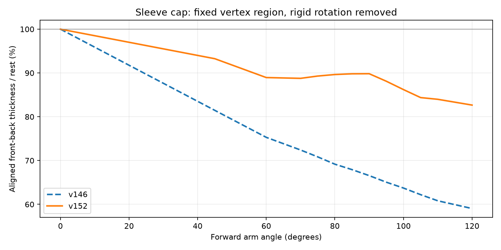

> **기록 시점 안내:** 아래는 해당 단계 당시의 보고서입니다. 후속 결정은 [최신 상태](../../STATUS.md)를 기준으로 읽어주세요. 모델·원본 텍스처·검증 원시 데이터는 이 문서 공유본에 포함하지 않습니다.

# v152 — 팔을 앞으로 뻗을 때 어깨 두께 복원

**어깨가 납작해지는 현상을 크게 줄인 별도 비교본이다.** 앞90에서 소매산 앞뒤 두께가 기본의66.6%에서89.8%로 회복됐다. 손실된 두께의 약70%를 복원했다. 어깨선 길이는 기존 수준으로 맞췄다. 겨드랑이와 일부 작은 면의 경고가 남아 있으므로 모든 관절 문제를 해결한 최종 아바타는 아니다.

## 바로 확인할 파일

- 동작 모델 (공유본 미포함: `bianca_VOLUME_MOTION_REVIEW.blend`) — 421프레임,24fps. **73/373: 앞90**,385: 앞120,25: 옆120,325: 뒤35,409: 뒤60. 36개 표식 (공유본 미포함: `MOTION.json`).
- 정적 모델 (공유본 미포함: `bianca_VOLUME_REVIEW.blend`) — 기본 자세에서 시작하는 같은 보정 키의 모델.
- 전체 정적 검증 (공유본 미포함: `FINAL_STATIC_AUDIT.json`), 439자세 검사 (공유본 미포함: `PROJECTED_CHECK_1520910.json`), 841시점 모션 검사 (공유본 미포함: `MOTION_CHECK.json`).

## 같은 카메라에서 비교

[전체 뒤사선](COMPARE_F90_REAR.jpg) · [측면](COMPARE_F90_SIDE.jpg) · [정면](COMPARE_F90_FRONT.jpg) · [높은 각도](COMPARE_F90_HIGH.jpg) · [텍스처를 뺀 형태 비교](COMPARE_F90_CLAY.jpg)

[앞60](COMPARE_F60.jpg) · [앞120](COMPARE_F120.jpg) · [뒤35](COMPARE_B35.jpg) · [뒤60](COMPARE_B60.jpg) · [옆120](COMPARE_SIDE120.jpg) · [기본 자세](COMPARE_NEUTRAL.jpg)

클레이 이미지는 촬영 중에만 머리카락 등 일부 부위를 숨긴 진단용이다. 실제 저장 모델의 머리카락·텍스처·원형을 삭제하거나 바꾸지 않았다.

GIF는 저장 모션337–397프레임을2프레임 간격으로 읽은31장이다. 약12fps로 표시하며, 전체421프레임 검증을 대체하지 않는다. 프레임 목록 (공유본 미포함: `PREVIEW_FRAMES.json`), [접촉 시트](FORWARD_CONTACT_SHEET.jpg).

## 원인과 수정 내용

원본 캐릭터 레퍼런스 (공유본 미포함: `ref_char.png`)를 실제로 열어 정장 어깨선과 형태를 확인했다. 기존 키를 모두 꺼도 앞90의 두께는66.7%로 거의 동일했다. 상완과 몸통 사이의 선형 스키닝에서 소매산이 회전하면서 앞뒤로 눌리는 것이 주요 원인이다. 몸통 쪽 어깨판 중심의 전방 이동은약1.47mm였고 소매산은약17.88mm였다. 어깨 전체가 같은 양으로 통째로 움직인다는 설명과는 차이가 있다. 사람의 라운드 숄더 진단을 모델에 그대로 적용한 것은 아니다.

기존 코트493정점에60·90·120도용 좌우6개 보정 키를 추가했다. 기본 메시·본·웨이트·UV·원본 텍스처는 유지했다. 실제 스키닝 변환을 취득해, 줄어든 두께를 복원하면서 삼각형 간 분리·면적·면 방향·좌우 어깨선 길이를 함께 고려해 이동량과 방향을 조절했다. 전방 성분 게이트를 넣어 옆으로 들고 비틀 때 새 보정이 섞이는 문제도 없앴다.

처음 두께만 복원하면 어깨선 일부 구간이 더 늘어났다. 이를 별도로 제한한 것이 v152다. 단순 정점 고정, 회전 전체 억제, 전체 DQ 적용, 바깥 법선 방향만 남기는 방법도 비교했지만 부작용이 커서 채택하지 않았다.

| 앞90 측정 구간 | v146 길이/기본 | v152 길이/기본 |
|---|---:|---:|
| 어깨선 하단 | 1.148 | 1.142 |
| 중단 | 1.064 | 1.066 |
| 상단 | 1.397 | 1.393 |

중단은기존 대비약0.2% 길어지는 범위에 있다. 세 구간 proxy의 결과이며, 어깨선 전체가 완전히 늘어나지 않는다는 뜻은 아니다. 상단의약39% 늘어남은 기존 문제로 남아 있다. [구간 길이 그래프](SEAM_COMPARISON.png).

## 두께 개선과 측정 한계

| 팔 전방 각도 | v146 두께/기본 | v152 두께/기본 |
|---|---:|---:|
| 45도 | 81.5% | 93.3% |
| 60도 | 75.3% | 88.9% |
| 90도 | 66.6% | 89.8% |
| 120도 | 59.0% | 82.7% |

같은 기본 정점 집합을 사용하고 강체 회전을 제거한 앞뒤 범위다. 실제 닫힌 인체나 의상의 부피는 아니다. 열린 소매산 정점의 convex hull은 앞90에서0.840→1.169로 변했다. 단면이 복원되면서 다른 방향으로도 일부 넓어졌으므로, 숫자만으로 정확한 인체 부피를 달성했다고 판단하지 않는다. 본의 회전 자체를 교체한 작업도 아니다. 전체 수치 (공유본 미포함: `VOLUME_MEASURES.json`).

## 보존 및 동작 검증

- 32773정점·17648면·106본 유지. 새 정점·새 캐릭터·리메시 없음.
- 기본 좌표, 토폴로지, UV, 노멀, 텍스처, 웨이트, 기존18개 키와 표현식 동일. Basis를 제외한 총키24개.
- 기본/옆/뒤21조건의 좌표 차이0. 코트 밖 변화0. 앞90의 최대 새 변위약12.23mm.
- 정적 파일과 저장 모션의 모든 키 좌표·표현식 동일.36표식 재로드 오차0.
- quaternion 부호·배율4조건, 각도 경계5곳의0.001도 표본, 몸통15조건 검사. 경계에서 최대 좌표 이동은약0.0068mm. 각도 혼합은 연속인 구간별 선형 방식이며, 미분까지 매끄러운 C1 보간을 보장하지 않는다.
- 439자세(정규39+난수400,seed1520910)와 저장 모션841개 정수/반프레임을 검사했다. 두 집합을 독립적인1280개 자세로 합산하지 않는다.

보존 검사 (공유본 미포함: `FINAL_STATIC_AUDIT.json`), 게이트·저장 검증 (공유본 미포함: `GATE_SAVED_AUDIT.json`), 파일 보호와 문서 검사 (공유본 미포함: `DELIVERY_AUDIT.json`).

## 남은 문제 — 해결 완료로 표시하지 않은 항목

| 검사 집합 | 새 면적 경고 / 해소 | 새 접촉 / 해소 |
|---|---:|---:|
| 439자세 | 88 / 135 | 590 / 1199 |
| 841모션 시점 | 196 / 262 | 1733 / 3019 |

같은 면과 접촉이 여러 자세·프레임에서 반복되는 **사건 합계**다. 단순한 고유 결함 개수가 아니며, 기존 경고의 해소가 새 경고를 상쇄해 모두 통과했다는 뜻도 아니다. 면적 경고는 기준 삼각형 대비0.2배 미만/3배 초과, 접촉은 기준에서 존재하던 쌍을 제외한 삼각형 교차 진단이다. 접힌 옷의 자연스러운 겹침과 눈에 보이는 결함은 추가로 구분해서 봐야 한다.

앞90은 새 면적2개(원래면2395,13717), 새 접촉4쌍이 남았다. 같은 자세에서 기존 면적3개·접촉25쌍은 해소됐다. [면 위치 투영](REMAINING_AREA_LOCATIONS.png)은 가려짐을 판정한 그림이 아니므로 반대편과 아래쪽도 함께 살펴야 한다.

모션의 진단 점수가 가장 높은 표본은75.5프레임으로 새 면적4/접촉32다. [같은 자세에서 OFF/ON 비교](COMPARE_WORST_MOTION.jpg), 경고 상위10시점 (공유본 미포함: `WORST_MOTION.json`)을 포함했다. 가장 좋아 보이는 자세만 골라 전달하지 않는다. 실제 뒤사선·측면·높은 각도·클레이·이 표본의 렌더를 열어 확인했다.

겨드랑이의 깊은 접힘, 소매뿌리의 각진 주름, 일부 작은 면의 늘어남·교차는 남아 있다. 다음 수정 대상은 이 국소 면과 동작 중간 구간이다. 이번에 효과가 확인된 두께 복원과 어깨선 길이를 보호하면서 수정해야 한다. 전체 DQ나 정점 동결을 다시 그대로 적용하는 것은 현재 실험 근거상 적합하지 않다.

Unity/VRChat PC에서의 드라이버 변환·베이크·실행 검증, 머리카락/옷자락 물리는 이번 결과에 포함되지 않았다. Quest는 대상에서 제외한다.

## 이번 작업 이력과 조사

| 버전 | 내용 / 상태 |
|---|---|
| [v147](../v147_shoulder_volume/START_HERE.md) | 원본 비교, LBS/DQ·기존 키 OFF 진단, 공식 자료 정리 |
| [v148](../v148_volume_trials/START_HERE.md) | 두께·강체 형태·회전 억제·법선 방향 실험 |
| [v149](../v149_volume_fit/START_HERE.md) | 연속 키, 진폭/방향 최적화6회, 실제 MCP 재평가 |
| [v150](../v150_volume_review/START_HERE.md) | 일부 정점 고정안. 다른 자세 악화로 미채택 |
| [v151](../v151_volume_review/START_HERE.md) | 보존 검증 중간본. 어깨선 늘어남 추가 발견 |
| v152 | 두께 복원과 좌우 어깨선 길이를 함께 조정한 최신 비교 후보 |

이전 모델은 보존했다. v152가 생성됐다는 사실을 사용자 채택이나 모든 문제 해결로 해석하지 않는다. 파일별 SHA와 실제 검사 범위는 연결한 JSON을 기준으로 한다.
