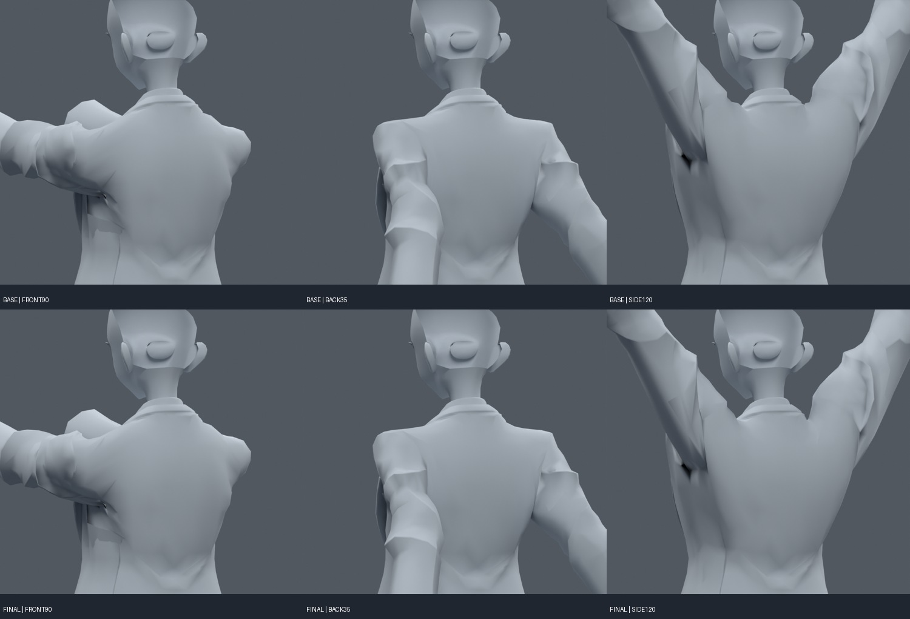

> **기록 시점 안내:** 아래는 해당 단계 당시의 보고서입니다. 후속 결정은 [최신 상태](../../STATUS.md)를 기준으로 읽어주세요. 모델·원본 텍스처·검증 원시 데이터는 이 문서 공유본에 포함하지 않습니다.

# v159 — 카라·라펠이 팔에 끌리는 현상 완화

검토 후보: **bianca_COLLAR_TRANSITION_REVIEW.blend**. v152의 기존 코트 웨이트 208정점만 조정했다. 새 메시나 새 면은 만들지 않았고, 원형·UV·기존 키·본은 보존했다. 중간 MID/STRONG/BALANCED 파일을 최종 후보와 혼동하지 않는다.

정장 카라의 선과 꺾임은 유지하면서, 팔/쇄골 기여 일부를 기존 Chest로 옮겼다. 소매 연결부를 일괄 고정하면 뒤로 드는 자세에서 문제가 생겨, 실패한 면 주변의 변경 강도를 거리로 완만하게 줄였다. 다른 아바타의 웨이트를 복사하지 않았다. 참고 근거는 [v158 조사](../v158_dynamics_research/RESEARCH.md), 실제 구매 모델 동작 비교는 [v157](../v157_reference_pose/START_HERE.md).

| 카라 영역 길이비 | v152 | v159 |
|---|---:|---:|
| 팔 앞90, 95백분위 | 1.128 | 1.065 |
| 팔 앞90, 최대 | 1.930 | 1.597 |
| 팔 뒤35, 최대 | 1.439 | 1.239 |
| 팔 옆120, 95백분위 | 1.247 | 1.155 |
| 팔 옆120, 최대 | 1.796 | 1.533 |

길이비는 같은 rest edge 대비 실제 평가 좌표의 길이다. 영역의 모든 선이 이 수치만큼 좋아진다는 뜻은 아니다. 원래 상단 어깨 봉제선의 별도 지표와 혼용하지 않는다.

358자세(고정38 + 두 seed의 복합320)에서 기존 대비 새 면적 경고 0, 기존 경고 사건25 감소. 기준은 rest 대비 삼각형 면적 0.2 미만/3 초과이며 자세별 평가 삼각분할을 사용했다. 이는 모든 모양의 품질 통과가 아니다. 옆 들기 무작위 항목의 side 표시는 실제로 양팔에 적용되므로 좌우 독립 옆 들기320개로 과장하지 않는다.

고정38자세 코트 접촉쌍은 새184/해소237 사건이다. 접촉이 완전히 없어진 결과가 아니며 단순 사건수 감소를 관통 해결로 해석하지 않는다. 팔 앞으로 들 때 소매산/겨드랑이의 기존 압축과 불규칙한 주름은 남아 있다. 전후·사선12렌더를 만들고 두 비교표를 검토했다. 별도 객체 분리 실험 및 후속 관절 검증으로 이어간다.

보존 검사: groups를 제외한 fingerprint 일치, 코트 밖 웨이트 exact, 최대4영향, 중립 평가 좌표 최대오차 4.17e-9m. 원본 파일은 덮어쓰지 않았다. 자세별 자료는 `FINAL_FIXED.json`, `TRANSITION_CHECK.json`, `PRESERVATION.json`, 집계는 `SUMMARY.json`.

재현 스크립트는 실제 Blender MCP의 upper43/arm121/shoulder127 모듈이 초기화된 세션에서 실행했다. 초기 강한안과 시험 로그는 실패 이력이다. NumPy 배열과 중간 trial blend는 로컬 보존·Git 제외.
