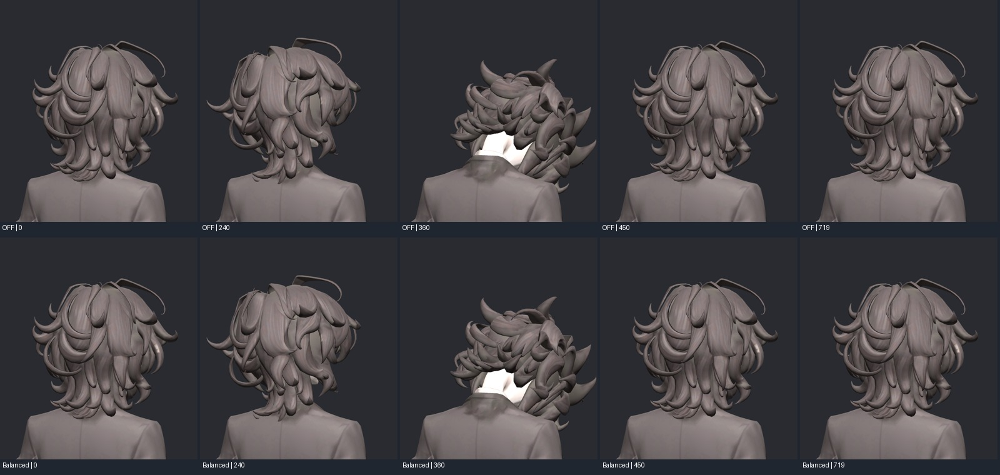

> **기록 시점 안내:** 아래는 해당 단계 당시의 보고서입니다. 후속 결정은 [최신 상태](../../STATUS.md)를 기준으로 읽어주세요. 모델·원본 텍스처·검증 원시 데이터는 이 문서 공유본에 포함하지 않습니다.

# v160 — 원래 헤어 형태를 보존하는 PhysBone 준비와 실제 Unity 검사

선택한 Blender 후보는 **bianca_HAIR_SMOOTH_REVIEW.blend**다. FLEX는 큰 움직임 비교용 실패 후보이며 통합에 사용하지 않는다. 실제 통합은 v161에서 카라 보정과 합친다.

기존 헤어 6개 체인/12가중 본을 유지하고, 바람 연출용 부모6개와 끝점6개를 추가했다(총106→118본). 새 헤어 메시를 만들지 않았다. 머리 쪽 고정을 유지하며 원래 가중치 비율을 연속 함수로 강화한 8,748정점만 조정했다. 기존 키24개·UV·원형을 보존하고 최대4영향을 유지한다. 원래 모델에는 헤어 본이 있었지만 가중치가 작고 Unity 물리 구성은 이번에 준비했다.

## 참고와 선택 과정

구매 모델 원래 Unity 설정과 실제 움직임을 조사한 [v158 연구](../v158_dynamics_research/RESEARCH.md)를 먼저 참고했다. 긴 헤어와 앞머리의 강도/제한을 다르게 두는 방식, 실제 연결된 머리/가슴 컬라이더, 별도 부모에서의 제약 입력을 확인했다. 원본 형상이나 구매 웨이트를 복사하지 않았다.

실제 SDK3.10.5의 PhysBone1.1 Advanced를 사용했다. 최종 설정은 Pull .4, Momentum에 대응하는 직렬화 spring .18, Stiffness .5, Gravity .08, Falloff1, Immobile .3, 각도25도, Stretch/Squish0. 기존 rest 형상 유지에 Falloff1을 사용하고 체인에 직접 애니메이션을 덮지 않았다. 명시적인 Collider 목록만 충돌한다. [VRChat 공식 PhysBone 설명](https://creators.vrchat.com/common-components/physbones/).

초기 FLEX는 14mm 수준으로 잘 움직였지만 20개 작은 삼각형에서 면적 경고43사건이 생겼다. 높은 목표 가중치를 약한 영역에도 급히 적용한 것이 문제였다. 최종 SMOOTH는 proximal/distal/sector 원래 비율을 유지하고 연속적으로 강화한다. 면을 늘려 문제를 숨기지 않았다.

컬라이더10조합을 정지180프레임씩 시험해 2.938mm의 rest 밀림 원인이 목 반경임을 확인했다. 목만 .025→.019m로 조정하고 머리·가슴·양 어깨는 유지했다. FBX의 lossyscale100 때문에 컴포넌트 로컬 크기는 역보정했다. 실제 보이는 월드 크기와 일치하는지 확인했다.

## 실제 실행 검증

Unity2022.3.22f1 Play Mode에서 각 후보720프레임(60fps 시간 기준). 머리 yaw/pitch/roll, 루트 상하·좌우 이동, 깊은 목 숙임, 바람 ON/OFF, 정지 복귀를 검사했다. 초기 Original/Balanced/Firm/Soft/NoColliders/OFF, 컬라이더 수정 후3구성, SMOOTH 후3구성을 비교했다.

최종 SMOOTH의 PB ON/OFF 같은 프레임 비교:

| 항목 | 결과 |
|---|---:|
| 헤어 표면 최대 차이 | 3.325mm |
| 헤어 이외 좌표 차이 | 0 |
| 정지·최종 복귀 차이 | 약0.000011mm |
| 헤어 면적비 범위(같은 프레임 OFF 대비) | .623–1.477 |
| 면적비 .2 미만 / 3 초과 사건 | 0 |
| 컬라이더 ON/OFF 최대 반응 차이 | 1.392mm |
| 바람 애니메이션 자체 최대 변위 | 1.626mm |

숫자는 검증한 동작의 범위이며 모든 충돌·모든 VRChat 월드의 보장은 아니다. 움직임을 크게 만드는 것보다 짧고 뭉친 원래 헤어 모양과 안정성을 우선했다. 내부 collisionRecords가0으로 나와 접촉 횟수 지표로 사용하지 않았다. 실제 충돌 효과는 컬라이더 ON/OFF 표면 좌표로 확인했다.

BakeMesh 측정에서는 기본 호출 후 TransformPoint가 이 FBX의100배 스케일을 중복 적용하는 문제가 있었다. 실제 bounds로 검증해 `BakeMesh(mesh,true)`로 수정했다. `.venv/bianca_hair_motion/` 최초 수치 데이터는 무효이며 최종은 `.venv/bianca_hair_motion_smooth/`. [Unity BakeMesh API](https://docs.unity3d.com/kr/2022.3/ScriptReference/SkinnedMeshRenderer.BakeMesh.html), `BAKE_AUDIT.txt` 참조.

바람은 별도 부모6개의 10초 루프와 `BiancaWind`0–1 조절이다. 월드의 임의 WindZone을 자동 수신하는 구현이 아니다. 머리/몸 움직임에 대한 관성은 실제 PhysBone이고 바람 연출과 구분된다.

## 파일과 한계

`HairSetup.cs`가 실제 PhysBone/Collider/바람 클립/FX/메뉴를 만든다. 원본 비교용과 SMOOTH용 프리팹 명칭은 각각 BiancaHairOriginal/BiancaHairFlex다. **최종 Flex 이름의 FBX 내용은 SMOOTH**이며 초기 FLEX blend와 다르다. `03_smooth.py`가 최종 입력을 내보낸다. 재현하려면 `HairSetup.Run` 후 `HairFinalEditor.Begin`; smooth 실행은 HairFinalMotion 출력 경로를 smooth로 지정했다.

`UnityHairReview.unitypackage`는 우리 모델·재질·프리팹·바람 FX·메뉴·검토 장면19개 에셋만 묶었다. 기존 VRChat SDK가 설치된 Unity2022.3 프로젝트에 가져온 후 `Assets/BiancaDynamics/BiancaHairPreview.unity`를 열고 Play하면 된다. 원본/수정 비교 장면은 `BiancaHairCompare.unity`. Head/Neck 또는 최상위 위치를 움직여 반응을 확인할 수 있다. 물리는 Blender에서 자동 재생되지 않는다. 테스트 전용 MonoBehaviour와 구매 모델, SDK 자체는 패키지에 포함하지 않았다.

이 Unity 구성은 Generic 물리 검사 프로젝트다. Blender의 기존 관절 드라이버를 자동으로 Unity/VRChat에 이식한 완성 아바타는 아니다. Humanoid/IK/표정·기존 보정 드라이버의 Unity 대응 및 실제 VRChat 클라이언트 검증은 별도 작업이다. 실제 움직임 확인에 필요한 데이터와 그림은 남겼고, 구매 모델 데이터는 Git에 포함하지 않는다.
