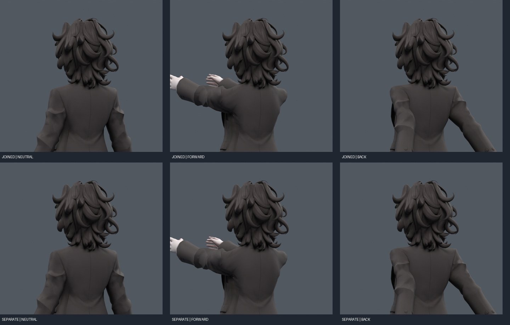

> **기록 시점 안내:** 아래는 해당 단계 당시의 보고서입니다. 후속 결정은 [최신 상태](../../STATUS.md)를 기준으로 읽어주세요. 모델·원본 텍스처·검증 원시 데이터는 이 문서 공유본에 포함하지 않습니다.

# v161 — 카라·헤어 통합 및 코트 객체 분리

현재 이 버전의 선택 후보는 **bianca_COAT_ENCODED_REVIEW.blend**다. 비교 원본은 **bianca_INTEGRATED_REVIEW.blend**. 두 파일 모두 v152에 v159 카라 보정과 v160 SMOOTH 헤어를 합쳤다. `bianca_COAT_SEPARATE_REVIEW.blend`는 중간 음영 실패 후보다.

사용자가 추가 허용한 범위 안에서, 원래 코트의 기존 정점·면을 `Separate Selected`로 별도 객체로 나눴다. 코트와 몸은 원래부터 연결되지 않은 성분이므로 새 절단면이나 몸통을 만들 필요가 없었다. 새 캐릭터 메시를 생성하거나 코트 속에 새 몸체를 만들지 않았다.

| 항목 | 분리 전 | 분리 후 |
|---|---:|---:|
| 전체 정점 | 32,773 | 32,773 |
| 전체 원래 폴리곤 | 17,648 | 17,648 |
| 캐릭터 메시 객체 | 1 | 2 |
| BodyHair | — | 31,037정점 / 15,713면 |
| Coat | — | 1,736정점 / 1,935면 |
| 기존 셰이프 키 | 24 | 각 객체에24 |
| 키 드라이버 | 24 | 각 객체에24 |
| 본 | 118 | 118 |

각 객체의 키는 자기 정점에 해당하는 기존 데이터를 그대로 가진다. 기존 UV·면 연결과 방향·원형·키 좌표를 원래 ID로 재조립해 비교했다. 전체 정점이 중복되거나 빠지지 않음을 확인했다.

## 음영 차이 원인과 해결

단순 분리 후 위치는 같아도 일부 포즈의 노멀 차이가 컸다. 원래 corner normal 벡터를 setter로 복원하는 방법도 rest만 비슷하고, 특정 팔 회전에서 차이가 남았다. 그래서 이 중간 파일은 채택하지 않았다.

Blender 소스에서 custom normal이 코너의 normal space를 기준으로 두 정수에 인코딩되고, 이를 해독해 사용함을 확인했다. 우리 모델의 일부 같은 정점 코너에는 서로 다른 인코딩 값이 남아 있었다. 벡터로 다시 인코딩하면 그 동작까지 동일하게 유지되지 않았다. **원래 custom_normal 인코딩과 sharp edge/smooth face 상태를 원래 ID로 복원**한 뒤, 다시 파일을 열고 실제 포즈를 비교해 해결했다. [Blender mesh_normals.cc](https://github.com/blender/blender/blob/main/source/blender/blenkernel/intern/mesh_normals.cc), [Separate 공식 문서](https://docs.blender.org/UATEST/manual/en/dev/modeling/meshes/editing/mesh/separate.html).

최종 `ENCODED_CHECK.json`: 팔 앞/뒤/옆 및 비틀기, 목/몸통, 손가락 제스처, 팔꿈치·무릎, 손목 총78자세. 분리 전후 좌표 최대차 **6.01e-8m**, 법선 벡터 최대차 **1.93e-5**. 원형을 바꾸는 수정으로 음영을 맞춘 결과가 아니다. 이전 `SEPARATION_CHECK.json`·`RELOAD_CHECK.json`의 큰 차이는 실패 이력이며 최종 결과와 구분한다.

원래 컬러 재질, 동일 카메라/조명으로 중립·팔 앞90·팔 뒤35를 전후에서 각각 렌더했다. 6쌍 모두 RGB 채널 차이 최대 **1/255**, 99백분위0이다. 두 비교표를 직접 검토했고 표시상 차이를 찾지 못했다. 이 검사는 분리 전후의 동일성 검사이며 기존 어깨가 완벽하다는 평가는 아니다.

## 분리의 의미

외형을 유지하면서 코트만 독립 선택하고, 별도의 웨이트·보정·물리·표시 설정을 적용하기 쉬워졌다. 향후 작업 기준으로 사용할 수 있는 구조다. 객체를 나누는 행위 자체가 어깨 압축이나 겨드랑이 접힘을 해결하지는 않는다. 이 두 문제는 기존 웨이트·관절/면 흐름의 문제로 남아 있다. Unity에서는 renderer가 하나 늘고, 기존 드라이버의 대상 경로도 분리된 키마다 연결해야 한다.

진행 중인 전완 Twist는 v162 별도 파일에서 검사한다. 결과 확인 전에 이 파일에 섞지 않았다. 기존 사용자 승인본을 덮어쓰지 않았다.
