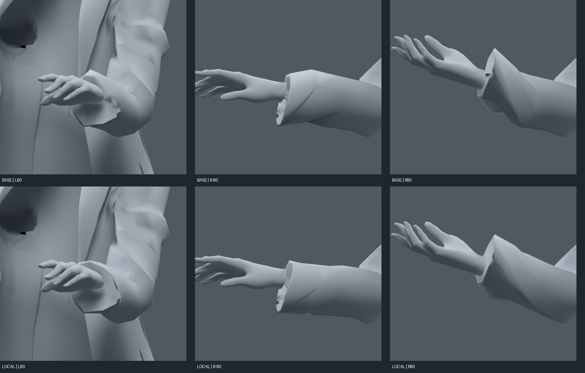
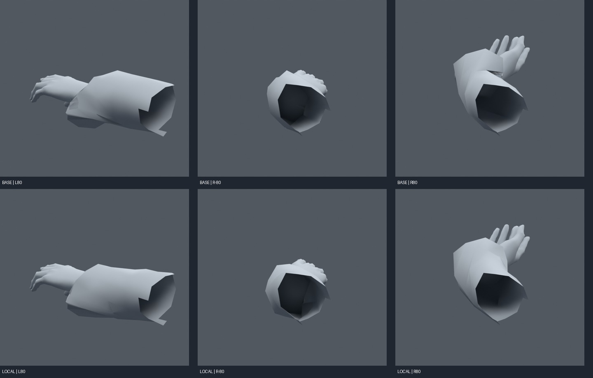

> **기록 시점 안내:** 아래는 해당 단계 당시의 보고서입니다. 후속 결정은 [최신 상태](../../STATUS.md)를 기준으로 읽어주세요. 모델·원본 텍스처·검증 원시 데이터는 이 문서 공유본에 포함하지 않습니다.

# v162 — 전완 Twist 분산 실험, 통합 보류

**이 버전의 보조본·웨이트는 최종 통합에 넣지 않았다.** 단순 비틀기에서 소매 압축을 줄일 수 있었지만 복합 자세에 새 면적 이상이 남았다. 원형을 지킨 검토 기준은 v161이며 v163 종합 검토본으로 정리한다.

SiuSiu/Lapwing에서 실제 작동한 전완 Twist를 참고했다. [실제 포즈 비교 v157](../v157_reference_pose/START_HERE.md), [VRChat Rotation Constraint](https://creators.vrchat.com/common-components/constraints/vrc-rotation-constraint/)에서 제약 축과 로컬 공간을 확인했다. 우리 손/전완 본의 rest 방향은 달라서 단순한 전역 Euler Y 복사로 처리하지 않았다.

손 로컬 quaternion을 전완 축으로 투영해 축 비틀기를 추출하고, 그 절반을 별도2본에 적용했다. 순수80도 비틀기에서 보조본40도, 초기90검사에서 최대 각오차0.000064도 수준이었다. 본 구동이 맞는 것과 메시 품질이 맞는 것을 구분했다. 기존 본+2=120본이며 새 메시를 만들지 않았다.

| 실험 | 검사 자세 | 새 면적 경고 사건 | 기존 경고 감소 |
|---|---:|---:|---:|
| 손목·소매 분산 | 90 | 9 | 54 |
| 오른쪽 실패 면 주변 12mm 완화 | 290 | 9 | 75 |
| 손 메시 보존, 소매만 변경 | 290 | 17 | 93 |
| 실패 주변25mm로 확대 | 290 | 20 | 62 |
| 꺾임이 커지면 기존으로 복귀, 슬롯 추가/제거 방지 | 290 | 1 | 10 |
| 마지막 안, 다른 seed + 코트/손 전체 면 검사 | 290 | 7 | 11 |

위 첫 다섯 표는 손목 주변45mm 영역 검사라 마지막 전역 검사와 동일한 사건 모집단이 아니다. '총 감소가 많다'는 이유로 새 결함을 채택하지 않았다. 오른쪽 손목 복합 자세에서 문제가 나타난 원래 면8325/8355/8356/8363/8368 등은 **코트 소매 쪽**이다. 전체 손 메시를 보호해도 해결되지 않는 이유다.

예를 들어 왼쪽 순수−80도 비틀기의 소매 최소 면적비는 .168→.588로 좋아졌고, +80도 최대비도2.544→1.334로 개선됐다(소매만 안). 그러나 오른쪽의 굽힘+비틀기에서는 다른 면이 눌리거나 펼쳐졌다. 원래 코트 말단의 비대칭 면 흐름과 기존 보정/가중 영향이 함께 작용하므로 양팔 평균 비율을 그대로 복사하는 방식은 기준으로 삼지 않는다.

후면은 몸통이 손목을 가려 진단용으로 손과 인접 소매만 표시했다. 이 표시용 마스킹은 저장 모델의 삭제가 아니다. 대표3복합자세의 코트↔손 교차면 검사는 BASE/FULL/SLEEVE/LOCAL 모두0쌍이었지만, 다른 자세·자가접힘까지 관통이 없다는 뜻은 아니다. LOCAL 그림은 미채택 후보다.

마지막 게이트 안의 최초 실행은 Blender driver expression이255자로 잘려 gate가 무효였다. 구동량0이라 즉시 무효 판정하고 표현식을 나누어 수정한 뒤 재검사했다. 최종 `GATED_CHECK.json`·`GLOBAL_GATED_CHECK.json`만 유효하다. 별도 구현 오류를 '회귀0으로 개선 성공'으로 세지 않았다.

다음 단계는 현재 면을 유지하는 국소 연결/보정 설계다. 오른쪽 소매 말단에서 비틀기와 손목 꺾임의 기여를 분리하고, 경계 면 몇 개와 인접 지지 가중치를 함께 다자세 최적화해야 한다. 8도 이상의 꺾임에서 효과를 꺼버리는 제한적인 게이트는 자연스러운 전완 구현의 완성으로 보지 않는다. 단순 본 추가나 강도 조절 반복보다 이 영역을 직접 다룰 근거를 남겼다.

대표 FULL/GATED blend는 Git 보존, 다른 세 blend도 로컬 폴더에 남겨 비교 가능하다. v159·v160·v161의 채택 후보와 기존 v152/knee 작업은 덮어쓰지 않았다.
