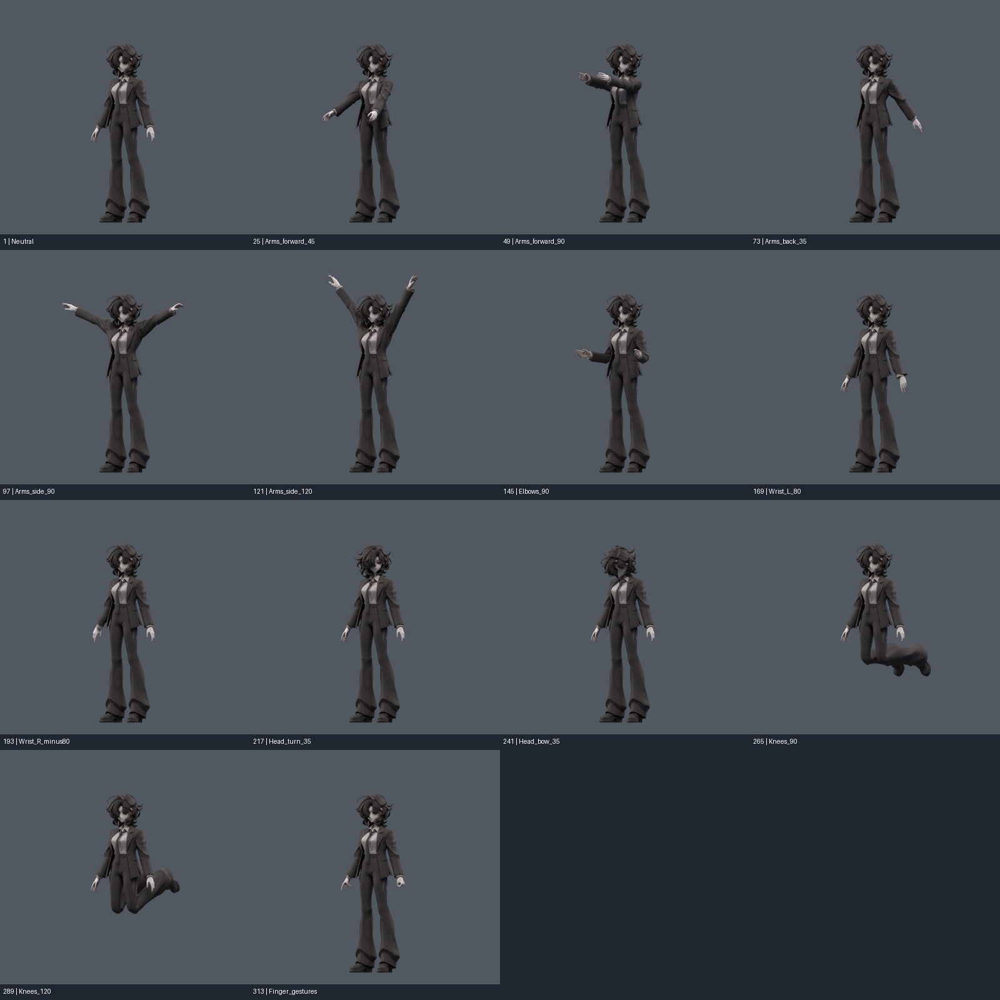

> **기록 시점 안내:** 아래는 해당 단계 당시의 보고서입니다. 후속 결정은 [최신 상태](../../STATUS.md)를 기준으로 읽어주세요. 모델·원본 텍스처·검증 원시 데이터는 이 문서 공유본에 포함하지 않습니다.

# 비앙카 v163 — 이번 작업 한 번에 확인하기

**먼저 `bianca_v163_POSE_REVIEW.blend`를 열면 된다.** 카라 보정, 안정적인 헤어 본/웨이트, 코트 객체 분리를 합쳤다. 기존 캐릭터 메시를 새로 만들지 않았다. 정지 작업용은 `bianca_v163_REVIEW.blend`다.

옷을 몸과 분리해도 원래 모양을 유지할 수 있었고, 이번부터 분리 구조를 작업 기준으로 삼았다. 다만 모든 관절이 해결된 완성본이나 VRChat 업로드 완료본은 아니다. 사용자의 새 외형 승인으로 기록하지 않는다.

## 바로 볼 파일

| 목적 | 파일 |
|---|---|
| 전체 모델·14자세 검토 | bianca_v163_POSE_REVIEW.blend (공유본 미포함: `bianca_v163_POSE_REVIEW.blend`) |
| 중립 상태 작업 기준 | bianca_v163_REVIEW.blend (공유본 미포함: `bianca_v163_REVIEW.blend`) |
| 실제 Unity 헤어 물리 | UnityHairReview.unitypackage (공유본 미포함: `UnityHairReview.unitypackage`) |
| 옷 분리 전후 앞/뒤 사진 | [전면](../v161_separate_coat/SEPARATION_FRONT.jpg) · [후면](../v161_separate_coat/SEPARATION_REAR.jpg) |
| 카라의 팔 자세별 차이 | [사선](../v159_collar_support/COLLAR_COMPARE_OBLIQUE.jpg) · [후면](../v159_collar_support/COLLAR_COMPARE_REAR.jpg) |
| 헤어 움직임 전후 | [전면](../v160_hair_dynamics/SMOOTH_FRONT.jpg) · [후면](../v160_hair_dynamics/SMOOTH_REAR.jpg) |

## 이번에 반영한 것

**카라·라펠:** 코트208정점의 팔/쇄골 기여를 줄이고 가슴 지지를 늘렸다. 앞90도에서 해당 영역 edge95백분위 길이비1.128→1.065, 최대1.930→1.597. 358자세에서 새 면적 경고0, 기존 경고25사건 감소. 접촉은 새184/해소237로 완전 해결이 아니다. 정장 카라의 선을 지우지 않았다. [v159 과정·실패안·수치](../v159_collar_support/START_HERE.md).

**헤어:** 기존6체인/12가중본에 wind 부모6·끝점6 추가. 8,748정점의 원래 분포를 부드럽게 강화했다. 강한 FLEX안은 작은 면의 과도한 변형 때문에 제외했다. 최종 SMOOTH는 실제 Unity720프레임 동작에서 PB ON/OFF 표면 차이 최대3.325mm, 헤어 밖0, 검사한 면적 경고0. 목 컬라이더가 원형을 밀던 문제도 수정했다. [v160 구현·검사·사용법](../v160_hair_dynamics/START_HERE.md).

**옷 분리:** 기존 Coat성분을 `Bianca_Coat`, 나머지를 `Bianca_BodyHair`로 분리했다. 총32,773정점/17,648면 유지. 원형·UV·기존24키·인코딩된 노멀을 보존했다. 일부 포즈 음영 차이가 생겼던 초기 분리안은 제외했고, 원래 custom_normal 인코딩을 복원한 안을 채택했다. 78자세 분리 전후 좌표 최대차6.01e-8m, 노멀 벡터차1.93e-5. 전후·중립·앞/뒤팔 6쌍 렌더 RGB차 최대1/255. [v161 진단과 해결](../v161_separate_coat/START_HERE.md).

## 타임라인 검토

포즈 파일은 자연스러운 동작 애니메이션이 아니라 **검토 자세를 고정해서 바꾸는 컷 목록**이다. 아래 프레임으로 이동하거나 타임라인의 이름표를 사용한다. 렌더 카메라 밖에 있는 부위는 3D 뷰에서 회전/확대해 볼 수 있다. 모델은 두 객체지만 같은 본과 보정 드라이버로 움직인다.

| 프레임 | 확인 부위 |
|---:|---|
| 1 | 기본 모양 |
| 25 / 49 | 팔 앞으로45 / 90도 |
| 73 | 팔 뒤로35도 |
| 97 / 121 | 팔 옆으로90 / 120도 |
| 145 | 팔꿈치90도 |
| 169 / 193 | 좌·우 손목 비틀기 |
| 217 / 241 | 머리 돌림 / 숙임 |
| 265 / 289 | 무릎90 / 120도 |
| 313 | 왼손 주먹·오른손 검지 제스처 |

14자세를 직접 설정했을 때와 저장한 타임라인 재생의 좌표 차이0을 확인했다. 파일을 다시 연 뒤14자세의 드라이버 무효0도 확인했다. 물리 헤어는 Blender에서 자동 시뮬레이션되지 않으므로 Unity 패키지로 확인한다.

## 채택하지 않은 추가 관절 실험

전완 Twist2본을 실제 추가하고 5방식으로 비교했다. 비틀기 단독 소매 압축은 좋아졌지만 오른쪽 소매 말단의 굽힘+비틀기에서 새 결함이 생겼다. 더 넓은 영역·다른 seed 검사에서도 해결되지 않아 **v163에는 포함하지 않았다**. 회귀가 남은 최신 실험 파일을 자동으로 기준에 올리지 않았다. [v162 결과·비교 이미지·다음 접근](../v162_forearm_twist/START_HERE.md).

## 남은 문제와 이어갈 순서

1. 어깨/겨드랑이: 앞 들기의 소매산 압축, 깊은 접힘과 불규칙한 주름이 남는다. 코트 분리 자체로 해결되는 현상은 아니다. 분리된 코트에서 몸판·소매산·겨드랑이 경계의 기존 면 흐름과 보정을 직접 다룰 필요가 있다.
2. 오른쪽 소매 말단: 비틀기와 손목 굽힘을 함께 처리하는 국소 면/웨이트/보정 설계. 단순 보조본 강도 조절은 이번 실험에서 충분하지 않았다.
3. Unity 통합: Humanoid/IK, Blender의 기존 관절·셰이프 키 드라이버와 분리된 renderer 경로 대응, 실제 VRChat 클라이언트 검증. 현재 Unity 패키지는 Generic 헤어 물리 검토용이다.

바람은 별도 부모 애니메이션과0–1조절이고, 임의 월드 WindZone을 자동 수신하지 않는다. 머리/몸 이동의 관성·명시한 컬라이더 반응은 실제 PhysBone으로 검사했다. 현재 테스트 범위가 모든 머리/옷 충돌의 보장은 아니다.

## 보존·작업 이력

`DELIVERY_AUDIT.json`: v152 대비 원형·면 연결·모든 UV·키 좌표·인코딩 노멀·텍스처 exact. 본은106→118, 최대4영향, 가중합 오차1.05e-7이하. 수정은 헤어 성분8,748점과 코트208점이다. 기존 본 rest 행렬 수치차 최대8.75e-8. v152정적/모션, 구매 ZIP두 개 SHA 모두 보존 확인.

조사와 구현은 실제 Blender MCP, 원본 이미지, 구매 프리팹의 Unity 구성·실제 회전/물리 검사, 공식 문서/소스 근거를 함께 사용했다. 구매 모델 파일·이미지·상세 좌표는 Git에 옮기지 않았다. 주요 단계별 문서와 Git 커밋을 남겼다. 새 캐릭터 생성, 사용량 리셋, 아바타 서비스 업로드는 하지 않았다.
