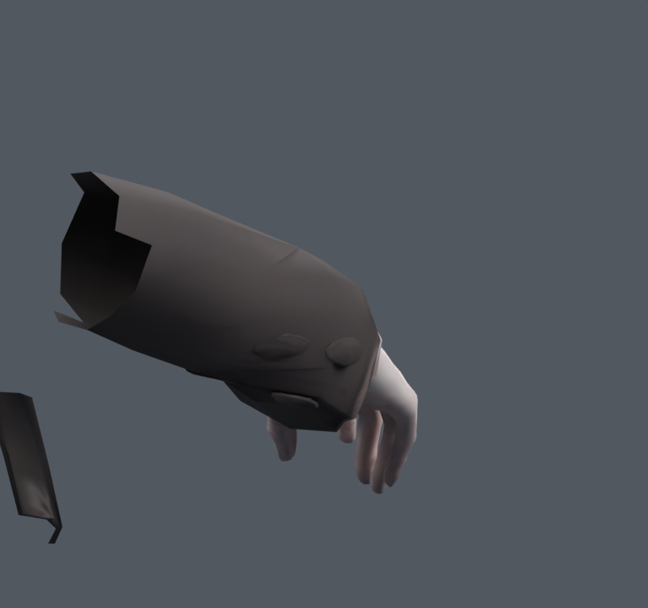

> **기록 시점 안내:** 아래는 해당 단계 당시의 보고서입니다. 후속 결정은 [최신 상태](../../STATUS.md)를 기준으로 읽어주세요. 모델·원본 텍스처·검증 원시 데이터는 이 문서 공유본에 포함하지 않습니다.

# v165 — 손목과 정장 소매 끝의 회전 역할 분리

현재 소매 후보는 `bianca_CUFF_REVIEW.blend`. v163의 카라·헤어·코트 분리를 유지하며, 소매 끝을 손처럼 전부 꺾거나 전완처럼 완전히 고정하지 않도록 수정했다. 새 캐릭터 메시를 만들지 않았다. 어깨 전체 해결이나 Unity 통합 완료를 뜻하지 않는다.

## 조사와 원인

[v164 조사·계획](../v164_integration_research/RESEARCH_AND_PLAN.md)을 먼저 작성했다. 기존 코트 말단은 양손 각각34정점에 손 본 영향이 있었다. 이를 전완으로 모두 옮기면 면 찌그러짐은 줄지만 굽힌 손이 소매를 통과했다. 단순 twist 전용 본도 복합 회전에 충분하지 않았다.

실제 같은 문제의 제작자 토론 [Making wrist cuffs/collars move with hand/neck](https://blenderartists.org/t/making-wrist-cuffs-collars-move-with-hand-neck/1579759)에서는 소매 보조본의 피벗·부모·축 정렬과 손/전완 회전 중복을 다룬다. 초기 답변의 잘못된 팔꿈치 피벗을 그대로 따르지 않고 후속 정정을 확인했다. 구매 SiuSiu/Lapwing의 전완 보조 회전도 참고했지만, 넓고 열린 소매와 닫힌 정장 커프스의 차이를 반영했다.

## 후보 비교

각 행은 해당 스크립트의 동일 입력 BASE 대비다. 서로 다른 seed/표본 수의 사건 수를 직접 순위 비교하지 않는다. 면적 경고는 rest 삼각형 대비0.2미만/3초과다.

| 후보 | 검사 | 결과와 판단 |
|---|---|---|
| 손 영향 절반을 전완으로 | 290자세 | 새 고정면적44건, 미채택 |
| 손 영향 전부 전완으로 | 290자세 및 추가검사 | 면적 개선, 후속 손 관통 확인으로 미채택 |
| 축회전만 소매로 | 290자세 | 새 고정면적10건, 미채택 |
| 낮은 굽힘 추종3안 | 190자세 | 피부 관통 잔여, 미채택 |
| 굽힘/비틀기 벡터 조합 FOLLOW_A | 490자세 | 새 면적0, 해소155, 손 관통0. 아래 로컬 제약으로 대체 |
| 동일 손 rest축 로컬회전65% | 190자세 | 새 면적0, 해소104, 손 관통0 |
| 위 제약+안쪽 커프스/단추 | **490자세** | **새 면적0, 해소152, 손 관통0** |

최종 490자세는 고정90+무작위400(seed1650916). 고정90은 좌우×팔꿈치0/60/110°×비틀기−80/−40/0/40/80°×손목굽힘−35/0/35°. BASE167건→후보15건이며 남은 사건은 기존 원본면15346이다. 이는 모두 관절 품질 통과라는 뜻이 아니다. 손 피부 검사는 연결성분4/5, 각각1284삼각형을 실제 사용했음을 `COMPONENT_AUDIT.json`에서 확인했다.

최종 cuff_support.L/R의 head/tail/roll은 hand와 같고 부모는 forearm. LOCAL Copy Rotation이 손 회전의65%를 받는다. 소매 전완 구간55–92% 사이에서 연속적으로 역할을 옮겼다. 기존 코트92정점과 안쪽 커프스/단추678정점의 웨이트가 바뀌었다. 손/손가락 피부 웨이트는 유지했다. 총120본,32773정점17648면이다.

## 검증과 사진

`DELIVERY_AUDIT.json`: v163 대비 원형좌표·전체키좌표·UV·인코딩노멀·면연결·텍스처 exact. 기존본 rest차0, 최대4영향, 가중합오차1.05e-7미만, 무효드라이버0. 사진용 마스크는 저장 후보에 포함하지 않았다.

`FINAL_`사진은 손 전체를 포함하도록 재촬영했다. 초기 근거리 마스크는 손가락을 잘랐고, 첫 FINAL 촬영은 좌우 성분4/5 지정이 반대여서 손이 숨겨졌다. 수정 후 양손 정점 수를 assert하고 덮어썼다. 양손4/5를 함께 사용한 수치 검사는 영향 없었다. 소매 상단의 절단선은 가림 제거용 마스크 경계다.

추가 `COMBINED_SUMMARY.json`: 고정24+무작위120(seed1650917), 팔 앞/뒤/옆 들기와 팔꿈치·손목을 결합한144자세. 코트 새 고정면적0/해소82, BodyHair 새 면적0, 소매 장식 밖 좌표 차 최대2.39e-7m. 손 피부 교차 삼각형 쌍 총수는 기준/후보 각각24로 기존 접촉이 남아 있으며, 총수 일치만으로 쌍의 완전 일치를 주장하지 않는다. 옆 들기 함수는 몸통 입력을 별도로 적용하지 않아 해당 사례를 몸통 회전까지 포함한 검사로 세지 않는다.

실제 Unity 제약 동등성 검사는 v167에서 이어진다. 현재 파일을 전체 아바타 최종 완료로 해석하지 않는다. 실패 후보 blend는 로컬 보존하며 Git에는 최종 후보와 코드/측정/사진을 남긴다.
