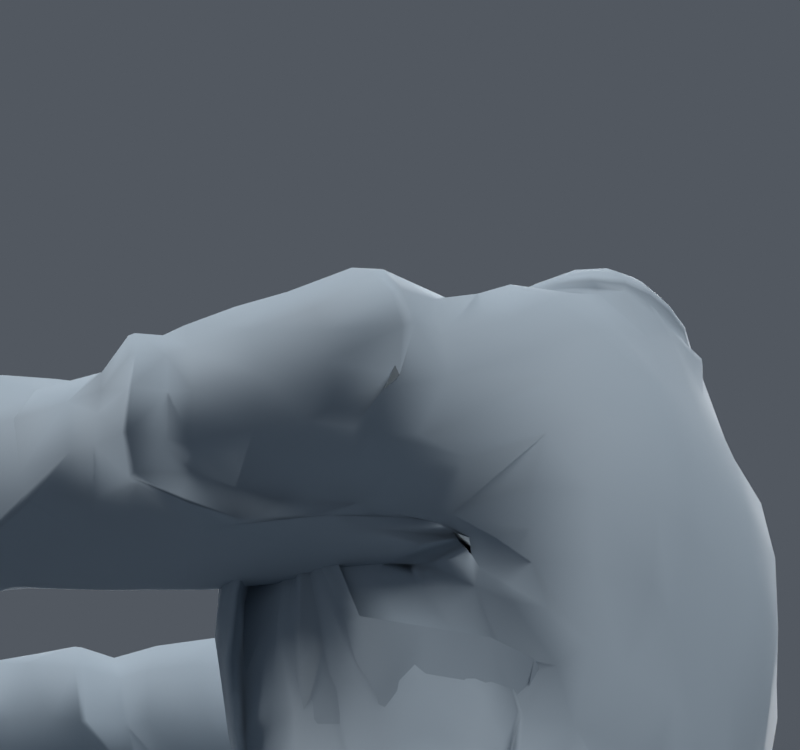
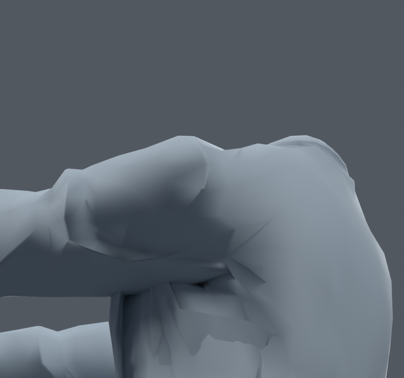
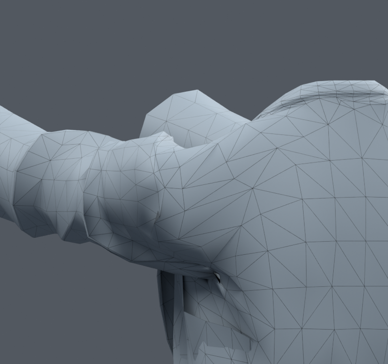

> **기록 시점 안내:** 아래는 해당 단계 당시의 보고서입니다. 후속 결정은 [최신 상태](../../STATUS.md)를 기준으로 읽어주세요. 모델·원본 텍스처·검증 원시 데이터는 이 문서 공유본에 포함하지 않습니다.

# v166 — 어깨 국소 변형 실험, 아직 미채택

v163 정장 어깨/겨드랑이의 기존584정점을 대상으로 60/90/120° 앞 들기에서 선 길이·면적·면 방향·새 교차를 조사했다. 기존 메시를 재생성하지 않았다. v165 소매 후보와 별도다.

정지 상태에도 봉제선과 주름이 있다. 뒤쪽/아래쪽 와이어 사진에서 기존 불규칙한 면 연결과 접힘을 확인했고, 큰 주름 자체를 모두 삭제하는 대신 동작 중 과도한 변형을 줄이는 실험을 했다. [v164 조사](../v164_integration_research/RESEARCH_AND_PLAN.md)와 기존 v139의 Corrective Smooth 실패 검토를 참고했다. [Blender 설명](https://docs.blender.org/manual/en/4.2/modeling/modifiers/deform/corrective_smooth.html)은 검색 요약만 확인 가능했고 본문 fetch402, [MK Graphics 영상](https://www.youtube.com/watch?v=w7Lsn7J8tGM)은 제작자 설명·챕터만 확인했다. 본문/전체 영상을 시청했다고 해석하지 않는다. 기존 v048의 넓은 Corrective Smooth를 새 해결책으로 반복하지 않았다.

| 실험 | 실제 Blender 156자세 검사 | 판단 |
|---|---|---|
| 국소 길이 완화 | 새 고정면적85, 해소177; 새 교차1632 | 회귀로 미채택 |
| 면 방향·분리 평면 추가 | 새 고정면적55, 해소170; 새 교차1331 | 회귀로 미채택 |
| 실패 정점 보정량 점진 감쇠 | 새 고정면적0, 해소81; 새 교차728 | 새 교차 남음, 미채택 |

고정36+무작위120(seed1660911), 앞−35..120/옆45..120°, twist±30 및 랜덤±40°, 일부 몸통 회전. 새 교차는 이웃 정점을 공유하지 않는 코트 삼각형 쌍의 검사이며 모든 접촉을 시각적 결함으로 단정하지 않는다. 그러나 변화 위치를 확인하기 전 개선 총합만 보고 채택하지 않는다.

`CONSTRAINED_FIT.json`의 최적화는700회 제한에 도달했고 success=False였다. 수치 목적값 감소는 해결 완료가 아니다. 최대4–7mm 범위의 변위를 허용해도 새 접힘을 만들었다. BACKOFF는 회귀 면 정점 보정량을20%로 낮추고 주변 감쇠를 부드럽게 연결,5회 후 새 면적 경고0에 도달했다. 새 교차 정점까지 추가 감쇠하는 CONTACTSAFE 실험이 이어진다.

사진은 가림 확인을 위해 몸/머리를 숨기고 코트만 표시했다. 정상 아바타에서 팔/머리가 삭제된 것이 아니다. LOCAL 사진은 CONSTRAINED안이다. 모든 실험 blend는 비교용이고 v163/v165 기준을 덮어쓰지 않았다. NPZ/NPY는 로컬 수치 재현 데이터다.

CONTACTSAFE는 새 교차 면 정점도 감쇠하여 기존156자세에서 새 면적0/해소20, 새 교차0/해소21까지 도달했다. 하지만 **새 seed1660918의436자세(고정36+무작위400)**에서는 새 면적4/해소27, 새 교차69/해소66이 발생했다. 따라서 이 후보도 미채택이다. 학습에 사용한 자세만 통과했다고 완성으로 해석하지 않았다. 다음 v168은 좌표를 더 보정하기 전에 게임의 고정 삼각화와 Blender 표시를 일치시키는 진단이다.
