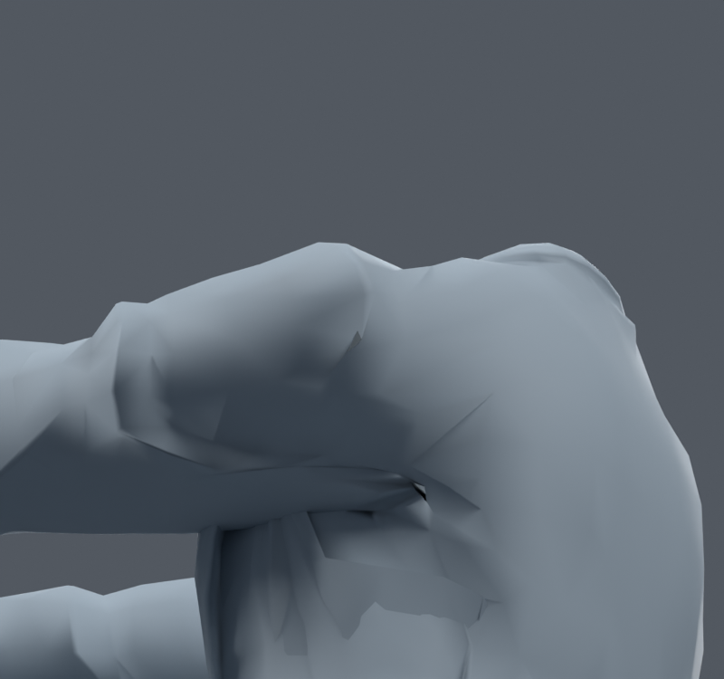
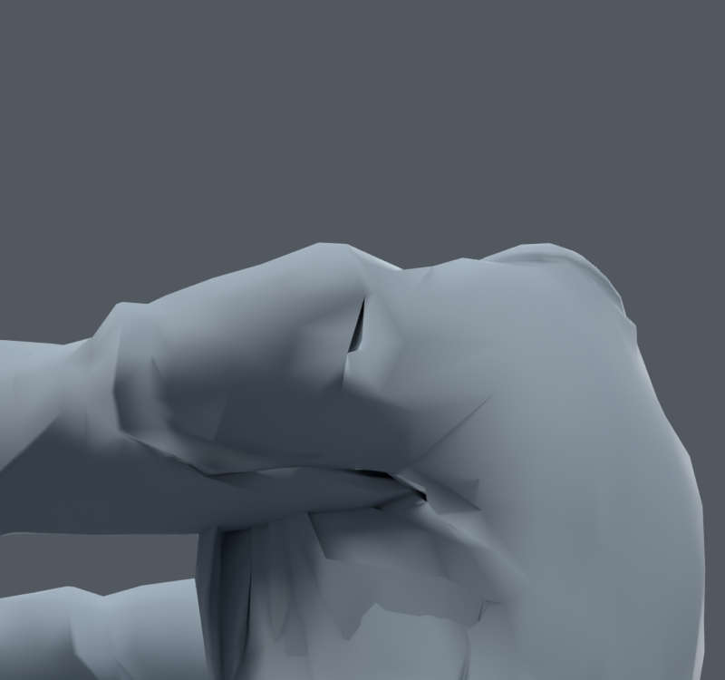

> **기록 시점 안내:** 아래는 해당 단계 당시의 보고서입니다. 후속 결정은 [최신 상태](../../STATUS.md)를 기준으로 읽어주세요. 모델·원본 텍스처·검증 원시 데이터는 이 문서 공유본에 포함하지 않습니다.

# v168 — 고정 삼각면 비교, 아직 미채택

## 후속 결과

17개 대각선에서 회귀가 생긴 면을 제거한3개안도 별도436자세에서 새면적1/새교차1이 남았다. 따라서 전체 삼각화 및3개안은 통합하지 않는다.

**원래면15400 하나만 대각선을 바꾸는 후보** `bianca_SINGLE_COAT_TRIAL.blend`: 다른 사각면 유지, 코트1935→1936면, 정점수 동일.536자세(고정36+무작위500,seed1680917)에서 새면적0/해소5, 새자기교차0/해소0. `SINGLE_BUILD.json`, `SINGLE_SUMMARY.json`과 `08_single_fix.py`. 원형·전체키·UV·웨이트 좌표 보존, 코너 노멀벡터 최대차0.00250054. 삼각면 내부 보간은 달라지므로 완전 동일 표면이라고 하지 않는다. 국소적으로 유효한 작은 후보이며 어깨 전체 홈 해결은 아니다. 추가 시각 검사 후 통합 여부를 정한다.

게임에서 쓰는 고정 삼각면과 Blender의 포즈별 사각면 삼각화 표시 차이를 확인했다. v165에서 코트의1478사각면에 대각선을 추가했다. 기존1736코트정점과 키·UV·웨이트를 그대로 두고3413삼각면이 됐다. BodyHair는 변경하지 않았다.

`bianca_FIXED_COAT_TRIAL.blend`는 rest 삼각형 연결이 원래와 정확히 같다. 코너 노멀 벡터는 ID로 대응해 복원했으며 최대벡터오차0.00808. 정지 사진 차이는 작지만 앞90에서는 기존 홈 일부가 더 깊게 보인다. Blender 사각면의 대각선 자동 선택이 일부 변형을 덜 보이게 했다는 진단이며, 고정하기만 하면 품질이 좋아진다는 뜻이 아니다.

136자세에서 두 대각선의 면적비를 비교하고, rest 사각면의 비평면성1mm이하인 경우 중 경고가 줄어드는17개를 골랐다. `bianca_OPTIMIZED_COAT_TRIAL.blend`는 해당17대각선만다른고정삼각형안이다. 정점위치/키/UV/웨이트동일이지만 비평면 사각면의 내부보간은달라질수있다. 정점좌표동일을표면완전동일로과장하지않는다.

별도336자세(고정36+무작위300,seed1680912)에서 새 면적50/해소219, 새 자기교차315/해소522가 발생했다. 총합은 줄었으나 회귀가 생겨 **아직 미채택**. 다음은 나빠진 원래면 ID를 구분하여 대각선 선택을 되돌리고, 실제 게임 삼각형에서 접힘을 줄이는 국소 수정과 비교한다.

사진은코트만표시한진단이다. 원래모델을재생성하거나전체정점을새로배치하지않았다. 참고이력: v146원본면15414하나의대각선고정, v166다자세국소보정실패. 실제사용기준은여전히v165소매후보이며 v167물리/Unity작업과독립적으로진행한다.
