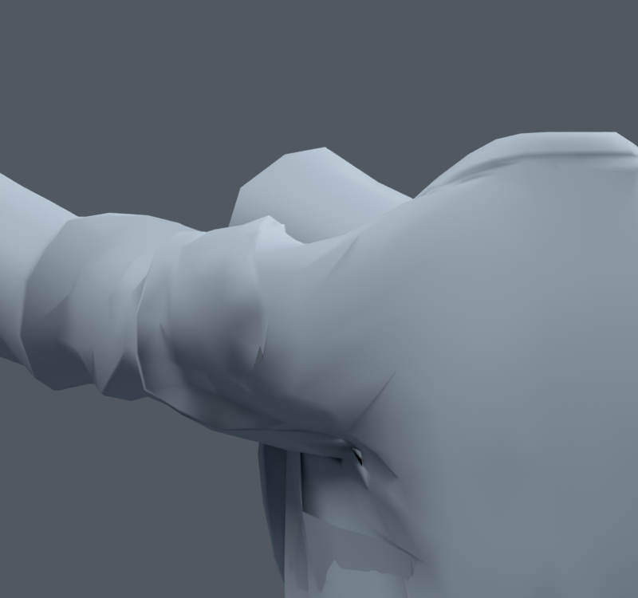
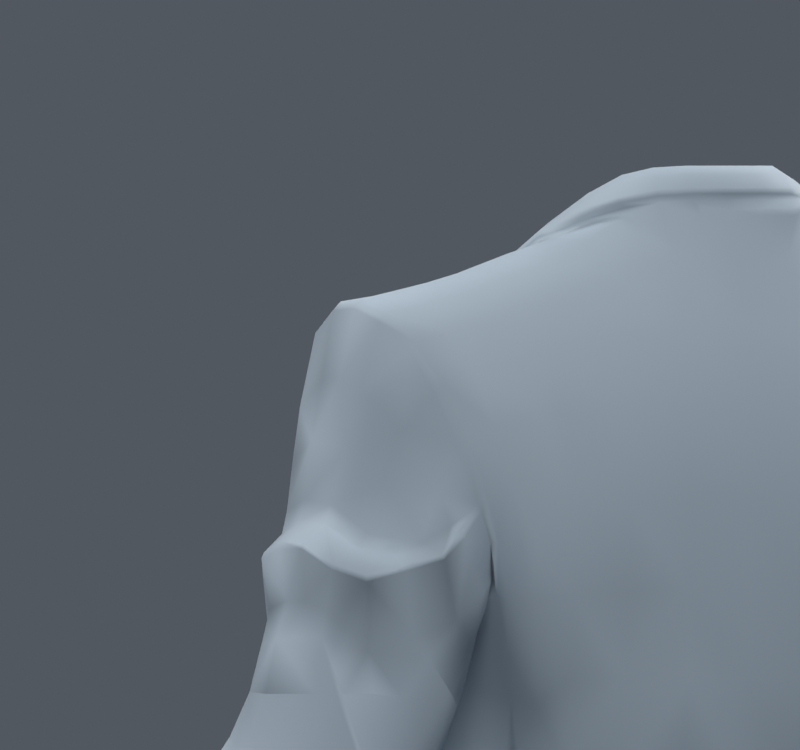

> **기록 시점 안내:** 아래는 해당 단계 당시의 보고서입니다. 후속 결정은 [최신 상태](../../STATUS.md)를 기준으로 읽어주세요. 모델·원본 텍스처·검증 원시 데이터는 이 문서 공유본에 포함하지 않습니다.

# v169 — 원래 오목한 주름을 채우는 국소 실험, 미채택

v165 기준의 기존 코트78정점만 변경했다. 이웃 평균의 법선 방향 성분 중 오목한 부분만 채우며, 접선 이동과 볼록한 정장 봉제선 완화는 억제했다. Blender Fill/Plane Brush의 개념을 참고한 별도 수치 실험이며 새 메시 생성은 없다. 조사와 계획은 `PLAN.md`.

GENTLE 최대 정지 변위1.185mm, FILL2.371mm. 모든 키에 같은 델타를 추가하여 상대 키 변위를 유지하도록 구성했다. 웨이트/UV/면 연결을 변경하는 코드는 없다. 별도 사후 exact 감사와 구분한다.

236자세(고정36+무작위200,seed1690911) 결과:

| 후보 | 새 고정면적 경고 | 해소 | 새 자기교차 | 해소 |
|---|---:|---:|---:|---:|
| GENTLE |93|53|348|596|
| FILL |94|53|357|691|

교차 총량은 줄지만 다른 자세에서 악화되는 부분이 생겨 **둘 다 미채택**. 기준은 v165/v167 그대로다. 앞90 뒤와 정지 뒤 사진을 실제 열어 확인했으며, 큰 홈이 뚜렷하게 해소되지는 않았다. 수치 개선 총합만으로 채택하지 않는다. 자기교차는 BVH 비인접 삼각면 교차 쌍이며 옷 주름의 자연스러운 접촉과 시각적으로 구분할 필요가 있다.

이 사진은 코트만 표시한 진단이다. 머리/몸통이 안 보이는 것을 삭제로 해석하지 않는다. 다음 방향은 원래 주름을 무조건 평탄화하는 것이 아니라 변형 시 면 흐름과 지지 위치를 국소적으로 조정하는 것이다.
