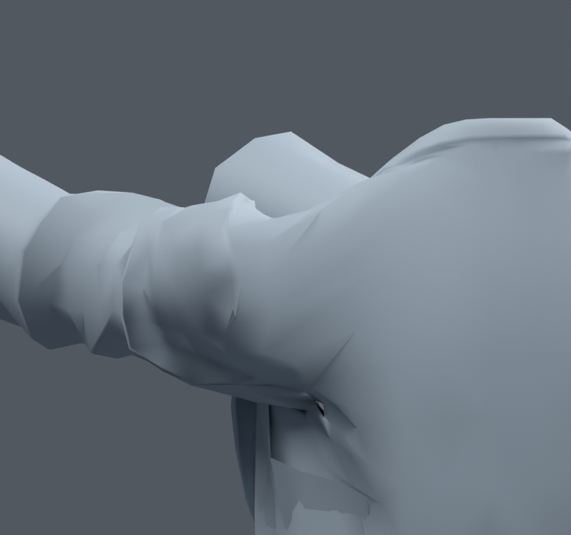
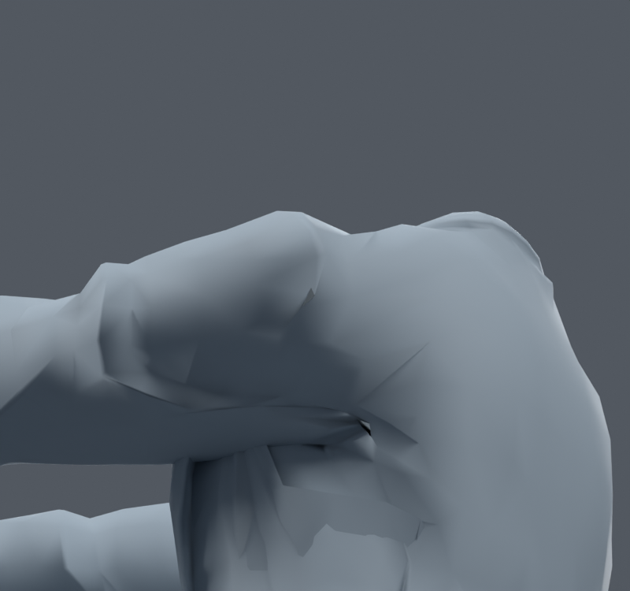

> **기록 시점 안내:** 아래는 해당 단계 당시의 보고서입니다. 후속 결정은 [최신 상태](../../STATUS.md)를 기준으로 읽어주세요. 모델·원본 텍스처·검증 원시 데이터는 이 문서 공유본에 포함하지 않습니다.

# v172 — 기존 두 면 연결만 수정한 후보

검토 파일 `bianca_TOPOLOGY_REVIEW.blend`. v167의 본129개·정점32773개를 그대로 사용한다. 코트의 기존 edge140–249를138–254로 회전하고, 원래 face15400의 대각선584–614를 명시했다. 기존 메시 수정이며 새 캐릭터 메시를 만들지 않았다.

536개 독립 자세 검사에서 새 면적 경고0, 새 교차0, 면적 경고6사건 감소. 정점 좌표·전체 shape key·웨이트·원래 코너UV·텍스처·129개 본rest가 모두 동일하다. 코트 노멀 벡터의 최대 차이는0.002502다. 근거 `SUMMARY.json`, `DELIVERY_AUDIT.json`.

뒤쪽 앞90도 사진을 실제 열어 확인했다. 큰 어깨 주름과 겨드랑이 접힘은 여전히 남아 있다. 이 결과는 작은 국소 개선이며 어깨 전체 해결로 보고하지 않는다. Unity 통합은 아직 별도다.

v171 두 edge 후보 중 원래face462/464는 새로운 교차1사건이 있어 제외했다. 1347/1351 영역만 유지했다. BMesh 연산 후 polygon index가 재배열되므로 원래 face provenance로 선택했다.
