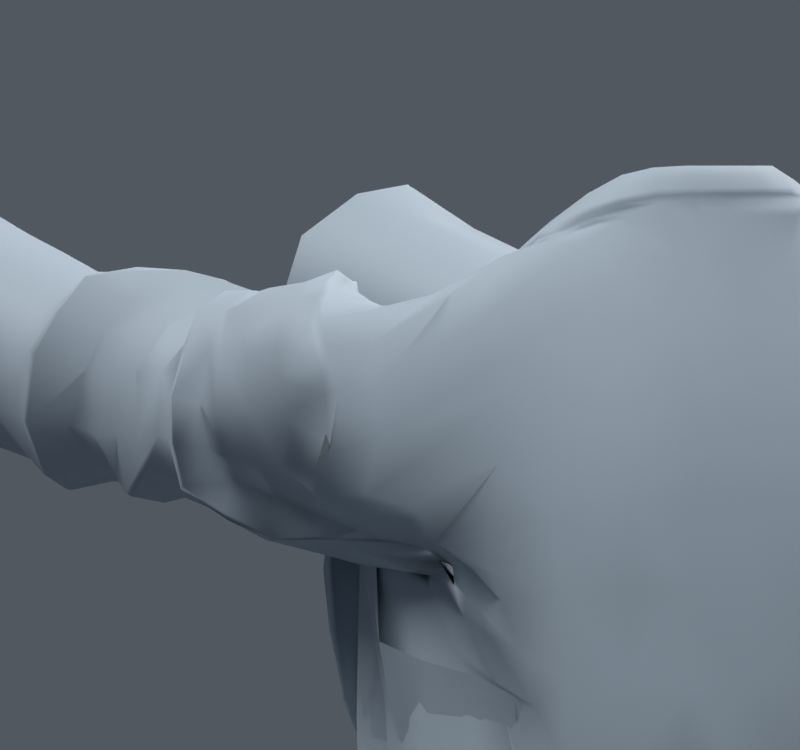
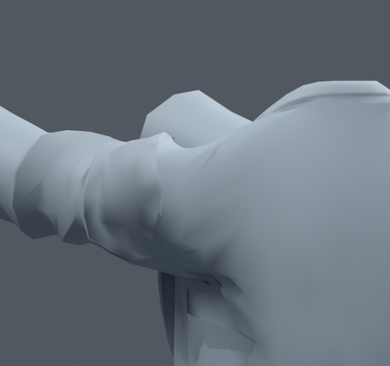

> **기록 시점 안내:** 아래는 해당 단계 당시의 보고서입니다. 후속 결정은 [최신 상태](../../STATUS.md)를 기준으로 읽어주세요. 모델·원본 텍스처·검증 원시 데이터는 이 문서 공유본에 포함하지 않습니다.

# v178 — 동작 중 오목한 홈 완화, 세 후보 미채택

기존 보정키60/90/120의 어깨·소매149–155정점을 바깥 방향으로만 완화했다. 정지 원형, 웨이트, 본, UV, 면 연결은 유지했다. 변위 한도1/3/6mm의 별도 blend를 만들었다.

156복합 자세의 결과:

| 후보 | 새 고정 면적 경고 / 해소 | 새 교차 / 해소 |
|---|---:|---:|
| SMALL |40 / 41|661 / 706|
| MEDIUM |83 / 55|1086 / 1337|
| FULL |117 / 75|1247 / 1666|

실제 앞90 뒤/아래 사진에서 FULL은 일부 홈을 완화했지만 접힘이 다른 위치로 옮겨졌고 회귀가 커서 채택하지 않았다. 이들 blend는 실험 이력이며 v180 패키지에 없다. 단순 전체 smoothing이나 같은 변위의 확대를 이어 적용하지 않았다. 다음 v179는 원래 면의 긴 edge에만 지지점을 추가한 독립 실험이다.

