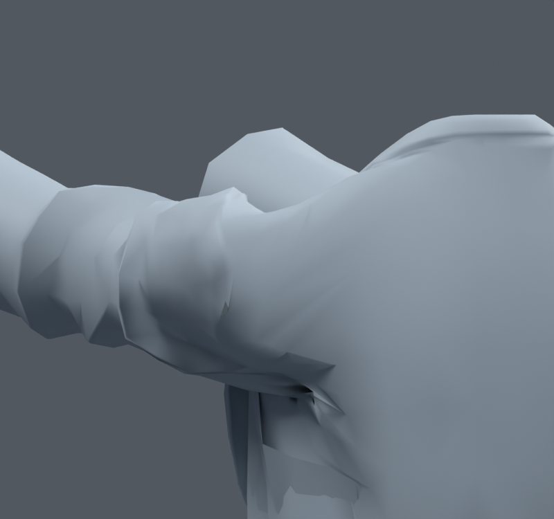

> **기록 시점 안내:** 아래는 해당 단계 당시의 보고서입니다. 후속 결정은 [최신 상태](../../STATUS.md)를 기준으로 읽어주세요. 모델·원본 텍스처·검증 원시 데이터는 이 문서 공유본에 포함하지 않습니다.

# v179 — 기존 지지선 추가 시험, 미채택

기존 코트의 긴 edge120개에 한 번씩 cut을 추가했다. 원래1736정점/모든 키/웨이트는 그대로이고 새 정점120개를 보간했다. 새 정점의 원래 면으로부터 오차 최대7.79e-9m, UV 보간 오차 약4.4e-8. 새 정점28개만 영향본을4개로 제한했다.

536자세에서 원래 face별 면적을 합산해 비교했다. 새 면적 경고16/해소24, 새 비인접 면 교차1066/해소1238. 면 분할로 삼각형 수가 늘어나는 효과를 배제하려고 원래 face ID로 묶고 원래 인접 face 쌍을 제외했다. 이 수치는 이전 삼각형 단위 경고 수와 직접 비교하지 않는다.

앞90 뒤 사진에서 겨드랑이 접힘이 더 날카로워졌다. 원형 보존만으로 동작 개선이 보장되지 않음을 확인했고 **통합하지 않았다**. v180은 v172의 작은 연결 수정만 사용한다.

첫 live MCP 편집에서 BMVert 참조가 제거되는 예외가 있었고 이후 연결 응답이 없었다. 원래 파일을 덮어쓰지 않고 별도 background Blender에서 원래 정점 식별 속성으로 매핑해 재현·검증을 마쳤다. `batch.py`, `batch_check.py`로 재현한다. 실패한 live 상태를 채택 결과로 간주하지 않는다.

