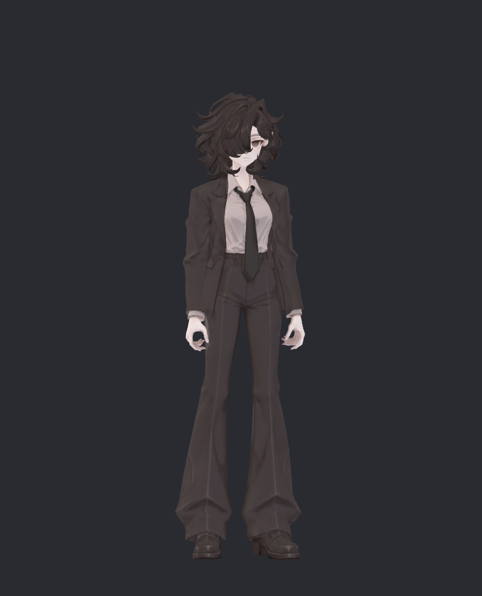
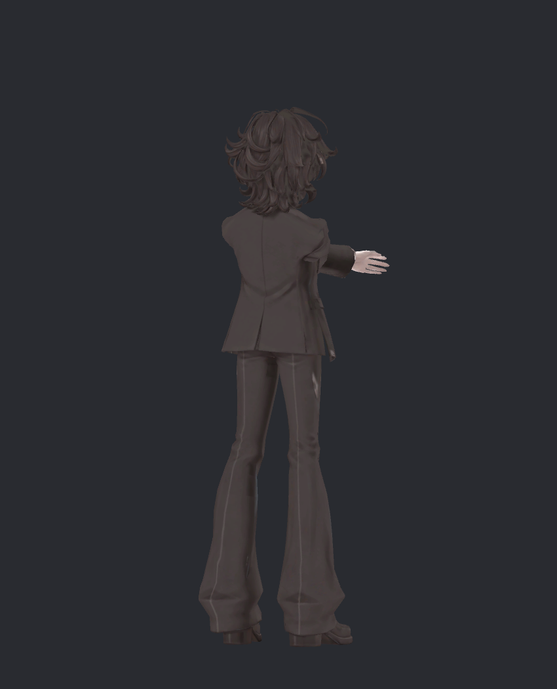
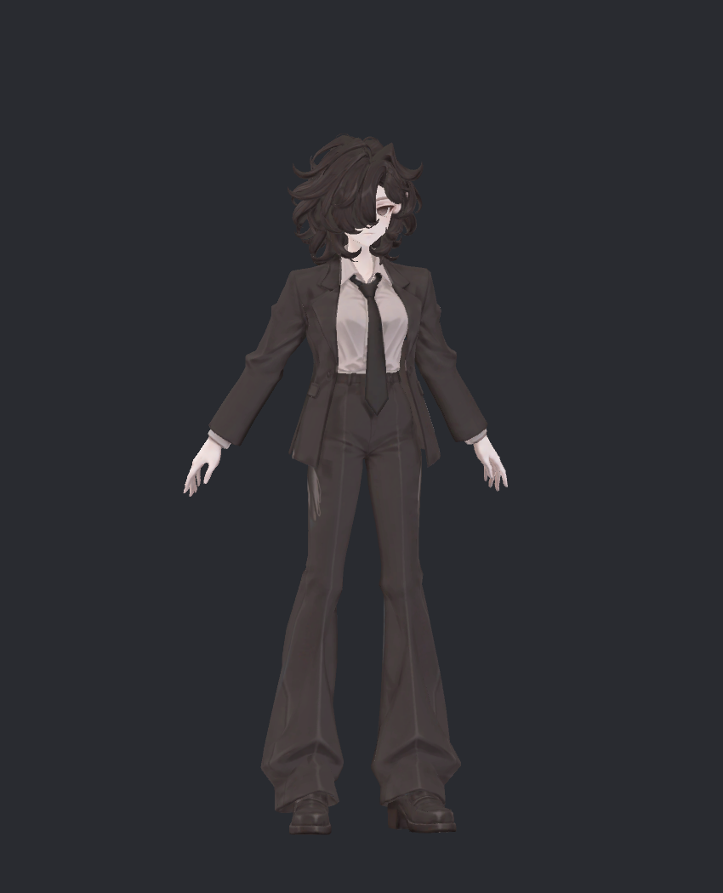
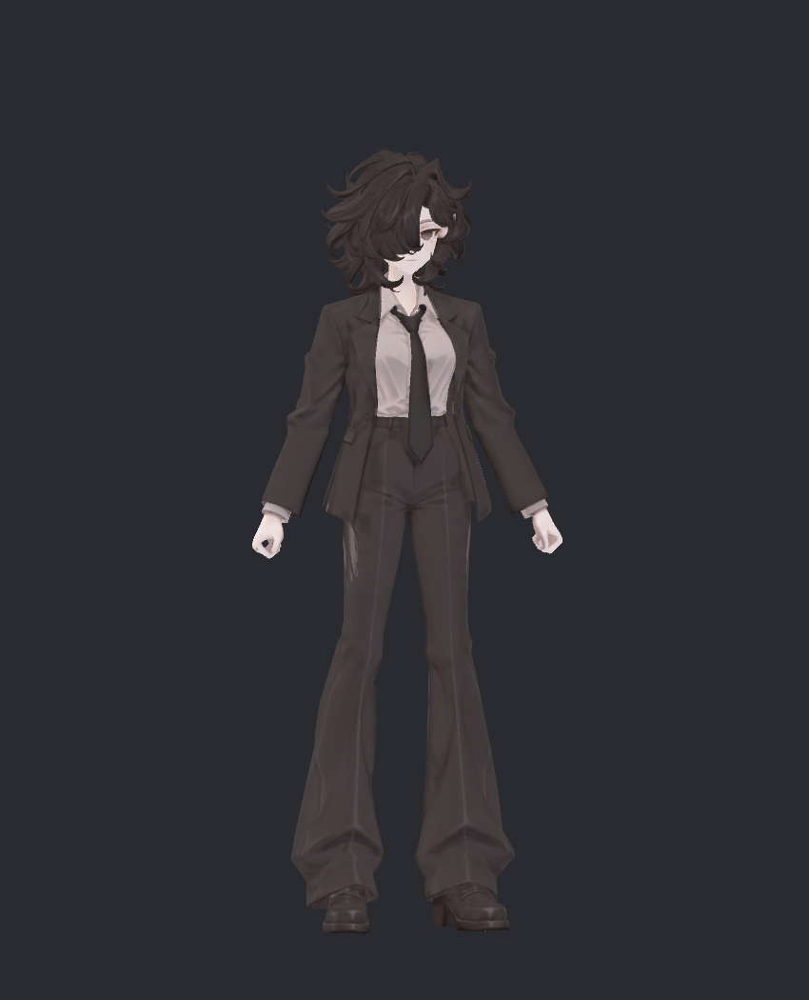

> **기록 시점 안내:** 아래는 해당 단계 당시의 보고서입니다. 후속 결정은 [최신 상태](../../STATUS.md)를 기준으로 읽어주세요. 모델·원본 텍스처·검증 원시 데이터는 이 문서 공유본에 포함하지 않습니다.

# 비앙카 통합 검토 v180

**현재 작업은 이 문서에서 한 번에 확인할 수 있다.** Unity 검수 패키지는 Bianca_v180_Review.unitypackage (공유본 미포함: `Bianca_v180_Review.unitypackage`), 대응하는 Blender 메시·본 기준은 v172 검수본 (공유본 미포함: `bianca_TOPOLOGY_REVIEW.blend`)이다. Unity에서 추가한 Humanoid 정의·자동 보정·물리·메뉴·재질은 패키지에 들어 있다.

아직 **일부 앞팔/복합 자세의 어깨·겨드랑이 옷 접힘이 남은 검수본**이다. 모든 관절 외형이 완성됐다는 뜻은 아니다. 실제 VRChat 클라이언트·업로드·Build & Test는 진행하지 않았다.

## PC 성능에 관한 사용자 요청 반영

등급만 낮추기 위해 보정이나 물리를 없애지 않았다. 구매 모델을 같은 SDK에서 실제 집계하고 실행 비용을 비교한 결과, 비앙카의 **Very Poor 등급을 허용하고 기능을 유지**하는 쪽으로 정했다.

| PC 항목 | 비앙카 | Lapwing 기본 | SiuSiu 기본 | SiuSiu Kisekae |
|---|---:|---:|---:|---:|
| 등급 |Very Poor|Medium|Medium|Very Poor|
| 삼각형 |31,363|67,698|61,582|61,582|
| Skinned Mesh |2|8|8|25|
| 재질 슬롯 |2|11|12|30|
| 텍스처 메모리 |2.67MB|26.00MB|13.69MB|집계 불완전|
| Contacts |94|0|1|1|

비앙카는 Contacts가 등급을 낮춘다. Kisekae는 분리된 메시25개가 원인이다. 실제 SDK PhysBoneJob 기록 합계는 비앙카0.696ms/SiuSiu0.445ms/Lapwing1.210ms로 두 참고 모델 사이였다. 비앙카 Contact CollisionScene0.0229ms/Receiver0.0375ms였고 큰 병목은 나타나지 않았다. 이는 **Editor에서 작업자 스레드 시간을 기록한 비교**이며, 서로 병렬 실행되는 값을 더해 실제 게임 한 프레임의 시간이라고 읽으면 안 된다. GPU나 VRChat 실제 클라이언트 성능을 측정한 것도 아니다.

다른 사용자의 표시 필터에 따른 제한은 여전히 남는다. 자세한 측정 조건·정적 기준·실패한 초기 측정은 [성능 비교 문서](../v170_runtime_validation/PERFORMANCE_COMPARISON.md)에 있다. 근거 [공식 PC 등급 기준](https://creators.vrchat.com/avatars/avatar-performance-ranking-system/).

## 이번에 실제로 해결한 실행 문제

- **루트 이동 시 보정 소실:** 가상 측정 구역6개로 센서를 분리했다. 이동/회전/크기0.5·1·2를 포함한192자세에서 최대 키 오차0.00088215%였다.
- **바람과 보정의 충돌:** Write Defaults 혼합으로 값이 누적되던 문제를 실제5구성 대조로 확인하고 수정했다.
- **기본 자세부터 팔이 등 뒤로 모임:** Unity Humanoid 기준에 원래 팔 내린 rest가 들어간 문제를 별도 T-pose Avatar로 수정했다. 메시·웨이트·원래 본rest를 바꾸지 않았다.
- **손가락의 실제 미매핑:** Unity HumanTrait 이름의 공백까지 맞춰51개 본 모두 GetBoneTransform으로 확인했다. 정의 목록51개만 보고 실제51개가 연결됐다고 판단했던 부분을 바로잡았다.
- **보정 반응 지연:** 중간 계산 단계를 줄여4레이어136파라미터에서3레이어100파라미터로 변경했다. 연속 검사에서3프레임→2프레임으로 줄었고, 지연을 정렬한 최대 키 오차0.00074248%였다.

## 형태와 움직임에 포함된 변경

v165 손목 축에 맞춘 커프스 보조 본, v159 카라 웨이트, v160 헤어, v161 코트 분리, v152 관절 부피 보정을 유지한다. v172의 기존 코트 연결 두 곳만 Unity에 반영했다. 바뀐 삼각형은4개→4개이며 정점·전체 키 frame·웨이트·bindpose·노멀·tangent·색·UV8채널은 동일함을 확인했다.

머리카락·옷자락·넥타이에11PhysBones, Collider8개, 영향 Transform34개가 있다. 바람은 Breeze 메뉴의 선택형 연출과 실제 PhysBone 관성을 함께 사용한다. 임의 월드 WindZone을 자동으로 읽는 구현은 아니다. 다른 두 모델의 물리 처리도 참고했다.

Standard 검수 재질과 lilToon Soft/Flat을 동일한 자세·조명에서 비교해 Soft를 선택했다. 원래 텍스처는 그대로다. 음영 개선을 메시 접힘 해결로 간주하지 않는다.

## 검증한 범위와 남은 경고

실제 연결된86근육 채널을 각각±0.65로 움직이고9종 복합 자세·무작위50자세·기본/복귀를 더해233자세를 검사했다. 다른 관절을 기본값으로 둔 standing 검사가 최신이다. 앞선 전체 근육0 검사는 관절 범위 중앙 자세여서 대기 자세와 다르며 `ALL_JOINT_CHECK.json`에 별도로 남겼다.

최신 `STANDING_JOINT_CHECK.json`:51본 실제 매핑,233자세 전체 좌표finite, 자동 보정 최대 오차0.00063276%, 기본 복귀 정점 오차0. PhysBones를 꺼서 관절과 보정만 분리했다. 물리는 별도1200프레임 ON/OFF연속 검사에서 확인했다.

**면적비 경고까지 모두0인 것은 아니다.** BodyHair65자세269사건, Coat38자세104사건이 남았다. 극소 삼각형·압축·자연스러운 접촉·외형 결함을 구분해야 하며 경고 개수만으로 파손 수를 단정하지 않는다. 큰 경고 부위도 있어 모두 무시할 수준이라고 판단하지 않았다. 특히 앞팔/복합 회전의 소매산·겨드랑이는 추가 형상 작업 대상이다. 상세 태그와 면적은 `SUMMARY.json`에 있다.

헤어 연속 검사에서13차례 경고를 만든 것은 동일한 삼각형 하나였다. 원래 면적1.82e-12m²로 거의 일직선인 세 정점이다. 헤어 전체13곳이 망가진 것으로 보고하지 않는다. 정지 복귀는 코트0, BodyHair약0.00012mm였다.

## 채택하지 않은 실험

v166 국소 길이/접촉 최적화, v168 다수 대각선, v169 정지 홈 채우기, v171 일부 edge, v178 동작 홈 완화1/3/6mm, v179 지지선120개 추가를 별도 파일에서 시험했다. 일부 모습은 좋아졌지만 복합 자세에서 새 찌그러짐/교차가 생겨 통합하지 않았다. v178/v179 뒤·아래 사진도 실제 확인했다. 원래 캐릭터 메시를 새로 생성하지 않았다.

## 로컬 검수 패키지

Unity2022.3.22f1, VRChat SDK3.10.5, lilToon2.3.4 환경을 사용한다. 패키지에는 자체 에셋13개만 포함하며 SDK·lilToon·구매 아바타·검사용 C#은 동봉하지 않는다. 씬은 `Assets/BiancaIntegration/Bianca_v180_Review.unity`, 프리팹은 같은 폴더의 `Bianca_v180_Review.prefab`이다.

패키지 내부13경로와 원래 의존성 목록을 대조했다. 크기10,115,209bytes, SHA256 `59cf8b13f767608c08f889a1a72c654ab6b169c11a5e3249e0dcc0cc1ca3a7ff`. 빈 프로젝트 재수입 검사는 `FRESH_IMPORT.txt`의 결과를 별도로 확인한다. 이 검수 패키지를 실제 VRChat 테스트 준비 완료 승인으로 해석하지 않는다.

빈 프로젝트 검증 완료: 패키지만 재수입한 프로젝트에서51실매핑/2메시/전체48shape/재질·텍스처·본·스크립트 참조/좌표finite를 확인했고 실제 씬도 렌더했다. FRESH_IMPORT.txt와 FRESH_IMPORT.png가 최종 결과다. 최초 ImportPackage 호출 직후 확인은 비동기 수입이 끝나기 전이라 실패했으며, import 완료 후 별도 검증 단계로 재실행했다. 이 초기 타이밍 오류는 FRESH_IMPORT_INITIAL_TIMING_ERROR.txt에 남겼다. 구매 모델/작업용 Assets를 가져오지 않았고 SDK/lilToon 패키지 의존성만 제공했다.
