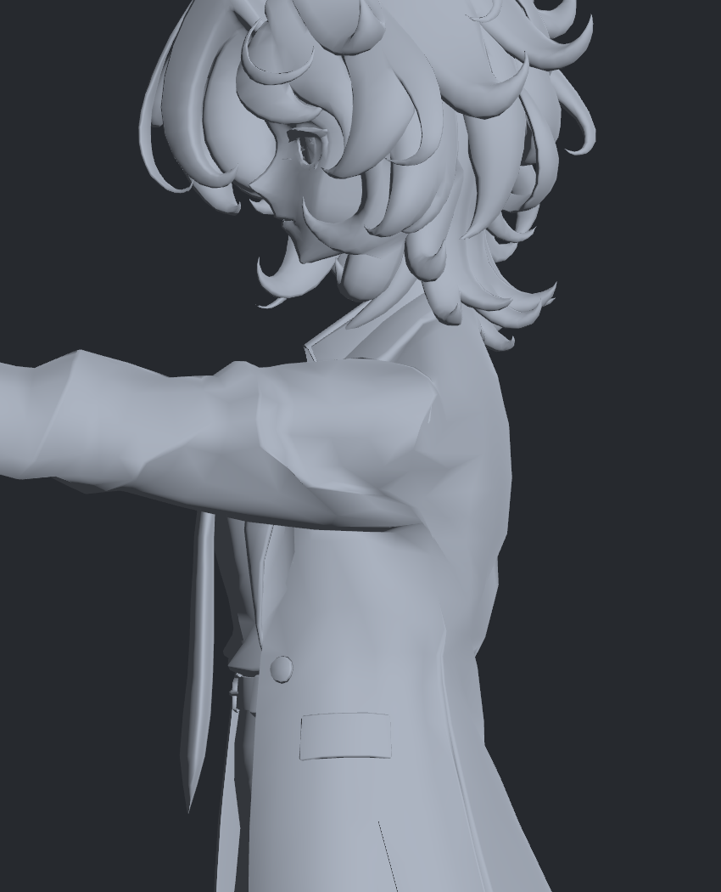

> **기록 시점 안내:** 아래는 해당 단계 당시의 보고서입니다. 후속 결정은 [최신 상태](../../STATUS.md)를 기준으로 읽어주세요. 모델·원본 텍스처·검증 원시 데이터는 이 문서 공유본에 포함하지 않습니다.

# v275 — 정지 자세 분리의 동작 회귀 검증 — 미채택

2026-09-12.

v273의 정점 이동을 기존26개 코트 보정 키와 원래 웨이트에 적용해 실제 캡처 본 행렬1,239개로 재구성했다. v253 후속4키는 제외한 기준이다. 새 면적 경고244/해소203, 새 큰접힘230/해소181, 새 교차10,869/해소22,455였다. 최대 교차선23.03mm 미만이며 침투 깊이가 아니다. 전체 자기 교차가 동작 내내0이라는 주장은 하지 않는다.

중립·왼팔 앞90도 Unity 렌더를 직접 확인했다. 정지 겹면을 분리한 효과는 있지만, 동작의 기존 각진 접힘이 남고 다른 교차를 만들기 때문에 **미채택**이다. 최종 모델을 이 후보로 교체하지 않았다. 정지 분리와 회전 변형을 함께 해결하는 후속이 필요하다.

