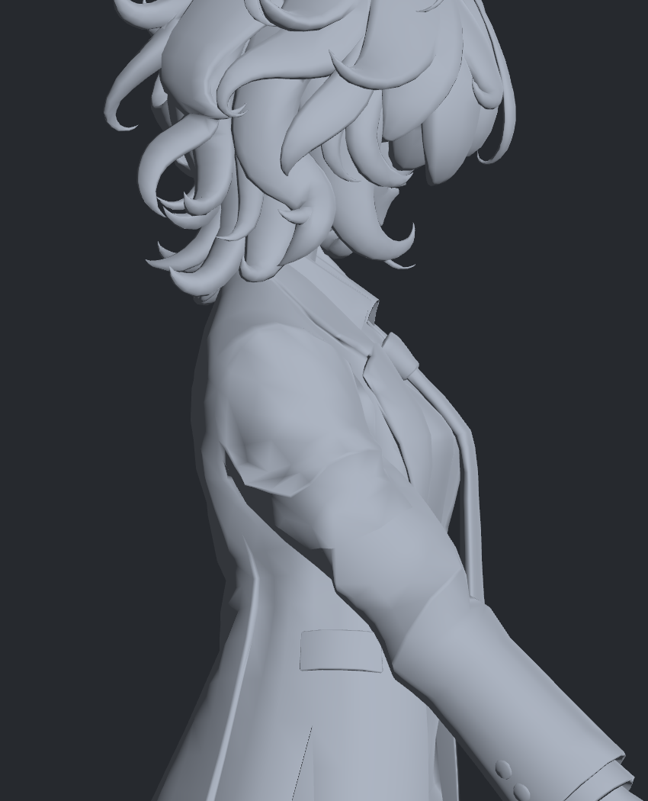
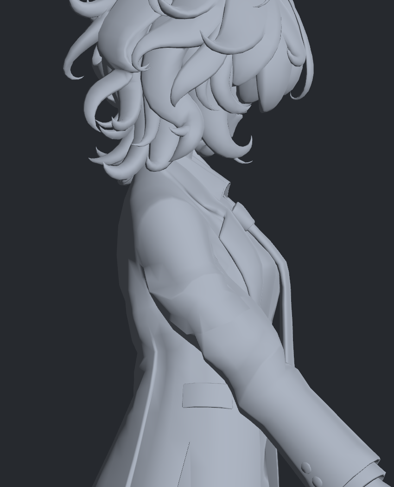
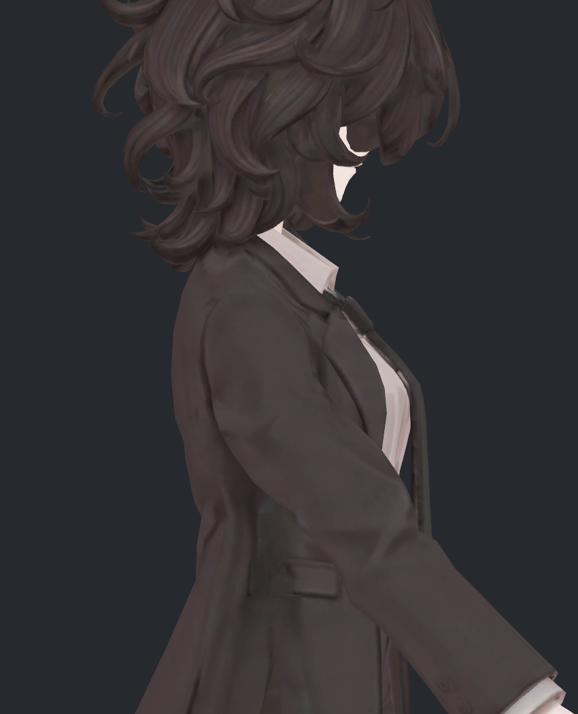

> **기록 시점 안내:** 아래는 해당 단계 당시의 보고서입니다. 후속 결정은 [최신 상태](../../STATUS.md)를 기준으로 읽어주세요. 모델·원본 텍스처·검증 원시 데이터는 이 문서 공유본에 포함하지 않습니다.

# v295 — 부피 보정 목표의 실제 Unity 스키닝 검수

2026-09-12 · 원래 메시/본/UV/웨이트 유지 · 별도 검수 사본 · **자동 보정과 전체 관절은 미완료**

## 바뀐 점과 원인

v285의 교차 없는 목표는 앞30도에서 위팔 중앙 최소 두께를 중립의 약83–84%로 줄였다. 단면적 검사만으로도 이 납작함을 잡지 못했다. v290에서 실제 평면 절단 단면적과 최소/최대 폭을 동시에 제한해 양팔 중앙 두께를 약95%로 회복했다. 단면적94.946–105.023%는 측정 가능한271개 중앙 단면의 범위이며, 열린9개 단면이나 어깨 뿌리 전체 부피가 통과했다는 뜻이 아니다.

별도로, 이전 노멀 방향을 변형 면에 옮긴 방식이 뾰족한 주름을 과장했다. v294에서 원래1765개 음영 연결 그룹을 유지하며 새 면에서 노멀을 계산했다. v295는 팔/어깨 범위 안에 적용하고, 밖은 실제 원래26키의 노멀을 유지한다. 노멀은 두께 보정에 사용하지 않았으며 위치 변경과 독립적으로 검사했다.

## 실제 스키닝 확인

v224의 기존26키에 검수용20키를 추가한 별도 prefab/mesh 사본을 만들었다. 원래 중립 정점 배열·삼각형·UV·본 웨이트는 동일하다. 새 메시나 대체 표면을 생성하지 않았다. 원래 본 행렬을 재현하고 검수 키를 명시적으로 선택한 뒤 Unity BakeMesh 출력에서 다시 검사했다.

| 검사 | 결과 |
|---|---:|
| 실제 Unity 스키닝 자세 | 20 |
| 목표 대비 최대 정점 오차 | 0.000597mm 미만 |
| 목표 대비 최대 단위 노멀 벡터 오차 | 0.00000076 미만 |
| 코트 자기 교차 | 0 |
| 새 면적 이상 / 해소 | 0 / 24 |
| 새120도 이상 접힘 / 해소 | 0 / 59 |
| 실제 스키닝과 목표의 단면 유효성 불일치 | 0 |
| 단면 최소 폭 최대 차이 | 0.000148mm 미만 |
| 새 몸 접촉 / 해소 | 323 / 2660 |

새 몸 접촉은 남는다. 최대 교차선7.97141mm는 침투 깊이가 아니다. 이 수치와 실제 그림을 확인하고도 **전체 해결·최종 채택으로 표시하지 않는다.**

초기 BakeMesh 캡처에서 스케일을 이중 적용한 오류를 발견해 이력에 분리했다. 최종 검사는 프로젝트의 기존 캡처와 같은 명시적 `BakeMesh(..., true)` 및 좌표 변환을 사용했다. [Unity 2022.3 공식 API](https://docs.unity3d.com/kr/2022.3/ScriptReference/SkinnedMeshRenderer.BakeMesh.html)의 스케일 인자와 CPU 스키닝 동작을 확인했다.

## 직접 확인한 그림

같은 오른앞30도와 카메라의 원래26키 출력:

두께 보정과 새 면 노멀을 실제 Unity에서 스키닝한 출력:

색이 있는 원래 재질에서도 확인했다:

위 그림들과 뒤45도, 위120도도 에이전트가 실제 열어 검수했다. 소매 끝의 원래 각진 형태와 일부 접힘, 몸 접촉은 남는다. 한쪽 사진만으로 양쪽/다른 동작을 통과 처리하지 않았다.

## 사용할 파일과 남은 일

검수 prefab은 `Bianca_v295_POSE_TARGETS_NOT_ADOPTED.prefab`, 메시 사본은 `Bianca_Coat_v295_POSE_TARGETS_NOT_ADOPTED.asset`다. 기존 모델을 덮어쓰지 않았다.

20키의 자동 선택·혼합은 아직 구현하지 않았다. 명시적으로 키를 선택한 실제 스키닝과 SDK 자동 구동은 다르다. v286의 상완만을 입력으로 한 방식은 많은 자세 회귀로 제외했고, v296/297에서 팔꿈치·쇄골·몸통과 중립을 구분하는 입력을 검사 중이다. 중간 자세의 부피/접촉과 새로운 자세 회귀를 해결한 뒤에만 자동 구동 후보로 연결한다. 실제 VRChat 클라이언트/업로드/Build & Test는 실행하지 않았다.
