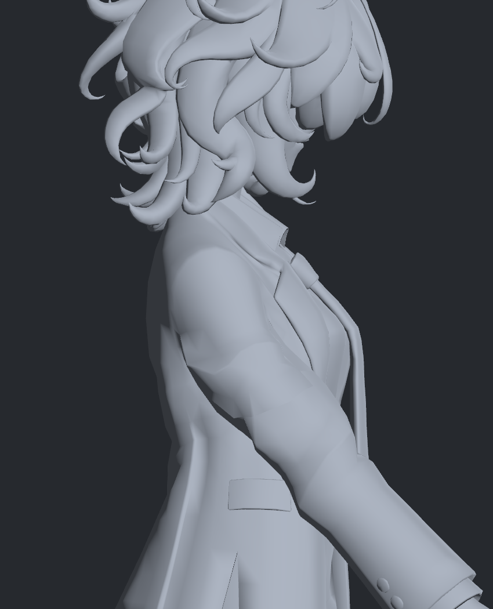
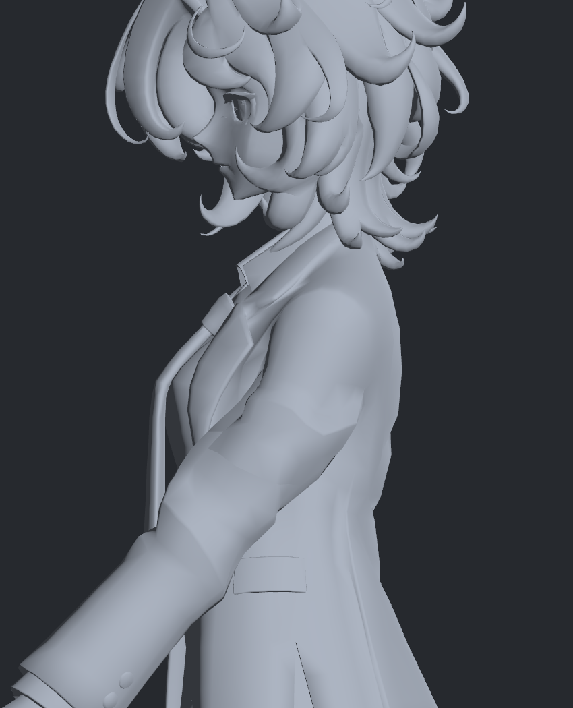
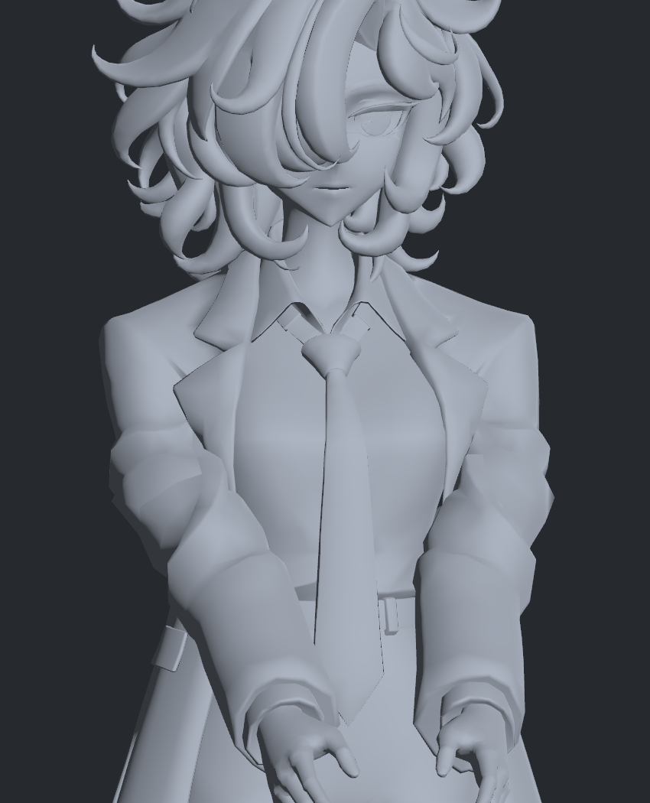

> **기록 시점 안내:** 아래는 해당 단계 당시의 보고서입니다. 후속 결정은 [최신 상태](../../STATUS.md)를 기준으로 읽어주세요. 모델·원본 텍스처·검증 원시 데이터는 이 문서 공유본에 포함하지 않습니다.

# v308 — 부피 보존 계산 수정과 실제 형상 재검수

**계산 오류 세 가지를 분리했고, 기본 자세의 두께는 개선됐습니다. 복합 자세의 비정상적인 접힘과 접촉이 남아 모델은 미채택입니다.** 원래 정점·면 연결·UV·본·웨이트를 사용하는 별도 목표 형상입니다. 이번 그림은 Unity에서 그 좌표를 표시한 정적 검수이며 자동 구동이나 실제 스키닝 검증이 아닙니다. 이전 v295의 실제20자세 BakeMesh 검증과 구분합니다.

## 부피를 어떻게 확인했는가

최소 두께, 실제 단면 면적, 구간 외곽 부피를 따로 측정했습니다. 위팔 축의55–85% 구간을25개 평면으로 자르고, 모든 단면이 유효한 닫힌 외곽일 때만 면적을 적분했습니다. 옷감 재료의 부피·어깨 전체 체적·해부학적 조직 부피는 아닙니다. 열린 단면은0으로 처리하거나 임의로 메우지 않았습니다.

| 앞30도 자세의 움직인 쪽 | 이전 v285 구간 외곽 부피 / 중립 | v308 / 중립 |
|---|---:|---:|
| 왼팔 | 91.40% | 96.73% |
| 오른팔 | 91.15% | 96.54% |

두 기본 자세의 중앙55–85% 검사28단면은 모두 유효했습니다. 최소 폭의 최저값은 중립의95.43%, 면적 범위94.95–100.00%였습니다.95–105%는 이번 실험 범위이며 보편적인 의복 합격선은 아닙니다. 매끄러운 계산용 폭과 최종 다각형의 실제 폭을 구분했습니다. 수치적 구간 적분은 간격을 두 배로 바꾼 결과와도 대조했습니다.

## 확인하고 수정한 계산 원인

1. **목표의 기준 혼용:** 목표 생성은 중립 REFINED, 충돌 시작은 ITERATED를 사용했습니다. 최대0.51846mm의 기준 차이를 v299에서 통일했고, v300의 학습 목표 적합 오차는 약0.461mm에서0.000251mm 미만으로 줄었습니다. 자동 전환 회귀가 모두 해결됐다는 뜻은 아닙니다.
2. **단면 교차점 개수에 따라 바뀌던 폭:** v290의 무가중 logsumexp는 교차점이45→43개로 바뀌면 거의 같은 외곽에서도 벌점이 약0.907708 점프했습니다. v306의 길이 가중 근사를 거쳐 v307에서 선분별 정확 적분으로 수정했습니다. 중복점·공선 분할 불변과 미분을 검증했습니다. 새 아바타 메시를 만든 것이 아닙니다.
3. **열린 몸 표면의 거리 판정:** 전역 winding 부호가 표면에서0.316mm 떨어진 곳에서 뒤집혔습니다. 부호를 붙인 거리로 최적화하면 벌점이 불연속이 됩니다. 단순 PSEUDONORMAL 교체도 열린 경계에서 실패해 제외했습니다. unsigned 거리로 바꾼 뒤에는 최근접 면 전환의 꺾임이 남았습니다. 실제 오른앞30도 정지점의 전진/후진 미분은 약+7.477/−0.676으로 달랐습니다. v308은 가까운 각 삼각형의 표면 거리 벌점을 합산하여 이 전환을 제거했고, 양방향 미분이 약6.935로 일치했습니다. 양쪽 앞30도 계산은 수렴 조건에 도달했습니다.

이는 열린 표면에서 프로젝트가 사용한 목적함수와 최적화 방식의 문제입니다. [libigl 구현](https://github.com/libigl/libigl/blob/main/include/igl/signed_distance.cpp)과 [거리 계산 설명](https://libigl.github.io/tutorial/#signed-distance)을 확인했으며 라이브러리 자체의 결함이라고 단정하지 않습니다. 새로운 unsigned 접촉 항은 내외부를 구별하거나 모든 삼각형 교차를 막는 방법이 아닙니다.

## 직접 확인한 그림과 남은 문제

같은 카메라·조명·기하 노멀 계산으로 비교했습니다. 원래 음영 연결 그룹을 유지했으며, 이번 비교의 노멀 재계산을 원래 v224 음영의 보존이나 채택으로 해석하지 않습니다.

오른앞30도 v308: 소매 중앙의 납작함은 줄었지만 어깨 아래 각진 접힘과 겨드랑이 틈은 남아 있습니다.

왼앞30도도 직접 확인했습니다. 두께가 유지되어도 큰 면의 각진 전환은 여전히 보입니다.

복합 자세571의 정면: 팔 안쪽이 덩어리처럼 꺾이는 비정상적인 형태가 남습니다. 이 그림을 합격 결과로 공유하지 않습니다.

두 기본 자세에서 코트 자기교차0, 새 면적 경고0, 새120도 초과 접힘 경고0이지만 시각적 완성을 뜻하지 않습니다. 기존 BodyHair와의 삼각형 교차는 원래 대비 새91/해소669가 남고 최대 새 교차선은9.86mm입니다. 교차선 길이는 침투 깊이가 아닙니다. BodyHair에는 몸 외에 작은 부속 요소도 있어 부위 분류가 필요합니다. coplanar 접촉은 이 선분 검사에서 별도 제외됩니다.

복합571은 계산이 다시 정지했고, 목표와 최대12.72mm 차이가 납니다. 이 자세도 코트 자기교차와 새 면적/큰접힘 경고가0이지만 위 사진의 형상은 여전히 실패입니다. 이 때문에 기준 모델·v295 검수 사본에 합치지 않았습니다. v300 자동 전환의1239자세 회귀, 다른 관절, 실제 자동 구동, 전체 체적 검수도 미완료입니다.

다음은 부피 수치를 더 맞추는 것만으로 진행하지 않습니다. 복합 자세의 접힌 기존 면과 정점 띠를 직접 추적해 원래 면 연결·변형 분담을 확인하고, 몸 접촉을 실제 삼각형과 부속 요소별로 분리해야 합니다. 새/대체 메시·리메시는 사용하지 않습니다.
