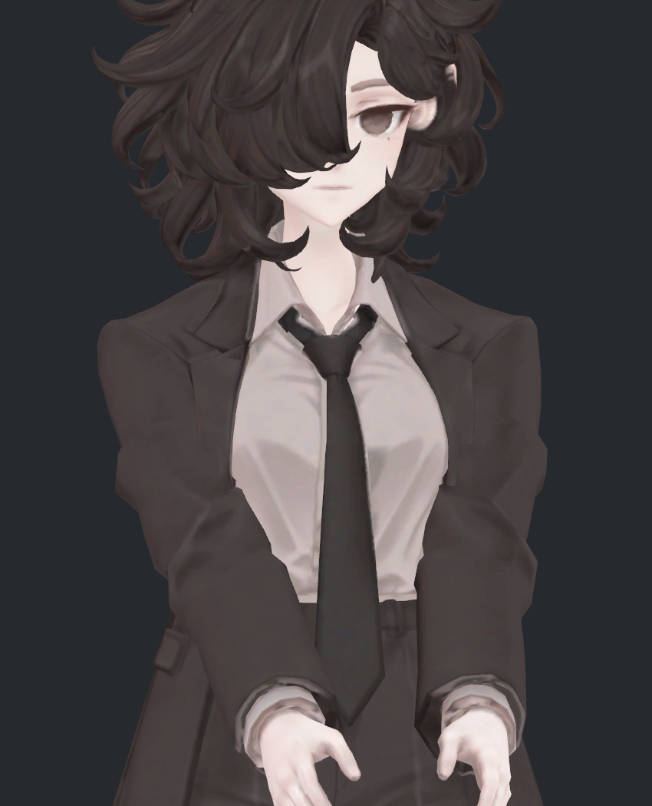

> **기록 시점 안내:** 아래는 해당 단계 당시의 보고서입니다. 후속 결정은 [최신 상태](../../STATUS.md)를 기준으로 읽어주세요. 모델·원본 텍스처·검증 원시 데이터는 이 문서 공유본에 포함하지 않습니다.

# v315 — 원형 주름과 기존 두께 보정의 작용 분리

어깨의 넓고 각진 앞면은 남아 있다. 기존 V152 두께 키를 끄는 것만으로 해결되지 않아 원본26키는 유지했다. 이 단계는 원인 진단이며 모델을 수정하거나 후보를 채택하지 않았다.

v309에서 Unity 카메라의 실제 광선으로 코트와 몸 표면을 함께 검사해 보이는 면을 식별했다. 팔꿈치·전완의 일부 면은 기본 자세와 복합 자세의 길이 변화가 거의 없고, 이웃 면의 접힘 각도도 같다. 사진의 모든 주름을 새 변형 결함으로 분류했던 판단은 지나치게 넓었다. 원래 조형 주름은 보존하고, 동작 중 새로 생긴 함몰·늘어남과 구분해야 한다.

세 그림과 측면, 기본 자세 클레이를 직접 열었다. 동일 원래 삼각형·기하 노멀 계산·재질·조명이며 두 움직임 그림은 카메라도 같다. 기본 자세와 동작 자세는 몸 위치에 따라 구도를 맞췄으므로 픽셀 차이를 정점 변화량으로 해석하지 않는다. Unity 정적 정점 스냅숏이며 새 자동 구동을 구현한 것이 아니다.

기존 V152 키는 복합 자세에서 정점을 최대7.60mm 이동시킨다. 작용은 어깨뿌리에 집중돼, 위팔 중앙55–85%의 닫힌 단면25개 적분에는 약0.003%p 이하 차이만 있었다. 이 중앙 구간 수치를 어깨 전체 두께 보존의 증거로 사용하면 안 된다. 어깨뿌리15–40%에는 독립된 소매 폐곡선이 없어 같은 방식의 체적을 산출하지 않았다.

복합 자세의 중앙 외곽 부피는 기존 형상에서 중립의 왼97.73/오른97.78%이고, v314 접힘 보정에서는96.59/96.80%다. v314는 접힘 일부를 줄였지만 이 구간의 부피가 원래보다 더 크거나 더 정확해진 것은 아니다. 일부 보이는 면은 늘어남도 증가했다. 면1659의 큰 방향 길이비는 기존1.224→v3141.396으로 늘었다. 후속에서는 부피·폭과 면의 늘어남을 함께 제한해야 한다.

`KEY_ABLATION.json`에 기본/왼·오른 앞30·90/복합 자세6개, 기존 키 OFF 대조, 보이는10개 면, 실제 폐단면 값을 보존했다. 원형 메시·UV·본·웨이트·기존 키는 변경하지 않았다. 어깨의 시각적 각짐, 몸 접촉, 자동 구동과 다른 관절은 미완료다.
