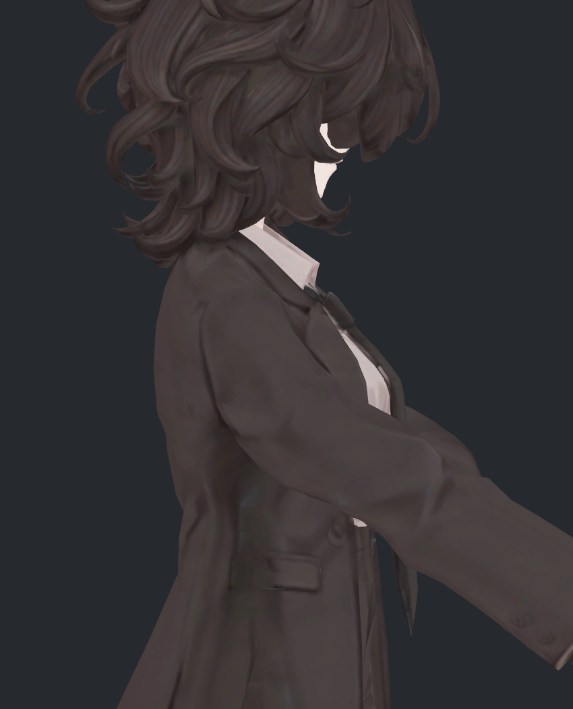
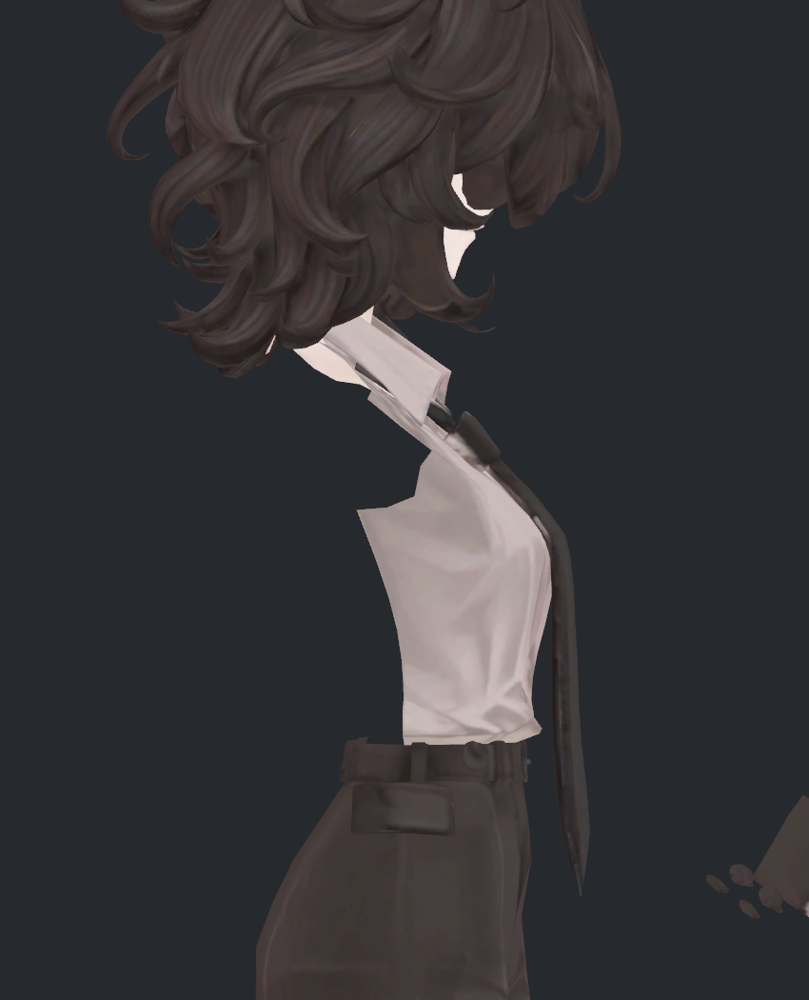

> **기록 시점 안내:** 아래는 해당 단계 당시의 보고서입니다. 후속 결정은 [최신 상태](../../STATUS.md)를 기준으로 읽어주세요. 모델·원본 텍스처·검증 원시 데이터는 이 문서 공유본에 포함하지 않습니다.

# v319 — 작업 중 겪은 문제·시도한 방법·미채택 사유

2026-09-12 · 사용자 피드백용 기록 · **형상 문제 미해결 / 이번 단계는 문서 정리만 진행**

현재 어깨와 겨드랑이의 넓은 각짐, 접힐 때의 소매 형태, 코트와 안쪽 셔츠의 교차를 해결하지 못했습니다. 수치가 좋아진 후보도 실제 그림에서 자연스럽다고 판단할 수준에 도달하지 못했습니다. v319에서는 새 모델을 수정하지 않고, Mac 재개 후 v263–v318의 주요 시도와 판단을 정리했습니다. 최근 v309–v318을 상세히 다룹니다.

기준 v212 형상과 v224 노멀은 보존했습니다. 아래 실험을 기준 모델에 합치지 않았으며, 새 최종 Blender/Unity 아바타도 만들지 않았습니다. 문서를 확인하신 뒤 주실 피드백을 다음 편집에 반영하겠습니다.

## 1. 실제로 확인한 모습

아래 여섯 장은 기존 검수 렌더를 다시 직접 열어 확인한 원본 복사본입니다. 사진을 새로 보정하거나 모양을 가공하지 않았습니다. ②·③은 같은 복합 자세571, 같은 정면 카메라입니다. 자세571은 팔을 앞으로 모으는 자세이며, 명령값의 음수 부호를 뒤로 젖히는 자세로 해석하면 안 됩니다.

### ① 기본 자세 — 보존할 원래 주름의 기준

중립 상태에도 전완과 소매에 굵은 조형 주름이 있습니다. 이전 설명에서 눈에 보이는 덩어리 주름을 모두 새 변형 결함으로 묶은 것은 과했습니다. 원래 주름을 보존할 범위와 동작 중 새로 꺾이는 어깨 면을 구분해야 합니다.

### ②·③ 같은 자세의 수정 전후 — 여전히 미채택

| ② 기준 형상, 자세571 | ③ v316 부피·면 길이 동시 제약 |
|---|---|
|  |  |

③에서는 일부 면이 길게 당겨지는 현상을 줄였지만, 어깨 앞과 겨드랑이에서 넓은 면이 각지게 전환되는 모습이 남습니다. 이 사진을 자연스러운 완성 형태로 판정하지 않았습니다. 숫자상 중앙 부피를 유지했다는 사실만으로 어깨 전체의 형태가 좋아졌다고 할 수 없습니다.

### ④ v316 측면 — 부피 수치로 대신할 수 없는 외형

앞면 사진만으로 판단하지 않도록 같은 후보의 측면도 넣었습니다. 어깨 뿌리와 소매가 이어지는 면 흐름이 충분히 자연스럽지 않습니다. 아래 부피 수치는 팔 중앙의 닫힌 단면 구간에 한정되며, 이 뿌리 부분 전체를 측정한 값이 아닙니다.

### ⑤ 코트를 숨겨 확인한 안쪽 셔츠

이 그림은 코트를 임시로 숨긴 진단입니다. 메시를 새로 삭제한 결과가 아닙니다. 접촉 검사 대상인 component12는 측면과 뒤가 열린 셔츠 조각이며 경계 모서리가77개입니다. 닫힌 인체 몸통이나 완전한 팔로 가정해 안/밖을 나누는 방식은 이 표면에 맞지 않았습니다.

### ⑥ 접촉 제약을 강화한 v317 — 새 회귀 발생

교차를 줄이려고 제약을 강화했지만 마지막 검사에서 새 면적 이상7건과 큰 접힘1건이 생겼습니다. 교차도 남았습니다. 이 사진은 실패 후보의 기록이며 전달 모델이 아닙니다. 그림만으로 내부 교차 수나 위치를 모두 판별할 수 없어 실제 삼각형 검사와 함께 판단했습니다.

## 2. 작업 중 부딪힌 핵심 문제

| ID | 겪은 문제 | 확인된 근거와 의미 | 아직 모르는 부분 |
|---|---|---|---|
| I1 | 검사 통과와 시각 품질이 일치하지 않음 | 자기교차·새 큰 면적 이상이0이어도 넓은 각짐과 부자연스러운 접힘이 사진에 남음 | 사용자가 보존하려는 주름과 수정해야 할 형태의 정확한 경계 |
| I2 | 부피·면의 늘어남·접촉을 동시에 만족시키기 어려움 | v316은 면의 큰 방향 늘어남을 줄였지만 셔츠 새 교차가 v314의79→90쌍으로 증가 | 기존 면 연결과 두 레이어의 경계를 어떻게 함께 조정해야 회귀를 피할지 |
| I3 | 한 자세의 개선이 다른 자세로 이어지지 않음 | v273 중립 교차를 없앴지만 v275의1,239자세 예측에서 새 교차10,869쌍 발생 | 제한된 목표 자세 밖에서 자연스러운 변형을 유지할 구조 |
| I4 | 사용한 계산의 전제에 오류가 있었음 | 중립 기준 혼용, 단면 표본 수에 의존한 폭, 열린 셔츠의 안/밖 가정 등을 수정 | 계산을 고친 뒤에도 남는 형상 문제의 충분한 해결 조건 |
| I5 | 정적 좌표 실험과 실제 자동 구동 사이에 간격이 있음 | v295는20자세 실제 Unity 스키닝 확인. 최근 v309–v318은 주로 자세571의 정적 형상 검수 | 새 보정의 자동 활성화, 연속 동작, 다른 관절, VRChat 실행 |

기본 스키닝의 영향도 일부 확인했습니다. v263의 특정 어깨 모서리는 중립 약7°에서 기본 리그만으로 약175°까지 접혔고, 인접 위치의 본 영향 비율도 급격히 달랐습니다. 따라서 노멀만 바꾸면 해결되는 문제가 아닙니다. 다만 이 한 모서리의 증거를 모든 어깨 결함의 단일 원인으로 확대하지 않습니다.

## 3. 앞선 방법들은 왜 채택하지 않았나

`회귀`는 새 악화를 실제로 확인한 경우입니다. `검수 미완료`는 성공도 실패도 충분히 확정하지 못한 경우입니다. `계산 수정`은 분석 방식의 개선이며 모델 채택과 다릅니다. 서로 다른 자세 수·검사 기준의 숫자는 후보 순위를 매기는 용도로 직접 비교할 수 없습니다.

| 단계 / 방법 | 의도와 실제 결과 | 미채택 또는 보류 사유 |
|---|---|---|
| v263 DQS 진단 | 회전 시 두께 손실을 줄이는 스키닝 방식을 비교 | 겨드랑이가 부푸는 외형. 진단에만 사용, 모델에 적용하지 않음 |
| v264 웨이트 평활화·절반 회전 보조 | 본 영향의 급격한 변화를 분산. W15는 선택40자세에서 새 압축203건·새 큰 접힘118건. 보조 회전/피벗12조건도 회귀 | 앞쪽 개선이 뒤쪽 악화로 이동. 전체 채택 불가 |
| v265 기존 면 대각선 변경 | UV·평면성 조건 안의7모서리/14면 후보를 비교 | 후보가 주요120° 초과 접힘 모서리를 포함하지 못함. 전체 접촉·실제 구동 검수도 미완료. 주 결함 해결 근거 부족 |
| v266 참고 모델 관절 비교 | 두 참고 모델30자세의 실제 팔 방향을 맞춰 구조를 관찰 | 한 모델의 완만한 재킷 연결은 참고했지만 다른 모델의 수동 시험에는 레이어 교차가 있었음. 그대로 정답으로 삼거나 메시·웨이트를 복사하지 않음 |
| v267 소매 영향도 재분배 | 팔 영향도를 줄이고 어깨 영향도를 늘리는8조건 | 최선 조건도40자세에서 새 압축83건·새 큰 접힘131건. 부풀음과 깊은 홈이 남음 |
| v268 곡선을 따른 가상 회전 분담 |9개의 가상 회전 기준으로 변형을 연속 분산 | 평활 조건에서도 새 압축 최소579건·새 접힘250건. 실제9본을 추가한 모델은 만들지 않음 |
| v269–v270 기존 본 웨이트 최적화·코트 가상 피벗 | 앞90도 굽힘 비용54.94→16.17 등 감소. 가상 피벗 이동의 비용 개선은10.44→10.01로 작음 | 뒤30도 새 면적 이상1건과 각진 면이 남음. 비용 감소가 자연스러운 외형을 뜻하지 않음 |
| v271 기존 중립 정점+웨이트 완화 | 최대 중립 이동 약1.062mm. 선택13자세 새 면적 이상0, 앞90도 비용54.94→9.56 | 사진의 각짐 잔여. 반대쪽·새 자세·연속 동작·접촉·실제 구동 미검증으로 보류 |
| v272 연결 표면의 회전 재구성 | 국소 접힘을 완화 |40자세 새 교차3,652쌍: 코트 자체2,925 / 몸727. 교차 회귀로 제외 |
| v273–v275 중립 겹면 분리 | 기존125위치 최대1.944mm 수정. 중립 교차40/Unity 중립34→0 |1,239자세 예측에서 새 면적244·큰 접힘230·교차10,869. 정지 자세의 성공을 동작 해결로 채택할 수 없음 |
| v285–v295 소매 두께·노멀·실제 스키닝 | 앞30도 최소 두께 약83–84% 문제를 실제 단면 제약으로 개선. 원래 음영 경계를 유지하고20자세 Unity BakeMesh 대조 | 새 몸 교차323쌍 잔여.20개 검수 키의 자동 전환 미구현. 실제20자세 재현은 확인했지만 전체 수정안은 미채택 |
| v297–v300 자세별 보정 보간 | 자세 사이에 보정이 자연스럽게 이어지도록 시도. v299–300은 혼용 중립 기준을 통일 |1,239자세에서 새 면적5·큰 접힘5, 회귀8자세에 자기교차 잔여. 중립 기준 오류 수정과 보간 품질 해결은 별개 |
| v298 제한된 보정값으로 회귀 억제 | 기준21자세를 고정하고 중간 자세를 보완 | 작은 계수 제한은 조건 불성립, 큰 제한은 중간 변화18.28mm와 새 문제15건. 그 설정으로는 채택 불가 |
| v306–v308 폭·접촉 목적함수 수정 | 단면 분할 수에 따른 값 변화는 선적분 방식으로, 최근접 면 전환 문제는 주변 삼각형 비용 합으로 개선 | 미분·기본 자세 계산은 개선됐지만 복합571은 목표 이탈12.72mm와 시각 문제 잔여. 계산 수정만 유지 |

참고 모델 비교와 수학적 진단은 원인을 좁히는 데 도움을 줬지만, 그 자체가 이 모델의 해결책을 검증한 것은 아닙니다. 구매 모델과 원본 참고 이미지는 이 공유 문서에 포함하지 않았습니다.

## 4. 최근 v309–v318의 시도와 중단 이유

| 단계 | 시도한 방법 / 확인한 변화 | 채택하지 않은 이유 |
|---|---|---|
| v309 | 카메라 광선으로 보이는 면을 추적하고 원래 주름과 동작 결함을 분리. 공간 단면의 삼각형 교차 전환에서 미분 불연속도 확인 | 원인 진단이며 새 수정 모델 아님. 원래60° 이상 모서리를 모두 제외하면 어깨 문제19모서리도 보정 밖에 남음 |
| v310 | 원래 모서리의 고정 위치를 잇는 재료 띠로 폭 계산을 안정화 | 띠가 팔 방향으로 미끄러져 실제 단면 최소 면적91.59%, 최소 폭92.29%. 계산용 띠의 정상 값이 실제 두께를 보장하지 못함 |
| v311 | 굽힘 비용을50/150으로 높여 접힘 분산 | 실제 면적 약91.6%, 새 몸 교차76쌍. 두께와 접촉 문제 잔여 |
| v312 | 띠가 팔 축 방향으로 벗어나지 않도록 정렬 조건 추가 | 유효 실제14단면의 최소 면적94.83%, 최소 폭95.41%로 개선했으나 새 몸 교차74쌍과 큰 시각 주름 잔여 |
| v313 | 기존 삼각형 길이를 보존하는 비용30/100 시험 | 계산 완료와 자기교차0까지만 확인. 별도 시각·몸 접촉·실제 단면 검수 미완료로 보류. 검증된 실패라고 단정하지 않음 |
| v314 | 원래60° 이상이어서 제외했던19모서리도60°/90° 목표로 완화 | 일부170° 접힘→약60.4°지만 면이 과하게 늘어남. 새 몸 교차79쌍. 자연스러운 면 흐름을 해결하지 못함 |
| v315 | 중립과 좌우 앞30/90도·571의6자세에서 기존 두께 키6개를 꺼 비교 |571에서 최대 위치 차7.60mm지만 중앙 부피 차이는0.003%p 미만. 키를 끄는 것만으로 외형 문제가 해결되지 않음. 원래 주름 판정은 이 진단을 반영해 정정 |
| v316 | 모서리 완화+축 정렬+면 길이 비용30을 함께 적용 | 면1659 큰 방향 길이비1.396→1.051로 개선. 다른 방향0.925로 압축 잔여. 중앙 부피 약96.8%이나 새 몸 교차90쌍과 어깨 각짐 잔여 |
| v317 | 기준 교차를 나누는 평면 조건으로 새90쌍을 억제하고 두 번째에는 제약을 강화 | 첫 회에 기존 대상1쌍+다른71쌍=72쌍, 다음 회66쌍 잔여. 마지막 새 면적 이상7건·큰 접힘1건. 문제를 주변으로 옮긴 회귀 |
| v318 | v316 코트는 고정하고 기존 셔츠524위치만 축별±6mm 안에서 이동, 인접 정점 변화도 제한 | 선택한 선형 조건에서 해가 없다는 결과(primal infeasible). 후보 좌표나 모델을 저장하지 않음. 모든 기존 메시 수정이 불가능하다는 증명은 아님 |

## 5. 부피와 접촉 숫자를 읽을 때의 한계

**부피:** v316의96.75%/96.83%는 팔 길이55–85% 구간의 좌우 각25개 닫힌 단면으로 계산한 외곽 부피이며 중립 대비 값입니다. 옷감 자체 체적이나 인체 체적, 어깨 전체 부피가 아닙니다. 뿌리15–40% 구간에는 독립적인 닫힌 단면이 없어 같은 방법으로 전체 부피를 주장할 수 없습니다. 같은571 기준 형상은 중앙97.73%/97.78%였습니다. 따라서 v316을 단순히 “원본보다 부피가 좋아졌다”고 설명하면 틀립니다.

**면 길이:** 면1659의1.396→1.051은 크게 늘어나는 한 방향의 비율입니다. 다른 방향은0.925로 약7.5% 압축됐습니다. 한 면의 수치 개선을 전체 소매의 늘어남 해결로 확대하지 않습니다.

**교차:** v316의 새90쌍은 코트와 몸/셔츠 삼각형 쌍의 사건 수입니다. 독립된 결함90곳이라는 뜻은 아닙니다. 해소된217쌍은 몸 접촉,558쌍은 코트 자기교차입니다. 과거 합계775를 몸 교차 해소 수로 읽으면 안 됩니다.

**위치와 깊이:** 새90쌍 중25쌍은 교차선의9표본이 모두 기존 교차 곡선1mm 이내,59쌍은3mm 이내였습니다. 가장 먼 값은8.94mm입니다. 이는 기존 접촉의 위치 이동인지 살피는 진단이며, 관통 깊이나 허용 판정이 아닙니다. 가까우니 무시해도 된다는 결론을 내리지 않았습니다.

**실행 범위:** v295의20자세는 실제 Unity BakeMesh 검증입니다. 최근 v309–v318의 정적 Unity 형상 렌더는 새 자동 키 활성화·연속 동작 검증과 다릅니다. 이 후보들의 새 드라이버, VRChat Build & Test·업로드·클라이언트 검수는 수행하지 않았습니다.

## 6. 제 작업 방식에서 바로잡을 점

- 원래 조형 주름을 새 결함과 충분히 구분하기 전에 넓게 문제로 설명했습니다. 중립·동작·키OFF 비교와 보이는 면 추적으로 판단을 좁혔습니다.
- 계산 조건을 계속 개선하면서도 사용자가 지적한 사진의 모양과 충분히 일치하는 목표를 먼저 고정하지 못했습니다. 수치 개선을 반복하는 것만으로 진행 상황을 설명하면 실제 해결 정도가 과장됩니다.
- 폭을 재는 띠와 실제 단면, 중앙 외곽 부피와 어깨 전체 부피를 혼동하지 않도록 검사 대상을 분리했습니다.
- 열린 셔츠를 닫힌 몸처럼 취급한 전제, 중립 기준 혼용, 표본 수에 따라 달라지는 비용 등은 제가 사용한 모델링·계산 방식의 문제였습니다. 외부 라이브러리 자체의 결함이라고 주장하지 않습니다.
- 미검수 후보, 실제 회귀 후보, 해가 없었던 제한 조건을 모두 같은 “실패”로 뭉뚱그리지 않겠습니다. 이번 문서에서 이유를 각각 구분했습니다.

재사용할 수 있는 것은 통일한 중립 기준, 실제 단면 재검사, 면 길이 양방향 검사, 미분 확인, 교차 종류 구분, 사진 직접 대조 같은 검증 방법입니다. 이를 재사용한다는 말은 위 수정 모델을 채택한다는 뜻이 아닙니다.

## 7. 피드백을 남길 위치

| 번호 | 확인받고 싶은 내용 |
|---|---|
| F1 | 사진①–⑥에서 가장 비정상적으로 보이는 부위와 모양. 예: ③ 어깨 앞의 넓은 평면 / ④ 겨드랑이 홈 |
| F2 | ①의 원래 주름 중 유지할 부분과 동작 시 달라져야 할 부분 |
| F3 | 위 시도 중 다시 검토할 접근 또는 피해야 할 접근과 그 이유 |
| F4 | 추가로 보고 싶은 자세·각도·비교 대상 |

번호 없이 자유롭게 피드백하셔도 됩니다. 현재 후보 중 하나를 채택해 달라는 요청은 아닙니다. 피드백을 받은 뒤 문제 부위와 목표 형태를 구체화하고, 기존 코트·셔츠 경계와 면 연결을 함께 검토하는 다음 범위를 정리할 예정입니다. 이 방향은 아직 실행하거나 성공을 검증한 해결책이 아닙니다. 이번 문서 공유 후에는 새 형상 실험을 이어가지 않고 피드백을 기다립니다.

## 8. 상세 기록

이전 실제 스키닝 검수 v295 (공유본 미포함: `README.md`) · 계산 수정과 한계 v308 (공유본 미포함: `README.md`) · 원래 주름과 두께 키 v315 (공유본 미포함: `README.md`) · 부피·면 길이 v316 (공유본 미포함: `README.md`) · 셔츠 분리 조건 v318 (공유본 미포함: `README.md`)

본문은 해당 단계의 기존 보고서와 검증 결과를 재검토한 요약입니다. 이번 v319에서 실험을 다시 실행한 것은 아닙니다. 사진 출처·해시는 작업 저장소의 별도 검수 기록에 보존했습니다. 공유본에는 문서와 직접 확인한 자체 렌더만 포함합니다.
