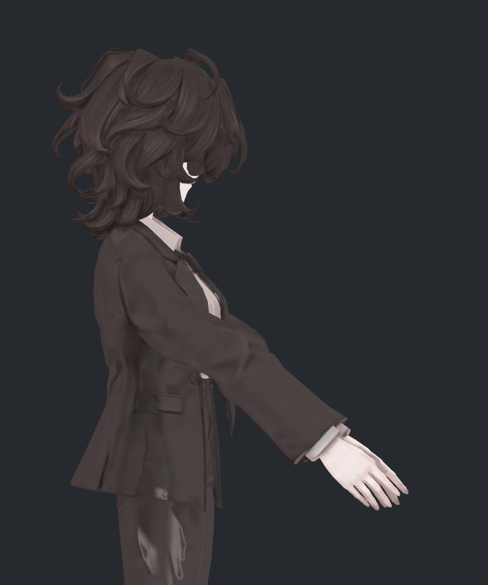
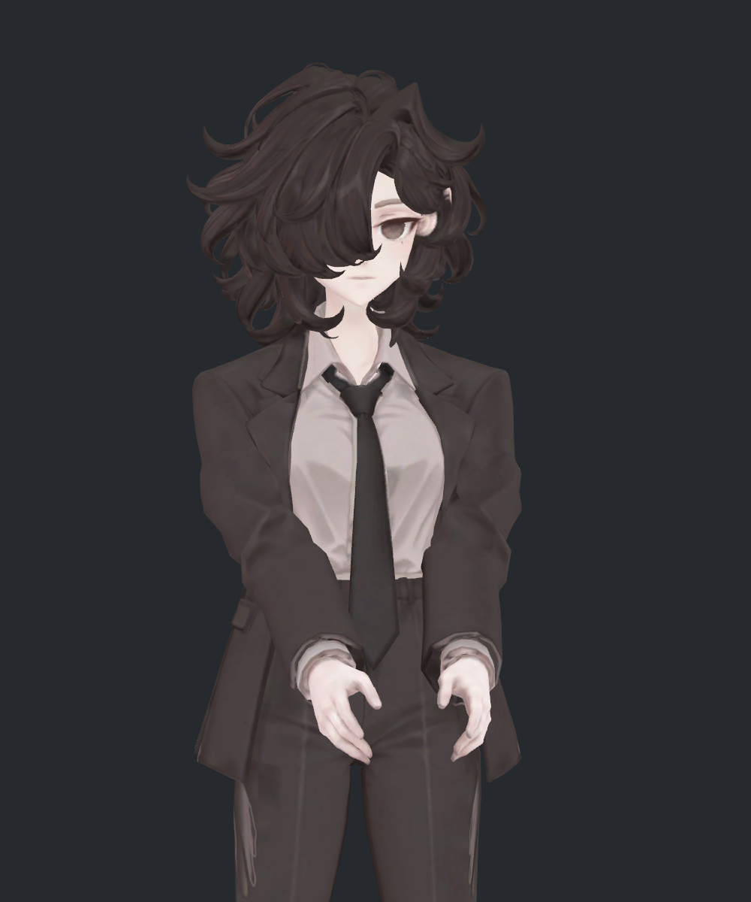
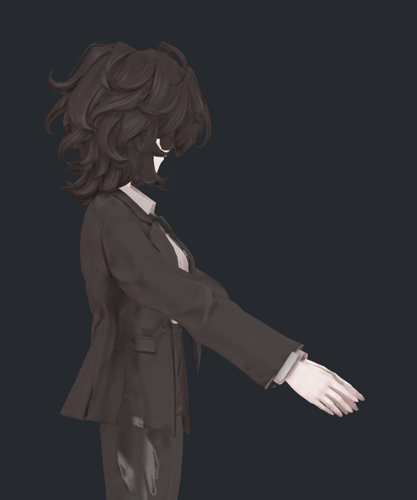

> **기록 시점 안내:** 아래는 해당 단계 당시의 보고서입니다. 후속 결정은 [최신 상태](../../STATUS.md)를 기준으로 읽어주세요. 모델·원본 텍스처·검증 원시 데이터는 이 문서 공유본에 포함하지 않습니다.

# v320 — 사진③ 기준, 팔꿈치를 완전히 편 비교

2026-09-12 · 사용자 요청에 따른 자세 확인 사진

사진③(v316 M30)의 형상을 기존 본·웨이트로 연결한 임시 사본에서 **어깨 위치·윗팔 방향은 유지하고 팔꿈치만 완전히 폈습니다.** 양쪽 팔꿈치의 실제 굽힘은 약9.23°→0°입니다. 팔을 수평으로 들어 올린 자세나 T포즈는 아닙니다. 원본과 사진③의 보관 데이터는 유지했습니다.

## 완전히 편 상태

두 사진을 직접 열어 확인했습니다. 관절 중심은 일직선이지만 팔꿈치 주변의 두꺼운 주름과 튀어나온 소매 윤곽은 남습니다. 소매 표면을 평평하게 펴거나 주름을 없애는 형상 수정을 추가하지 않았기 때문입니다. 따라서 사진에서 각지게 보이는 부분을 모두 팔꿈치 굽힘으로 해석하면 안 됩니다.

## 같은 카메라의 전후 비교

| 기존③ 재현: 약9.23° 굽힘 | 팔꿈치0° |
|---|---|
|  |  |
|  |  |

기존③은 팔꿈치가 약9.23° 굽어 있었으므로 전후 차이가 아주 크지는 않습니다. 정면에서는 앞으로 향한 팔이 짧게 보입니다. 이번 카메라는 머리와 손끝까지 확인하도록 v319보다 넓혔고, 위 전후 두 후보에는 같은 카메라·재질·조명을 적용했습니다.

## 검증과 적용 범위

- 원래③ 좌표를 기존 스키닝의 역변환으로 임시 로컬 좌표에 옮긴 뒤, 실제 Unity BakeMesh로 재현했습니다. 최대 위치 차이는0.000480mm입니다.
- 어깨·팔꿈치·손목 중심으로 측정한 굽힘 각도는 좌우 각각 약9.2319°에서0°로 바뀌었습니다. 어깨·팔꿈치 위치는 동일합니다.
- 기존 정점 수·삼각형 연결·UV·본·웨이트를 유지한 임시 사본입니다. 새 표면 생성·리메시·기준 프리팹 덮어쓰기는 하지 않았습니다.
- 코트 노멀은③과 동일한 원래 음영 분리 그룹을 사용해 현재 형상에서 다시 계산했습니다. 사진 편집으로 외형을 보정하지 않았습니다.
- 임시 사본의 실제 스키닝으로 만든 **두 자세의 사진 검수**입니다. 이 보정을 전체 자세에 자동 적용하는 키/컨트롤러는 구현하지 않았고, 새 접촉·부피 회귀 전체 검사는 이번 요청에서 수행하지 않았습니다.

팔을 편 모양을 확인하기 위한 단계이며, 전체 관절 완료 또는 새 최종 아바타 채택을 뜻하지 않습니다. 앞선 사진③ 유지 결정 (공유본 미포함: `v319_FEEDBACK.md`)을 따릅니다.
