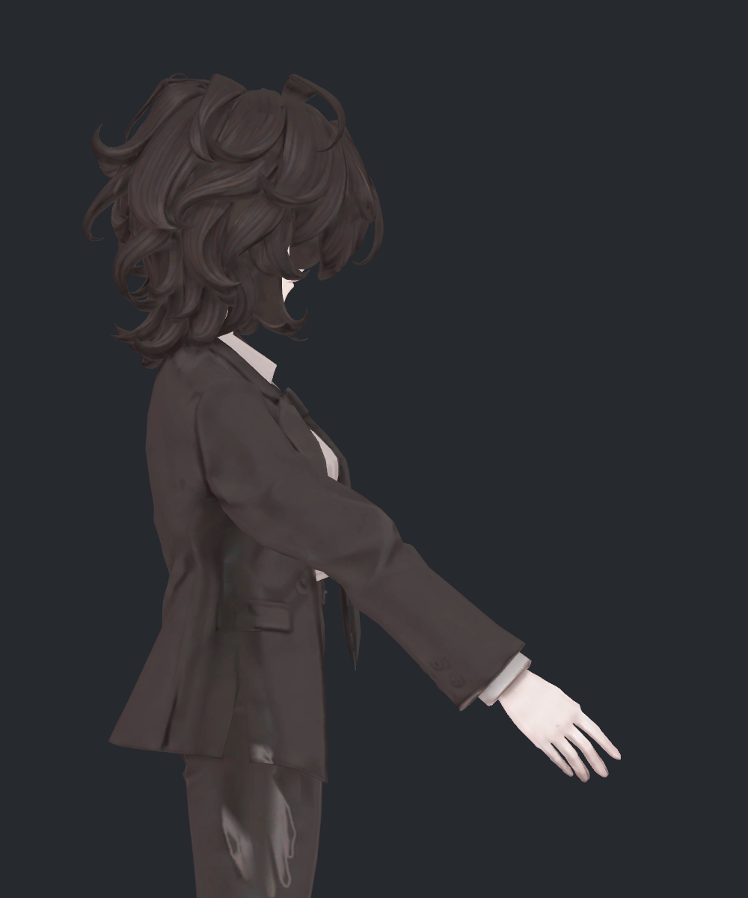
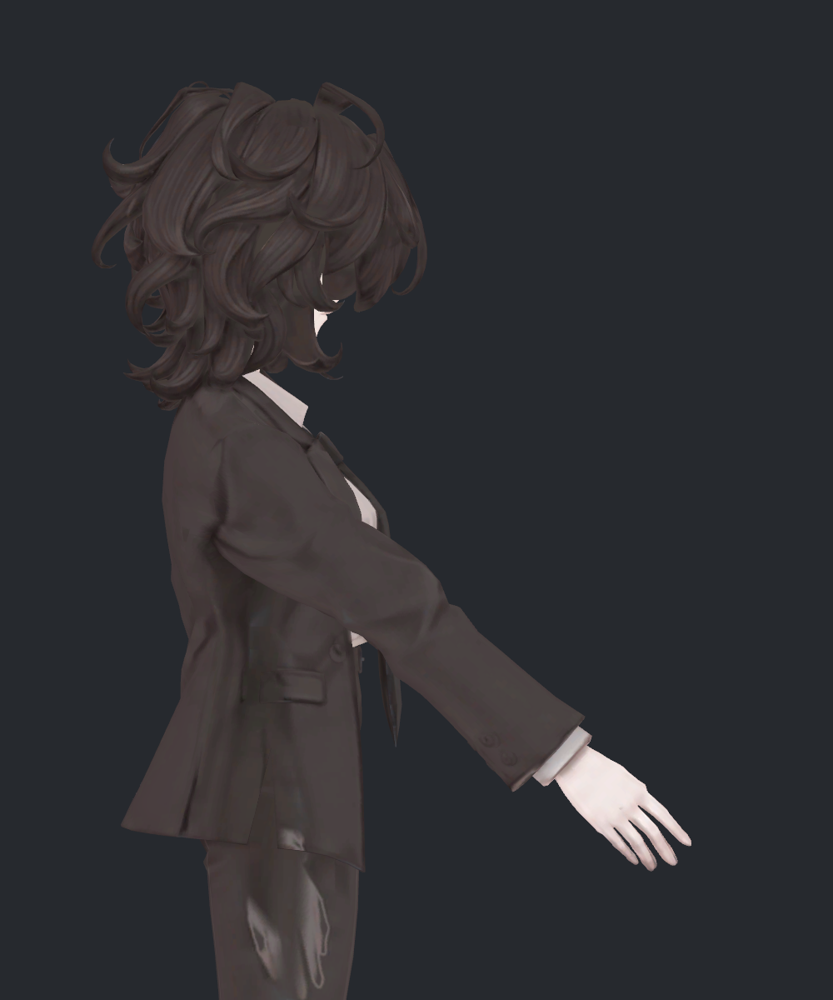
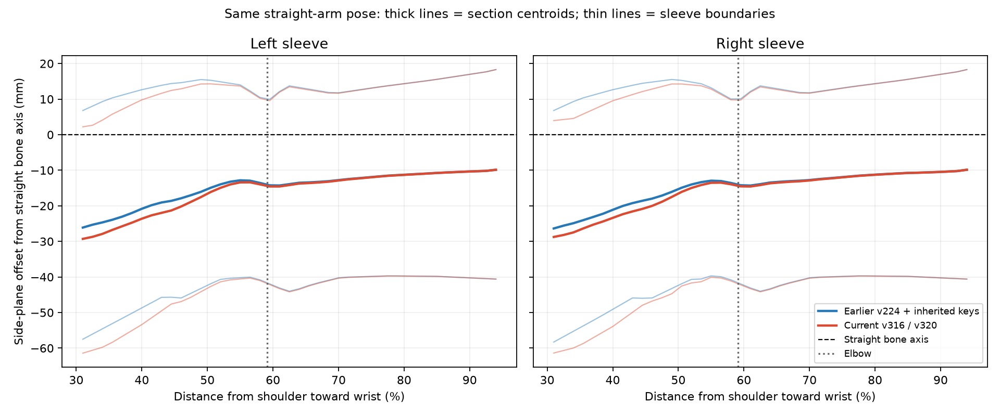
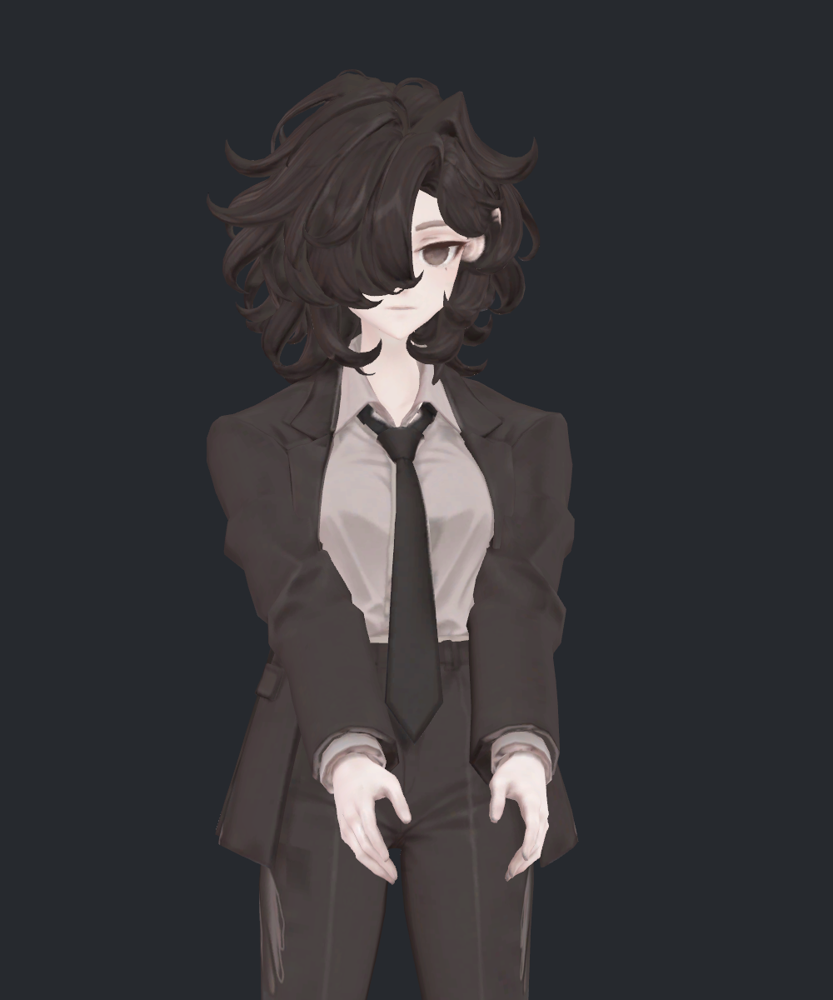

> **기록 시점 안내:** 아래는 해당 단계 당시의 보고서입니다. 후속 결정은 [최신 상태](../../STATUS.md)를 기준으로 읽어주세요. 모델·원본 텍스처·검증 원시 데이터는 이 문서 공유본에 포함하지 않습니다.

# v321 — 소매 주름의 출처와 측면 휘어짐 비교

**후속 사용자 피드백:** 첨부한 이전 기준 BASE 측면은 “이 정도면 괜찮다”는 판단을 받았습니다. 이 주름·곡선을 허용 가능한 외형 기준으로 기록했습니다. [선택 사진과 결정](v321_FEEDBACK.md). 아래 표면 차이 측정은 유지하며, 이를 곧바로 수정해야 할 결함으로 단정하지 않습니다.

2026-09-12 · 읽기 전용 비교 · 사진③ 형태 보존

**원래부터 있던 소매 주름이 있지만, 현재 보이는 굴곡을 전부 원래 주름이라고 할 수는 없습니다.** 같은 자세에서 이전 기준과 비교하니 팔의 본은 양쪽 모두 일직선이지만, 최근 수정으로 윗소매의 표면과 면의 꺾임이 실제로 달라졌습니다. 시점에 의한 착시만은 아닙니다. 앞선 “소매의 굵은 주름은 그대로 남아 있다”는 설명에 이 구분이 부족했습니다.

이번에는 모델을 더 수정하지 않았습니다. 사용자가 우선 유지한 사진③(v316 M30)을 보존하고 비교 사본만 촬영·측정했습니다.

## 어떤 버전을 비교했나

| 표기 | 대상 | 자세 |
|---|---|---|
| 이전 기준 BASE | v224 원래 메시 + 자세571에 사용되던 기존26개 보정 키 | v320과 같은 어깨 방향, 양쪽 팔꿈치0° |
| 현재 CURRENT | 사진③ v316 M30을 기존 본·웨이트로 연결한 v320 사본 | 이전 기준과 본 위치·회전 동일 |
| 키OFF NO_KEYS | v224 원래 메시, 기존 보정 키 모두OFF | 같은 본 자세, 원형 주름을 분리하기 위한 진단 |
| 원형 중립 REST | 기존 v224 기준 형상의 중립 좌표 | 같은 정점/면의 원래 접힘 확인용. 동작 사진과 픽셀 비교하지 않음 |

v224는 이번 Mac 좌표 실험 전의 기준입니다. 모든 예전 버전을 전부 비교한 것은 아닙니다. 현재형은 앞서 게시한 v320 좌표와 다시 대조했습니다. 같은 포즈의 몸/헤어 좌표는 이전·현재가 정확히 같고, 바뀐 부분은 코트입니다.

## 같은 자세·정확한 측면 비교

| 이전 기준 v224 + 기존 키 | 현재 사진③ / v320 |
|---|---|
|  |  |

두 사진은 직접 열어 비교했습니다. 어깨에서 팔꿈치로 내려오는 윗소매, 특히 중간 아래쪽의 면 전환이 달라졌습니다. 팔꿈치 아래에서 손목까지의 굵은 주름과 소매 윤곽은 거의 겹칩니다. 현재 윗소매가 이어지는 방식 때문에 팔 전체가 휘어 보인다는 지적은 표면 변화로 확인됩니다.

카메라는 정확히 옆 방향이고 두 대상에 같은 구도·재질·조명·노멀 계산 방식을 사용했습니다. 앞선 v320의 약간 비스듬한 측면과 카메라가 다르므로, 위 두 장끼리 비교해야 합니다.

## 주름은 원래 있었나

**팔꿈치 아래의 확인한 주름은 원래 형상에서 이어진 것이 맞습니다.** 보정 키를 모두 꺼도 남으며 원형 중립의 같은 면 경계와 수치가 가깝습니다. 다만 윗소매에는 최근 수정으로 생긴 면 꺾임의 증가가 함께 있습니다.

| 확인 위치 | 원형 중립 | 이전 기준 / 같은 자세 | 현재 / 같은 자세 | 판단 |
|---|---:|---:|---:|---|
| 팔꿈치 아래 주름 경계677–680, 면458/1154 |29.308° |29.308° |29.366° | 거의 같은 원형 주름 |
| 팔꿈치 부근 경계173–974, 면1191/1192 |29.412° |28.609° |28.268° | 원형 굴곡이 이어짐 |
| 어깨와 팔꿈치 사이 경계193–195, 면117/1230 |4.308° |4.337° |29.370° | 최근 수정으로 꺾임 증가 |
| 같은 부위의 이웃 경계193–977, 면1230/1231 |11.186° |10.861° |30.058° | 이웃 면도 더 꺾임 |

각도는 **서로 이웃한 삼각형 면 사이의 각도**이며 팔꿈치 관절 각도가 아닙니다. 세 번째·네 번째 경계는 현재 측면 사진의 어깨와 팔꿈치 사이, 윗소매 중간 아래쪽에 있습니다. 사진 광선으로 해당 면을 추적해 동일 정점·면끼리 비교했습니다. 표본을 확인한 결과이며 모든 주름이 원형이라는 증거로 확대하지 않습니다.

## 실제로 팔이 휘었나

**본 중심으로는 새로 휘지 않았습니다. 소매 표면은 원래도 직선이 아니었고, 현재 윗소매의 굴곡이 추가로 달라졌습니다.**

| 측정 | 왼쪽 | 오른쪽 |
|---|---:|---:|
| 이전/현재 팔꿈치 굽힘 | 모두0° | 모두0° |
| 비교 가능한 실제 폐단면 |43/43 |43/43 |
| 단면 중심의 측면 방향 이동, 최대 |3.41mm |2.62mm |
| 단면 외곽의 측면 방향 변화, 최대 |5.39mm |4.95mm |
| 윗소매의 같은 정점 이동, 최대 |12.81mm |12.76mm |
| 팔꿈치 구간의 같은 정점 이동, 최대 |1.42mm |1.44mm |
| 전완 구간의 같은 정점 이동, 최대 |0.34mm |0.37mm |

윗소매 정점 이동은3차원 거리입니다. 이를 팔 전체가12.8mm 휘었다는 뜻으로 읽으면 안 됩니다. 단면 중심은 소매 외곽으로 둘러싸인 면적의 중심이며 실제 인체나 뼈의 중심이 아닙니다.

파랑은 이전 기준, 빨강은 현재입니다. 굵은 선은 소매 단면 중심, 가는 선은 단면의 측면 양끝입니다. 검정 점선은 일직선인 본 축, 세로 점선은 팔꿈치 위치입니다. 손목 쪽 선은 거의 겹치고 어깨 쪽에서 차이가 납니다. 원래 소매 자체도 본 축을 중심으로 한 직선 원통이 아니었습니다.

어깨→손목 길이31–94%를43곳에서 실제 삼각형으로 잘랐고, 좌우·이전·현재 모두43개 폐단면이 유효했습니다. 같은 단면 중심에 직선을 맞춘 뒤의 최대 굴곡 잔차는 왼4.12→4.58mm, 오른4.22→4.32mm였습니다. 이 잔차는 선택 구간에 의존하며 외형의 좋고 나쁨을 정하는 합격선이 아닙니다. 원래 굴곡에 비해 추가 변화가 국소적이라는 점을 함께 보여줍니다.

## 정면도 함께 확인

| 이전 기준 | 현재 |
|---|---|
|  |  |

정면에서 달라진 어깨·윗소매 형태가 측면에서는 어떻게 이어지는지 함께 봐야 합니다. 사진③을 유지하라는 결정을 바꾸거나 추가로 펴는 수정은 이번에 하지 않았습니다.

## 이번 검수의 한계와 기록

- 실제 Unity BakeMesh에서 이전·현재·키OFF를 같은 본 자세로 만들었습니다. v320 현재 좌표 재현, 이전 기준의 원래 자세 재현, 좌우 본 위치 동일 및 몸/헤어 좌표 동일을 확인했습니다.
- 실제 삼각형 단면과 같은 정점의 이동, 원래 면 경계 각도를 대조했습니다. 영상이나 사진을 변형해서 비교한 것이 아닙니다.
- 비교용 임시 사본만 사용했고 원본 메시·UV·본·웨이트·프리팹은 변경하지 않았습니다. 모델 전체 접촉·부피 회귀나 다른 자세의 검수는 이번 결과에 포함하지 않습니다.
- 원시 좌표·검수 JSON·재현 코드는 작업 저장소의 같은 버전 폴더에 보관합니다. 공유본에는 직접 확인한 사진·측정 도표·설명만 게시합니다.

이전 완전 신전 사진 v320 (공유본 미포함: `README.md`) · 사진③ 유지 결정 (공유본 미포함: `v319_FEEDBACK.md`)
