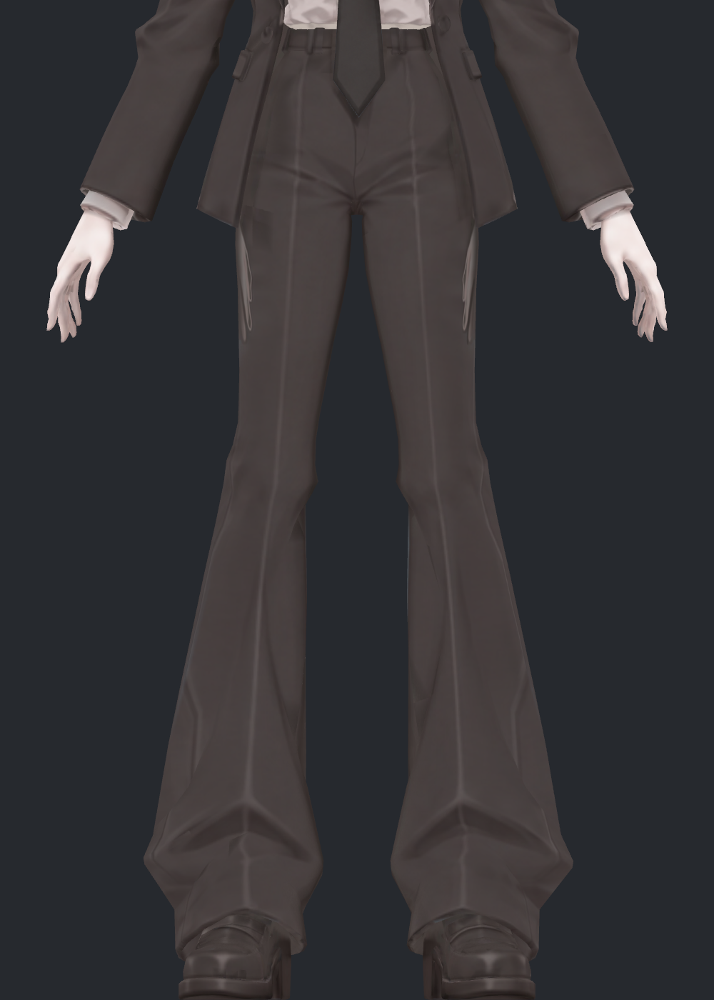
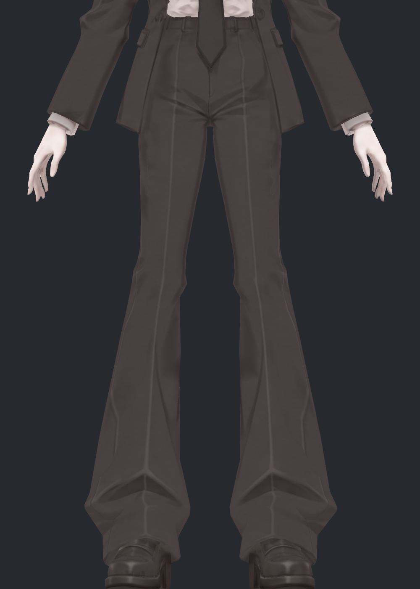
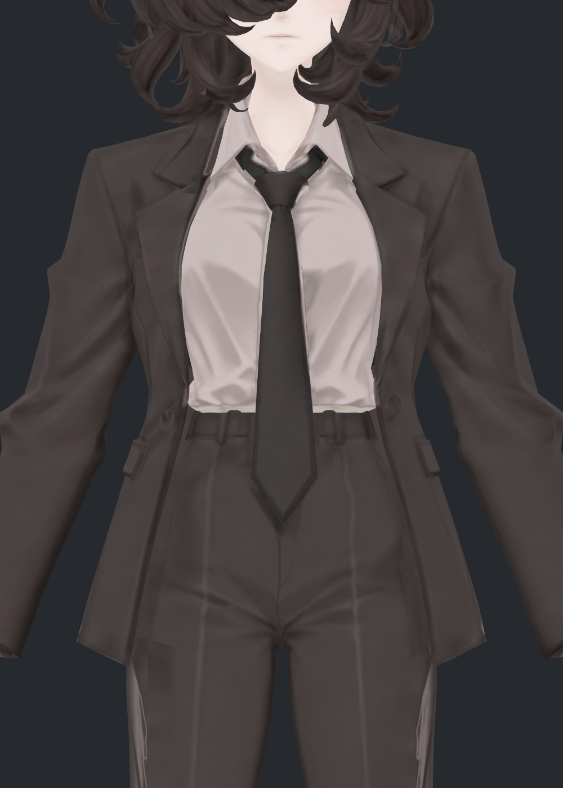
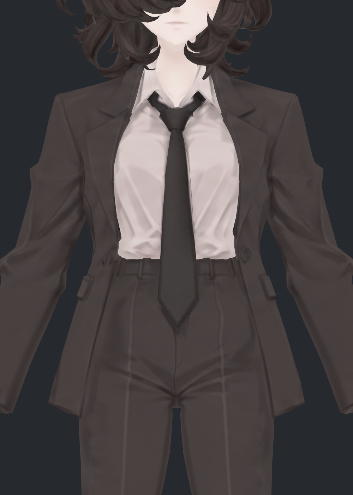
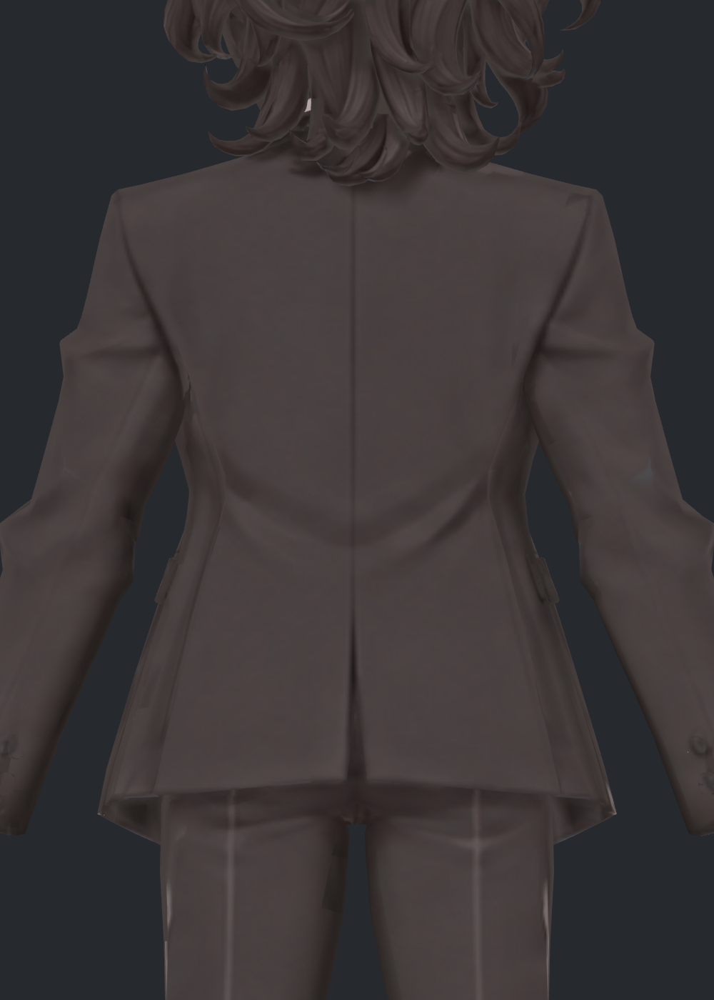
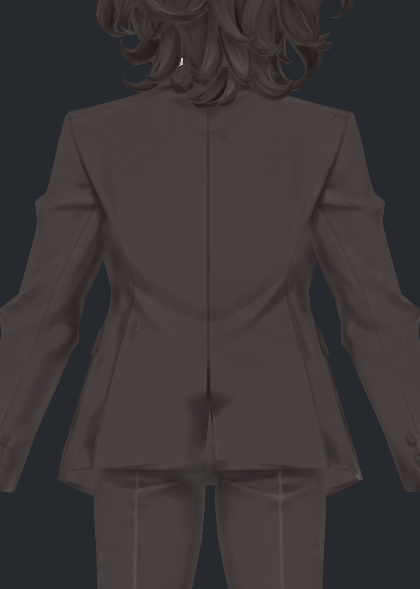
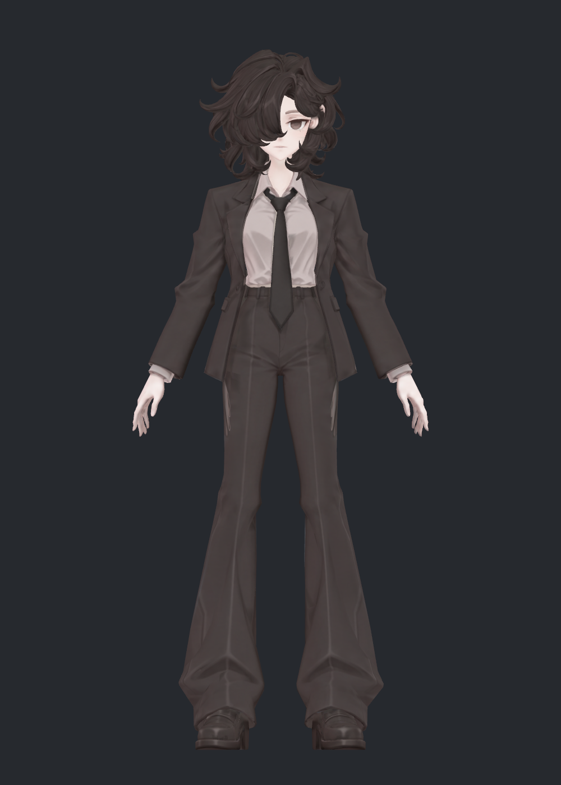
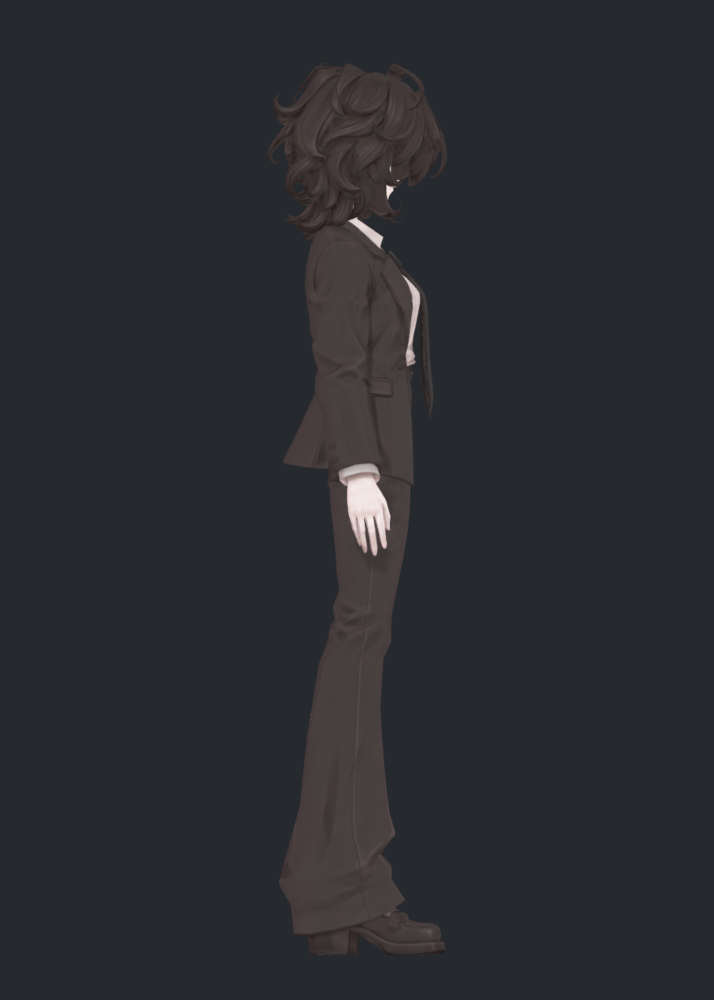
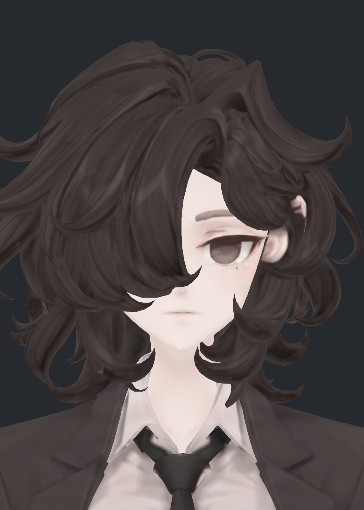

> **기록 시점 안내:** 아래는 해당 단계 당시의 보고서입니다. 후속 결정은 [최신 상태](../../STATUS.md)를 기준으로 읽어주세요. 모델·원본 텍스처·검증 원시 데이터는 이 문서 공유본에 포함하지 않습니다.

# v322 텍스처 재작업 보고 — 얼룩 원인, UV 처리와 실제 전후

2026-09-12. 사용자가 모델 점검에 앞서 얼룩덜룩한 텍스처를 레퍼런스에 맞춰 재작업하고, 필요하면 UV도 함께 정리하도록 요청했습니다. **코트·바지·셔츠의 넓은 색 번짐을 줄이고, 재투영 과정에서 확인한 피부색 혼입과 UV 패딩 덮어쓰기를 수정했습니다.** 원래 형상을 유지한 검수 사본이며 전체 아바타의 완성·사용자 최종 채택을 뜻하지 않습니다.

## 1. 실제 적용 전후

두 사진 모두 같은 v224 메시·좌표·노멀·자세·카메라입니다. 전후 모두 4096, 무압축, sRGB, mipmap 켬으로 맞췄습니다. 확대 사진의 UNLIT는 조명 효과를 배제하므로 텍스처의 색 차이를 볼 수 있습니다. LIT는 기존 lilToon 설정의 재질에 새 텍스처를 연결한 것입니다. 사진을 후처리해 얼룩을 지우지 않았습니다.

### 바지 — 허벅지 옆의 밝은 번짐과 흐릿한 면

| 이전 UNLIT | 재작업 UNLIT |
|---|---|
|  |  |

양 허벅지 바깥쪽의 밝은 자국을 크게 줄였습니다. 가운데 길게 이어지는 바지 다림선과 발목의 원래 조형 주름은 유지했습니다. 텍스처를 고쳐도 실제 메시의 각진 접힘 자체가 없어지는 것은 아닙니다.

### 코트와 셔츠 — 큰 색 번짐과 투영 경계

| 이전 UNLIT | 재작업 UNLIT |
|---|---|
|  |  |
|  |  |

어깨·소매·옷자락의 색 연결을 정리하고 셔츠의 큰 흐린 면을 다시 채색했습니다. 봉제선·주머니·단추와 실제 소매 주름을 일괄 삭제하지 않았습니다. 뒤목 아래에는 확대 시 희미한 옷깃 모양의 투영 윤곽이 남습니다. 이를 완전히 제거했다고 판단하지 않았습니다.

### 기존 게임 재질에서의 전체 인상

| 이전 LIT | 재작업 LIT |
|---|---|
|  |  |

레퍼런스의 따뜻한 짙은 회갈색 정장, 밝은 셔츠와 어두운 타이의 대비를 유지했습니다. 사용자가 허용한 소매 형태를 텍스처 문제라는 이유로 펴거나, 부피를 바꾸지 않았습니다. 이 사진은 텍스처 전후의 같은 중립 자세이며 이전 사진③의 어깨 보정 후보를 통합한 결과는 아닙니다.

### 얼굴·헤어 보존 확인

| 이전 | 재작업 후 |
|---|---|
|  |  |

얼굴·눈·헤어·손은 새 채색 대상에서 제외했습니다. 원래 얼굴 인상과 머리카락 결을 유지합니다. 타이·신발·작은 장식도 기존 채색을 보존했습니다. 전체 피부를 다시 설계하거나 모든 텍셀을 새로 그렸다고 주장하지 않습니다.

## 2. 조사에서 확인한 원인

1. **색 자체에 들어 있는 얼룩:** 기존 텍스처를 조명 없는 화면으로 표시해도 바지의 밝은 자국과 코트의 흐린 색 면이 보였습니다. 조명·본·노멀 조절만으로 해결할 문제가 아닙니다. 현재 Unity 재질은 v141 계열 아틀라스를 연결하고 있었고, 저장돼 있던 v143 후속 PNG와 파일 해시가 달랐습니다. 후속 파일이 있다는 이유로 적용됐다고 간주하지 않았습니다.
2. **투영 중 가려짐과 부위 혼입:** 이번 재현에서 측면 그림의 손 피부색이 바지에 묻었습니다. 가려짐 계산에서 손을 빠뜨린 부분을 고쳤고, 각 방향의 색을 섞기 **전에** 피부·배경 혼입을 제외했습니다. 섞은 뒤 검사하면 피부색이 희석돼 옷의 밝은 자국으로 남았습니다. 기존 자국 모두의 제작 이력을 증명한 것은 아니지만, 이번 작업에서는 같은 유형을 재현하고 수정했습니다.
3. **UV 섬 사이 패딩 덮어쓰기:** 몸과 코트를 같은 아틀라스에 순서대로 베이크하면 뒤에 처리한 코트의 여백 색이 몸의 작은 섬을 덮었습니다. 패딩만 크게 늘린 시험에서 얼굴·셔츠·손까지 삼각형 색 조각이 생겨 바로 제외했습니다. 기존 메시의 임시 베이크 사본을 한 번에 처리해 전체 UV 점유 영역을 함께 보호하도록 수정했습니다. 임시 사본은 저장 전에 제거했고 전달 모델에는 원래 두 메시만 있습니다.
4. **색공간 처리 오류도 분리:** 이미지 픽셀 샘플을 재질의 선형 색과 같은 값으로 취급한 시험에서는 옷이 회색 단색처럼 보였습니다. sRGB→선형 변환을 명시하고 제외했습니다. 이 시험의 낮은 경계 수치는 품질 개선 근거로 사용하지 않습니다.

## 3. 레퍼런스와 재작업 방식

`avator_references/ref_char.png`, `ref_full.png`, `ref_back.png`를 실제로 열어 전체 배색과 정장 디테일을 비교했습니다. 기존 모델에서 조명을 배제한 정면·측면·후면·반대 측면을 만들고, 내장 imagegen으로 의상 채색을 정리했습니다. 생성 원본은 1914×822이며, 최종 UV 아틀라스는 4096×4096입니다. 두 해상도를 혼동하지 않습니다.

생성 그림의 실루엣·배치를 완벽하게 믿지 않고 실제 표면에서 가려짐과 방향을 계산했습니다. 보이지 않는 옷 부분은 같은 부위에서 유효하게 얻은 주변 색으로 연결했습니다. 얼굴·헤어·손 등의 기존 색은 보존하고, 코트·바지·셔츠만 새 그림과 연결했습니다. Blender의 재질 투영과 EMIT 베이크를 사용했습니다. [Blender 공식 베이크 문서](https://docs.blender.org/manual/en/5.1/render/cycles/baking.html)의 이미지 대상·UV·패딩 동작을 참고했습니다.

## 4. UV도 확인했고, 이번에는 좌표를 다시 펴지 않았습니다

| 검사 | 결과와 판단 |
|---|---|
| UV 섬 수 | BodyHair 2,838개, Coat 281개. 작은 섬이 많아 경계 처리가 중요하지만 이 수만으로 재전개를 결정하지 않음 |
| 주 의상 UV 면적 0인 삼각형 | 코트·바지·셔츠 각각 0 |
| 의상 텍셀 밀도 | UV면적/표면적이 약0.397~0.398로 비슷함. 부위별 큰 해상도 불균형을 확인하지 못함 |
| 2048 내부 픽셀 중심 겹침 검사 | 1,753,734표본 중 67중복, 약0.0038%. 미세 겹침을 완전히 배제하는 검사는 아님 |
| 실제 수정 | 기존 UV 좌표 유지, 동일 위치의 분리 코너에 투영 값 공유, 전체 섬 점유를 보호한 32px 패딩 베이크 |

이번 넓은 얼룩의 해결에는 전면 UV 재배치가 필요하지 않았습니다. 자동 재전개로 섬을 더 늘리는 방법도 채택하지 않았습니다. 기존 좌표를 유지해 기존 메시·노멀·웨이트·shape key와 다른 형상 후보에 같은 아틀라스를 적용할 수 있게 했습니다.

2,784개 의상 UV 분리 경계에 각각 4개 표본을 두고 양쪽 RGB 차이를 검사했습니다. 아래는 차이 길이 0.10을 넘은 **경계 표본 수**이며, 실제 불량 개수나 미관 합격 판정이 아닙니다. 축소는 box filter 근사이고 실제 게임의 모든 거리·시점 시험을 대체하지 않습니다.

| 검사 크기 | 이전 | 최종 사본 |
|---|---:|---:|
| 4096 | 41 | 7 |
| 2048 | 51 | 11 |
| 1024 | 56 | 15 |
| 512 | 85 | 29 |

4096 평균 RGB 차이는 0.01319→0.00681, 95백분위는 0.04946→0.02514로 줄었습니다. 이 수치와 실제 사진을 함께 확인했습니다.

## 5. 시도한 방법과 제외한 이유

| 시험 | 확인한 문제 | 처리 |
|---|---|---|
| 01 투영 후 고정색 치환 | 겨드랑이·타이 주변에 새로운 얼룩과 딱딱한 경계 | 미채택 |
| 02 가시성 완화·코너 공유 | 경계는 줄었지만 측면 손 색이 바지로 들어옴 | 단독 미채택, 손 포함 가림 검사로 수정 |
| 03 주변색 연결 | 색공간 해석 오류로 회색·단색화. 경계 수치는 낮아도 외형 실패 | 미채택, 선형 변환 수정 |
| 04 순차 베이크+32px 패딩 | 코트 패딩이 얼굴·셔츠·손의 다른 섬을 덮음 | 미채택, 전체 섬을 한 번에 보호하도록 수정 |
| 05 전체 섬 베이크 | 패딩 문제 해결, 투영 혼합 뒤 희미한 피부 윤곽이 남음 | 보완 후 후속 사용 |
| 06 혼합 후 밝기 차단 강화 | 큰 번짐은 줄었으나 희석된 색이 일부 통과 | 방향별 혼합 전 검사로 교체 |
| 07 방향별 차단+전체 섬 베이크 | 큰 밝은 자국·색 번짐 감소, 보존 검사 통과 | 이번 검수 사본. 최종 채색 채택은 별도 |

시험별 코드·검사·대표 실패 사진은 작업 저장소의 `trials/`에 보존했습니다. 원래 아바타를 교체하거나 재생성하지 않았습니다.

## 6. 저장·검증과 남는 범위

- Blender 파일을 다시 열어 정점·에지·면 코너·UV·코너 노멀·웨이트·shape key 좌표의 지문, 오브젝트 변환, 본 구조/위치, shape key 값이 v212 원본과 동일함을 확인했습니다. 패킹된 4K 이미지가 두 메시의 실제 재질에 연결돼 있습니다.
- Unity 검수 prefab은 v224의 **같은 Mesh 자산**을 참조합니다. BodyHair 31,042점, Coat 3,603점, 각26 shape key와129 bone 슬롯을 유지합니다. 이는 Blender의 분리 전 정점 수와 다르며 증가 편집을 뜻하지 않습니다.
- 보호 부위의 삼각형 중심 색 비교에서 평균 절대 차이는 머리 약0.17, 얼굴0.34, 양손0.13/255 수준입니다. 베이크 재샘플링 때문에 픽셀 완전 동일은 아닙니다.
- Unity 활성 장면 경로와 dirty 상태를 보존했습니다. 새 재질·prefab·Unity package를 별도로 저장했고 원래 재질은 덮어쓰지 않았습니다.
- 확대 시 뒤목 아래의 희미한 투영 윤곽, 셔츠의 부드러운 주름 디테일, 원래 메시의 각짐은 남습니다. 헤어·구두의 기존 하이라이트까지 전부 다시 그린 단계는 아닙니다. 관절 후보 통합·변형 검수·실제 VRChat 실행·업로드는 수행하지 않았습니다.

[파일과 검사 자료로 돌아가기](README.md)
