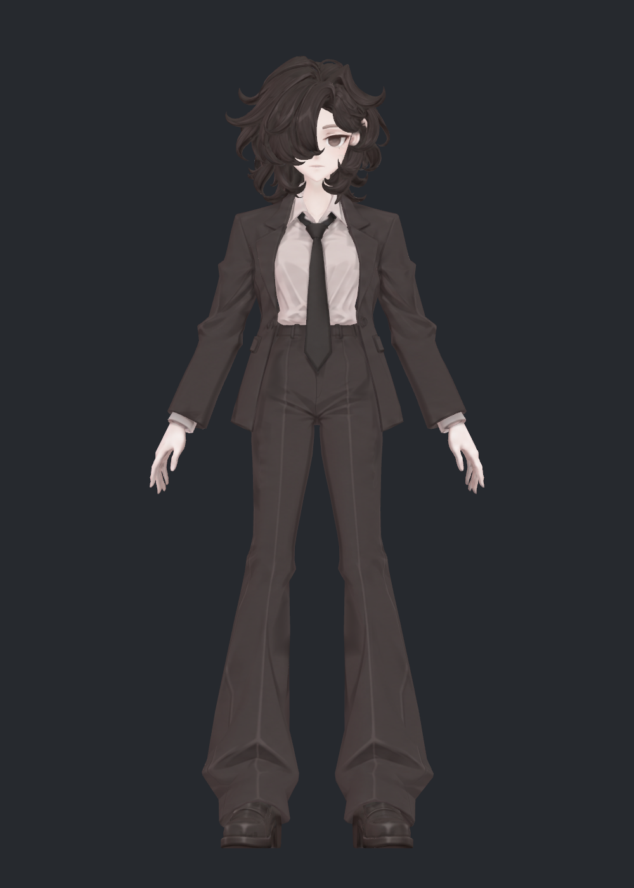
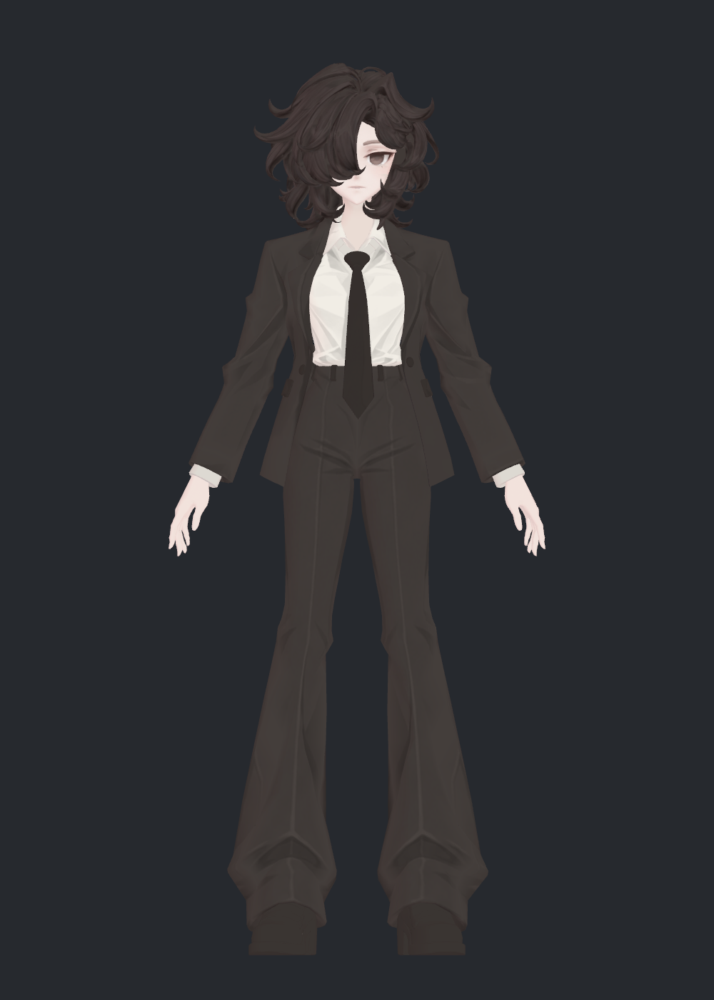
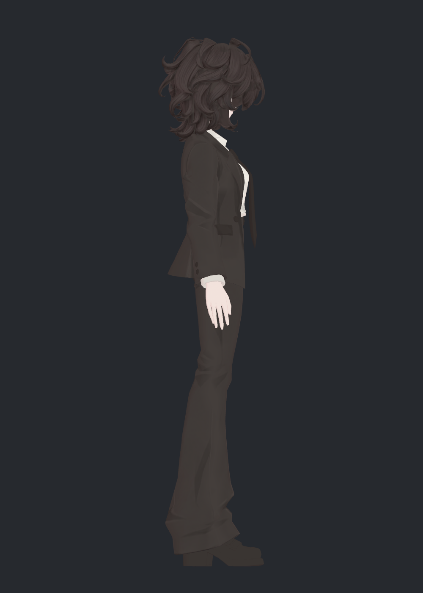
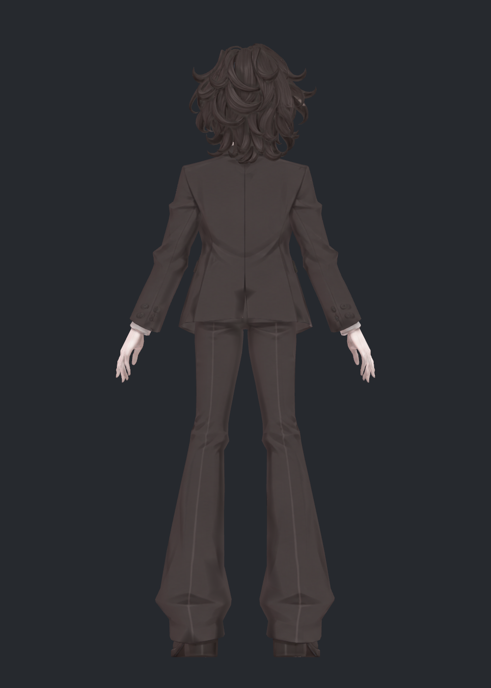
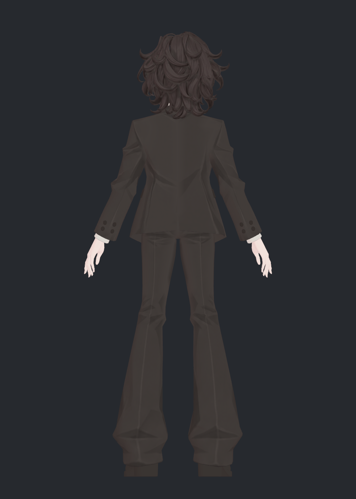
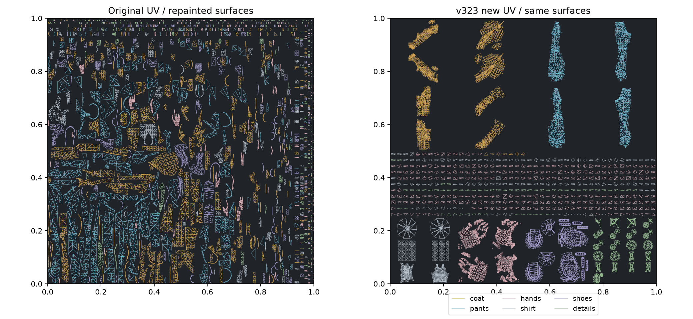
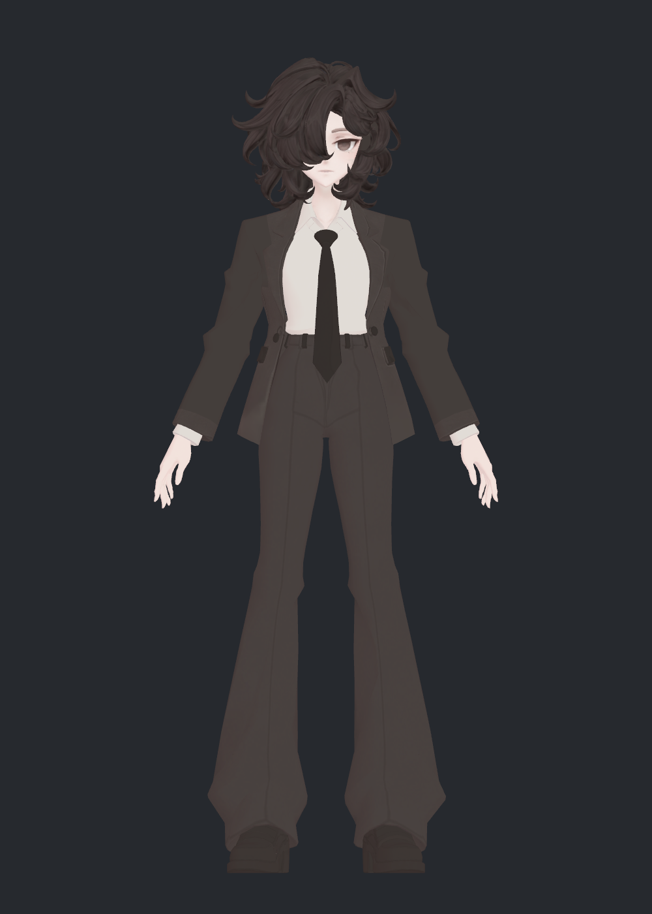

> **기록 시점 안내:** 아래는 해당 단계 당시의 보고서입니다. 후속 결정은 [최신 상태](../../STATUS.md)를 기준으로 읽어주세요. 모델·원본 텍스처·검증 원시 데이터는 이 문서 공유본에 포함하지 않습니다.

# v323 가려진 표면 텍스처·UV 재작업 보고

2026-09-12 · 출발 v322 · 상태: 적용·검수한 별도 후보, 사용자 피드백 전

## 이번 결과

코트에 가린 골반·다리 옆면, 소매 안쪽과 손목, 손바닥·손가락 사이, 셔츠·칼라, 신발 바닥, 넥타이 뒷면, 머리 안쪽까지 분리했습니다. 기존 **17,659개 면을 빠짐없이 분류**하고 12개 그룹을 각각 6방향에서 전후 렌더했습니다. 생성된 채색만 보는 데 그치지 않고 실제 Blender 적용 사진과 Unity 사진을 직접 열어 확인했습니다.

흐릿하게 투영된 색과 다른 부위의 색 혼입을 제거하고, 레퍼런스에 있는 각진 옷 주름은 채색으로 다시 구성했습니다. UV도 실제로 새로 펼쳐 적용했습니다. **기존 메시의 좌표·면 연결·노멀·본·웨이트·모든 변형 키는 유지**했습니다. 검수 파일은 [버전 안내](README.md)에서 열 수 있습니다.

## 같은 자세의 실제 적용 전후

아래는 Unity에서 같은 원본 자세 좌표·카메라·재질 설정으로 촬영한 결과입니다. 팔·다리를 다시 모델링한 비교가 아닙니다. 채색 명암이 달라져 두께가 달라 보일 수 있으나 실제 좌표는 같습니다.

| v322 이전 | v323 수정 |
|---|---|
|  |  |
|  |  |
|  |  |

직접 확인한 변화: 소매·다리에 퍼진 반사광처럼 보이는 얼룩과 손목의 어두운 띠가 줄었습니다. 셔츠와 넥타이 경계가 선명해졌고 머리 안쪽의 피부색 조각을 제거했습니다. 실제 소매 형상 주름·바지 접힘은 그대로입니다.

## 무엇이 원인이었나

1. **보이는 방향 중심의 투영**: v322에서 코트·바지·셔츠를 정리했지만 손·장식·신발과 가려진 영역에는 더 오래된 색이 남았습니다. 손목에 소매색, 넥타이 뒤에 셔츠색, 머리에 귀색이 섞여 있었습니다. 조명을 끈 Base Color 분리 렌더에서도 보이므로 조명만의 문제가 아닙니다.
2. **UV와 채색의 경계 불일치**: 생성 이미지의 UV 외곽선과 패널별 색차를 그대로 적용하면 실제 옷에 없는 선·얼룩이 생겼습니다. 경계에서 동일한 재질 바탕색으로 이어지도록 바꾸고 검은 여백을 색으로 읽지 않게 했습니다.
3. **새 UV도 자동 펼침만으로 끝나지 않음**: 닫힌 손가락·비다양체 부품의 일부 펼침이 겹치거나 납작해졌습니다. 겹친 원래 면을 추적하고 UV만 별도 칸으로 재배치했습니다. 기존 메시를 자르거나 새로 만들지 않았습니다.
4. **머리 UV의 이웃 색 번짐**: 머리색 보정 뒤에도 남은 7개 밝은 표본은 기존 한 면이 얼굴색 경계를 공유하는 문제였습니다. 해당 원래 면 하나의 UV를 독립 배치하자 밝은 표본이 0이 됐습니다. 목 아래쪽의 옛 얼룩도 얼굴 특징과 분리해 바탕색을 정리했습니다.

## 레퍼런스와 채색 방향

작업 폴더의 `ref_char.png`, `ref_full.png` 및 방향별 레퍼런스를 기준으로 작업했습니다. 핵심은 어두운 갈색 정장, 밝은 셔츠·피부, 제한된 명암과 각진 주름 면입니다. 첫 단색화 시도는 얼룩은 줄었지만 옷이 너무 평평해 보여 제외했습니다. 후속 채색에서는 코트·바지·셔츠의 접힘을 선명한 명암 면으로 되살렸습니다.

실제 주머니·단추는 기존 입체 부품에 있으므로 새 채색에 가짜 주머니·단추를 중복해서 그리지 않았습니다. 손과 셔츠 커프스는 과거 오염색 대신 깨끗한 바탕색과 약한 색 변화로 정리했습니다. 레퍼런스에 없는 숨은 디테일을 임의로 추가하지 않았습니다. 눈·입·눈썹의 기존 채색 배치는 유지했습니다.

9개의 생성 채색 입력을 보존했고, 실제 적용은 Blender의 재질 계산과 베이크로 수행했습니다. 최종 저장은 4096×4096 두 장이지만 입력 생성물은 1254×1254입니다. **모든 원화 디테일이 네이티브 4K라는 뜻은 아닙니다.**

## 가려진 부분의 확인 범위

| 부위 | 기존 면 수 | 확인·처리 |
|---|---:|---|
| 코트 | 1,936 | 앞·뒤 패널을 개방해 안쪽과 소매 6방향 확인, 외곽선·패널 얼룩 제거 |
| 바지 | 1,035 | 코트 없이 골반·옆다리·뒤·안쪽·밑단 확인, 흐린 선을 정리하고 접힘 채색 재구성 |
| 손 | 1,419 | 양손 독립, 손등·손바닥·손목·손가락 사이 색 확인 |
| 셔츠 | 694 | 몸통·칼라·양쪽 커프스, 숨은 짙은 색 제거 |
| 신발 | 1,069 | 좌우 독립, 앞·뒤·측면·바닥, 지저분한 구운 반사광 제거 |
| 장식 | 818 | 넥타이 양면·단추·주머니 부품·벨트 고리의 잘못 투영된 색 정리 |
| 얼굴·목 | 1,763 | 머리 없이 6방향 확인, 얼굴 특징 유지, 목 아래 색 얼룩 정리 |
| 머리 | 8,925 | 얼굴 없이 안쪽·밑면까지 확인, 피부색 혼입 제거 |

**[모든 부위의 전후 사진 24장](v323_SURFACE_GALLERY.md)**에 각 사진의 6방향과 관찰 내용을 남겼습니다. 모든 원래 면의 분류·수치 검사를 포함하지만, 모든 텍셀을 사람이 하나씩 검사했다는 의미는 아닙니다.

코트에 별도 안감 메시가 존재하는 것은 아닙니다. 개방 검수의 안쪽은 원래 코트 면의 뒷면이며 같은 텍스처를 사용합니다. 셔츠도 원래 뒤가 열린 구조입니다. 새 안감·몸통을 생성하지 않았습니다.

## 새 UV의 결과와 비용

얼굴·머리의 원래 UV는 유지하고, 코트·바지·손·셔츠·신발·장식을 부위별로 새로 펼쳤습니다. 기존 UV0는 Blender에 보존하고 `V323_UV`를 최종 렌더용으로 추가했습니다. 머리의 색 번짐 한 면만 예외적으로 새 아틀라스에 옮겼습니다.

초기 자동 펼침에서 겹침 1,484쌍과 손 126개·장식 12개의 퇴화 삼각형을 발견했습니다. 겹침/퇴화가 걸친 451개 기존 면과 머리 경계 1개 면, 총 **452개 면의 UV**를 수정했습니다. 최종 Paint 아틀라스 12,273개 삼각형의 양의 면적 겹침 0쌍(임계 면적 1e−11), 범위 이탈 0, 재작업 부위 퇴화 0입니다. 얼굴·머리 전체 UV를 최적화했다는 결과는 아닙니다.

| UV 늘어짐의 면적 가중 95백분위 | 기존 | 새 UV |
|---|---:|---:|
| 코트 | 1.195 | 2.064 |
| 바지 | 1.177 | 1.311 |
| 손 | 1.194 | 1.201 |
| 셔츠 | 1.201 | 3.519 |
| 신발 | 1.177 | 2.079 |
| 장식 | 1.162 | 6.992 |

1에 가까울수록 등방적인 지표입니다. **새 UV가 모든 면에서 더 좋은 왜곡 수치를 가진 것은 아닙니다.** 부위별 편집성과 오염색 분리를 얻었지만 작은 부품과 칼라 일부의 늘어짐·새 경계가 늘었습니다. 현재는 저주파 바탕색 위주로 적용해 사진을 확인했습니다. 촘촘한 패턴·글자를 그릴 최적 UV로 확정하지 않습니다.

Unity에서는 UV 경계를 위해 같은 원래 점을 복제해 BodyHair 31,042→32,448점, Coat 3,603→3,846점이 됐습니다. 총 1,649점 증가는 위치 이동이나 새 입체 면 추가가 아닙니다. 원래 삼각형은 모두 유지됩니다. 4K 텍스처가 1장→2장이 되어 텍스처 저장·메모리 비용도 늘고, 비어 있지 않은 재질 구간은 2개→3개입니다. 실제 VRChat 성능을 측정한 결과는 아닙니다.

## 겪은 문제·시도·미채택 사유

| 시도 | 실제 문제 | 판정·다음 처리 |
|---|---|---|
| 손을 위치의 앞/뒤로 나눠 펼침 | 닫힌 손가락 일부가 납작해짐. 별도 수정 스크립트는 다른 부위 UV까지 초기화 | 미채택. 법선 방향 분류로 전체 준비 단계를 다시 실행 |
| 생성 채색을 그대로 베이크 | UV 외곽선이 가짜 봉제선으로 보이고 주머니·단추 중복 | 미채택. 하드웨어 없는 입력을 다시 생성하고 경계 바탕색 통일 |
| 생성 패널 색을 그대로 혼합 | 앞·뒤 및 팔 패널 사이 색차 | 미채택. 재질 바탕색을 공통으로 하고 명암만 제한 적용 |
| 바탕색+약한 선만 남김 | 얼룩은 줄었으나 레퍼런스 주름까지 사라져 너무 평평함 | 미채택. 코트·바지·셔츠에 각진 명암 면을 재생성 |
| 자동 UV만 사용 | 1,484쌍 겹침·퇴화 | 미채택. 문제를 일으킨 기존 면의 UV만 재배치 |
| 머리 밝기만 제한 | 보정 구간에 밝은 테두리, 이후에도 경계 1면에서 얼굴색 번짐 | 높은 제한 구간 미채택. 낮은 제한 구간+해당 1면 독립 UV 적용 |
| Unity 기본 AddBlendShapeFrame 복사 | 원본의 아주 작은 변형 값이 삭제되어 최대 8.87e−6 차이 | 미채택. 원본 희소 변형 데이터를 정확히 확장·복사하고 오차 0 재검사 |
| 최종 확대 검수 | 목 아래쪽의 과거 색 얼룩 잔여 | 눈·입 위쪽은 유지, 목만 바탕색으로 정리 후 재베이크 |

실패 입력·당시 적용 사진·코드·오류 기록은 작업 버전의 `trials/`에 보존했습니다. 다음은 제외한 평평한 채색입니다. 최종 정면 사진과 비교하면 다시 복원한 옷 명암을 확인할 수 있습니다.

## 보존·적용 검증

- Blender 재로드 비교: 원래 점 좌표·면·UV0·코너 노멀·웨이트·모든 키 좌표의 지문 동일. 본·변환·현재 키 값도 동일. 최종 2장 텍스처 packed 확인.
- Unity: 31,363개 삼각형을 원래 UV 면에 모두 유일하게 대응, 미대응·모호 대응 0. 복제점의 원래 위치·노멀·키의 위치/노멀/탄젠트 차이 **모두 0**, 웨이트 정확 일치. 각 메시 26개 키·129개 본 슬롯 유지.
- 각 원래 평가 삼각형에 내부 7점, 총 219,541개 색 표본: 손의 어두운 표본 7,609→0, 셔츠 2,607→0, 머리의 밝은 표본 113→0. 손/셔츠 sRGB 휘도<0.65, 머리>0.5를 검사한 비가중 진단이며 미관 점수나 전체 픽셀 무결점 보증은 아님.
- Unity 실제 전후 촬영 24장, Blender 분리 전후 24장(각 6방향). 조명 없는 색과 lilToon 적용을 구분해 확인. 기존 사용자 장면 경로·dirty 상태 보존.

원시 근거: `RELOAD_CHECK.json`, `UV_CHECK.json`, `SURFACE_COLOR_CHECK.json`, `UNITY_UV_TRANSFER.json`, `UNITY_DELIVERY_CHECK.json`, `VISUAL_REVIEW.json`, `DELIVERY.json`.

## 남은 판단

이번 결과는 숨은 오염색을 정리하고 새 UV를 적용해 본 후보입니다. 새 UV의 작은 부품 늘어짐·경계 수 증가와 두 번째 텍스처 비용은 남습니다. 셔츠 명암 강도, 손·신발의 단순화 정도는 실제 사진을 바탕으로 피드백받을 수 있습니다. 기존 관절 접힘·코트 접촉·전체 아바타 통합·VRChat 클라이언트 검증은 이번 텍스처 작업으로 해결됐다고 판단하지 않습니다.

참고한 공식 API: [Blender UV 연산 문서](https://docs.blender.org/UATEST/api/current/bpy.ops.uv.html). 실제 펼침·겹침·보존 수치는 이 작업의 저장 결과를 검사한 값입니다.
