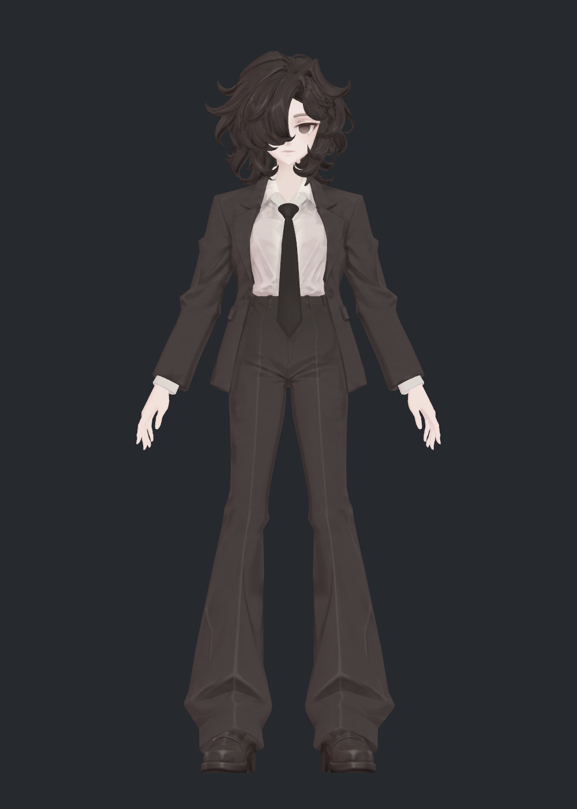
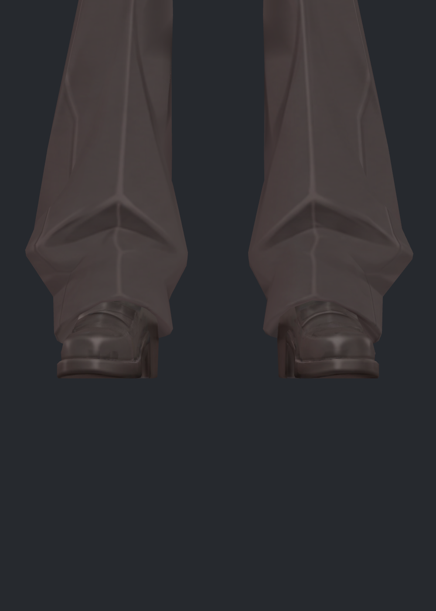
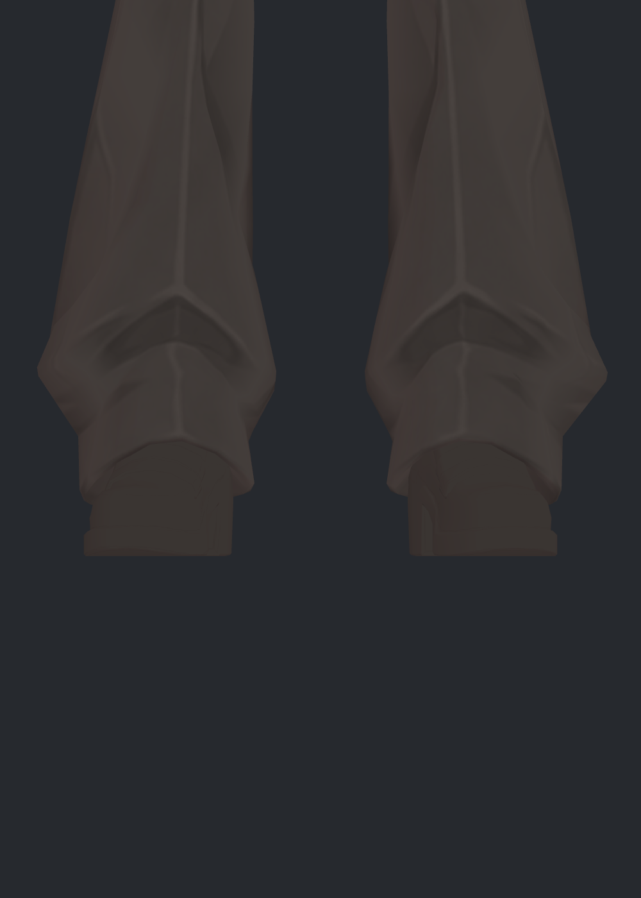
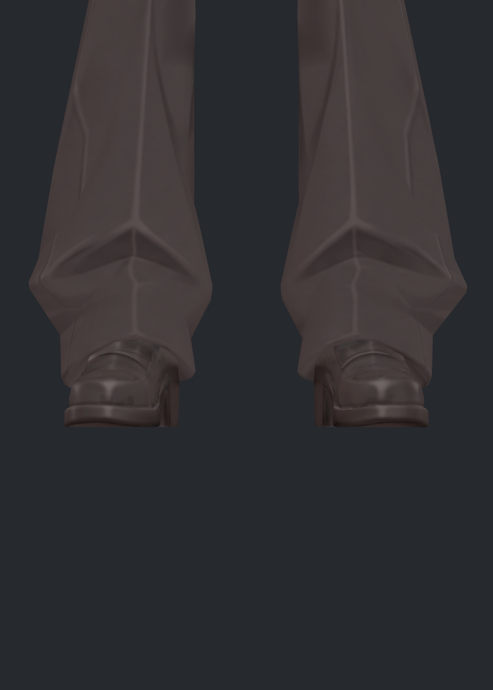
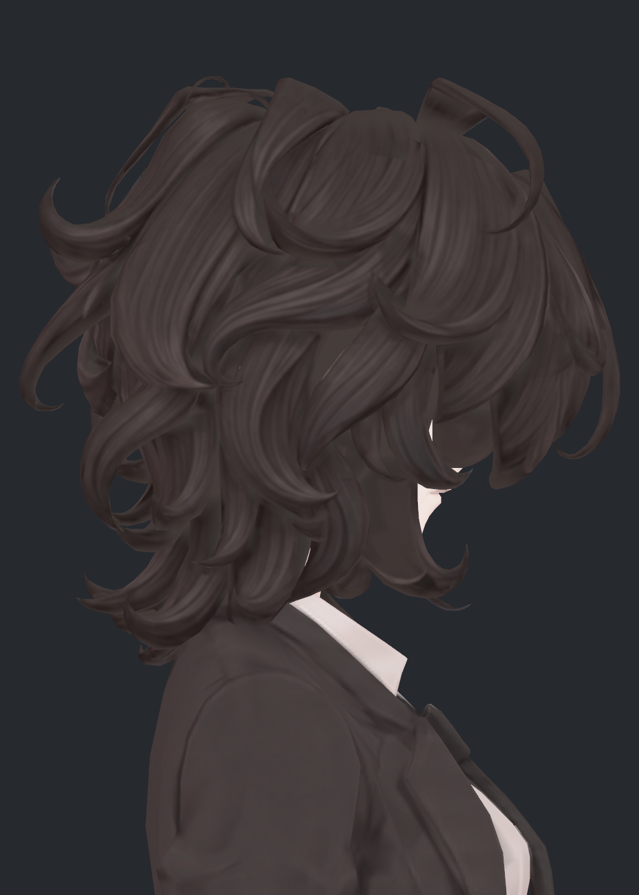
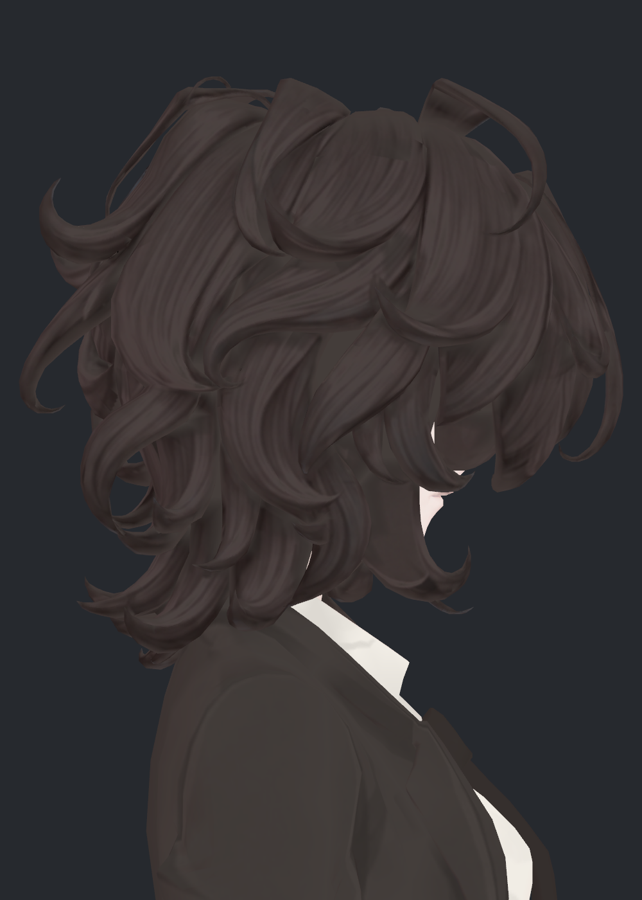
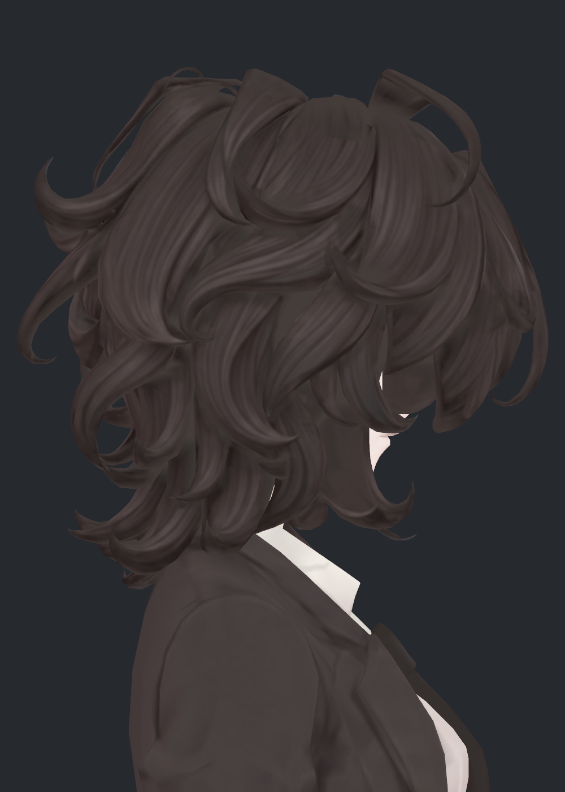
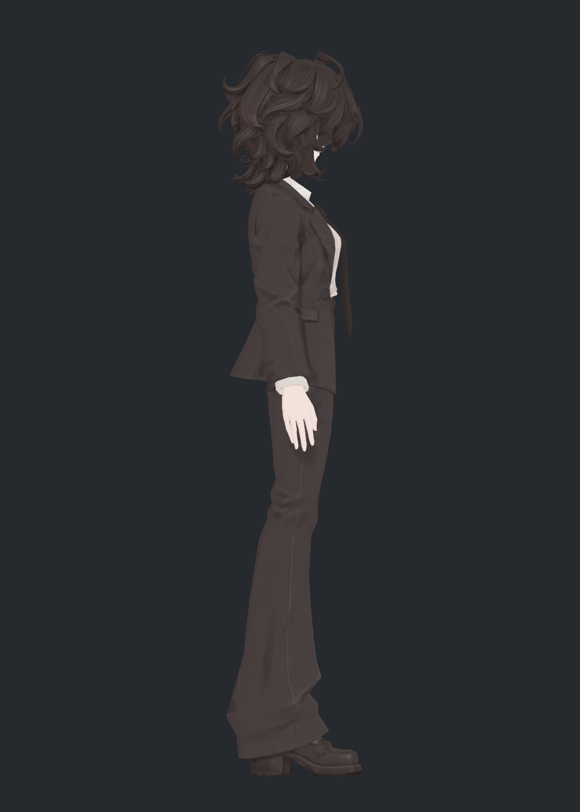
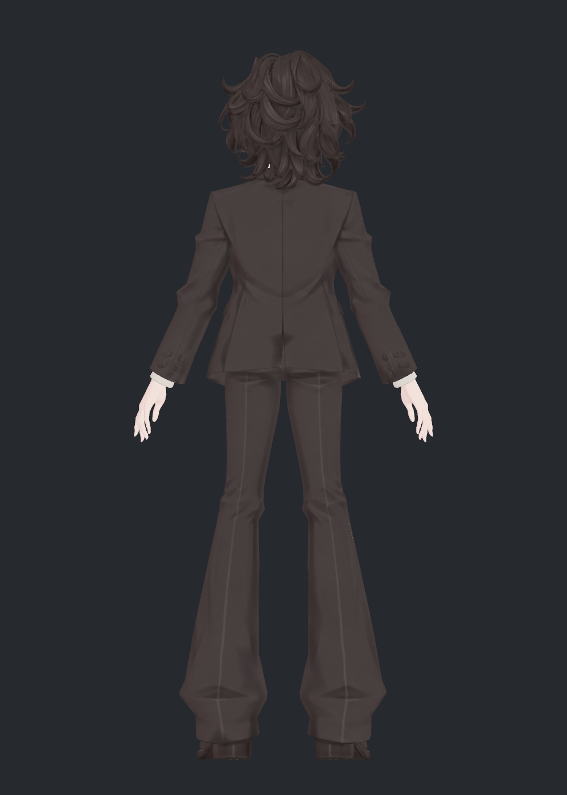
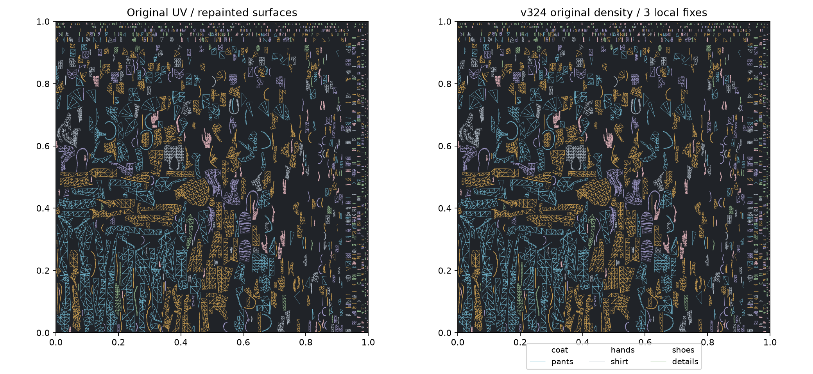

> **기록 시점 안내:** 아래는 해당 단계 당시의 보고서입니다. 후속 결정은 [최신 상태](../../STATUS.md)를 기준으로 읽어주세요. 모델·원본 텍스처·검증 원시 데이터는 이 문서 공유본에 포함하지 않습니다.

# v324 디테일 복원 — 원인·전후 사진·시도 기록

2026-09-12 · 사용자: “신발이나 옷, 머리의 세세한 요소들이 다 죽었다.”

**비교 결과 지적이 맞았습니다.** v323에서 오염색을 지우면서 정상적인 신발 장식, 의복 주름의 명암, 머릿결의 밝은 부분까지 함께 억제했습니다. v323을 시각 검수한 이전 기록만으로 이 손실을 합격 처리할 수 없습니다. 이번 v324는 기존 디테일을 복원한 별도 파일이며, v323의 평탄한 채색을 후속 기준으로 자동 사용하지 않습니다.

## 1. 같은 조건에서 실제 적용 비교

v322는 숨은 표면 전체 재채색 전의 기존 디테일 기준, v323은 사용자가 지적한 평탄화 버전, v324는 이번 복원본입니다. 세 사진 모두 동일한 기존 정적 좌표·노멀·카메라·조명·재질 설정입니다. 실루엣을 바꿔 디테일 차이를 가리지 않았습니다.

| 기존 v322 | 문제 v323 | 복원 v324 |
|---|---|---|
|  |  |  |

`avator_references/ref_full.png`와 `ref_char.png`를 실제 열어 신발의 가로 띠·밑창 경계, 코트 라펠·단추·주름 명암, 방향을 따라가는 머릿결을 확인했습니다. 모든 명암을 얼룩으로 취급하면 레퍼런스에도 있는 구조적 단서가 사라집니다. 참고 원본은 공유 저장소에 재배포하지 않습니다.

## 2. 신발 — 사라진 띠와 밑창 경계 복원

| 기존 v322 | 문제 v323 | 복원 v324 |
|---|---|---|
|  |  |  |

v323의 거의 단색인 신발을 기존 신발 아틀라스로 교체했습니다. 가로 띠, 앞코 반사 명암, 밑창 테두리와 바닥 무늬를 기존 UV 위치에 맞게 복원했습니다. 새 장식이나 가죽 무늬를 임의로 그리지 않았습니다. 극단적인 확대에서는 원래 입력에 있던 부드러움이 남습니다. 4K로 저장했다는 이유로 원본에 없던 세부 해상도가 생겼다고 주장하지 않습니다.

## 3. 옷과 머리 — 정상 명암과 오염을 분리

코트는 기존 색을 92%, 바지는 88%로 되살리되, 가려진 골반 위쪽의 잘못 투영된 무늬는 복원하지 않았습니다. 셔츠는 가슴·옆구리의 기존 접힘을 되살리고, 중앙 넥타이 투영 흔적·깃·소맷부리의 정리 결과를 유지했습니다. 단추·벨트 부속은 원래 명암을 복원했습니다. 넥타이는 원래 앞면 음영을 보존하면서 뒷면과 잘못 밝게 칠해진 면을 정리하고 경계를 완만하게 연결했습니다.

| 기존 v322 | 문제 v323 | 복원 v324 |
|---|---|---|
|  |  |  |

머리는 전체 밝기를 좁은 구간으로 제한했던 처리를 제거했습니다. 피부색 혼입이 확인된 31면만 v323의 정리색을 쓰고 정상적인 머릿결은 기존 색을 사용합니다. 얼굴 가까운 한 머리 면의 UV 이웃색 혼입 방지도 유지합니다. 사진에서 머리카락 사이로 실제 피부가 보이는 틈과 머리 표면에 피부색이 칠해진 문제를 구분했습니다.

복원본 측면과 후면도 직접 확인했습니다. 부피를 포함한 기하는 기존과 동일하며, 아래 차이는 텍스처와 UV 샘플링에서 옵니다.

| 측면 | 후면 |
|---|---|
|  |  |

## 4. UV — 전체 재배치가 아니라 원래 밀도 회복

v323에서 새 UV 배치 후 코트의 UV 면적 합은 약 0.104에서 0.040, 바지는 약 0.138에서 0.033으로 줄었습니다. 새 UV라는 사실 자체가 디테일 개선을 보장하지 않았고, 얇고 작은 부속의 늘어짐도 커졌습니다. 이번에는 원래 UV의 모양·크기·배치를 새 `V324_UV`에 복사했습니다. 원래 UV0와 v323 UV도 비교용으로 남겼습니다.

원래 배치를 그대로 쓰는 첫 시험에서는 아주 작은 겹침 6쌍이 검출됐습니다. 해당 3면만 빈 공간으로 평행 이동해 크기와 왜곡을 유지하면서 해결했습니다. 겹침 면적 합은 원래 4K 기준 약 4.36픽셀에 해당하는 작은 양이었지만 그대로 통과시키지 않았습니다.

| 검사 | 결과 |
|---|---|
| Paint 평가 삼각형 | 12,273개 |
| 양의 면적 겹침 / 범위 이탈 | 0 / 0, 겹침 판정 면적 임계값 1e-11 |
| 재채색 6분류 UV 퇴화 | 0 |
| UV 면적·늘어짐 | 원래와 동일, 3면은 이동만 적용 |
| Unity UV용 복제점 | v323 1,649개 → v324 10개 |
| 최종 아틀라스 | Head/Paint 각 4096², 총 2장 |

기존 UV는 여전히 많은 작은 섬으로 나뉘어 있습니다. 손으로 채색하기 편한 최적의 UV 전체 재설계를 완료했다는 뜻은 아닙니다. 이번 목적은 정합된 기존 디테일과 밀도를 보존하면서 실제 겹침을 해결하는 것입니다.

## 5. 이번에 겪은 문제와 미채택한 접근

| 시도 | 관찰한 문제 | 판정·최종 대응 |
|---|---|---|
| v323 정리색을 그대로 유지 | 신발 장식 거의 소실, 옷과 머리 명암 약화 | 디테일 후속 기준으로 미채택. v322의 정합된 디테일을 선택 복원 |
| 기존 텍스처 전체 복귀 | 숨은 골반·손·머리·넥타이 오염도 돌아올 수 있음 | 전체 복귀하지 않고 부위/면/위치별 정리 마스크 유지 |
| 밝은 픽셀을 일괄 제한하는 복원 마스크 | 정상 하이라이트 억제, 오염 가장자리에 밝은 고리 | 머리·부속에 적용하지 않음. 확인된 오염 면을 지정 |
| 셔츠 색 밝기만으로 혼합 | 중앙에 고드름처럼 긴 밝은 경계 | 미채택. 중앙/깃과 몸통 접힘을 위치로 분리 |
| 넥타이 로컬 법선으로 앞뒤 판단 | 객체 변환 때문에 앞뒤 선택이 어긋남 | 월드 법선으로 수정. 밝은 오염 106면 별도 정리 |
| 넥타이 면별 0/1 복원 | 정면에 곧은 마스크 경계가 보임 | 미채택. 기존 좌표로 연결한 정점 마스크를 3회 완화. 오염 정점은 정리색 유지 |
| 원래 UV 완전 복사 | 작은 겹침 6쌍 | 3면만 평행 이동, 원래 면적/왜곡 유지 |
| 신발 첫 확대 카메라 | 신발 일부가 프레임 밖으로 잘림 | 촬영 범위 확대 후 세 버전 재촬영, 직접 다시 확인 |

실패한 셔츠/넥타이 시험의 스크립트와 사진은 작업 폴더 `trials/`에 보존했습니다. 최종 전달본은 이 시험 파일들과 구분합니다. 신규 AI 그림 생성은 이번 단계에서 사용하지 않았습니다. 기존 등록된 이미지와 Blender의 재질·베이크로 수정했습니다.

## 6. 검증 근거와 범위

Blender 저장본을 다시 열어 v322와 비교한 원래 정점 좌표·면/모서리·UV0·코너 노멀·웨이트·모든 키 좌표·본·변환·키 값이 정확히 같습니다. 임시 베이크 복제물은 전달 모델에 남기지 않았습니다. Unity에서도 원래 위치/노멀/모든 키 델타 오차 0, 웨이트 동일, 각 메시 26개 키와 129개 본 슬롯을 보존했습니다. 추가 10점은 동일 위치의 UV 분리용 복제입니다. 실제 열린 사용자 장면의 path와 dirty 값도 보존됐습니다.

같은 삼각형 안 7표본의 밝기 표준편차를 면적으로 가중해 계산한 비교입니다. **명암 변화량의 진단 수치이며 “디테일 몇 % 복구”나 미관 점수가 아닙니다.** 머리의 31개 오염 면은 이 비교에서 제외했습니다.

| 분류 | v323 / 기존 v322 | v324 / 기존 v322 |
|---|---:|---:|
| 신발 | 0.032 | 0.996 |
| 코트 | 0.533 | 0.917 |
| 바지 | 0.659 | 0.881 |
| 머리 | 0.945 | 0.990 |

셔츠·부속은 잘못 투영된 밝고 어두운 색까지 제거했으므로 전체 명암량을 기존 수준으로 올리는 것을 목표로 하지 않았습니다. 수치가 높은 버전을 자동 채택하지 않고 실제 적용 사진을 확인했습니다.

원래 17,659면 분류를 사용했고, 코트 앞/뒤·소매·다리·양손·양신발·셔츠·부속·얼굴·머리의 12그룹을 6방향 BaseColor 사진으로 직접 확인했습니다. Unity에서는 같은 조건의 54장을 생성했고, 본 보고서에 실은 11장의 비교/최종 사진을 직접 열었습니다. 모든 텍셀을 한 픽셀씩 수동 검수했다는 주장은 아닙니다. 자세한 숨은 부위는 [12그룹 갤러리](v324_SURFACE_GALLERY.md), 원시 검사와 전달 파일은 [버전 README](README.md)에 있습니다.

이번 디테일 손실에 대한 수정본·검증·사진 기록을 마쳤습니다. 사용자 최종 채택, 전체 관절 완성, VRChat 실행·업로드 완료와는 구분합니다. 원래의 작은 UV 섬, 확대 시 부드러운 입력 디테일, 기존 모델의 형상·관절 한계는 남아 있습니다.
