> **기록 시점 안내:** 아래는 해당 단계 당시의 보고서입니다. 후속 결정은 [최신 상태](../../STATUS.md)를 기준으로 읽어주세요. 모델·원본 텍스처·검증 원시 데이터는 이 문서 공유본에 포함하지 않습니다.

# v324 숨은 표면 포함 12그룹 확인 사진

[전후 비교·원인·시도 보고서](v324_DETAIL_REVIEW.md) · [검수 파일](README.md)

실제 최종 아틀라스를 기존 모델 표면에 적용해 Blender에서 분리 촬영했습니다. 각 그림은 왼쪽 위부터 정면·측면·후면, 아래줄은 반대 측면·위·아래입니다. BaseColor를 조명 없이 보므로 Unity 조명 사진보다 평평하게 보입니다. 뒤에 가려진 원래 면도 확인하려고 다른 부품을 숨기거나 기존 면 그룹을 나누었으며, 새 내부 메시를 만든 것이 아닙니다.

이 12장은 직접 열어 확인했습니다. 마지막 넥타이 경계 수정 뒤에는 부속 시트를 재촬영·재확인했으며 다른 그룹의 텍스처는 그대로입니다. 원래 양면으로 표현되는 열린 표면과 실제 내부 체적을 구분합니다.

## 코트 앞판과 안쪽

라펠·포켓·접힘 명암을 복원하고, 가림막 없이 안쪽을 확인했습니다.

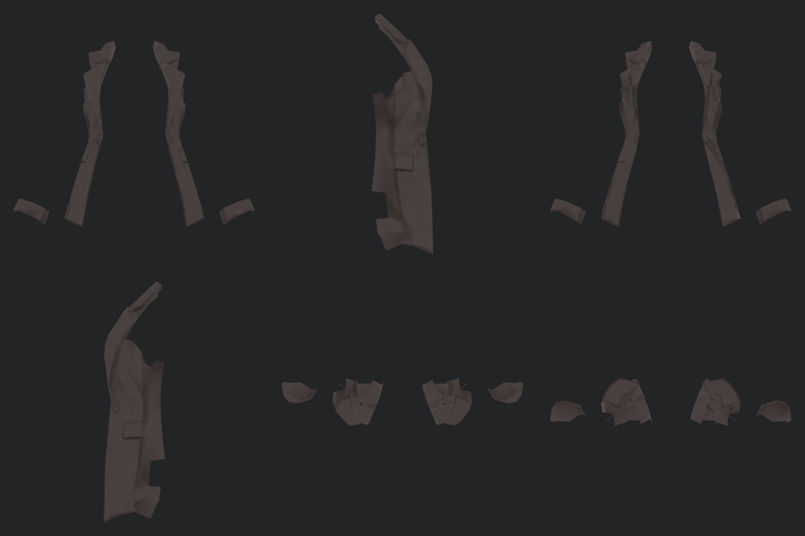

## 코트 뒷판과 안쪽

원래 등과 자락의 주름 명암을 유지했습니다. 흰 피부색 투영과 구분해 확인했습니다.

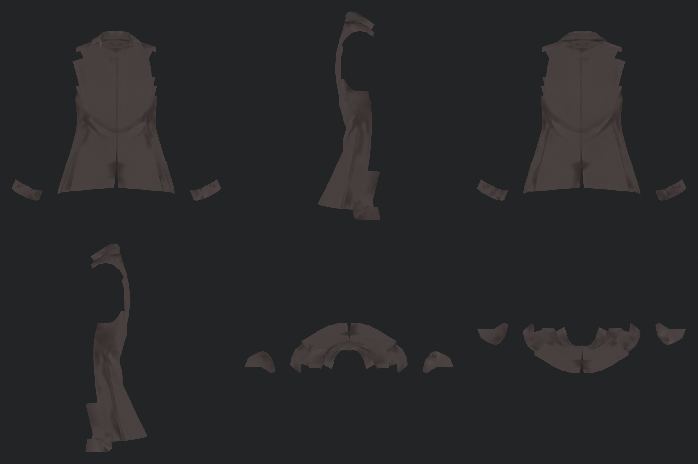

## 양 소매

원래 형상 주름과 텍스처 명암을 유지합니다. 소맷부리의 잘못 묻은 어두운 색은 되돌리지 않았습니다.

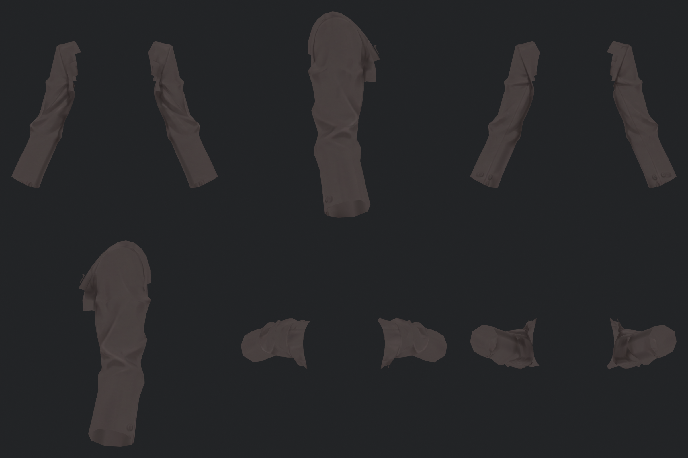

## 옆다리·안쪽 다리·가려진 골반

다리 접힘과 옆선은 복원하고, 위쪽 골반의 가려진 오염은 정리색을 유지했습니다.

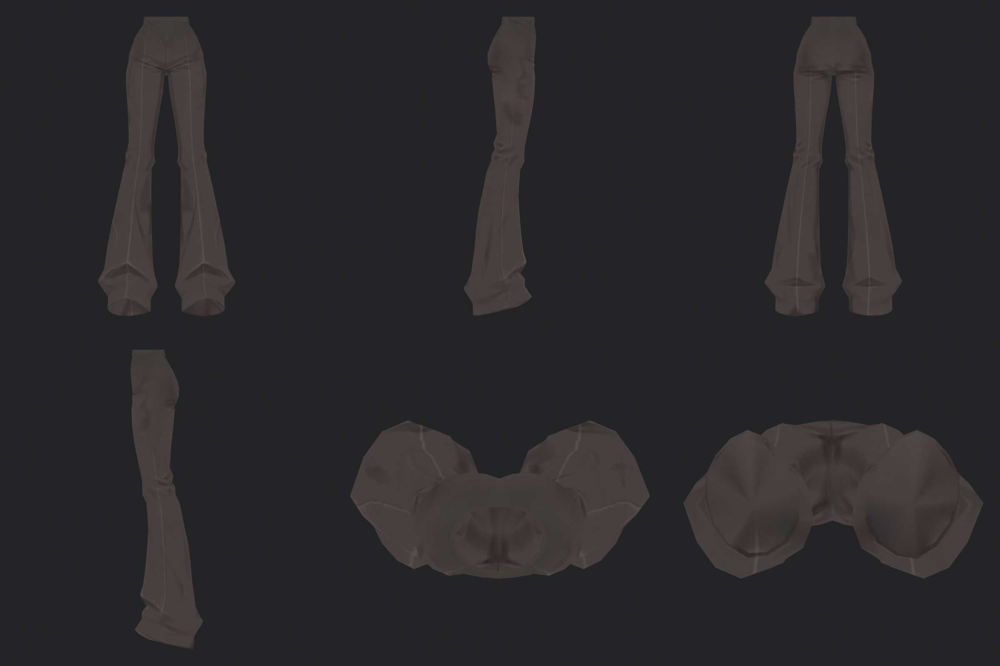

## 왼 신발·밑창

기존 띠·밑창 경계·바닥 무늬를 복원했습니다.

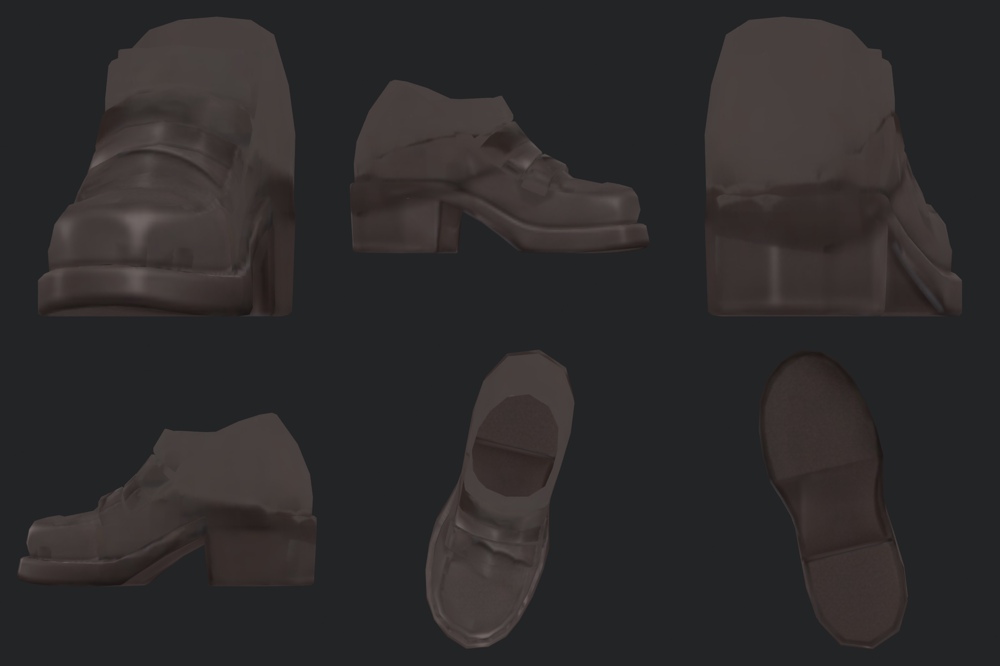

## 오른 신발·밑창

기존 장식을 복원했습니다. 원래 입력의 확대 시 부드러움은 남습니다.

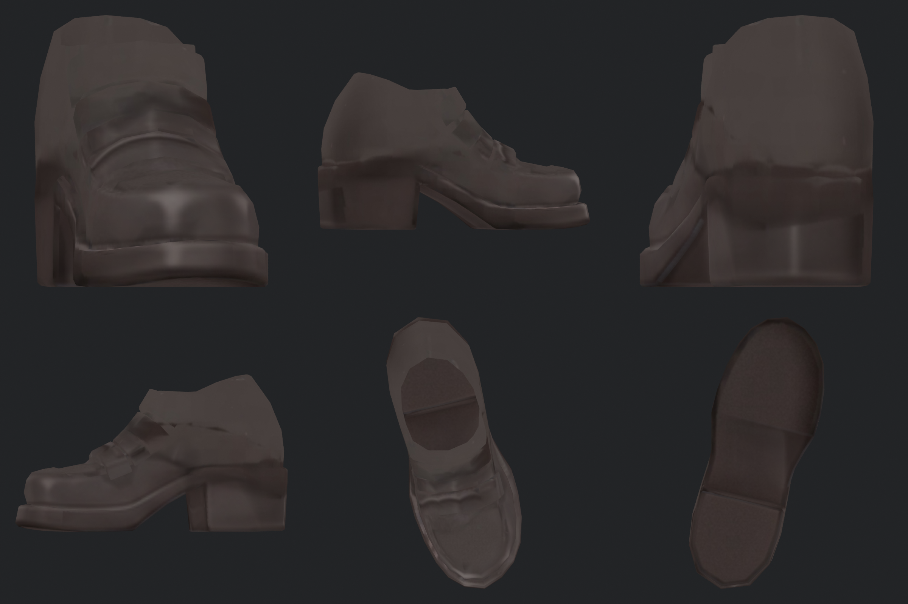

## 셔츠·깃·소맷부리

몸통 주름 복원과 중앙/깃/소맷부리 정리를 분리했습니다.

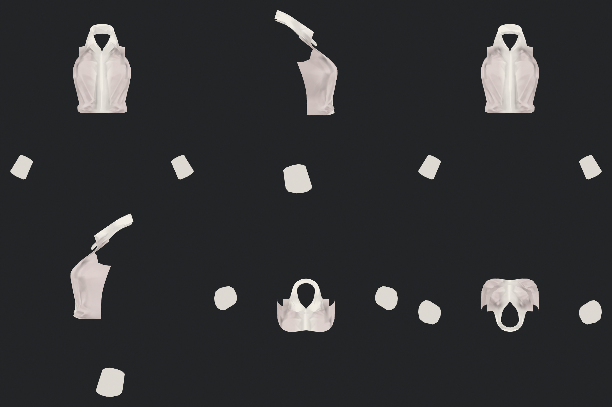

## 넥타이·단추·벨트 부속

장식 명암을 복원했습니다. 넥타이 뒷면·오염색과 복원 마스크의 곧은 경계를 정리했습니다.

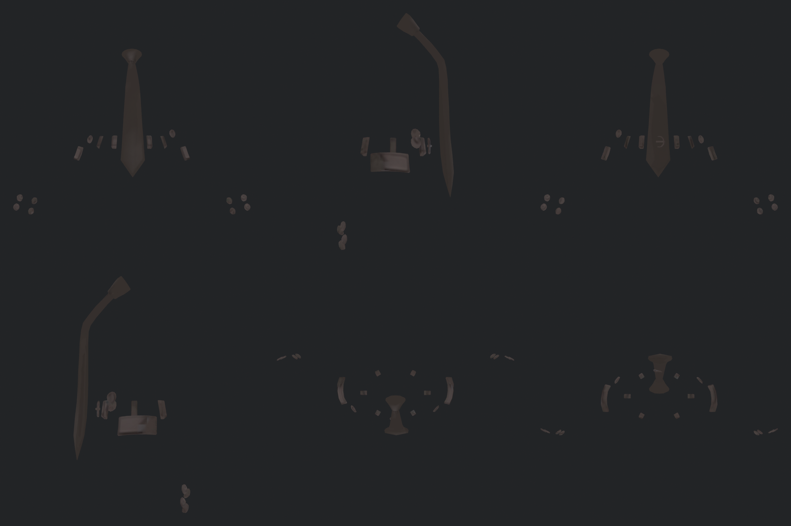

## 왼손

손등·손바닥·손가락 사이를 확인했습니다. v323의 손 정리를 유지합니다.

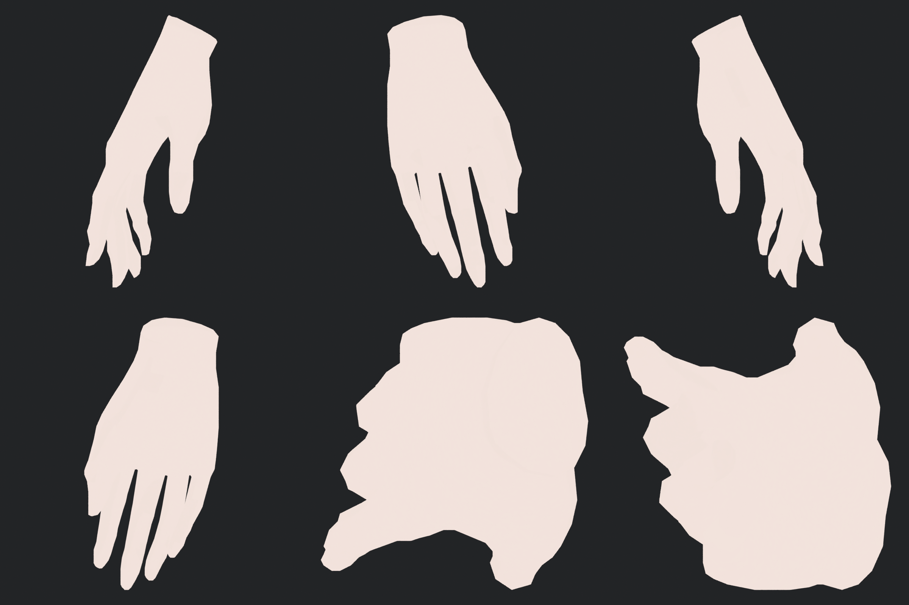

## 오른손

손가락과 손목의 오염 제거를 유지합니다.

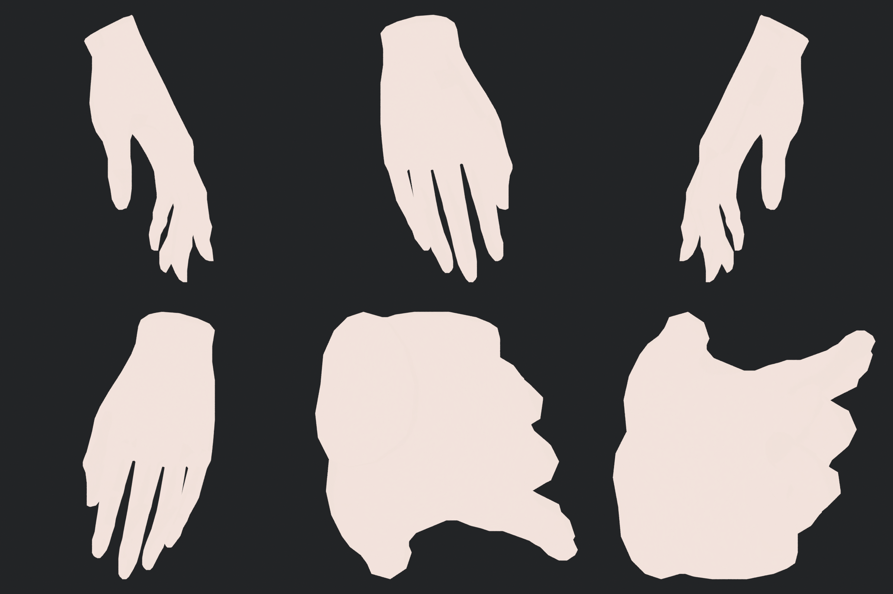

## 얼굴·목

얼굴 인상과 눈·입 디테일을 보존하고 v323의 아래 목 정리를 유지합니다.

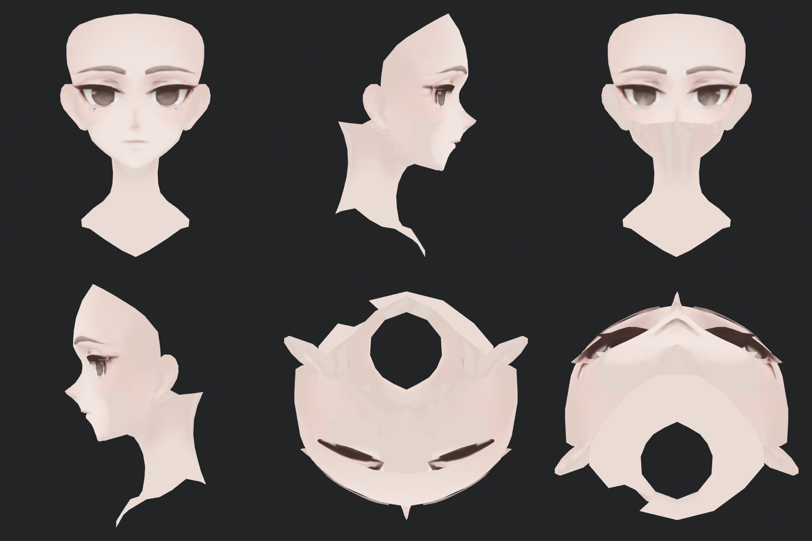

## 머리 안쪽과 바깥쪽

정상 머릿결은 원본을 복원하고 확인된 피부색 혼입 31면만 정리합니다.

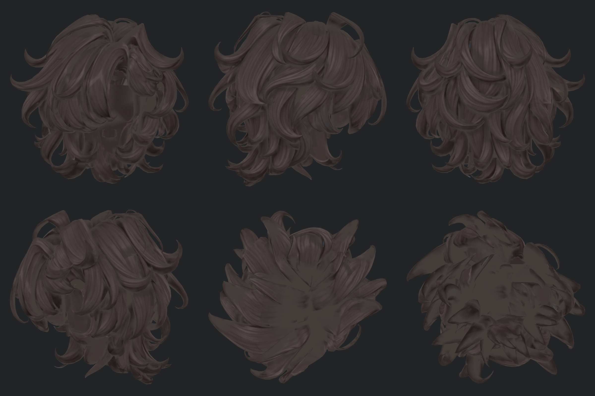
