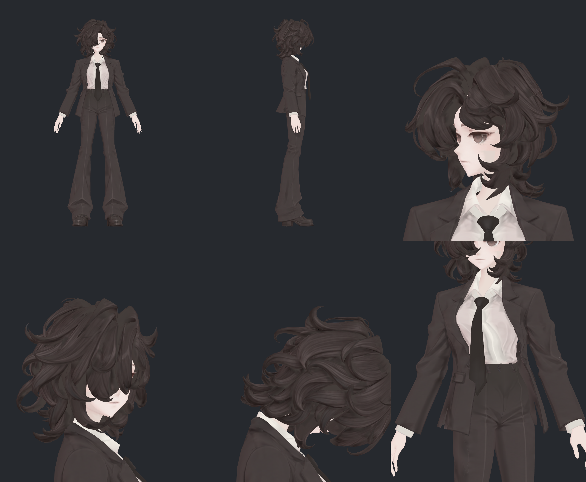
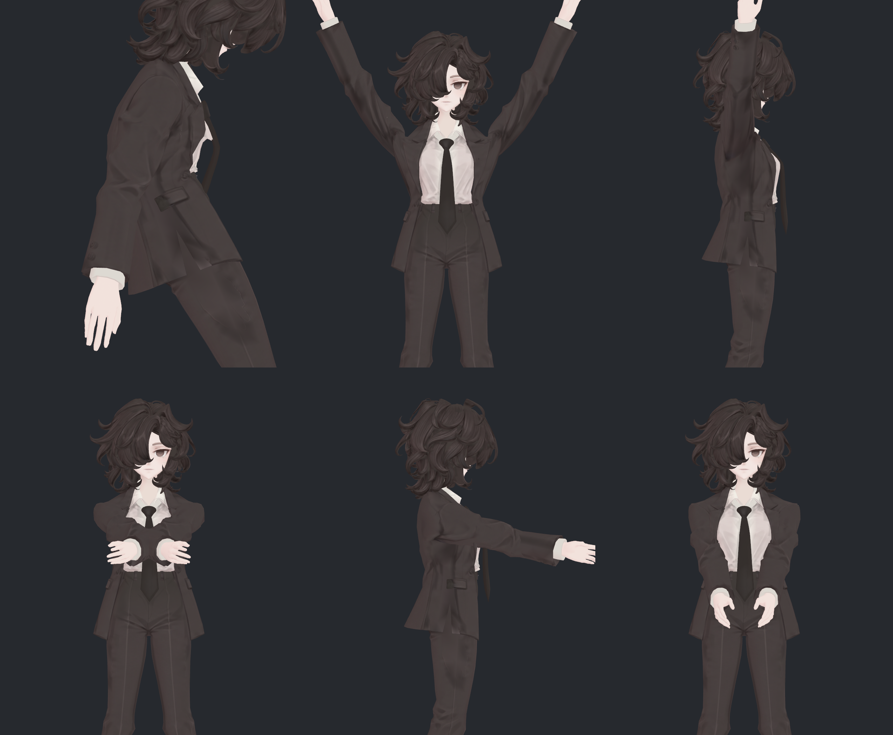
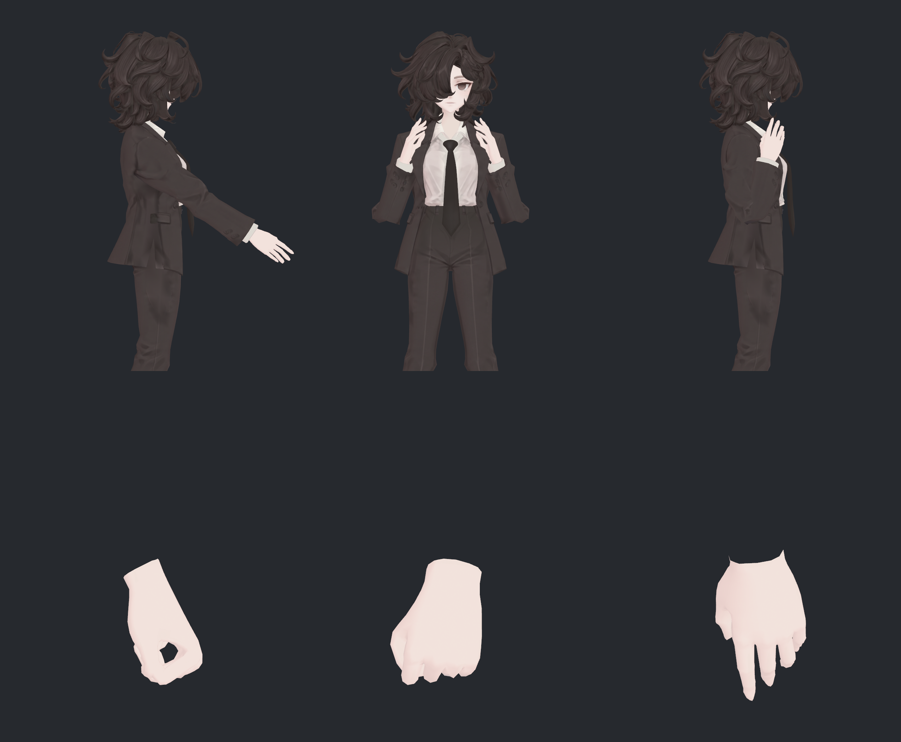
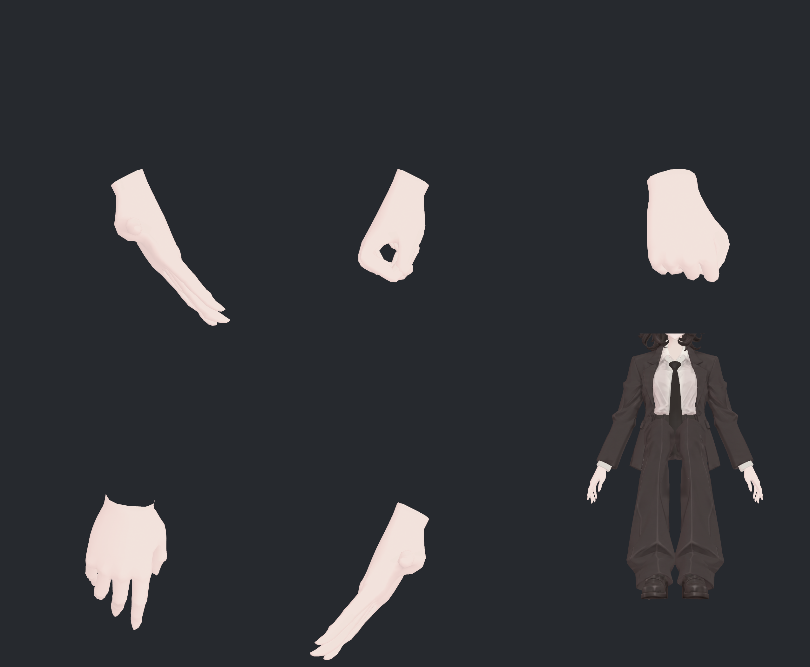
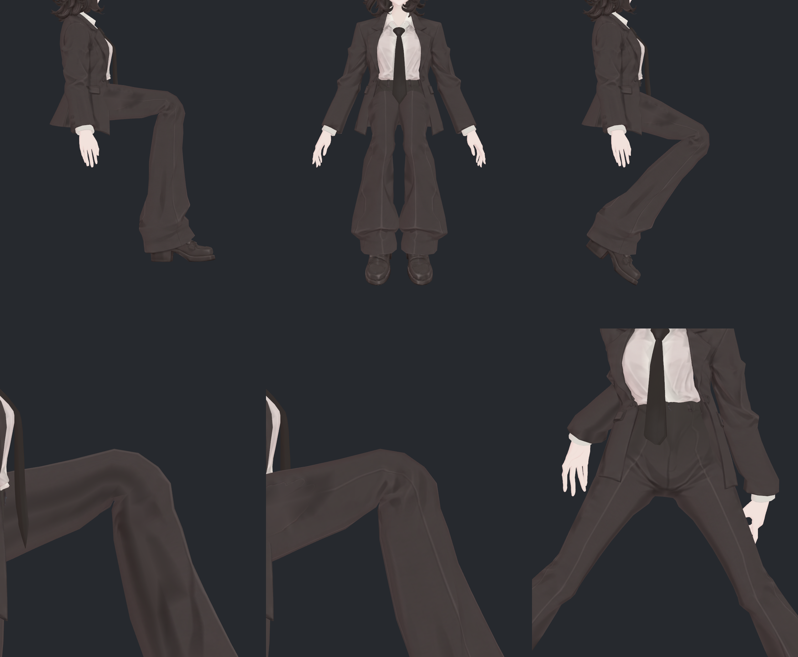
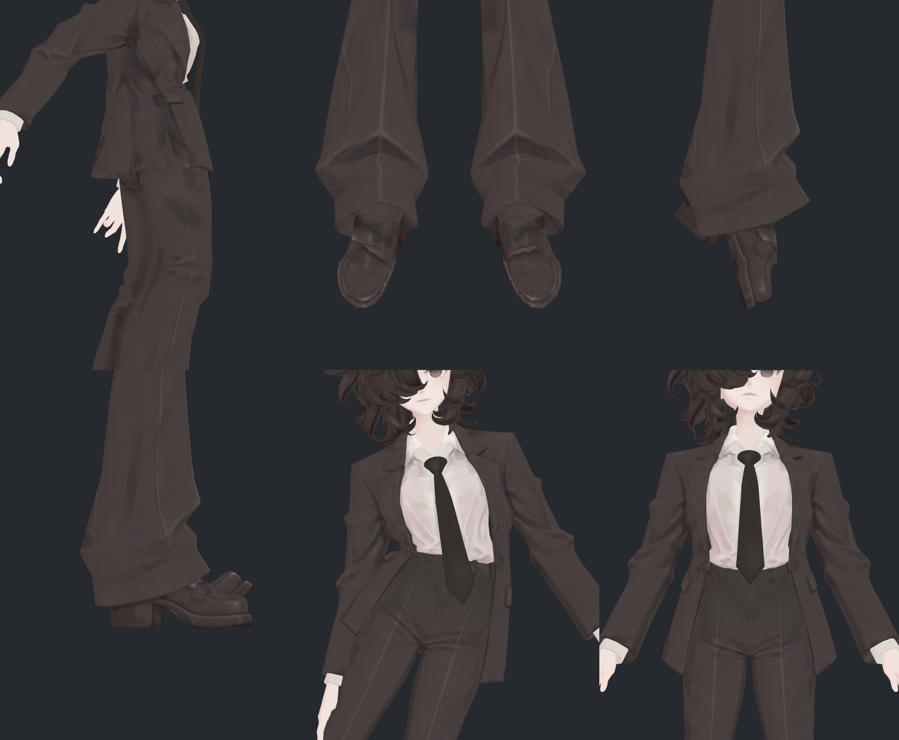
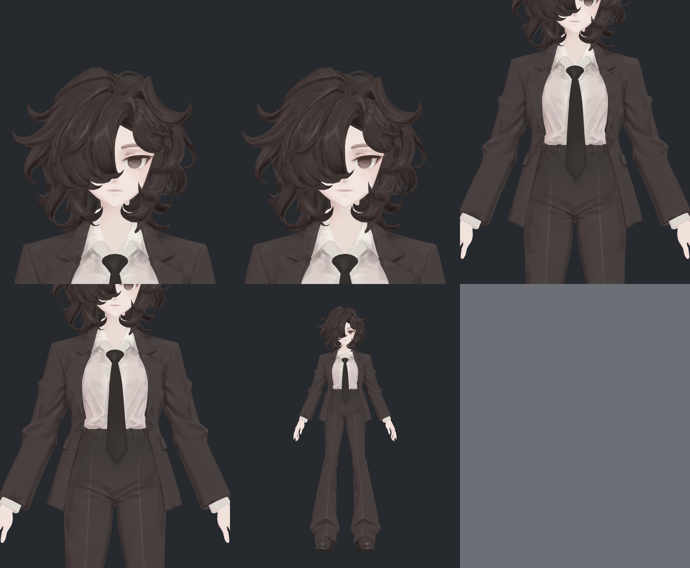

> **기록 시점 안내:** 아래는 해당 단계 당시의 보고서입니다. 후속 결정은 [최신 상태](../../STATUS.md)를 기준으로 읽어주세요. 모델·원본 텍스처·검증 원시 데이터는 이 문서 공유본에 포함하지 않습니다.

# v325 관절·본 실제 적용 사진 41장

[검토 결과와 우선순위](v325_RIG_REVIEW.md) · [129본 점검표](v325_BONE_TABLE.md)

현재 v324 prefab을 실제 Unity Play Mode에서 변형해 BakeMesh로 기록한 위치·노멀에 현재 텍스처를 적용했습니다. 목표 형상을 임의로 그린 사진이 아닙니다. 7개 시트를 모두 직접 열었고 주요 실패 자세를 개별 확대했습니다. 각 시트는 위줄 왼쪽부터 1–3, 아래줄 왼쪽부터 4–6입니다. 마지막 시트의 여섯째 칸은 빈칸입니다. 부분 확대는 지정 관절을 보여주므로 전신 일부가 프레임 밖일 수 있습니다.

## 사진 1–6

1. `Neutral` · FULL · FRONT
2. `Neutral` · FULL · SIDE
3. `HeadTurn` · HEAD · FRONT
4. `HeadTurn` · HEAD · SIDE
5. `HeadBow` · HEAD · SIDE
6. `TorsoTwist` · TORSO · FRONT

## 사진 7–12

1. `TorsoBend` · TORSO · SIDE
2. `ArmsUp` · UPPER · FRONT
3. `ArmsUp` · UPPER · SIDE
4. `ArmsForward` · UPPER · FRONT
5. `ArmsForward` · UPPER · SIDE
6. `Historical571` · UPPER · FRONT

## 사진 13–18

1. `Historical571` · UPPER · SIDE
2. `ElbowsFold` · UPPER · FRONT
3. `ElbowsFold` · UPPER · SIDE
4. `Fist` · HAND_L · FRONT
5. `Fist` · HAND_L · SIDE
6. `WristsBent` · HAND_L · SIDE

## 사진 19–24

1. `FingersOpen` · HAND_L · FRONT
2. `Fist` · HAND_R · FRONT
3. `Fist` · HAND_R · SIDE
4. `WristsBent` · HAND_R · SIDE
5. `FingersOpen` · HAND_R · FRONT
6. `Hip_Both_90_90_0_0` · LOWER · FRONT

## 사진 25–30

1. `Hip_Both_90_90_0_0` · LOWER · SIDE
2. `Hip_Both_70_110_0_0` · LOWER · FRONT
3. `Hip_Both_70_110_0_0` · LOWER · SIDE
4. `Hip_L_110_90_0_0` · KNEE_L · SIDE
5. `Hip_R_110_90_0_0` · KNEE_R · SIDE
6. `Mixed_60` · HIPS · FRONT

## 사진 31–36

1. `Mixed_60` · HIPS · SIDE
2. `AnklesToes` · FEET · FRONT
3. `AnklesToes` · FEET · SIDE
4. `Channel_28_-0.8` · FEET · SIDE
5. `Channel_1_0.8` · TORSO · FRONT
6. `Channel_3_0.8` · TORSO · FRONT

## 사진 37–41

1. `Physics_0` · HEAD · FRONT
2. `Physics_90` · HEAD · FRONT
3. `Physics_0` · TORSO · FRONT
4. `Physics_90` · TORSO · FRONT
5. `FinalRecover` · FULL · FRONT

