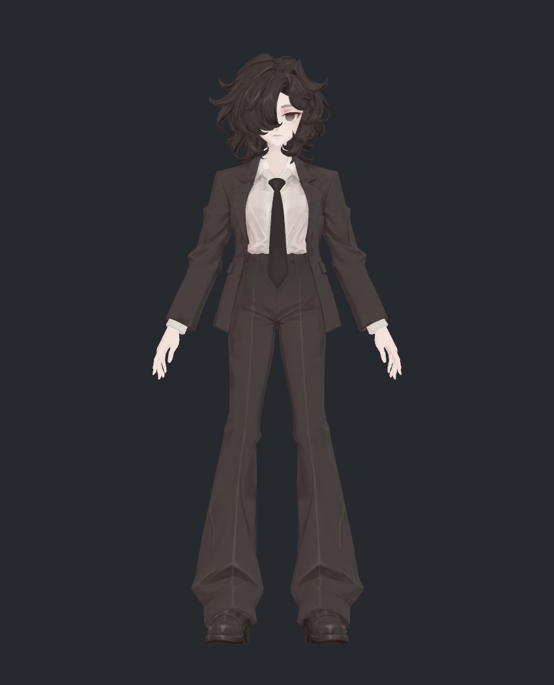
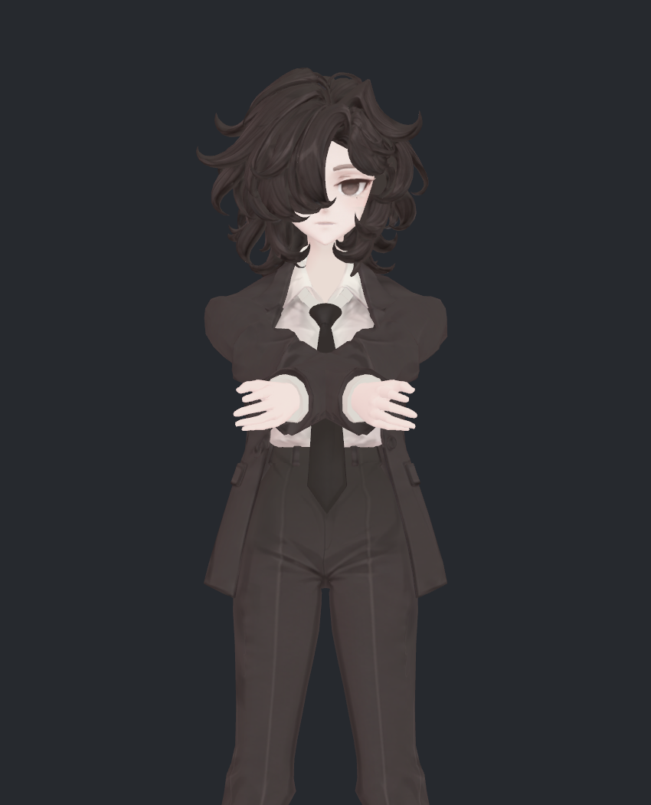
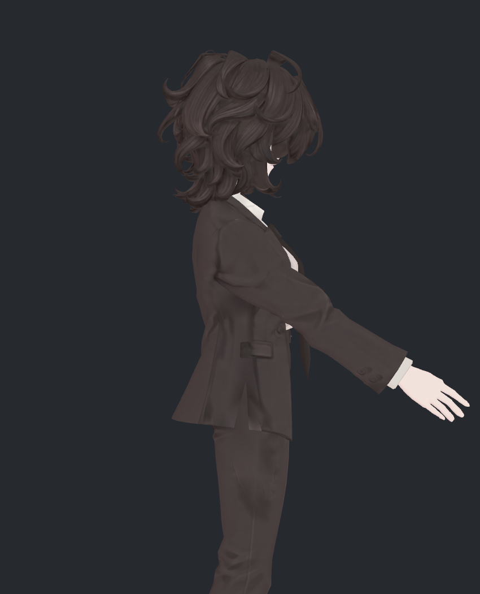
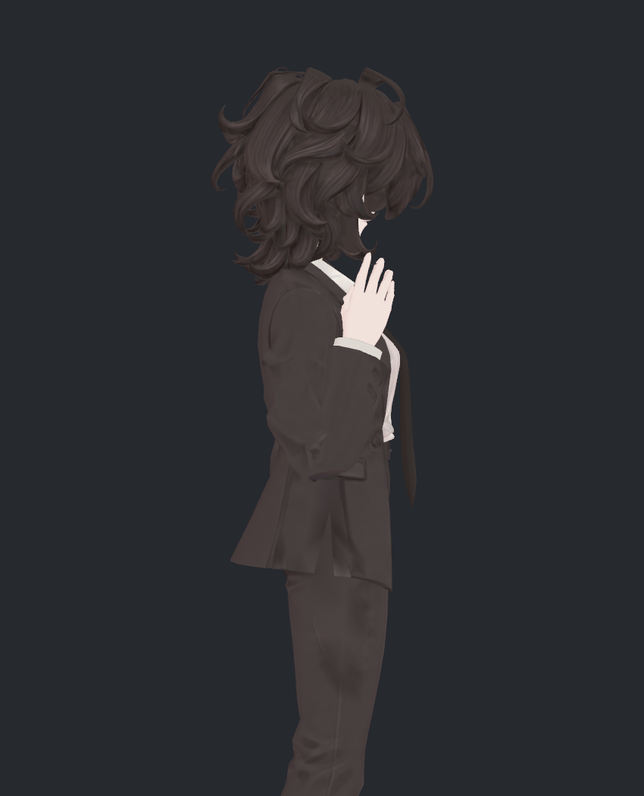
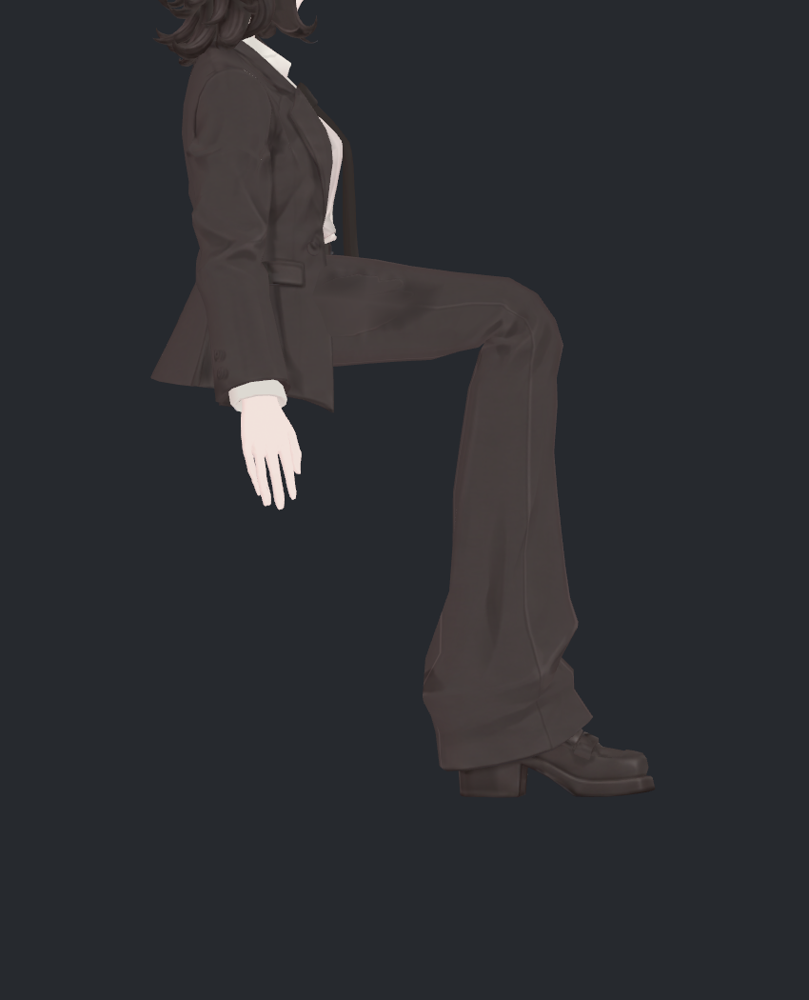
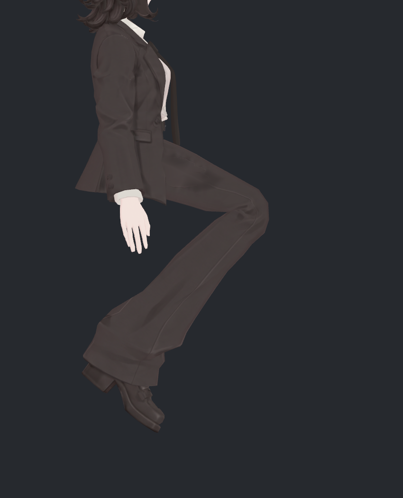
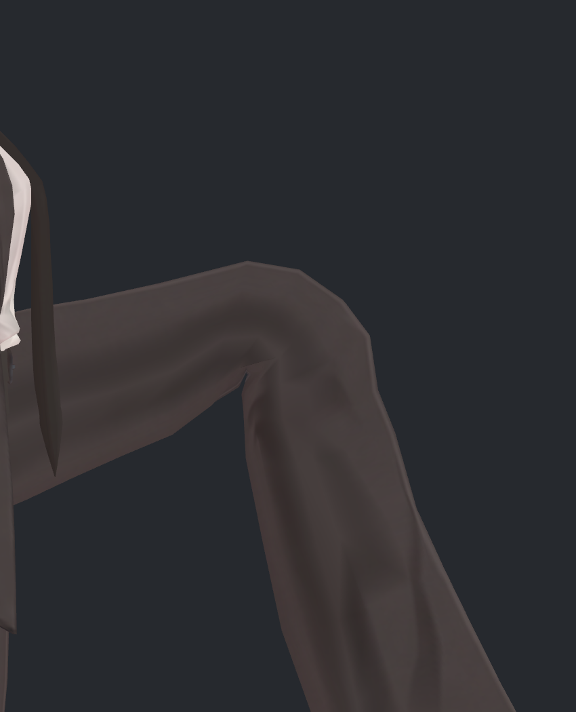
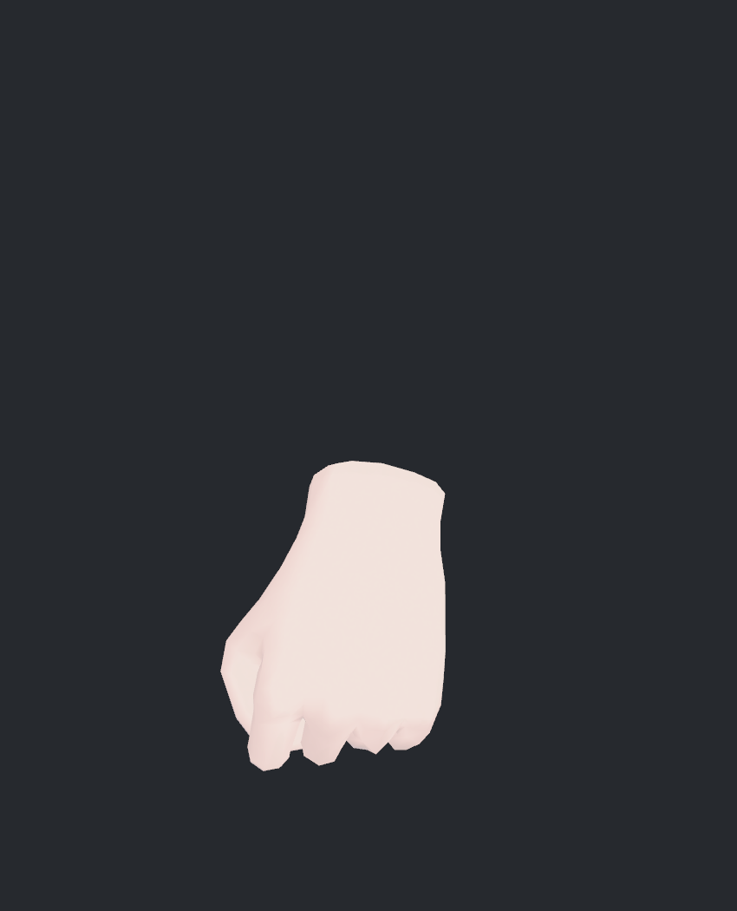
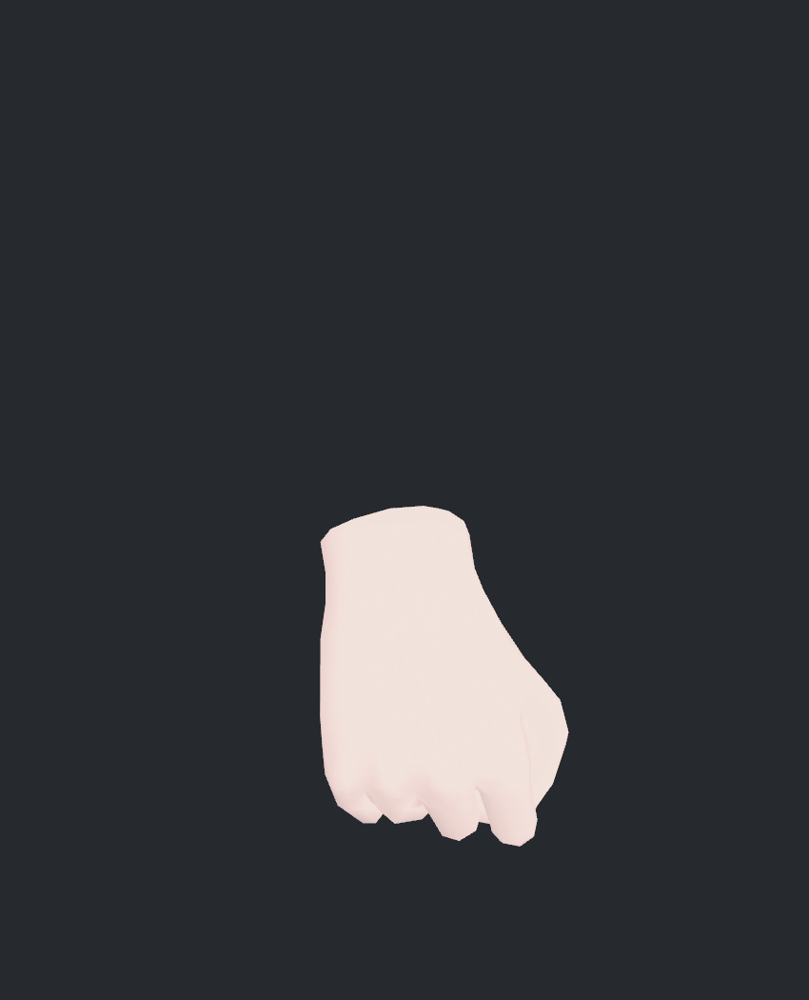
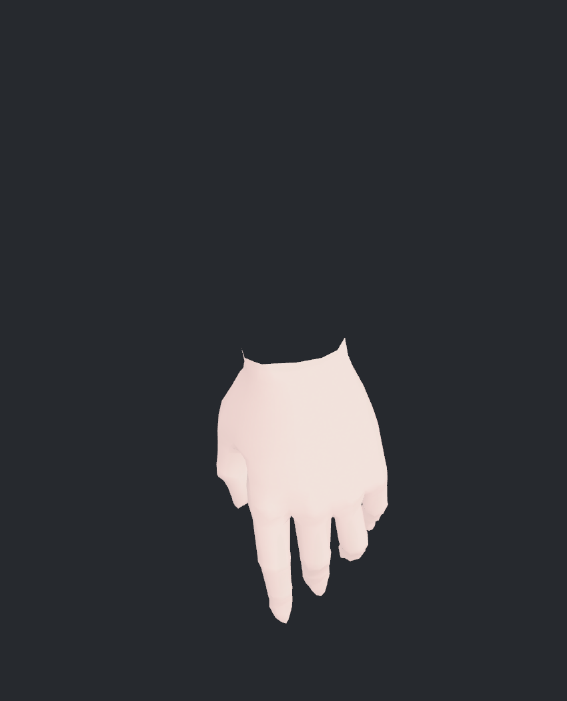

> **기록 시점 안내:** 아래는 해당 단계 당시의 보고서입니다. 후속 결정은 [최신 상태](../../STATUS.md)를 기준으로 읽어주세요. 모델·원본 텍스처·검증 원시 데이터는 이 문서 공유본에 포함하지 않습니다.

# v325 전체 관절·본 검토 결과

텍스처 정리 후 현재 v324 모델을 대상으로 검토했습니다. **본과 웨이트의 기본 연결은 통과했지만, 어깨·소매, 몸통과 코트 경계, 고관절·무릎, 손가락의 변형 품질은 아직 전체 합격 상태가 아닙니다.** 이번에는 모델을 수정하지 않고 실제 문제 자세와 검사 근거를 정리했습니다.

검수 대상은 `Bianca_v324_DetailReview.prefab`과 `bianca_v324_DETAIL_REVIEW.blend`입니다. 원래 v212 기하/v224 노멀·26개 보정 키를 계승한 현재 파일입니다. 과거 v245 손·v251 골반·v253 이후 어깨 후보를 자동 합친 파일이 아닙니다. 사진③(v316 M30)의 특정 목표 형상도 현재 자유 동작 리그에 자동 통합된 것으로 해석하지 않습니다. 사용자께서 허용한 기본 소매 주름·측면 곡선을 무조건 제거할 결함으로 분류하지 않았습니다.

## 1. 어떤 검사를 했나

| 항목 | 실제 범위 |
|---|---|
| 전체 본 | Blender/Unity 이름 대응 129개, 부모·길이·영향 정점·실제 로컬 회전 추적 |
| Humanoid | 매핑 51본, 실제 매핑된 회전 채널 86개 각각 −0.8/+0.8 |
| 정적 자세 | 300개: 중립, 172개 단일 채널, 12개 주요 동작, 49개 실제 각도 다리 자세, 기존571, 64개 복합, 복귀 |
| 연속 움직임 | 121개 연속 표본의 실제 BakeMesh 검사 |
| 보조 본 | PhysBone 11개 체인, 워밍업90프레임 후180프레임 이동·바람, 정지 후 복귀 확인 |
| 면적 검사 | 실제 평가 삼각형 31,363개, 중립 대비 면적 0.2 미만/3 초과를 경고로 선별 |
| 교차 검사 | 주요 자세·영역별 경고가 큰 자세 등 47개에서 실제 삼각형 교차선 확인 |
| 두께·부피 | 9자세×양 위팔/허벅지, 각 7개의 닫힌 단면. 유효 구간만 외곽 부피 적분 |
| 시각 검수 | 실제 Unity 스키닝 결과 41장, 7개 시트 전부 직접 확인. 주요 문제는 개별 확대 확인 |

단일 채널의 ±0.8은 정규화된 Humanoid 스트레스 입력이며 각도(도)나 일상 동작 범위가 아닙니다. 실제 관절 각도는 별도로 기록했습니다.

Unity 2022.3.22f1의 Play Mode에서 현재 prefab과 기존 자동 보정·SDK 구성요소를 사용했습니다. 관절 검사 중 바람은 0, PhysBone은 꺼서 움직임 원인을 분리했습니다. 이후 보조 본 검사에서만 바람·PhysBone을 켰습니다. VRChat 클라이언트 실행·업로드·네트워크 동기화 시험은 아닙니다.

Blender에서는 원본을 읽어 129본·부모 구조·웨이트·67개 드라이버 유효성을 확인했습니다. 위 300자세 변형 수치는 Unity 실제 출력입니다. Blender의 모든 제어기에서 동일 결과가 나오는지까지 왕복 검증했다는 뜻은 아닙니다.

## 2. 본 구조와 웨이트

두 메시 모두 본 참조 129개와 bind pose 129개가 일치하고, 누락 본·잘못된 인덱스·무가중치 정점은 0입니다. 실제 변형 본에 대한 정점 영향은 최대 4개이고 합계는 부동소수점 오차 범위에서 1입니다. Blender와 Unity의 본 이름이 모두 대응하며 부모 누락·순환·길이 0·무효 드라이버는 없습니다.

Blender에 있는 `REGION_`, `PART_`, `CHECK_` 같은 선택·검사용 그룹은 변형 웨이트에서 제외했습니다. 이 그룹까지 더하면 합계가 1을 넘으므로 잘못된 웨이트로 오인하게 됩니다. 실제 본 그룹만으로 재검사했습니다.

현재 Unity 구성은 회전 제약 30개, Contact Sender 26개/Receiver 80개, PhysBone 11개와 Collider 8개입니다. 구조가 있다는 사실만으로 접촉 품질이나 VRChat 작동이 완성됐다고 판정하지 않았습니다. 전체 이름별 결과는 **[129본 점검표](v325_BONE_TABLE.md)**에 있습니다.

## 3. 부위별 판단

| 부위 | 현재 확인한 결과 | 판단 |
|---|---|---|
| 목·머리 | 돌리기·숙이기에서 본 연결과 머리 추종을 확인. 얼굴 표면의 큰 붕괴는 사진에서 확인하지 못함 | 기본 추종 확인. 극단적 머리카락·깃 접촉 전체 합격은 아님 |
| 척추·가슴·허리 | 비틀기/굽히기에서 셔츠·라펠·코트 앞판 접촉과 국소 면적 경고 | 경계와 변형 분담 후속 검토 필요 |
| 어깨·겨드랑이 | 팔을 앞으로 모을 때 소매 안쪽의 덩어리 접힘, 들어 올릴 때 깊은 겨드랑이 꺾임 | 우선 수정 대상 |
| 팔꿈치·전완 | 굽힘·비틀기 구동 확인. 큰 굽힘에서는 안쪽 압축과 각진 접힘 | 원래 주름과 새 압축을 구분해 수정 필요 |
| 손목·소맷부리 | 양손 굽힘·옆꺾기 작동. 손목/깃/단추 주변 접촉 경고 | 확대 접촉 정리 필요 |
| 손가락 30본·보조 | 각 채널과 주먹·펼침 확인. 주먹에서 각진 마디와 국소 압축이 남음 | 기존 손 후보의 합격 수치를 현재 파일에 대신 적용할 수 없음 |
| 고관절·골반 | 실제 각도 시험에서 바지 상단·코트 경계 눌림, 복합 자세에서 경고 증가 | 어깨와 함께 우선 수정 대상 |
| 무릎 | 양쪽 실제90°/110° 굽힘 확인. 안쪽이 모이고 외곽 전환이 각지게 남음 | 두께만으로 합격 불가, 접힘 형태 후속 검토 |
| 발목·발가락·신발 | 각 채널 움직임 확인. 신발의 작은 면적 경고와 바짓단 접촉 | 극단 굽힘의 국소 검토 필요 |
| 머리·넥타이·코트 보조 | 11개 체인의 활성 상태와 이동·바람 중 실제 움직임 확인 | 짧은 Editor 표본의 동작 확인. 물리 안정성·관통 최종 보증 아님 |

### 어깨와 팔꿈치

아래는 실제 팔 앞으로 모으기와 기존571 자세입니다. 기본 소매의 조형 주름을 문제 삼는 것이 아니라, 움직임에서 겨드랑이·윗소매가 큰 덩어리로 접히는 부분을 보고 있습니다.

| 앞으로 모으기 | 기존571 측면 |
|---|---|
|  |  |

팔꿈치 최대 굽힘 시험의 실제 각도는 약 164.5°입니다. 팔을 굽히라는 입력을 주었는지와 실제 관절 각도를 함께 기록했습니다. 기본 자세는 약9.23° 굽혀져 있으므로 기본 화면을 완전 신전 사진으로 설명하지 않습니다.

### 고관절·무릎

단순히 이름이 Crouch인 포즈를 사용하지 않았습니다. 아래 시험은 실제 고관절90°/무릎90°, 고관절70°/무릎110°를 확인했습니다. 골반 높이는 고정한 관절 검사용 자세이므로 바닥에 발을 딛고 앉는 동작/IK 검사가 아닙니다.

| 90° / 90° | 70° / 110° |
|---|---|
|  |  |

### 손과 손목

양손의 원래 면을 관찰용으로 분리해 손가락 사이를 확인했습니다. 사진의 손목 절단 경계는 검사용 표시 범위이며 전달 모델을 자른 것이 아닙니다. 주먹 입력에서 마디의 각짐과 접힌 면의 국소 압축이 남습니다.

| 왼손 주먹 | 오른손 주먹 |
|---|---|
|  |  |

## 4. 수치가 말해주는 범위

정적300자세 중 **126자세**에서 하나 이상의 면적 경고가 있었습니다. 전체 기록 435표본 중 경고가 있는 것은 217표본입니다. 이는 삼각형 압축/확대의 선별 기준이며, 경고 개수와 눈에 보이는 문제 개수는 같지 않습니다. 한 자세의 같은 면이 여러 표본에 반복되면 여러 번 집계됩니다.

| 대표 자세 | 전체 면적 경고 삼각형 |
|---|---:|
| 팔 앞으로 | 10 |
| 팔 위로 | 10 |
| 주먹 | 9 |
| 고관절90°/무릎90° | 3 |
| 고관절70°/무릎110° | 2 |

교차 검사는 공유된 기하 정점의 이웃 삼각형을 제외하고, 0.05mm를 넘는 비공면 교차선을 확인했습니다. 머리카락 표면은 이번 정확 교차 집계에서 제외하고 별도 시각·동작 검수로 다뤘습니다. 중립에도 옷 겹침·신발 내부·부속 결합부의 교차가 있어서, 중립 대비 새 교차와 기존 교차를 나눴습니다. 교차선 길이는 침투 깊이가 아니며, 겉에서 보이지 않는 겹침을 모두 불량으로 세지 않습니다. 전체 접촉 0을 달성했다는 결론은 아닙니다.

### 부피·두께

위팔/허벅지 본 길이의55–85% 구간에서 7개 실제 닫힌 단면의 외곽을 적분했습니다. 9자세×4구간의252단면이 닫혔습니다. 이 값은 **해당 짧은 구간의 외곽 부피**이며 어깨 전체·팔 전체·무릎 접힘 자체·옷감 부피가 아닙니다.

| 자세 | 왼 위팔 구간 / 중립 | 오른 위팔 구간 / 중립 |
|---|---:|---:|
| 팔 위로 | 97.92% | 97.84% |
| 팔 앞으로 | 97.24% | 97.25% |
| 팔꿈치 최대 굽힘 | 97.15% | 96.82% |
| 기존571 | 97.71% | 97.77% |

허벅지 중앙 구간의 외곽 부피 변화가 작아도 고관절 입구·코트 경계나 무릎 안쪽의 각짐이 해결됐다는 뜻은 아닙니다. 이번 사진에서도 중앙 두께를 유지한 채 관절 접힘이 부자연스러운 사례가 있으므로, 다음 수정에서는 접힘·접촉·구간 두께를 함께 확인해야 합니다.

## 5. 검토 중 발견한 검사 문제와 대응

| 문제/시도 | 대응과 판정 |
|---|---|
| 모든 Blender 정점 그룹을 웨이트로 합산 | 선택·검사용 그룹까지 포함한 오진. 실제 변형 본 그룹만으로 재검사, 합계/최대4영향 정상 |
| 미저장 Unity 장면에 Editor 검사용 장면 추가 | Unity 제한으로 실패. 사용자 장면을 저장·변경하지 않고 Play Mode 안의 임시 장면으로 전환 |
| 보조 검사와 본 검사의 실행 상태 키 공유 | 후속 검사 분리를 위해 키/런타임 장면 이름을 독립시켰고 최종 검사 재실행 |
| PhysBone만 끄고 중립 복귀 비교 | 기본 바람0.35 애니메이션의 시간 차이가 섞임. 바람0인 관절 검사와 보조 움직임 검사를 분리해 최종 재실행 |
| RenderTexture에 카메라 viewport만 바꾼 모음 사진 | 마지막 사진으로 덮이는 문제 확인. 실제 개별 렌더를 Unity 그래픽 버퍼로 조합하고 다시 직접 확인 |
| 면적 경고/교차 수치만으로 판정 | 기존 결합부·보이는 접힘을 구분해 확대 사진으로 교차 확인 |

바람이 켜졌던 초기 자료는 `trials/default_wind/`에 남겼고 최종 관절 수치로 사용하지 않았습니다. 원래 본/웨이트/메시/텍스처를 수정해서 경고를 숨기지 않았습니다.

바람을 끈 최종 관절 복귀의 중립 대비 최대 위치 차이는 BodyHair **0.000000mm**, Coat **0.000000mm**입니다. 물리·바람 후에는 잔류 동적 자세를 따로 기록하고, 관찰용 인스턴스의 보조 회전을 초기화한 복귀도 분리했습니다. 초기화 후 복귀를 물리가 자연스럽게 완전히 수렴한 것으로 설명하지 않습니다.

## 6. 다음 수정의 우선순위

1. **어깨·겨드랑이와 소매 안쪽:** 현재 실제 보정 키/기존 면 흐름으로 앞 모으기·큰 굽힘의 덩어리 접힘을 정리하고 기존 허용 외형과 대조합니다.
2. **고관절·무릎과 코트 경계:** 실제 각도 기준으로 안쪽 접힘·관통·두께를 함께 다룹니다. 과거 골반 후보를 검증 없이 합치지 않습니다.
3. **손가락·손목·발목의 국소 잔여:** 현재 파일에서 실패한 면과 자세를 고정해 기존 개선 후보와 같은 조건으로 비교합니다.
4. **보조 물리와 전체 통합:** 머리·넥타이·자락의 긴 동작·접촉 안정성, Blender 제어와 Unity의 대응 및 실제 VRChat 검증을 별도 진행합니다.

검토와 문서화는 완료했으며 **전체 관절 수정 완료/최종 아바타 채택은 아닙니다.** 현재 v324 전달 파일은 바뀌지 않았습니다. [41장 갤러리](v325_GALLERY.md), [129본 점검표](v325_BONE_TABLE.md), [검사 데이터·재현 안내](README.md)를 함께 볼 수 있습니다.
