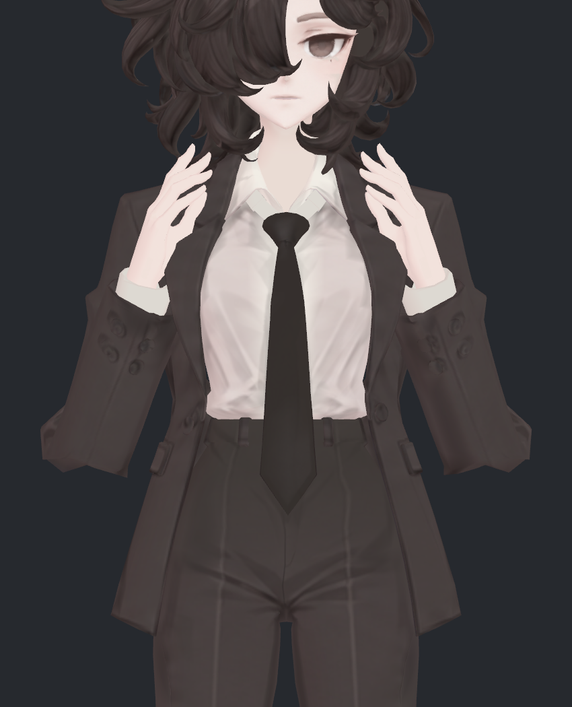
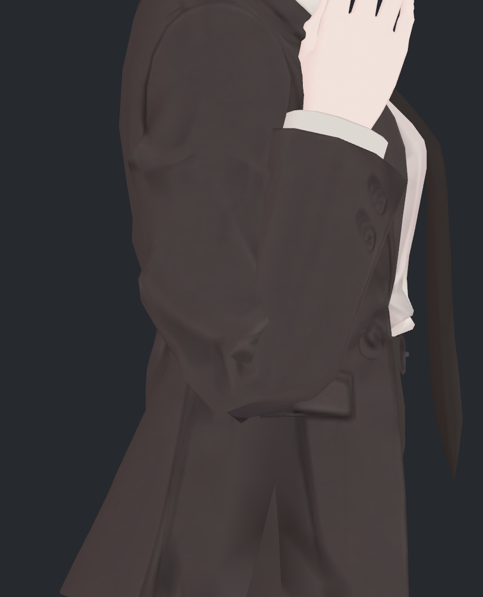
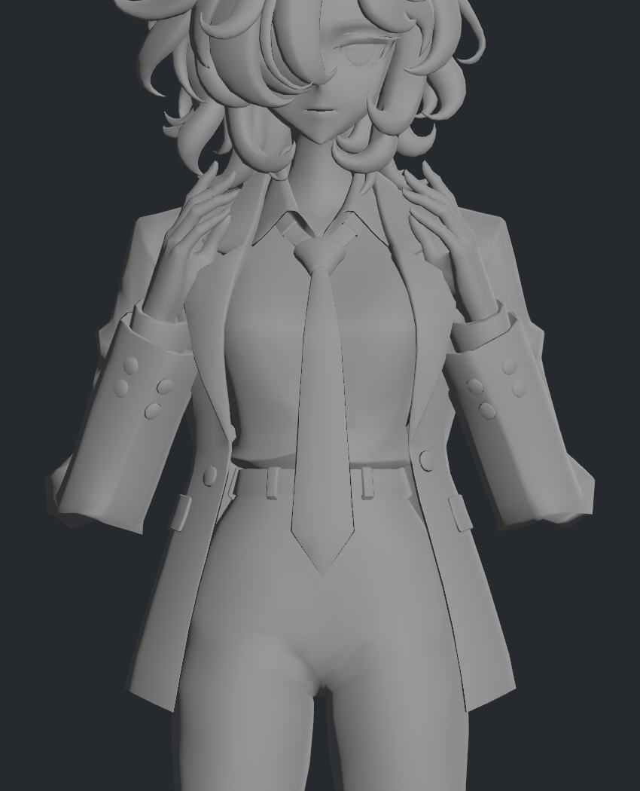
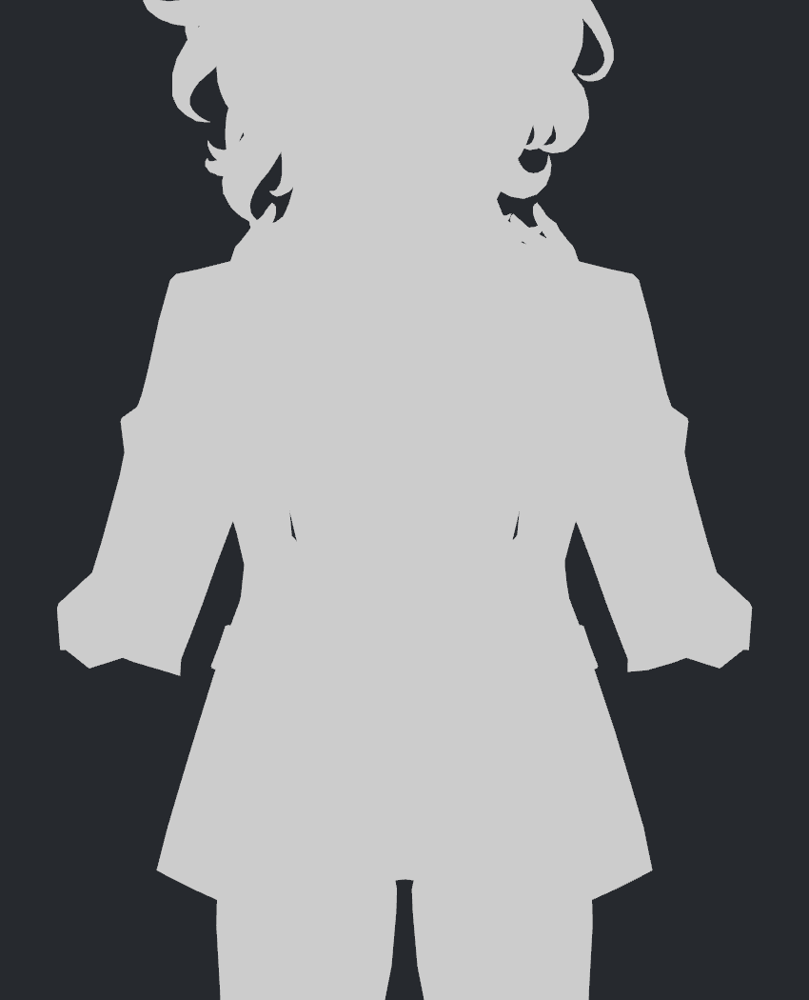
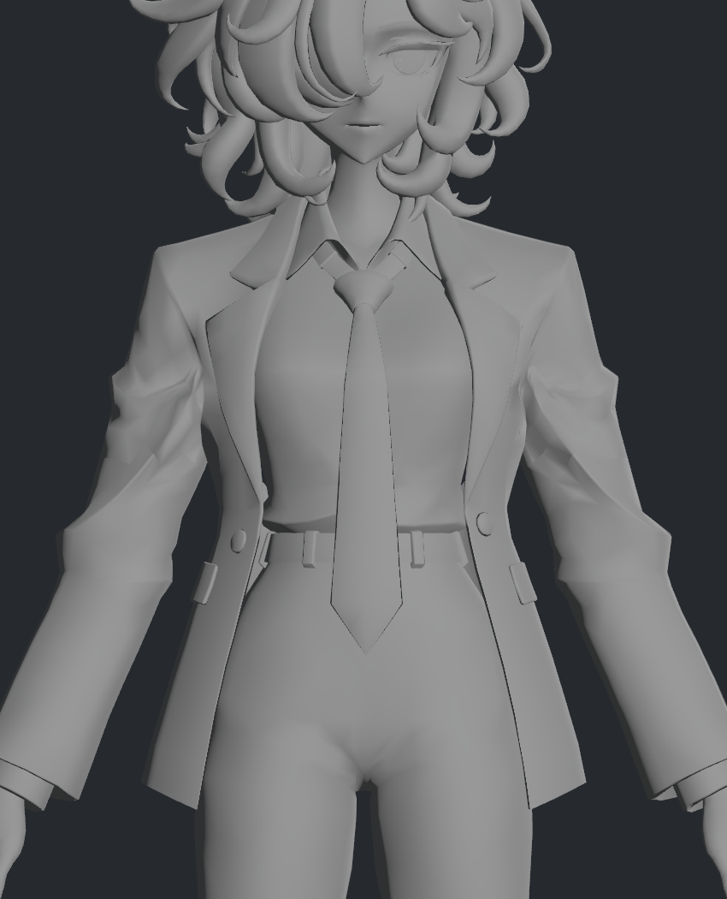
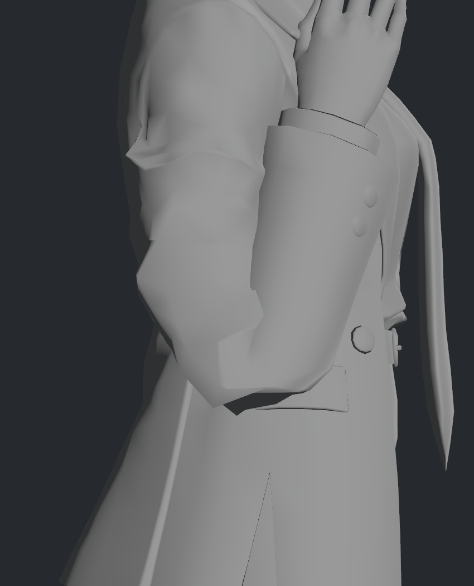

> **기록 시점 안내:** 아래는 해당 단계 당시의 보고서입니다. 후속 결정은 [최신 상태](../../STATUS.md)를 기준으로 읽어주세요. 모델·원본 텍스처·검증 원시 데이터는 이 문서 공유본에 포함하지 않습니다.

# v326 팔꿈치 정면 각짐 재검토

**정면에서 양쪽 팔꿈치 바깥이 넓은 다각형 모서리처럼 접히는 현상을 확인했습니다. 텍스처나 조명만의 문제가 아니라 실제 변형된 소매 외곽의 각짐입니다.** 사용자가 이전에 괜찮다고 한 측면 모습과 별개로, 이번 정면 지적 부위를 다시 검토 대상으로 열었습니다. 무릎 유지·손가락 국소 압축 보류 결정은 그대로입니다.

## 같은 자세를 다시 확인

첨부 화면은 v325의 ElbowsFold 정면과 같은 형상입니다. 당시 실제 굽힘은 좌164.539°/우164.539°였고, 이번에는 저장된 실제 Unity BakeMesh 위치와 노멀을 그대로 사용해 가까이 촬영했습니다. 이 두 자세를 새로 구동하거나 일상 동작 전체를 추가 검사한 것은 아닙니다. 원본 v324 모델도 수정하지 않았습니다.

| 정면 | 측면 확대 |
|---|---|
|  |  |

문제 위치는 손목의 흰 깃이 아니라, 그 아래 소매가 돌아 나오는 **양쪽 팔꿈치의 바깥쪽·아래쪽 외곽**입니다. 정면에서는 넓은 전완 소매 끝이 각진 모서리처럼 튀어나오고, 측면에서는 접힌 소매가 겹쳐 보여 같은 모서리가 덜 두드러집니다. 측면 허용을 모든 방향의 품질 합격으로 확대하지 않습니다.

## 채색·음영과 실제 형상을 분리

왼쪽은 원래 위치/노멀에 회색 재질을 입힌 결과이고, 오른쪽은 조명 없는 단색 실루엣입니다. 실루엣에서도 같은 모서리가 남으므로 텍스처를 다시 칠하거나 노멀만 부드럽게 바꿔 해결할 대상은 아닙니다. 회색 재질에서는 다른 기존 면 경계도 더 잘 보이지만 이번 검토 범위는 팔꿈치입니다.

| 회색 표면 | 조명 없는 실루엣 |
|---|---|
|  |  |

| 중립 회색 표면 | 굽힘 측면 회색 표면 |
|---|---|
|  |  |

중립에도 조형 주름과 각진 면이 있습니다. 굽힘 때 기존 면 흐름이 압축·회전되면서 정면 모서리가 더 두드러집니다. 원래 주름을 전부 지우는 방향으로 해석하지 않습니다.

## 수치 확인과 원인 범위

중립 팔꿈치 본 위치에서75mm 이내의 소매 삼각형 중심을 골라 같은 삼각형을 비교했습니다. UV 이음점은 원래 위치 기준으로 대응시키고, 음영 노멀이 아닌 실제 삼각형의 기하 법선 사이 각도를 측정했습니다.

| 실제 리그 쪽 | 선택 삼각형 | 면 사이45° 초과 경계: 중립 → 굽힘 | 면적 압축/확대 경고 삼각형 |
|---|---:|---:|---:|
| L | 297 | 32 → 81 | 4 |
| R | 296 | 30 → 77 | 7 |

이 경계 수는 보이는 결함 수나 관통 개수가 아닙니다. 75mm 근방에는 앞뒤 면과 기존 주름이 함께 들어 있고, 이번 검사는 팔꿈치 전체 부피를 측정하지 않았습니다. 단순히 외곽을 줄여 각짐을 없애면 두께를 잃을 수 있으므로 후속 수정에서는 두께도 함께 비교해야 합니다.

- **확인:** 해당 자세에서 BodyHair/Coat 보정 키는 모두0입니다. 과한 보정 키의 활성화 때문에 생긴 현상은 아닙니다.
- **확인:** 팔꿈치 보조 본 웨이트는 양쪽 모두 존재합니다. 보조 본 누락으로 단정할 수 없습니다.
- **확인:** 실제 스키닝 결과의 면과 외곽이 각집니다. 채색/음영만으로 해결할 수 없습니다.
- **미확정:** 기존 면 배치, 본 회전 분담, 웨이트 중 어느 요소가 주원인인지는 개별 변경 비교를 아직 하지 않았습니다. 현재 근거만으로 “웨이트만 바꾸면 해결” 또는 “컷이 반드시 필요”라고 말하지 않습니다.

## 시도와 제외한 해석

| 시도 | 결과와 판단 |
|---|---|
| 원래 재질/회색/무조명 실루엣 비교 | 모두 모서리 유지. 텍스처 재작업을 해결책으로 채택하지 않음 |
| 기존 보정 키 활성값 확인 | 모두0. 보정 키 과적용이라는 설명 제외 |
| 중립/굽힘의 같은 면 기하 각도 비교 | 급한 꺾임 증가 확인. 수치를 미관 점수로 사용하지 않음 |
| 최초 영역 선택에서 기존 패널 L/R 문자 사용 | 리그 쪽과 패널 명명 대응을 가정해0개 선택. 실제 팔꿈치 본 위치와 소매 분류로 다시 선택하고 양쪽297/296면 확인. 빈 표본 결과 폐기 |
| 즉시 소매 전체 평활화·축소 | 실행하지 않음. 기존 주름·부피·허용 측면이 달라질 수 있어 국소 비교가 우선 |

## 후속 수정 범위 제안

현재 파일의 사본에서 **팔꿈치 주변 기존 웨이트/보조 본의 변형 분담**을 먼저 한 요소씩 비교하고, 그것만으로 정면 모서리를 줄이지 못할 때 기존 면 배치의 국소 조정을 검토하는 순서가 적절합니다. 정면 모서리를 줄이면서 기존 측면·중립 소매·두께를 유지하는 것이 목표입니다. 굽힘90/120/150/164.5°를 같은 조건으로 비교해야 합니다.

이번 작업은 이 문제의 재검토와 기록까지입니다. 새 메시, 원본 모델 편집, 수정안 채택은 없습니다. 원래 무릎·손가락 유지 결정은 바꾸지 않았습니다. 검사 데이터 (공유본 미포함: `ELBOW_CHECK.json`), [검사·재현 안내](README.md)를 작업 저장소에 보존했습니다.
