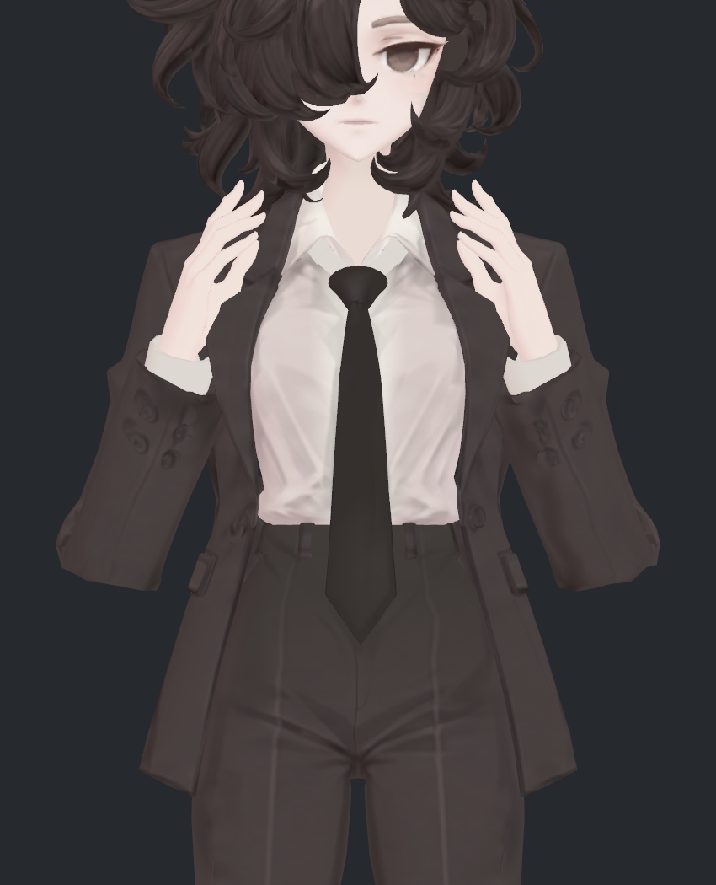
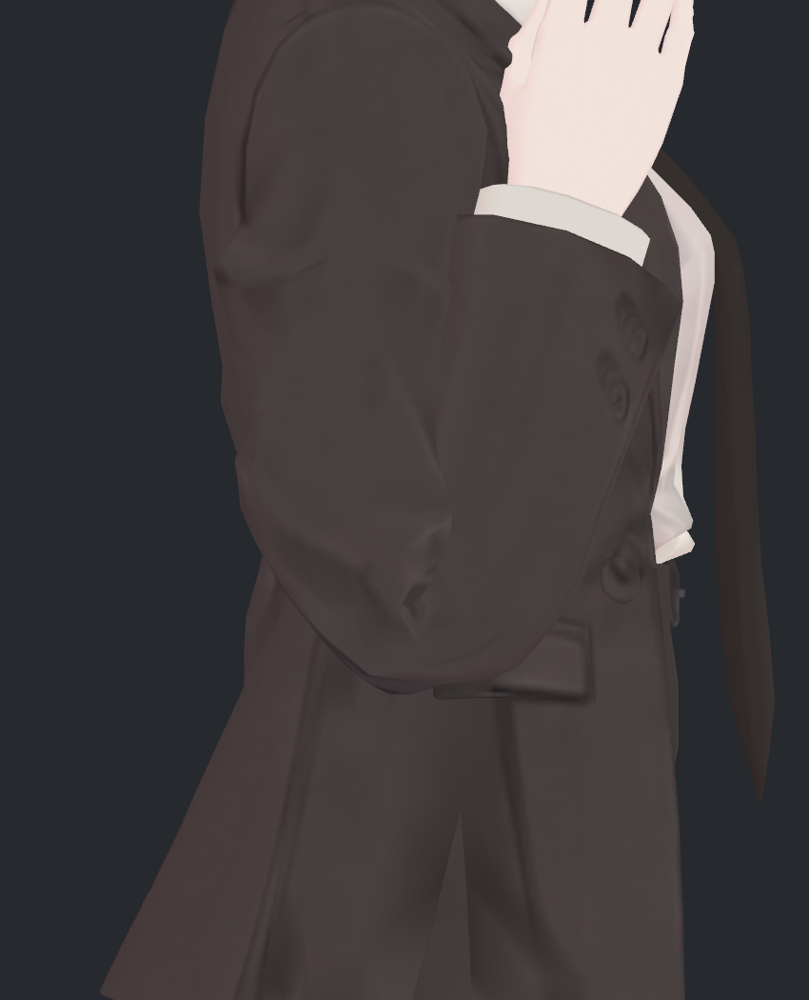
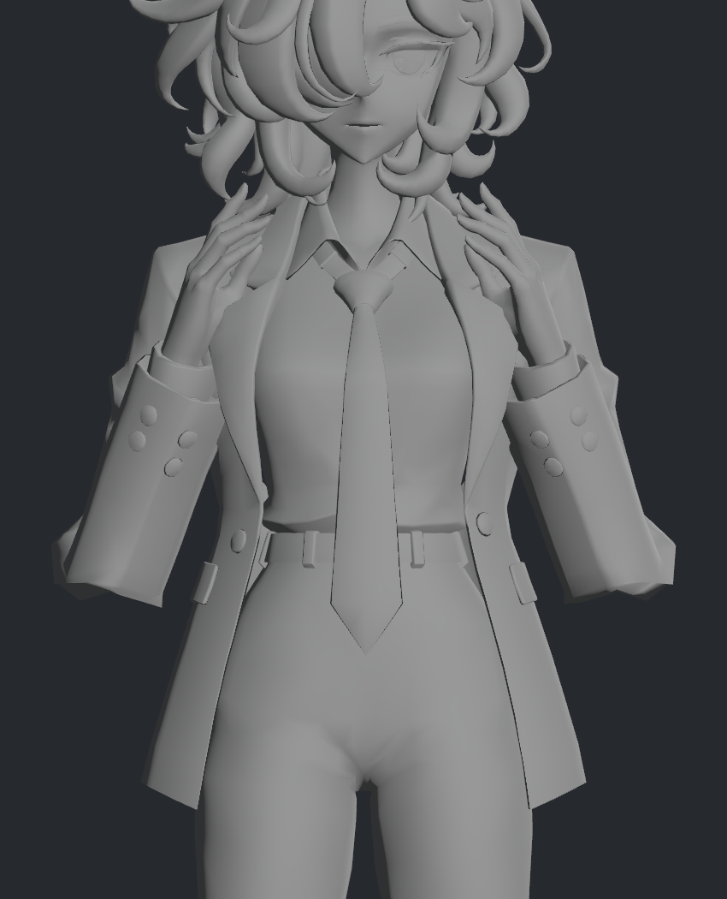
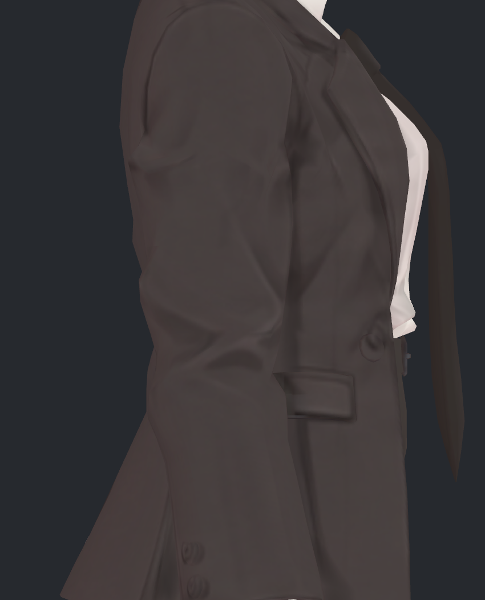
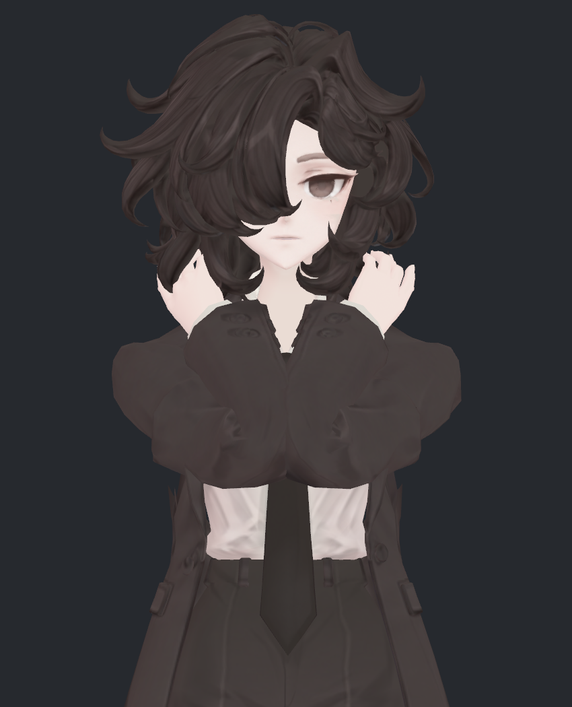

> **기록 시점 안내:** 아래는 해당 단계 당시의 보고서입니다. 후속 결정은 [최신 상태](../../STATUS.md)를 기준으로 읽어주세요. 모델·원본 텍스처·검증 원시 데이터는 이 문서 공유본에 포함하지 않습니다.

# v327 · 팔꿈치 정면 각짐 수정 검수

2026-09-12 · v324 사본에서 팔꿈치만 수정한 **후속 검수 후보**입니다. 사용자가 지적한 깊은 굽힘의 네모난 돌출을 줄였습니다. 중립 형상·텍스처·UV·본·웨이트는 그대로이고, 깊게 굽힐 때만 기존 소매 정점을 움직이는 보정 2개를 추가했습니다. Blender와 실제 Unity SDK 자동 구동을 확인했습니다. 전체 관절 완료나 사용자 최종 채택을 뜻하지 않습니다.

## 먼저 전후 사진

같은 팔 자세·카메라·원래 재질입니다. 최대 입력의 실제 팔꿈치 각도는 약 **164.54°**입니다. 합성으로 모양을 바꾼 그림이 아니라 실제 Unity에서 구동된 정점과 노멀의 렌더입니다.

| 정면 · 수정 전 v324 | 정면 · 수정 후 v327 |
|---|---|
|  |  |

팔꿈치 아래가 바깥으로 튀어나온 사각형처럼 보이던 부분을 완화했습니다. 아래 선과 측면을 더 둥글게 연결했지만, 소매의 원래 주름과 작은 면 경계까지 모두 없애지는 않았습니다.

| 측면 · 수정 전 | 측면 · 수정 후 |
|---|---|
|  |  |

측면에서 보이던 아래쪽 뾰족한 끝도 줄었습니다. 안쪽의 진한 접힘은 남습니다. 사진을 직접 열어 정면 아래 모서리, 측면 두께, 소매 단추와 원래 주름을 비교했습니다.

| 회색 재질 · 수정 전 | 회색 재질 · 수정 후 |
|---|---|
|  |  |

회색 재질에서도 외곽 변화가 보입니다. 텍스처를 흐리게 하거나 색으로 가린 수정은 아닙니다.

## 원인과 반영한 수정

v326에서 무조명 외곽에도 각짐이 있고, 기존 보정 키는 0이라는 점을 확인했습니다. 이번에는 실제 스키닝 행렬로 같은 자세를 재현한 뒤 웨이트, 절반 회전 보조본 분담, 원래 좌표 완화, 기존 면 분할을 각각 비교했습니다. 절반 회전 보조본은 실제로 작동하고 있었습니다. 단순히 보조본을 켜거나 웨이트를 넓히는 것으로는 정면 모서리가 없어지지 않았습니다.

실험 결과, 현재 면 배치와 선형 스키닝으로 깊게 접힌 소매가 특정 모서리와 안쪽 주름에 변형을 집중하는 것이 핵심으로 판단했습니다. 원래 좌표를 매끈하게 만드는 방법은 팔을 내렸을 때 두께까지 줄여 제외했습니다. **원래 좌표를 유지하고, 깊은 굽힘에서 필요한 표면 변화만 별도 보정으로 추가**했습니다.

| 항목 | 최종 사본 |
|---|---|
| 바뀌는 부분 | Coat의 기존 255정점: 왼124·오른131. Unity UV/노멀 분리점 기준525점 |
| 추가 키 | `V327_ElbowRound_L`, `V327_ElbowRound_R` |
| 시작·상한 | 실제 굽힘135°부터 점진 적용,164.54°에서 최대75% |
| 원형 보존 | 기존 좌표·면·UV·노멀·웨이트·129본·기존26키 그대로 |
| 새 메시/새 본/컷 | 최종 사본에 없음 |
| 측정용 구성 | 기존 위팔/전완에 점4개, Unity에서는 Sender2·Receiver2 |
| 텍스처 | v324 그대로. 무릎·손가락도 수정하지 않음 |

보정 목표는 접힌 표면을 국소 완화하고, 단순 완화로 줄어드는 외곽량을 보상해서 만들었습니다. 실제 스키닝의 역변환으로 기존 정점의 키 델타를 계산했습니다. 몸과 새로 겹치던 정점은 제외하고, 적용 강도를75%로 제한했습니다. [시도와 미채택 이유](v327_ATTEMPTS.md)에 상세히 기록했습니다.

## 평소 모양과 부피

| 중립 측면 · 수정 전 | 중립 측면 · 수정 후 |
|---|---|
|  |  |

중립·60°·90°·120°에서는 새 키가 모두0입니다. 원래 소매를 항상 깎아 놓는 방식이 아닙니다. 저장 전 기하·UV·노멀·웨이트·기존 키가 정확히 같은지 확인했고, Blender 저장본을 다시 열어 중립 새 키0을 확인했습니다.

같은 자세의 수정 전후에서, 위팔55–85%와 전완15–50% 구간을 각각7개 닫힌 단면으로 적분했습니다.

| 실제 굽힘 | 위팔 구간 외곽 부피 · 전 대비 | 전완 구간 외곽 부피 · 전 대비 |
|---|---:|---:|
| 중립·90°·120° | 약100% | 약100% |
| 150.02° | 좌101.53% / 우102.09% | 좌98.65% / 우96.98% |
| 164.54° | 좌102.96% / 우104.08% | 좌103.19% / 우104.22% |

따라서 **부피가 완전히 동일하다는 결과는 아닙니다.** 최대 굽힘에서는 선택 구간이 약3–4% 커졌고,150° 오른 전완은 약3% 줄었습니다. 중립 두께를10–20% 잃었던 미채택 좌표 수정과 구분합니다. 이 수치는 선택한 소매 외곽 구간이며 몸의 해부학적 부피·옷감 부피·전체 팔꿈치 부피가 아닙니다. 자기 교차가 있는 접힘은 단일한 닫힌 고체로 해석할 수도 없습니다.

초기 목표의 부호 있는 표면 변화량을0으로 맞췄어도, 최종 제외 정점과75% 적용 후에는 좌+0.875cm³·우−0.121cm³입니다. 이 값만으로 부피 보존 합격이라고 판정하지 않았습니다. 최대 굽힘에서 실제 표면 이동은 좌14.38mm·우10.17mm 이내입니다.

## 실제 자동 구동과 검사 범위

Unity에서는 두 측정점 간 거리로 굽힘을 감지합니다. VRChat Contact Proximity가 가까운 Sender에 따라 Animator float를0–1로 쓰는 공식 동작을 사용했고, 본인 접촉만 허용했습니다. 두 기존 본에 붙인 점 사이의 거리를 각도별 BlendTree로 변환해 키를 구동합니다. 전달 아바타에 별도 사용자 C# 런타임 스크립트는 추가하지 않았습니다. [VRChat Contacts 공식 문서](https://creators.vrchat.com/common-components/contacts/)

Blender에는 같은 거리 기준의 드라이버가 있습니다. 현재 저장된 scale1에서 측정한 실제 굽힘과 키 값의 오차는 최대0.00000135였습니다. Blender 입력 회전값과 실제 관절각은 원래 자세 오프셋 때문에 다르므로 실제 각도로 검사했습니다. 임의 전역 스케일이나 두 프로그램 전체 리그의 완전한 동등성을 검증한 것은 아닙니다.

| 검사 | 결과 |
|---|---|
| 정적 비교 | 중립·회복, 굽힘5단계×팔 앞으로3방향, 전완 비틀림2방향×3단계:23기록 |
| 연속 자동 구동 | 181표본+최종 중립 복귀, 정적 포함 총205기록 |
| 실제 SDK의 키 값 | 120°:0%,150°:38.13%,164.54°:약75% |
| 비정상 수치 | 205기록 두 메시 모두 유한값 |
| 연속 후 중립 복귀 | Coat·BodyHair 모두 정점 오차0mm |
| BodyHair 전후 | 정적23기록 모두 정점 오차0mm |
| 변경부 소매–몸 새 교차 | 정적23기록에서0쌍 |
| 원본 파일·사용자 장면 | 원본4파일 해시 유지, Unity 장면 경로·dirty·루트 유지 |

바람0·PhysBone 비활성 조건의 관절 검사입니다. 연속 동작 전체의 모든 면 교차를 검사한 결과나 자연스러운 손 회피 경로 검증이 아닙니다. 실제 VRChat 클라이언트·업로드·멀티플레이 검증도 아직 하지 않았습니다. 기본 비교 캐시 일부는 선형 스키닝 재현값이며, 실제 Unity 대비 정밀도 차이의 상한은0.000275mm입니다. 이를 정확한 비트 일치로 표현하지 않았습니다.

## 남은 접힘과 강하게 모으는 자세

| 강한 앞으로 모으기 · 전 | 강한 앞으로 모으기 · 후 |
|---|---|
|  |  |

이 자세는 앞뒤 팔 채널을−0.65로 주고 깊게 굽힌 스트레스 입력입니다. 손·팔 간격을 맞춘 일상 동작이 아니며 양쪽 소매끼리의 겹침과 안쪽 뭉침이 남습니다. 이번 보정으로 그 문제까지 해결했다고 판단하지 않습니다.

비공면 교차 검사에서 최대 굽힘 비교는 변경부 관련121쌍→91쌍이지만, 기존과 다른 새 소매 자기 교차34쌍도 있습니다. 강한 모으기는430→386쌍, 새 자기 교차116쌍입니다. 새 소매–몸 교차는0쌍입니다. 검사 문턱은 교차 선분0.05mm이며, 쌍 수는 관통 깊이나 눈에 보이는 결함 개수가 아닙니다. **총수 감소를 접촉 문제 전체 해결로 해석하지 않습니다.**

이번 전달 판단은 요청한 **정면 외곽 각짐 개선과 중립 원형 보존**입니다. 안쪽의 작은 주름·소매 자기 교차·강한 모으기 자세는 잔여 항목으로 유지합니다.

## 전달 파일

- Blender: `bianca_v327_ELBOW_REVIEW.blend`
- Unity: `Bianca_v327_ElbowReview.unitypackage` 안의 `Bianca_v327_ElbowReview.prefab`
- [시도·문제·미채택 사유](v327_ATTEMPTS.md)
- 원형 기준: v324. 실험 NPZ와 원시 검증 자료는 작업 저장소의 이 버전 폴더에 보존합니다.

문서 공유 저장소에는 이 보고서와 선별 그림만 올립니다. 원본 모델을 덮어쓰지 않았으며, 사용자 최종 검수 전까지 별도 후보로 유지합니다.
