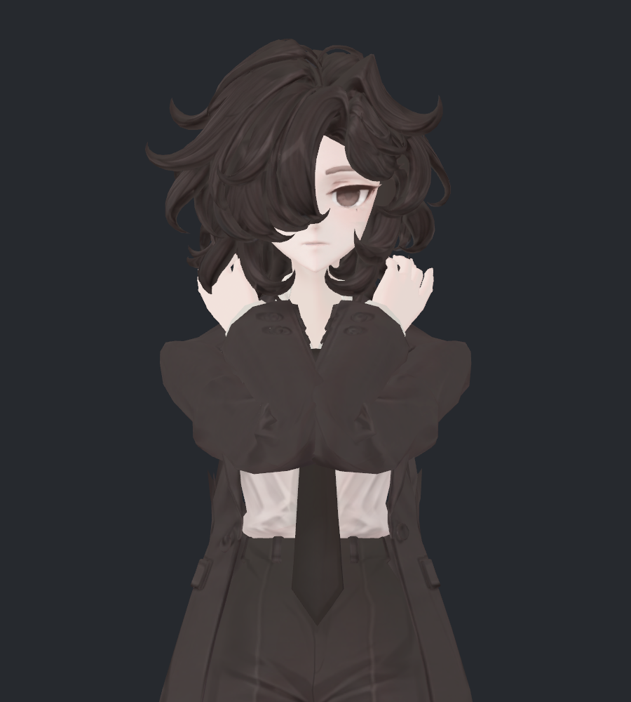
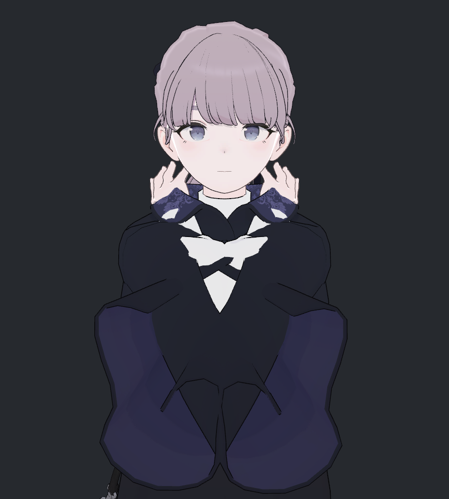
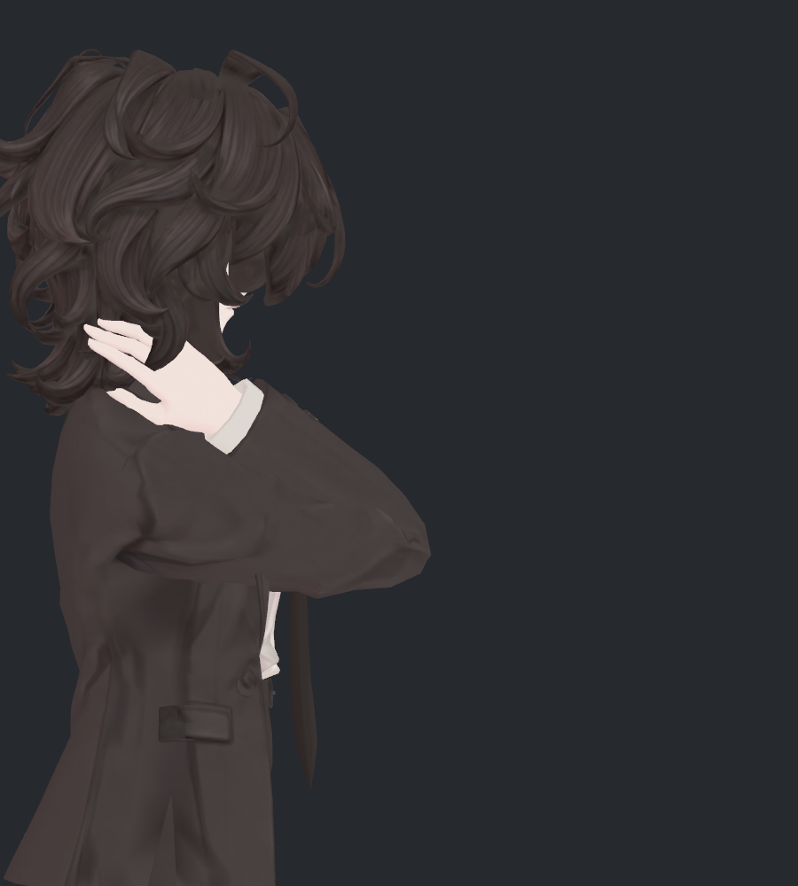
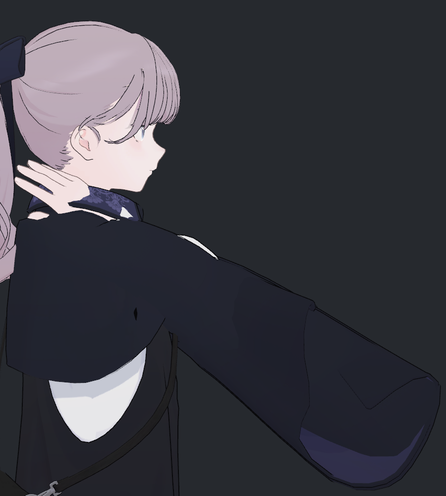
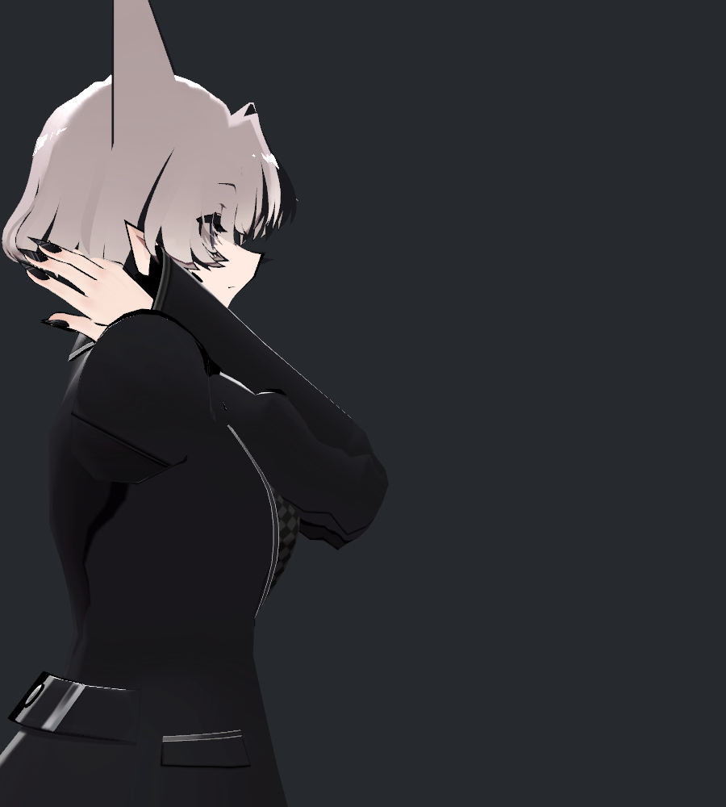
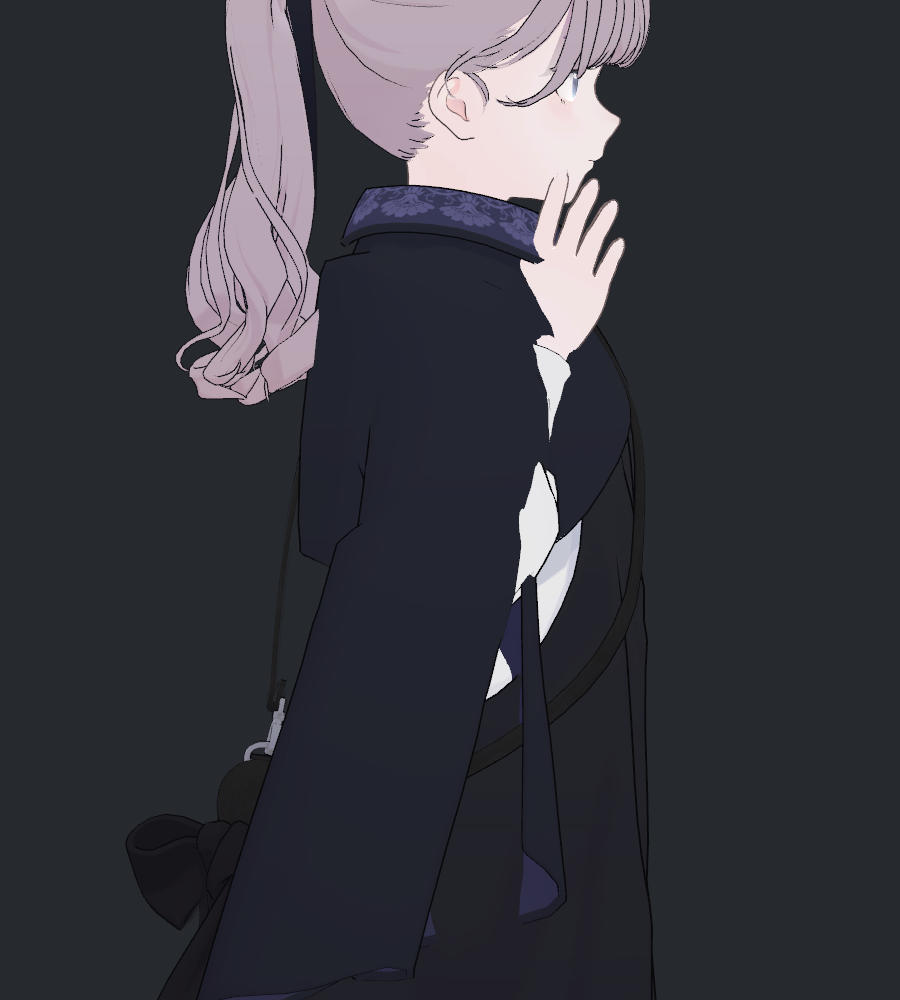
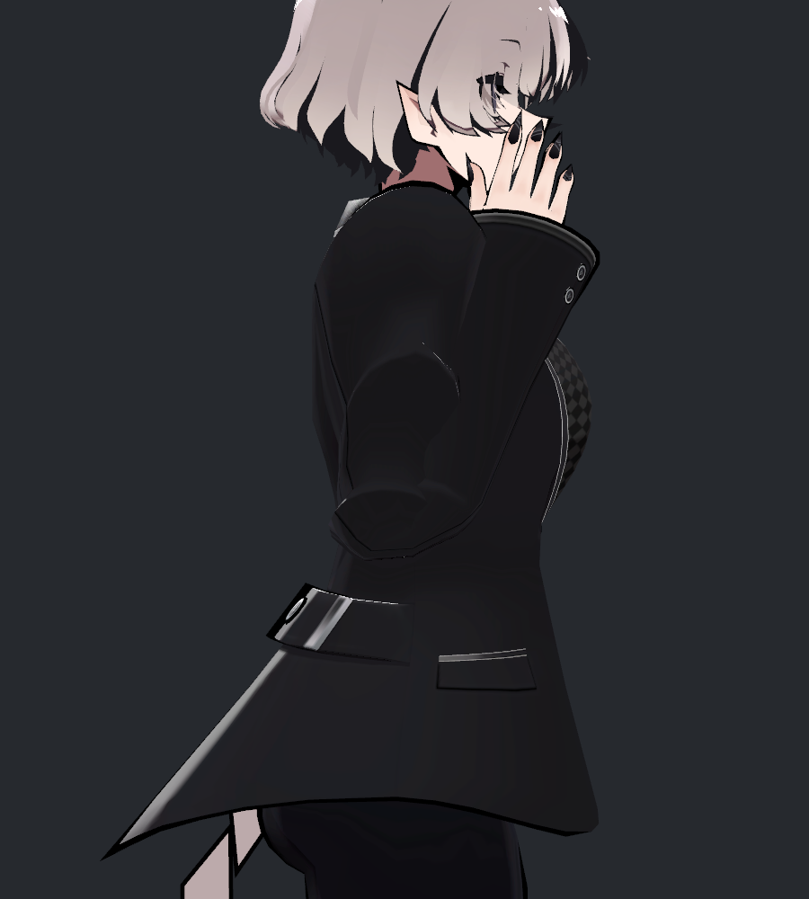

> **기록 시점 안내:** 아래는 해당 단계 당시의 보고서입니다. 후속 결정은 [최신 상태](../../STATUS.md)를 기준으로 읽어주세요. 모델·원본 텍스처·검증 원시 데이터는 이 문서 공유본에 포함하지 않습니다.

# v328 · 다른 모델의 강한 팔 모으기 확인

2026-09-12 · **읽기 전용 비교**입니다. 비앙카와 참고 모델을 새로 수정하거나 저장하지 않았습니다.

사용자는 v327의 측면이 너무 둥글고 수정 전이 더 좋다고 판단했습니다. v327 채택을 보류하고 **수정 전 측면을 외형 기준으로 보존**합니다. 이번에는 기존에 확보한 Lapwing의 볼레로 차림과 SiuSiu의 블레이저 차림에서 강하게 앞으로 모을 때 무엇이 보이는지 확인했습니다.

**두 참고 모델도 이 자세에서 소매가 가까워지고 접힘·겹침이 커집니다. 다만 그 모양은 비앙카와 같지 않습니다.** Lapwing은 넓고 열린 소매가 포개지고, SiuSiu는 소매가 얼굴·가슴 가까이 모이며 팔꿈치 안쪽과 겨드랑이 접힘이 커집니다. 이것만으로 비앙카의 관통을 정상이라고 판정하거나, 다른 모델의 실사용 품질에 결함이 있다고 결론 내리지 않습니다.

## 같은 방향으로 맞춘 강한 모으기

비앙카 v327 검사 중 원형 v324의 강한 모으기(index15)를 비교 목표로 사용했습니다. 위팔·전완의 실제 월드 방향을 맞췄고, 세 모델의 실제 팔꿈치 굽힘은 좌우 모두 약164.54°입니다. 사진은 각 모델의 **원래 재질**을 사용한 Unity 렌더로 직접 열어 확인했습니다.

| 비앙카 · 수정 전 v324 | Lapwing · 볼레로 | SiuSiu · 블레이저 |
|---|---|---|
|  |  |  |

- **비앙카:** 중앙에서 소매가 맞닿고, 안쪽에 뾰족하게 뭉친 주름이 보입니다.
- **Lapwing:** 소매 폭과 열린 구조가 커서 전완 앞과 중앙의 옷 부분이 포개집니다. 넓은 소매 윤곽 자체를 관절 오류로 분류하면 안 됩니다.
- **SiuSiu:** 두 전완 소매가 얼굴·가슴 앞으로 크게 모이고, 안쪽은 조밀하게 접힙니다. 어깨 아래의 틈과 겹쳐 보이는 영역도 있습니다. 이 진단 조건만으로 실제 제품의 관통 깊이나 원인을 확정하지 않았습니다.

| 비앙카 · 측면 | Lapwing · 측면 | SiuSiu · 측면 |
|---|---|---|
|  |  |  |

측면에서도 옷 디자인 차이가 큽니다. Lapwing의 넓은 소매는 아래로 열린 공간을 남기고, SiuSiu의 블레이저는 팔꿈치 근처에 작은 접힘이 집중됩니다. 같은 둥근 모양으로 통일하는 것이 목표일 필요는 없습니다.

## 앞으로 모으지 않고 깊게 굽혔을 때

팔꿈치 굽힘은164.54°로 유지하고 위팔 방향만 원래 깊은 굽힘(index5)에 맞췄습니다.

| Lapwing · 단순 깊은 굽힘 | SiuSiu · 단순 깊은 굽힘 |
|---|---|
|  |  |

단순히 팔꿈치를 깊게 접는 것과, 그 상태에서 양팔을 강하게 앞으로 모으는 것은 서로 다른 검사입니다. 후자는 어깨·몸통과의 공간까지 줄어들어 소매끼리의 접촉이 더 커집니다. 참고 모델도 이 두 조건에서 보이는 모습이 달랐습니다.

## 비교를 공정하게 하기 위해 확인한 것

같은 Humanoid 입력만 준 비교도 먼저 수행했습니다. 그러나 실제 각도는 같지 않았습니다.

| 모델 | 같은 입력의 실제 굽힘 | 방향을 맞춘 실제 굽힘 |
|---|---:|---:|
| 비앙카 v324 |164.54°|164.54°|
| Lapwing |161.97°|164.54°|
| SiuSiu |155.95°|164.54°|

방향을 맞춘 뒤 위팔·전완 방향 오차는 측정 정밀도에서0°였습니다. 팔 길이·어깨 폭·소매 폭은 원본 그대로라 손 위치까지 같지는 않습니다. 손목 중심 사이 거리/양 위팔 시작점 간격은 비앙카0.606, Lapwing0.693, SiuSiu0.753입니다. **이 비율은 표면 간격이나 충돌 검사가 아닙니다.** 손·소매 두께, 비틀림, 관절 기준축과 몸 비례까지 동일하게 만든 비교도 아닙니다.

모델3개×조건3개를 확인했고, 정면·측면을 회색 진단 재질과 원래 재질로 각각 렌더해36장을 생성했습니다. 그중 보고서에 싣는 원래 재질8장은 모두 개별로 열어 확인했습니다. 회색 재질은 원래 셰이더의 투명도·가림 처리를 바꾸어 얼굴·소매에 실제 착용 모습과 다른 틈이 보일 수 있어, 최종 비교에는 원래 재질을 사용했습니다.

검사는 임시 Play Mode 객체에서 Animator·PhysBone을 끄고 자세를 고정했으며, 원래 constraint는 유지했습니다. 따라서 **VRChat IK·원래 FX 자동 보정·물리까지 포함한 실사용 검사가 아닙니다.** 이번에는 삼각형 교차 전수 검사나 손 회피 동작 생성도 하지 않았습니다. 프리팹3개와 비앙카 Blender2파일의 전후 해시가 같고, Unity 사용자 장면의 경로·dirty·루트도 유지했습니다.

## 이번 판단

강한 모으기를 “어떤 모델에서도 편하게 성립해야 하는 일상 자세”로 두고 접촉0을 강제하는 것은 적절한 품질 기준이 아닙니다. 옷 디자인·체형·입력 범위를 함께 봐야 합니다. 그렇다고 비앙카의 뾰족한 접힘이나 명백한 관통을 다른 모델에서도 보인다는 이유로 합격 처리하지 않습니다.

이번 요청대로 **비교만 완료**했습니다. v327의 둥근 측면은 채택 보류이며, 다음 수정이 필요해도 수정 전 측면의 소매 형태를 보호하면서 정면의 특정 모서리만 다루는 방향을 우선해야 합니다. 이번에 그 수정은 실행하지 않았습니다.
