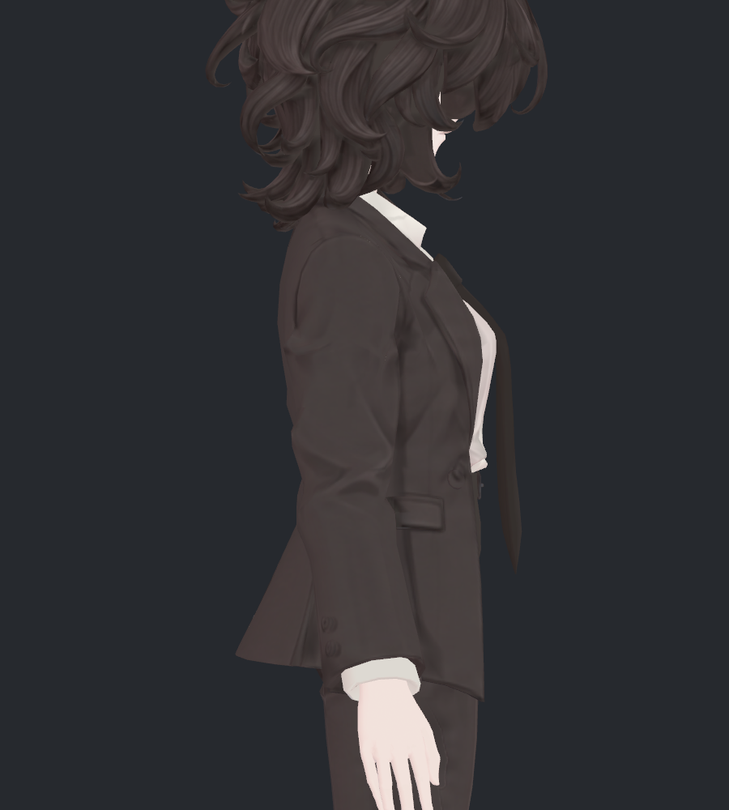
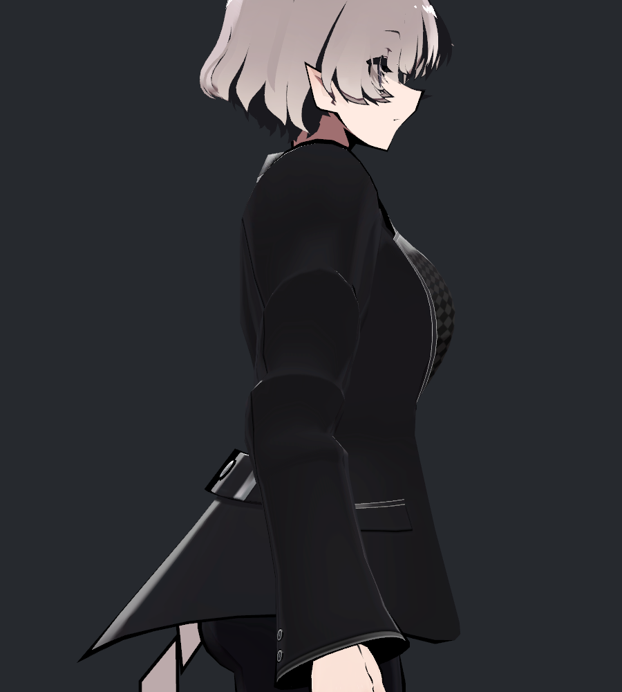
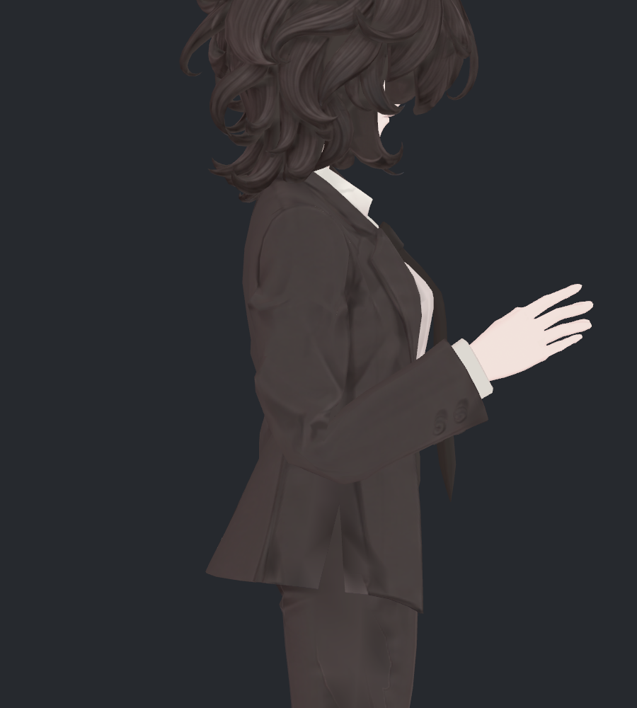
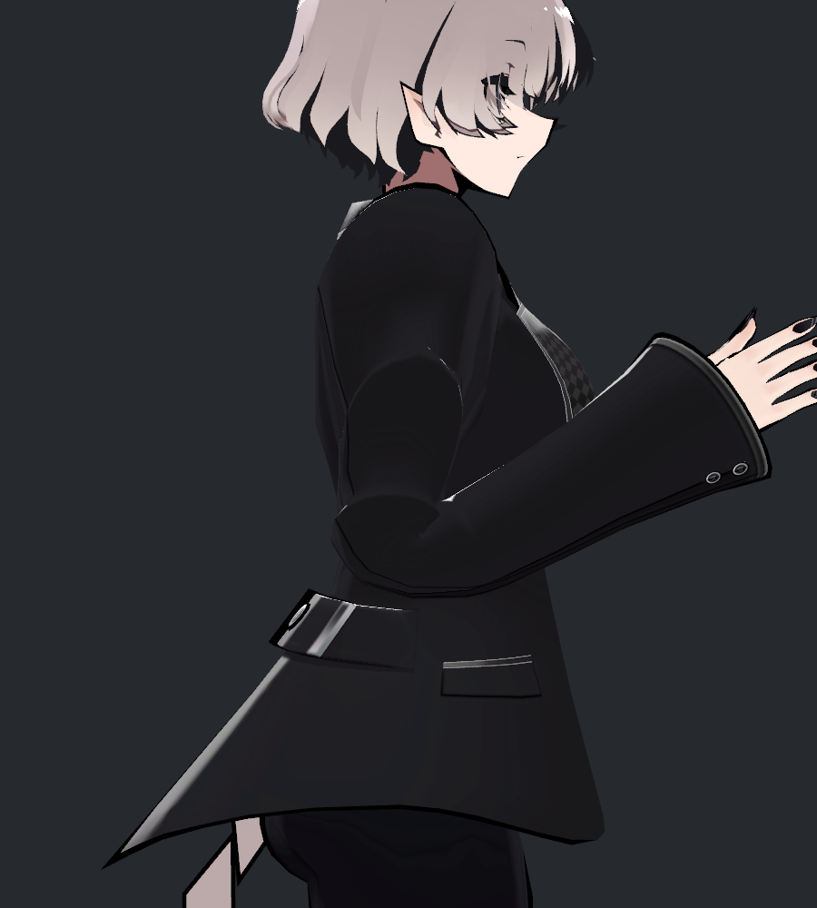
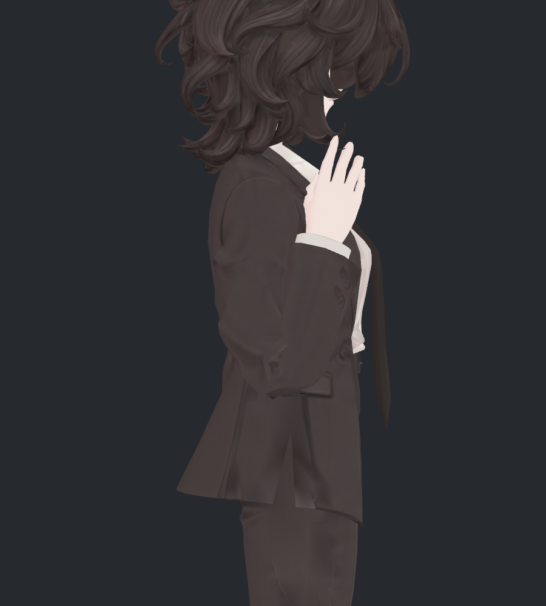
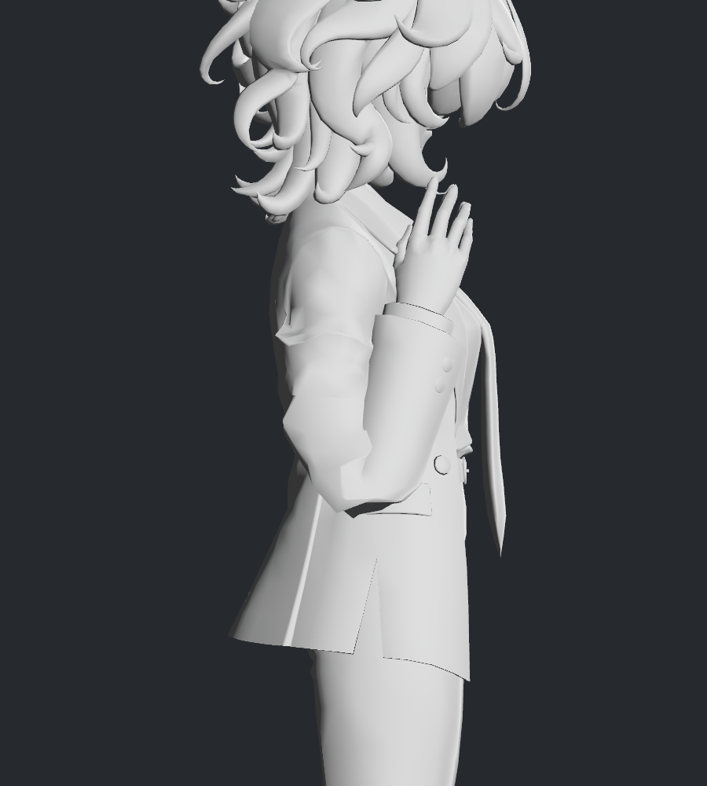
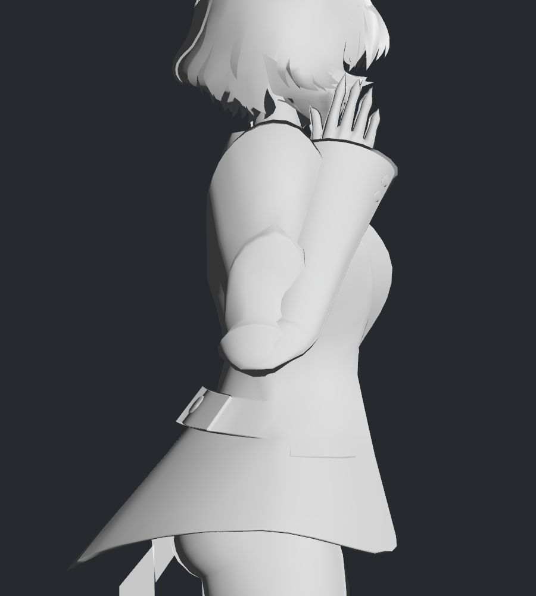

> **기록 시점 안내:** 아래는 해당 단계 당시의 보고서입니다. 후속 결정은 [최신 상태](../../STATUS.md)를 기준으로 읽어주세요. 모델·원본 텍스처·검증 원시 데이터는 이 문서 공유본에 포함하지 않습니다.

# v329 · SiuSiu를 기준으로 팔꿈치 차이 조사

2026-09-12 · **조사만 수행했고 모델은 수정하지 않았습니다.** 사용자는 SiuSiu의 모습이 더 예쁘다고 판단했습니다. 참고하는 대상은 v328에서 실제로 본 **SiuSiu Kisekae 구성의 블레이저**입니다. Standard 구성 전체의 특성으로 일반화하지 않습니다. 비앙카는 v327의 둥근 보정을 제외한 v324를 비교 기준으로 사용했습니다.

가장 큰 차이는 **긴 전완 소매의 비례, 접힘의 분배, 정리된 명암**입니다. SiuSiu도 각진 접힘이 있지만 소매 전체가 둥근 덩어리로 부풀지 않고 긴 전완 형태를 유지합니다. 더 많은 보조본이나 더 촘촘한 메시만으로 설명되지 않았습니다. 아래 수치는 확인한 차이이고, 각 항목이 미관에 기여하는 비중까지 분리한 인과 실험은 아닙니다.

## 1. 먼저 소매 비례가 다릅니다

| 중립 · 비앙카 v324 | 중립 · SiuSiu |
|---|---|
|  |  |

| 측정 · 왼팔 | 비앙카 | SiuSiu |
|---|---:|---:|
| 실제 전완 본 길이 / 위팔 본 길이 |0.692|1.077|
| 중립 전완 소매의 평균 최소 폭 / 전완 본 길이 |약0.450|약0.344|

전완 본은 팔꿈치에서 손목까지, 위팔 본은 어깨에서 팔꿈치까지의 실제 Humanoid 위치로 측정했습니다. 소매 폭은 전완15–50% 구간의7개 닫힌 단면에서 구한 최소 폭의 평균입니다. 사람의 표준 신체 비율을 주장하는 수치가 아닙니다.

SiuSiu는 전완이 위팔만큼 길고, 그 길이에 비해 소매가 상대적으로 가늘게 이어집니다. 비앙카는 전완이 짧아서 같은 깊이로 굽혀도 팔꿈치 아래가 짧고 넓은 덩어리처럼 보이기 쉽습니다. **이 비례 차이는 외형 차이에 기여할 가능성이 큰 요소**입니다. 하지만 팔 길이를 바꾸면 캐릭터 비례와 손 위치까지 달라지므로 이번 조사에서 조절하지 않았습니다.

## 2. 둥글기보다 긴 선과 접힘의 위치가 다릅니다

| 약120° · 비앙카 | 약120° · SiuSiu |
|---|---|
|  |  |

| 약164.54° · 비앙카 | 약164.54° · SiuSiu |
|---|---|
|  |  |

SiuSiu는 깊게 접어도 소매 끝까지 이어지는 긴 선이 남고, 팔꿈치 부근에는 작은 각과 접힌 면이 남습니다. 비앙카는 원래 조형 주름과 깊은 굽힘이 같은 짧은 구간에 겹쳐 끝이 튀어나오거나 작은 면이 뭉친 모습이 두드러집니다.

따라서 SiuSiu를 참고한다고 해서 팔꿈치를 반원처럼 둥글게 만들 필요는 없습니다. v327의 광범위한 둥근 보정은 사용자가 선호한 옷의 접힘을 약하게 만들었습니다. **수정 전 측면의 접힌 실루엣을 보호하면서 정면의 특정 돌출만 다루는 방향**이 이 피드백에 더 맞습니다. 이 방향은 제안이며 이번에 적용하지 않았습니다.

## 3. 웨이트는 다르지만 보조본 추가가 정답은 아닙니다

각 팔꿈치에서 위팔 길이의45% 반경 안에 있고, 해당 팔 웨이트가60%를 넘는 원래 정점을 골랐습니다. 위치가 같은 UV/노멀 분리점은1µm 기준으로 묶어 평균을 냈습니다. 아래 값은 왼팔 표본 평균이며 개별 정점에 적용할 목표 비율이 아닙니다.

| 웨이트 분담 | 비앙카 | SiuSiu |
|---|---:|---:|
| 위팔 본 |54.3%|24.7%|
| 전완 본 |37.8%|32.3%|
| 팔꿈치 절반 회전 보조 |7.1%|해당 본 없음|
| 위팔 Twist 본 |해당 본 없음|43.0%|
| 나머지 작은 분담 |약0.8%|반올림 범위0%|

**Twist라는 이름만 보고 이번 굽힘을43% 부드럽게 분산한다고 해석하면 안 됩니다.** SiuSiu Kisekae의 위팔/전완 Twist는 각각 원래 위팔/전완의 자식이며, 이번6자세에서 부모 대비 로컬 회전 변화가0°였습니다. 이 구성에는 팔 Twist 제약이 없었습니다. 따라서 이 굽힘에서는 위팔 Twist가 별도 절반 회전으로 작동한 것이 아니라 부모를 따라 움직였습니다. 위팔과 위팔 Twist를 합치면 선택 표본의 약67.7%가 위팔 계열입니다.

비앙카의 팔꿈치 보조는 실제로 움직였고 중립 대비 최대 로컬 회전 변화는 약77.83°였습니다. **보조본이 없는 쪽이 더 선호되는 사진을 만들었다는 점에서, 본 수를 늘리는 접근부터 시작할 근거는 없습니다.** 어느 웨이트가 더 예쁜지 확정하려면 같은 비앙카 형상에서 분담만 바꾼 대조군이 필요합니다. v327에서 보조 분담만 크게 올린 실험은 이미 원하는 결과를 얻지 못했습니다.

현재 SiuSiu 블레이저의 키는 `blazer_open`, `breasts_small`, `breasts_big` 3개이며 이번6자세에서 모두0이었습니다. 팔꿈치 전용 키로 이 모양을 만든 것은 아닙니다. 비앙카의 기존26키도 이번 검사에서는 모두0입니다. 다른 SiuSiu 구성·옷·FX에 관한 포괄적 주장으로 확대하지 않습니다.

## 4. 면 수보다 형태를 배분하는 방식이 중요합니다

| 같은 비율의 팔꿈치 구역 | 비앙카 좌/우 | SiuSiu 좌/우 |
|---|---:|---:|
| 위치를 묶은 표본 정점 |134 /134|157 /174|
| 구역 안 삼각형 중심 수 |267 /267|296 /330|
| 모서리 길이 중앙값 / 위팔 길이 · 좌 |0.098|0.106|
| 모서리 길이95백분위 / 위팔 길이 · 좌 |0.157|0.215|

SiuSiu 쪽에 이 구역의 표본 정점·면은 조금 더 있지만, 모서리 길이가 일괄적으로 짧지는 않습니다. **훨씬 촘촘해서 예쁜 것이라고 설명할 수 없습니다.** 단순 면 분할만으로 정면 모서리를 해결하려던 v327 미채택 결과와도 일치합니다.

이번 면 배치 검사는 실제 Unity 삼각형의 지역 밀도·길이 분포까지입니다. 원래 사각면 루프를 완전히 복원해 연결 방향 하나씩의 기여도를 판정한 것은 아닙니다. SiuSiu의 면이나 웨이트를 비앙카에 복사하지 않았습니다.

## 5. 색과 음영도 접힘의 인상에 기여합니다

| 같은 회색 재질 · 비앙카 | 같은 회색 재질 · SiuSiu |
|---|---|
|  |  |

회색으로 보아도 SiuSiu에는 팔꿈치와 위팔의 면 경계·각진 접힘이 있습니다. 원래 검은 재질에서는 긴 소매 면의 명암이 비교적 단순해 보이고, 비앙카에는 원래 텍스처 주름과 기하 접힘이 함께 강조됩니다. 원래 재질 사진에서 느낀 차이의 일부는 이 조합으로 설명할 수 있습니다.

다만 이번에는 두 원래 셰이더의 모든 설정을 동일화하거나 텍스처와 노멀의 기여율을 각각 수치로 분리하지 않았습니다. 회색 재질은 원래 투명도·아웃라인·가림 처리를 바꾸므로, 얼굴이나 얇은 경계의 표시 이상을 실제 모델 결함으로 해석하지 않습니다. 검토 대상은 소매입니다. 디테일을 전부 지우거나 텍스처를 흐리게 만드는 방향으로 되돌아가지 않습니다.

## 6. 더 예쁜 모델이 부피 수치도 항상 더 좋은 것은 아닙니다

각 모델 자신의 중립을100%로 두고, 위팔55–85%·전완15–50% 구간을 각각7개 닫힌 단면으로 적분했습니다. 해당 팔 웨이트가 우세한 옷 삼각형만 사용했습니다.

| 왼팔 구간 외곽 부피 | 비앙카 위팔 / 전완 | SiuSiu 위팔 / 전완 |
|---|---:|---:|
|150°|97.5% /96.0%|93.1% /89.1%|
|164.54°|97.1% /106.1%|90.3% /98.2%|
|강한 앞으로 모으기|94.3% /107.4%|90.0% /105.6%|

SiuSiu가 선호되는 사진에서도 특정 구간은 더 줄었습니다. 부피를 무조건100%로 되돌리거나 늘리는 것이 미관 개선과 같지는 않습니다. 반대로 이 수치를 비앙카도 그만큼 눌러도 된다는 허용치로 쓰지 않습니다. 선택 구간의 외곽량이며 팔꿈치 전체·몸의 해부학적 부피·옷감 부피가 아니고, 교차하는 표면을 단일 고체로 취급한 값도 아닙니다.

## 적용한다면 무엇을 먼저 볼 것인가

1. **현재 비앙카 비례를 유지하는 범위:** 수정 전 측면과 소매 두께를 기준으로 고정하고, 정면에서 튀는 국소 모서리·안쪽 주름 집중만 기존 정점과 웨이트로 비교합니다. v327처럼 넓게 부풀리는 보정은 기준으로 삼지 않습니다.
2. **SiuSiu에서 참고할 모양:** 손목까지 이어지는 소매 면을 길고 단정하게 읽히도록 하고, 주름을 모두 없애기보다 접히는 지점의 작은 각을 남깁니다. 텍스처 디테일 복원 결정을 유지합니다.
3. **별도로 판단해야 할 큰 차이:** 전완 길이·손목 위치·소매 비례는 캐릭터 외형을 바꿉니다. 이번 조사 결과만으로 본 위치나 팔 길이를 자동 수정하지 않습니다.

이번에는 비앙카와 SiuSiu 각각 중립/90/120/150/164.54도/강한 모으기, 총12자세를 실제 Unity에서 비교했습니다. 위팔·전완 목표 방향 오차는 최대0.020°였습니다. 손목 위치·전완 비틀림까지 완전히 동일한 실험은 아니며 Animator·PhysBone은 끄고 원래 constraint를 유지했습니다. VRChat 클라이언트·FX·물리 검증과 교차 전수 검사는 이번 범위가 아닙니다.

모델 파일·프리팹·사용자 장면은 보존했습니다. 원시 참고 모델 정점·웨이트 배열은 로컬 진단 캐시에만 남겼고, 보고서에는 요약과 직접 확인한8장의 그림만 사용했습니다. v327 채택 보류와 수정 전 측면 기준을 유지합니다.
