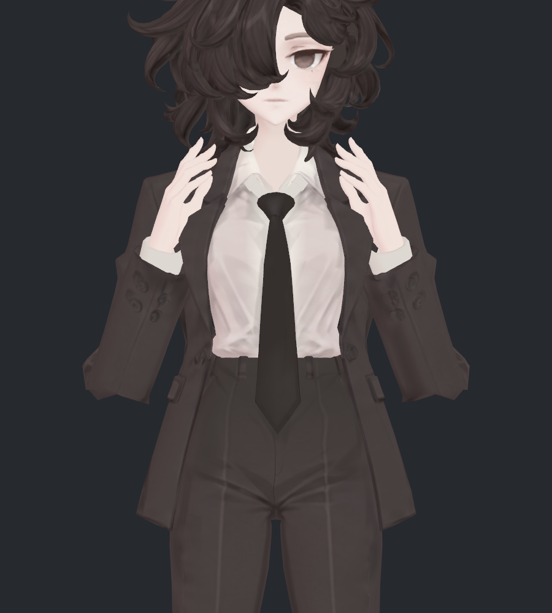
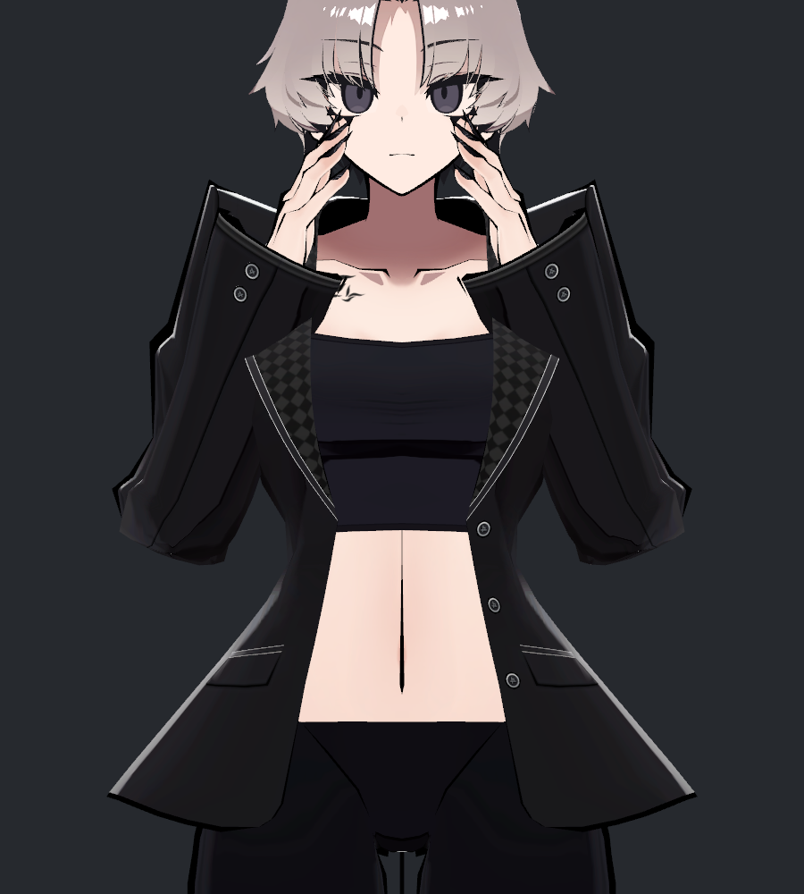
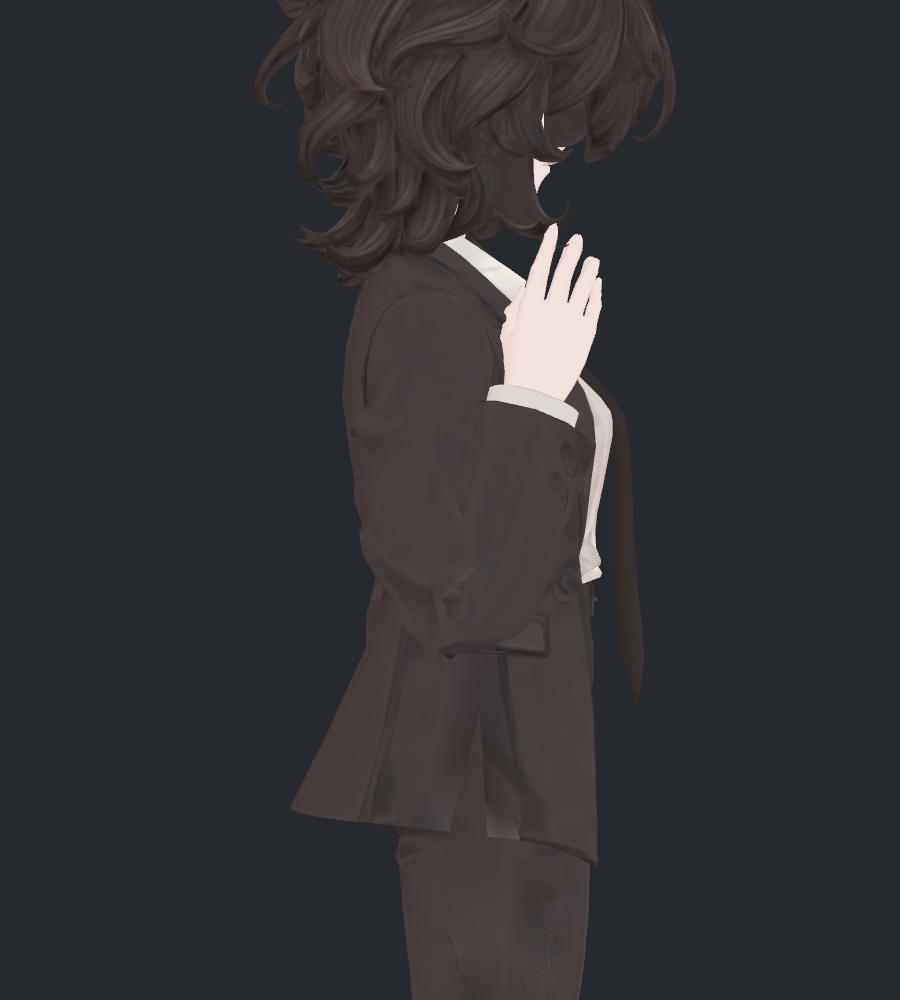
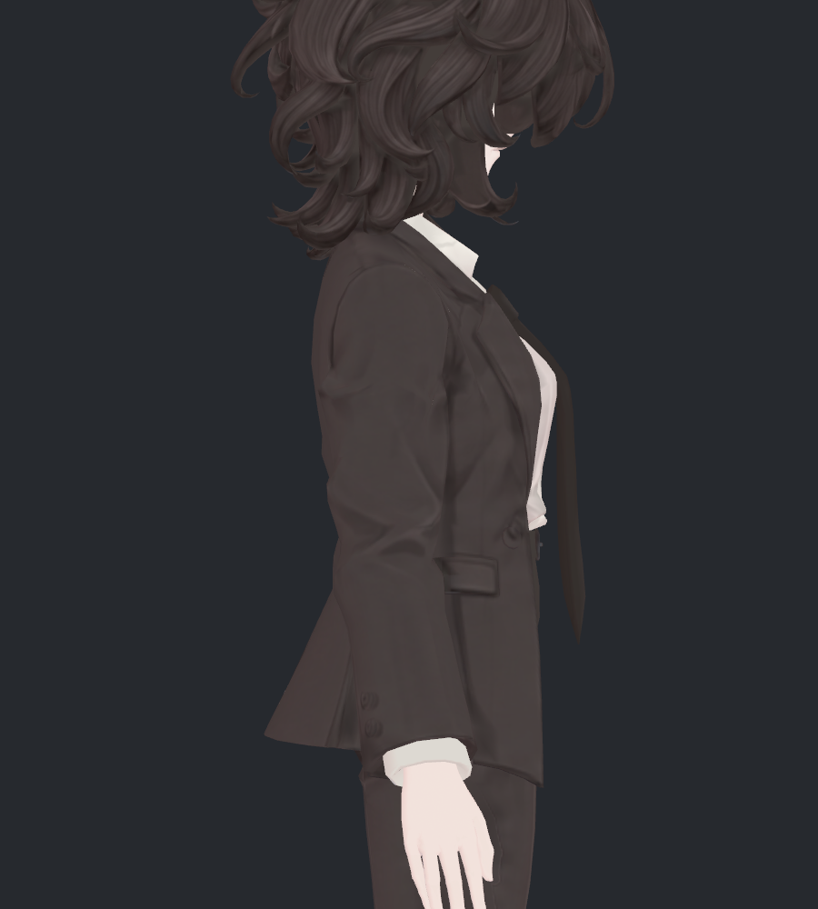
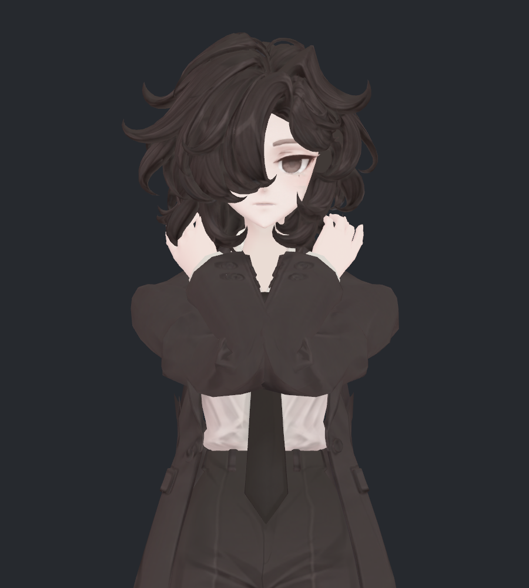
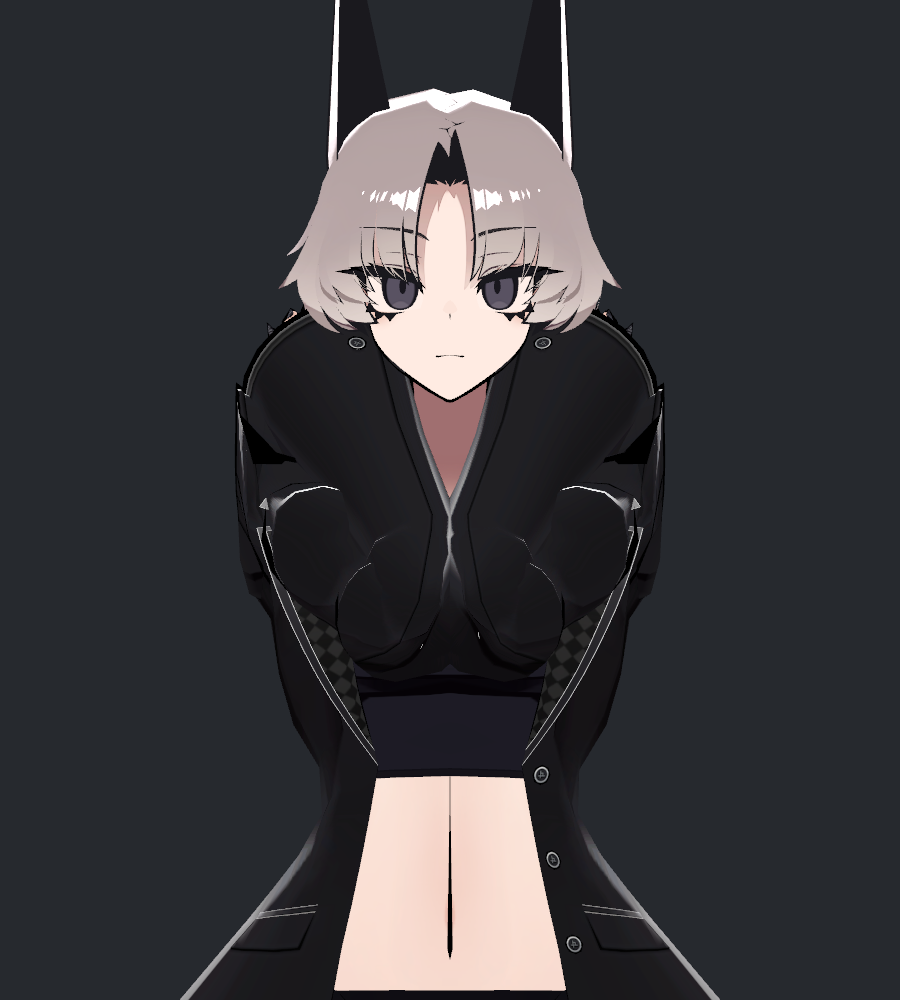

> **기록 시점 안내:** 아래는 해당 단계 당시의 보고서입니다. 후속 결정은 [최신 상태](../../STATUS.md)를 기준으로 읽어주세요. 모델·원본 텍스처·검증 원시 데이터는 이 문서 공유본에 포함하지 않습니다.

# v330 · 팔꿈치 수정 전 / 수정 후 / SiuSiu 비교

v324 사본에서 **깊게 굽힐 때 정면 바깥으로 튀는 모서리만 작게 줄였습니다.** 사용자가 선호한 수정 전 측면을 기준으로 삼았고, v327처럼 팔꿈치 전체를 둥글게 만드는 보정은 적용하지 않았습니다. 사진 12장을 직접 열어 검수했습니다.

결과는 **작은 개선을 확인할 검수 후보**입니다. SiuSiu처럼 길고 정리된 소매 형태를 재현한 완성본은 아닙니다. 정면 아래쪽의 각과 안쪽 접힘은 남았고, 최대 굽힘에 비틀림을 더한 두 자세에서는 새 자기 교차도 발견했습니다. 원형 v324와 보류 중인 v327은 각각 보존했습니다.

## 1. 깊은 굽힘 · 정면

| 수정 전 · v324 | 수정 후 · v330 두 번째 사본 | 참고 · SiuSiu Kisekae 블레이저 |
|---|---|---|
|  |  |  |

팔꿈치 양쪽 바깥에 튀는 작은 모서리가 안으로 들어갔습니다. 소매 아래쪽의 접힌 면과 긴 전완 쪽 면을 남겨, 둥근 덩어리로 바뀌는 정도를 제한했습니다. 다만 **전체적으로 달라 보일 만큼 큰 수정은 아닙니다.** SiuSiu는 팔꿈치 아래에서 손목까지 이어지는 면이 더 길고, 주름과 테두리 명암도 다르게 배치되어 있습니다.

## 2. 같은 깊은 굽힘 · 측면

| 수정 전 · v324 | 수정 후 · v330 두 번째 사본 | 참고 · SiuSiu |
|---|---|---|
|  |  |  |

이번 기준 자세의 측면 투영 좌표 변화는 최대 **0.000239mm**로, 비교 캐시의 수치 오차 범위 0.000275mm 이내입니다. 외곽은 사실상 유지했고, 노멀 보정에 따른 작은 음영 차이는 있습니다. 이전 v327에서 지적한 둥글게 부푼 아래 윤곽은 다시 넣지 않았습니다.

이 보장은 **위 사진의 기준 자세**에 대한 것입니다. 팔 방향까지 바꾸면 보정도 본을 따라 회전하므로 모든 자세에서 측면이 동일한 것은 아닙니다. 150° 굽힘에서는 측면 좌표 변화 최대 0.121mm, 강하게 모은 자세에서는 3.092mm입니다.

## 3. 팔을 내린 상태 · 원형 유지

| 수정 전 · v324 | 수정 후 · v330 두 번째 사본 | 참고 · SiuSiu |
|---|---|---|
|  |  |  |

중립에서 새 보정키는 0입니다. 원래 소매 주름, 팔 길이, 몸 비례, 텍스처를 유지했습니다. SiuSiu의 소매가 길게 읽히는 차이는 이 상태에서도 보이며, 이번 국소 수정으로 없애지 않았습니다.

## 4. 강하게 앞으로 모으기 · 잔여 문제 확인

| 수정 전 · v324 | 수정 후 · v330 두 번째 사본 | 참고 · SiuSiu |
|---|---|---|
|  |  |  |

안쪽으로 몰리는 접힘은 여전히 남았습니다. 이 자세의 검사 대상 소매 삼각형 자기 교차는 **전후 35쌍, 새 쌍 0**입니다. 교차가 없거나 모양이 완성됐다는 뜻은 아닙니다. 손 회피 경로와 자연스러운 양팔 간격을 맞추지 않은 스트레스 입력이며, 손/팔의 겹침 자체를 이번 팔꿈치 표면 수정으로 해결한 것은 아닙니다.

SiuSiu 역시 이 입력에서 소매가 크게 접혀 겹쳐 보입니다. 서로 다른 옷 구조와 팔 비례를 같은 본 방향으로 비교한 것이므로, 이 한 장을 참고 제품의 일반적인 품질 판정으로 사용하지 않습니다.

## 5. SiuSiu를 보고 반영한 것과 남긴 차이

| 항목 | v324 → v330 | SiuSiu와 남은 차이 |
|---|---|---|
| 정면 바깥 모서리 | 기존 정점만 이용해 작게 안쪽으로 이동 | SiuSiu처럼 전체 접힘 흐름을 재배치하지는 않음 |
| 측면 아래 윤곽 | 기준 깊은 굽힘에서 기존 투영 형태 유지 | SiuSiu의 긴 전완 소매와 다른 원형 주름 유지 |
| 팔 길이 | 본 길이·정점 기본 좌표 그대로 | 전완/위팔 본 길이 비율 비앙카 0.692, SiuSiu 1.077 |
| 변형 분담 | 기존 웨이트와 절반 회전 보조본 유지 | SiuSiu의 UpperTwist 웨이트 구조를 복사하지 않음 |
| 디테일 | 기존 UV·텍스처·노멀·26개 키 유지 | 재질 테두리, 긴 봉제선과 주름 배치 차이는 남음 |

v329 조사 (공유본 미포함: `v329_SIUSIU_COMPARISON.md`)에서 확인했듯이 SiuSiu가 보기 좋은 이유를 본 수나 부피 하나로 설명할 수 없습니다. 이번에는 원형 비례를 보존하면서 적용 가능한 **정면 모서리의 작은 변화**만 시험했습니다. SiuSiu의 메시·정점·웨이트를 이식하지 않았습니다.

## 6. 실제 수정 범위와 자동 구동

- 기존 Blender 정점 **36개, 좌우 각18개**에 두 보정키를 추가했습니다. Unity에서는 UV/노멀 경계 분리 때문에 **75개, 좌36/우39개**입니다.
- 기준 깊은 굽힘의 실제 최대 이동은 왼쪽 **4.021mm**, 오른쪽 **3.868mm**입니다. 원래 좌표 자체를 이동한 것이 아니라 해당 자세에서만 보정키가 작동합니다.
- 기존 면·UV·노멀·웨이트·129본·26개 키를 보존했습니다. 새 메시, 리메시, 컷, 새 본은 없습니다. 측정용 오브젝트 4개와 보정키 2개만 추가했습니다.
- 실제 굽힘 **135°부터 시작, 약164.54°에서 최대**입니다. 새 키 최대100%는 이번 작은 보정 전체를 뜻하며, 이전 v327 보정100%를 뜻하지 않습니다. 120°에서는0, 150°에서는 약50.84%입니다.
- Unity 실제 SDK Contacts와 Animator 구동으로 확인했습니다. 아바타용 사용자 런타임 C#은 추가하지 않았습니다. Blender는 현재 scale1 장면의 거리 드라이버로 검수했습니다. VRChat 클라이언트에서는 아직 검증하지 않았습니다.

## 7. 검증 결과와 부피

| 확인 | 결과와 범위 |
|---|---|
| 실제 Unity 구동 | 정적23 + 연속181 + 최종복귀1 = 205기록, 모든 좌표 유한 |
| 중립 복귀 | Coat와 BodyHair 최대 오차0mm |
| 비대상 몸·머리 | 23개 전후 정적 비교에서 BodyHair 좌표 변화0mm |
| 원형 | Blender 재로드와 Unity 생성 검사에서 기존 기하/UV/노멀/웨이트/키 보존, 원본5파일 해시 동일 |
| 소매–몸 | 변경 관련 삼각형의 정적23자세 검사에서 새 교차0쌍 |
| 소매 자기 교차 | 일반 깊은 굽힘과 강한 모으기는 새 쌍0. 비틀림을 더한 두 최대 굽힘 자세에서 총4개 새 쌍 |
| 사용자 장면 | 장면 경로·dirty 상태·루트 오브젝트 보존 |

새 자기 교차의 교차선 길이는 **0.160–0.725mm**입니다. 이는 관통 깊이가 아닙니다. 음의 비틀림에서는 32→32쌍이지만3쌍 교체, 양의 비틀림에서는32→33쌍으로1쌍 추가됐습니다. 따라서 **접촉 회귀가 없는 최종본으로 채택하지 않았습니다.** 검사 기준은 변경 관련 면, 공유 정점 제외, 비공면 교차선0.05mm 초과이며 전체 아바타와 모든 연속 프레임의 교차 전수 검사가 아닙니다.

부피는 같은 본 구간의 닫힌 단면으로 따로 비교했습니다. 위팔55–85%, 전완15–50%의 선택 구간에서 깊은 굽힘의 수정 후/전 구간 부피 비율은 **0.999594–0.999981**, 변화는0.041% 미만입니다. 그러나 이 구간이 국소 모서리 전체를 포함하지는 않습니다. 같은 표면의 방향을 이용한 별도 변화 부피는 좌우 약 **−1.61/−1.63cm³**이므로, 전체 부피를 정확히 보존했다고 표현할 수 없습니다. 접힌 자기 교차 표면은 하나의 고체 부피로 확정하기 어렵습니다.

## 8. 시도한 방법과 미채택 이유

| 시도 | 실제 결과 | 판정 |
|---|---|---|
| 이전 v327 · 넓은 팔꿈치 보정 | 정면을 완화하지만 측면이 너무 둥글다는 사용자 피드백 | 보류 유지. 최종 v330에 전체 보정 미통합 |
| v330 첫 사본 · 측면 투영 유지, 바깥/안쪽 함께 보정 | 255개 기존 정점, 기준 최대6.56/4.88mm. 강한 모으기에서 해당 검사 영역 자기 교차430→443쌍, 새83쌍 | 안쪽 접촉 회귀 때문에 미채택. 데이터와 사진은 작업 폴더 trials에 보존 |
| v330 두 번째 사본 · 바깥쪽으로 범위 축소 | 안쪽 절반 보정을0으로 줄이고 바깥18점씩만 사용. 일반 모으기 새 교차0, 측면 기준 유지. 비틀림 복합 자세에는4새쌍 잔여 | 이번 사진/모델 전달 후보. 사용자 최종 채택·전체 해결 아님 |
| 팔 길이 변경 / SiuSiu 웨이트 복사 | 이번에는 실행하지 않음 | 원래 비례·구조를 바꾸는 영향을 분리하기 위해 보류 |

첫 사본과 두 번째 사본은 변경 면 범위가 다르므로 교차 총수를 서로 직접 비교해 개선율을 계산하지 않습니다. 각 사본과 동일한 영역의 원형을 비교했습니다. 두 번째 사본은 기준 자세의 보정 방향을 측면에 나타나지 않는 방향으로 제한한 뒤, 실제 스키닝의 역변환으로 기존 정점의 키를 계산했습니다. 표면을 새로 생성하거나 렌더 이미지를 가공한 것이 아닙니다.

## 9. 전달과 판정

작업 버전 폴더의 `bianca_v330_ELBOW_REVIEW.blend`와 `Bianca_v330_ElbowReview.unitypackage`가 두 번째 사본입니다. Unity prefab은 `Assets/BiancaElbowProfileReview/Bianca_v330_ElbowReview.prefab`입니다. 재현 코드·원시 검사·첫 시도는 작업 저장소에, 이 문서와 직접 확인한 사진은 문서 저장소에도 선별 공유합니다.

**정면 모서리를 이 정도로 작게 다듬는 방향과 수정 전 측면 유지가 적절한지 확인하기 위한 결과**입니다. 비틀림 교차와 안쪽 접힘이 남아 전체 관절 마무리로 간주하지 않습니다. 무릎과 손가락을 그대로 두라는 결정도 유지합니다.

### 사진 비교 조건

비앙카 수정 전은 v324 원형 자세 캐시, 수정 후는 별도 v330 prefab의 실제 SDK 구동 결과입니다. 전후 같은 카메라·원래 재질·조명으로 렌더했습니다. 일부 전 캐시는 실제 본 행렬 기반 LBS 재계산이며 원래 스냅숏과 최대0.000275mm 오차 이내입니다. SiuSiu 사진4장은 v329의 실제 Unity 렌더를 재사용하고 이번에 다시 직접 열어 확인했습니다. 본 방향을 맞춘 비교로 v329의 최대 방향 오차는0.020°이며, 팔 길이·팔 비틀림·손 위치까지 동일하지 않습니다. 카메라는 위팔 본 길이를 기준으로 크기를 맞췄습니다.

SiuSiu는 Animator/PhysBone을 끄고 원래 제약은 유지한 정적 참고, 비앙카 수정 후는 새 Contacts 구동을 확인한 스냅숏입니다. 상이한 검수 조건이며 실제 VRChat의 참고 모델 자동 구동을 재현했다는 뜻은 아닙니다.
