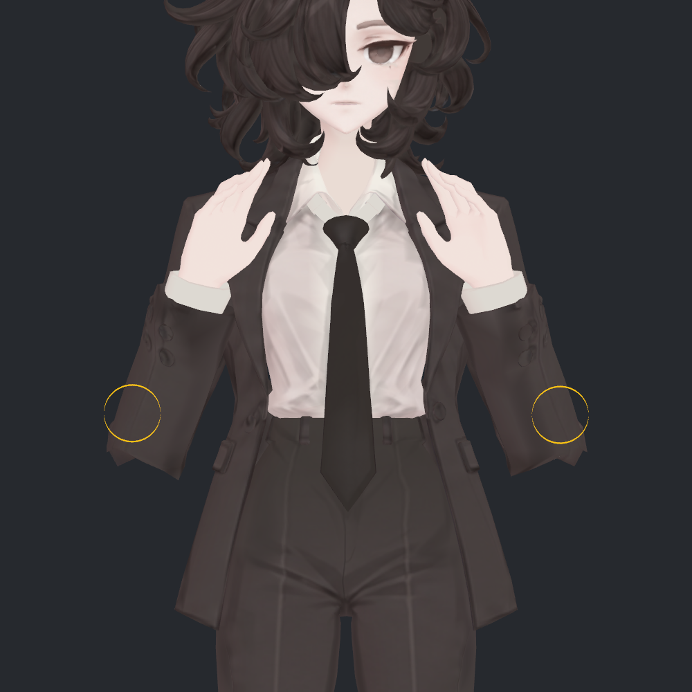
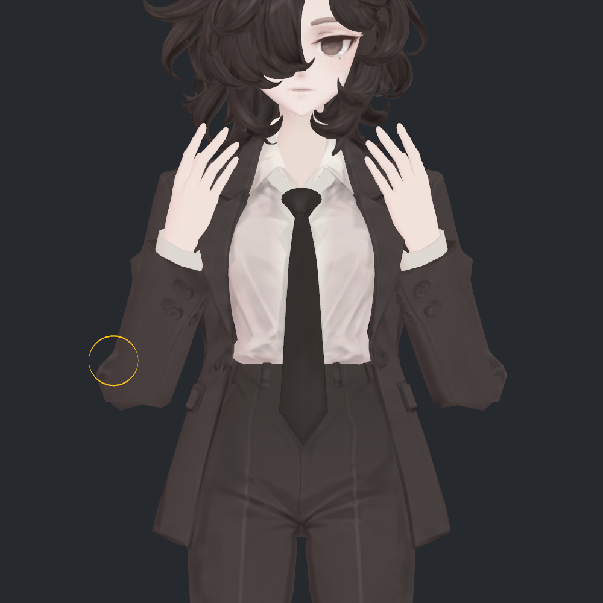
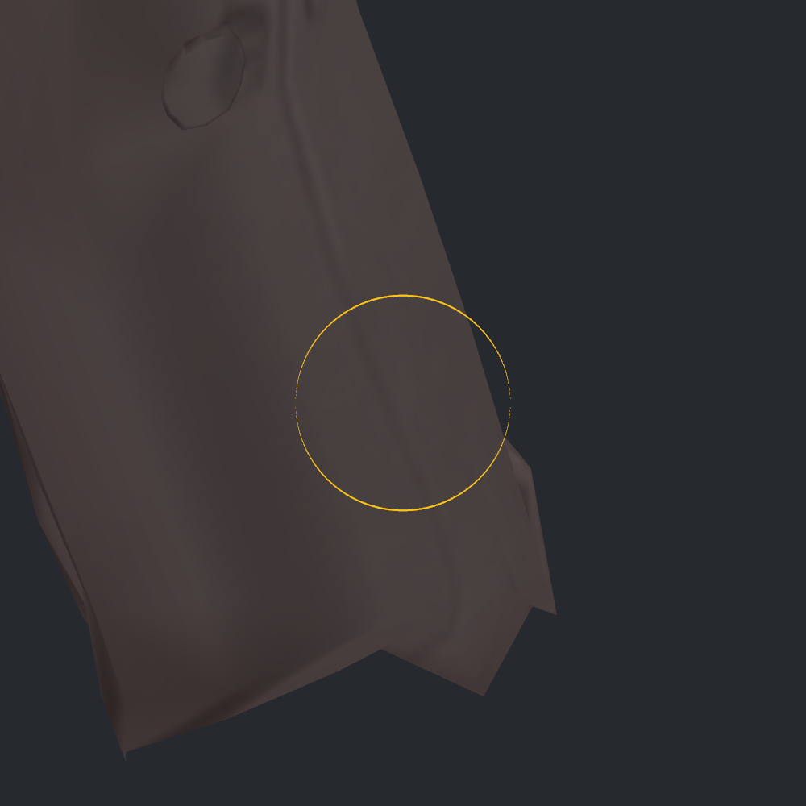
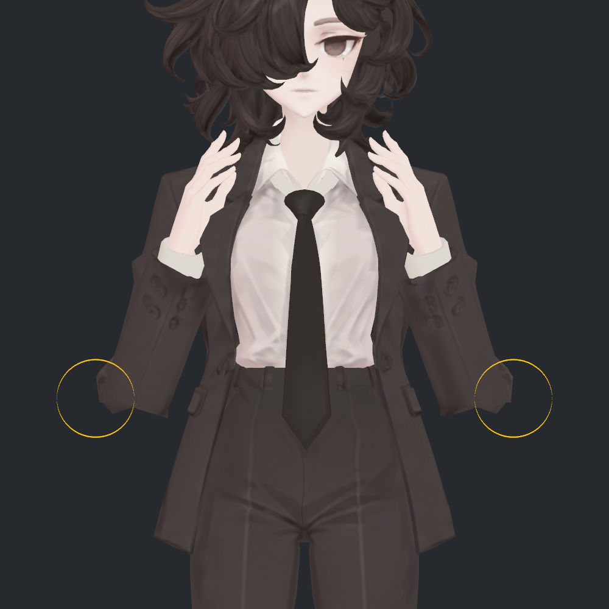
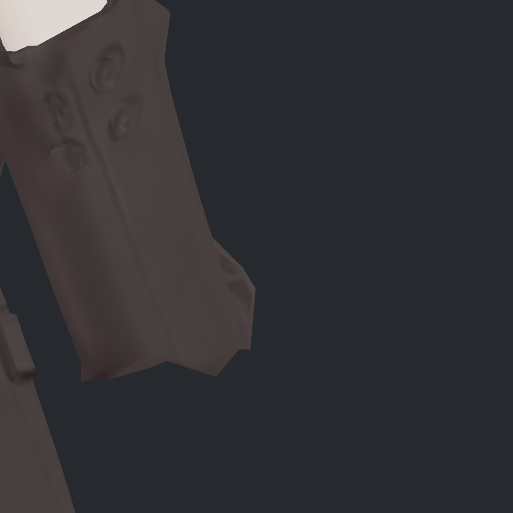
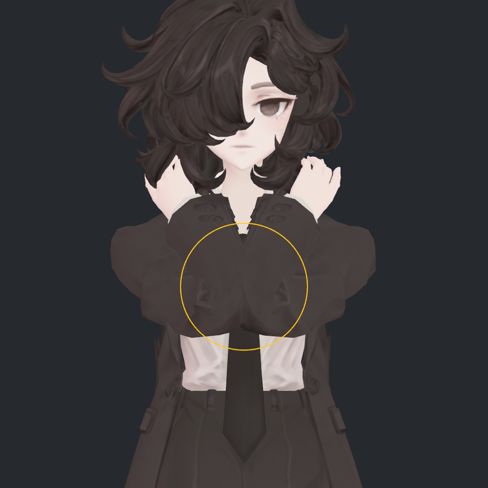
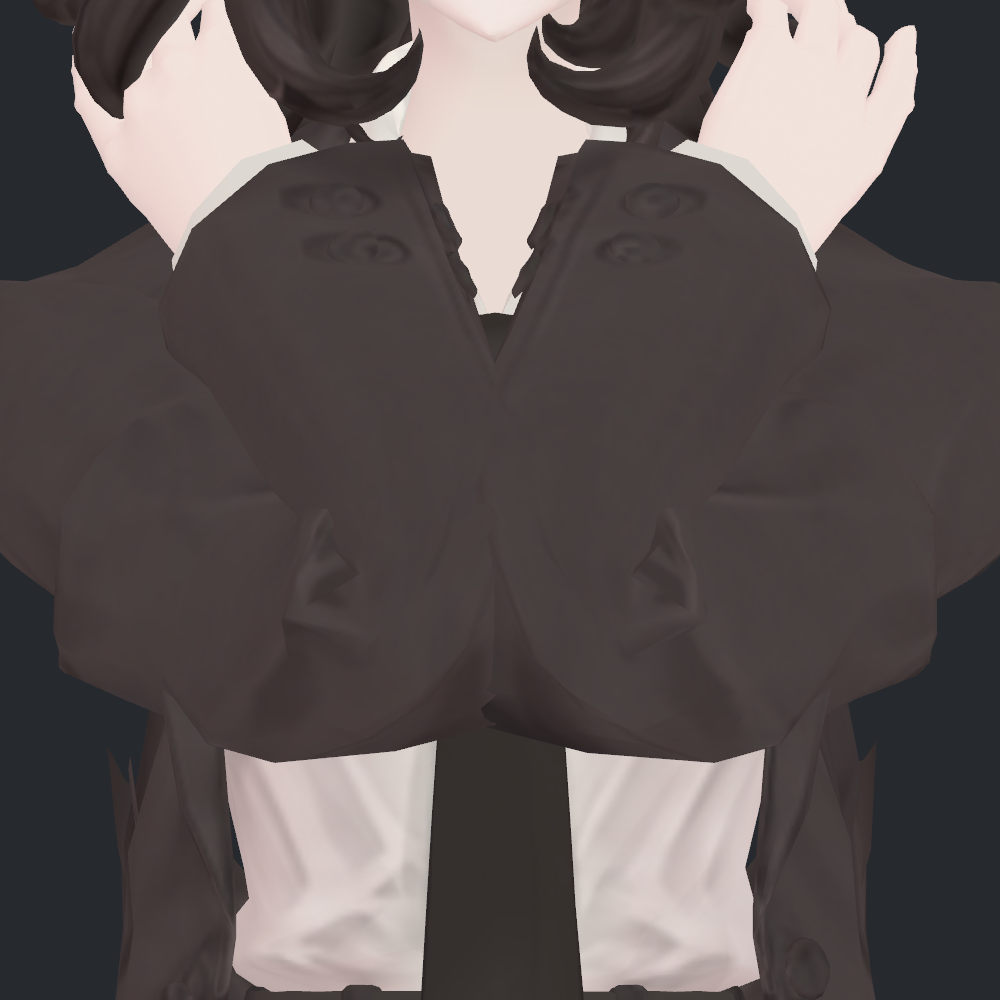

> **기록 시점 안내:** 아래는 해당 단계 당시의 보고서입니다. 후속 결정은 [최신 상태](../../STATUS.md)를 기준으로 읽어주세요. 모델·원본 텍스처·검증 원시 데이터는 이 문서 공유본에 포함하지 않습니다.

# v331 · 제가 문제로 보는 팔꿈치 세 부분

현재 **v330 두 번째 사본**에서 제가 문제로 판단한 부분만 모았습니다. 위치 표시 사진7장과 실제 삼각형 진단 그림2장을 새로 렌더하고 모두 직접 확인했습니다. 이번에는 모델을 수정하지 않았습니다.

| 번호 | 봐야 할 부분 | 제가 문제로 보는 이유 | 성격 / 우선순위 |
|---|---|---|---|
| ① | 최대 굽힘에 비틀림을 더했을 때, 팔꿈치 접힌 면 내부 | v330 보정으로 이전에 없던 작은 면 교차가 생김 | 확인된 기하 악화 / 1순위 |
| ② | 정면에서 양쪽 팔꿈치 아래·바깥 윤곽 | 모서리는 줄었지만 접힘 끝이 각진 덩어리로 읽힘 | 제 시각적 판단 / 2순위 |
| ③ | 양팔을 강하게 모았을 때, 아래쪽 안으로 몰린 주름 | 좁은 곳에 접힌 면이 뭉쳐 보이고 검사에서도 기존 교차가 남음 | 스트레스 자세의 잔여 문제 / 3순위 |

**노란 원은 확인할 위치를 가리킵니다. 원 전체가 관통하거나 모두 잘못됐다는 뜻은 아닙니다.** 각짐·주름에 대한 시각적 판단과 수치로 확인한 면 교차를 구분해서 읽어 주세요.

## ① 비틀림을 더하면 새로 생기는 작은 면 교차

**위치:** 양쪽 팔꿈치의 접힌 면 내부. 아래 첫 사진에서는 양쪽, 반대 비틀림 사진에서는 화면 왼쪽에 표시했습니다. 화면 왼쪽은 모델 오른팔입니다.

**조건:** 팔꿈치를 약164.54° 굽히고 비틀림 입력을 각각 −0.6 / +0.6으로 둔 두 자세입니다. 입력값은 각도가 아닙니다.

| 음의 비틀림 · 새 교차3쌍 | 양의 비틀림 · 새 교차1쌍 |
|---|---|
|  |  |

아래는 첫 사진의 **화면 오른쪽, 모델 왼팔** 확대입니다. 일반 재질에서는 교차 부위가 다른 소매 면에 가려져 있고 매우 작아, 사진만 보고 뚫린 틈을 쉽게 지목하기 어렵습니다. 이 사진은 위치 안내이며 교차를 눈으로 입증하는 사진으로 제시하지 않습니다.

### 실제로 무엇이 교차했는가

같은 부위의 두 삼각형만 원래 위치 그대로 분리해 렌더했습니다. 빨강과 하늘색은 서로 다른 소매 면, **노란 짧은 선은 실제 3차원 교차선**입니다. 아래 그림은 원래 재질 사진이 아니라 진단용 표시입니다.

| 수정 전 · 해당 두 면 교차 없음 | v330 · 해당 두 면 교차 발생 |
|---|---|
|  |  |

정면 투영에서는 수정 전에도 두 색이 겹쳐 보이지만, 공간상의 깊이가 달라 실제로 교차하지 않습니다. 수정 후에는 꼭짓점 부근에 **0.725mm 길이의 교차선**이 생겼습니다. 이 값은 관통 깊이가 아닙니다.

확인한 새 교차 전체는 다음과 같습니다. 면 번호는 작업용 재현 자료에서 해당 위치를 추적하기 위한 번호입니다.

| 자세 | 부위 | 새 교차선 길이 |
|---|---|---:|
| 음의 비틀림 | 모델 오른팔 · 면473/481 | 0.172mm |
| 음의 비틀림 | 모델 오른팔 · 면23/473 | 0.246mm |
| 음의 비틀림 | 모델 왼팔 · 면2487/2494, 위 확대 그림 | 0.725mm |
| 양의 비틀림 | 모델 오른팔 · 면473/485 | 0.160mm |

**제 판단:** 외관상 큰 구멍처럼 드러나는 문제는 아닙니다. 그래도 이번 보정으로 새로 생긴 기하 악화이므로 가장 먼저 정리할 대상으로 봅니다. 이 두 자세의 문제를 모든 일상 자세에서 발생하는 현상으로 일반화하지 않습니다.

## ② 정면 팔꿈치 아래쪽의 각진 끝

**위치:** 노란 원 안, 양쪽 팔꿈치의 아래·바깥 테두리입니다. 손목 가까운 단추나 소매 끝단이 아니라, 깊게 접힌 팔꿈치 쪽 윤곽을 봐 주세요.

| 위치 표시 · 정면 | 화면 오른쪽, 모델 왼팔 확대 |
|---|---|
|  |  |

확대 사진에서는 긴 전완 면 끝에서 **작은 돌출 → 수직에 가까운 짧은 면 → 아래쪽의 각진 꼭짓점**으로 윤곽이 꺾입니다. v330에서 바깥 모서리를 줄였지만, 제 눈에는 아직 옷감이 접힌 모습보다 면이 딱딱하게 맞붙은 모습으로 읽힙니다.

**제 판단:** ①처럼 교차 자체로 판정한 문제가 아니라 외형에 대한 판단입니다. 현재 작은 각을 허용할 수 있는지는 사용자 취향에 따라 달라집니다. 개선한다면 이 국소 연결을 대상으로 보고, 사용자가 선호한 측면까지 넓게 둥글게 만드는 접근은 적절하지 않다고 봅니다. 웨이트·면 흐름 각각의 기여는 이번 문서에서 새로 분리 실험하지 않았습니다.

## ③ 강하게 앞으로 모았을 때 안쪽으로 몰리는 접힘

**위치:** 양팔을 모은 사진의 아래쪽 중앙, 양쪽 팔꿈치에 접힌 면이 모여 있는 부분입니다. 손이 머리·팔과 겹치는 부분은 이번 표시 대상이 아닙니다.

| 위치 표시 · 강한 모으기 | 아래쪽 접힘 확대 |
|---|---|
|  |  |

양쪽 소매에서 작은 삼각형 모양 주름과 넓게 눌린 면이 좁은 곳에 모여 있습니다. 제 눈에는 접힘이 분산되기보다 덩어리로 눌려 붙은 느낌이 남습니다. 이 자세의 변경 관련 소매 검사에서는 자기 교차가 **수정 전35쌍 → 수정 후35쌍, 새 쌍0**으로 남았습니다. 35쌍은 검사 대상 면 범위의 합계이며, 사진의 노란 원 안에만 정확히35쌍이 있다는 뜻은 아닙니다. 사진에서 보이는 모든 어두운 주름을 관통이라고 판정하지도 않습니다.

**제 판단:** 기존부터 남아 있던 문제이며 이번 수정으로 거의 개선되지 않았습니다. 다만 양팔의 손 회피 경로를 조정하지 않은 강한 시험 입력입니다. 따라서 ①의 새 악화와 ②의 정면 외관보다 우선순위를 낮게 두고, 실제 사용할 움직임에서도 눈에 띄는지 먼저 확인할 대상으로 봅니다.

## 이번 문서의 범위

제가 지적한 세 부분의 위치와 근거를 설명한 문서입니다. 새 모델 수정, 최종 채택, 전체 관절 재검사나 VRChat 클라이언트 시험을 수행한 것은 아닙니다. 부피 변화나 SiuSiu와의 비례 차이를 추가 결함으로 분류하지 않았습니다.

기존 비교 전체는 v330 수정 전·후·SiuSiu 보고서 (공유본 미포함: `v330_ELBOW_COMPARISON.md`)에 있습니다. 이번 사진은 v330의 저장된 실제 Unity SDK 구동 좌표·노멀을 읽어 새 카메라로 렌더했습니다. 노란 위치 원과 분리한 두 면은 임시 진단 장면의 표시이며 아바타 파일에는 추가하지 않았습니다. 사용자 장면과 원본 전달 파일의 보존도 확인했습니다.

교차 수치는 v330의 변경 관련 삼각형, 공유 정점 제외, 비공면 교차선0.05mm 초과 검사에 근거합니다. 이번에는 대표0.725mm 교차선의 끝점을 다시 계산해 진단 그림에 사용했습니다. 전체 메시나 연속 동작의 새 전수검사를 한 것은 아닙니다.
