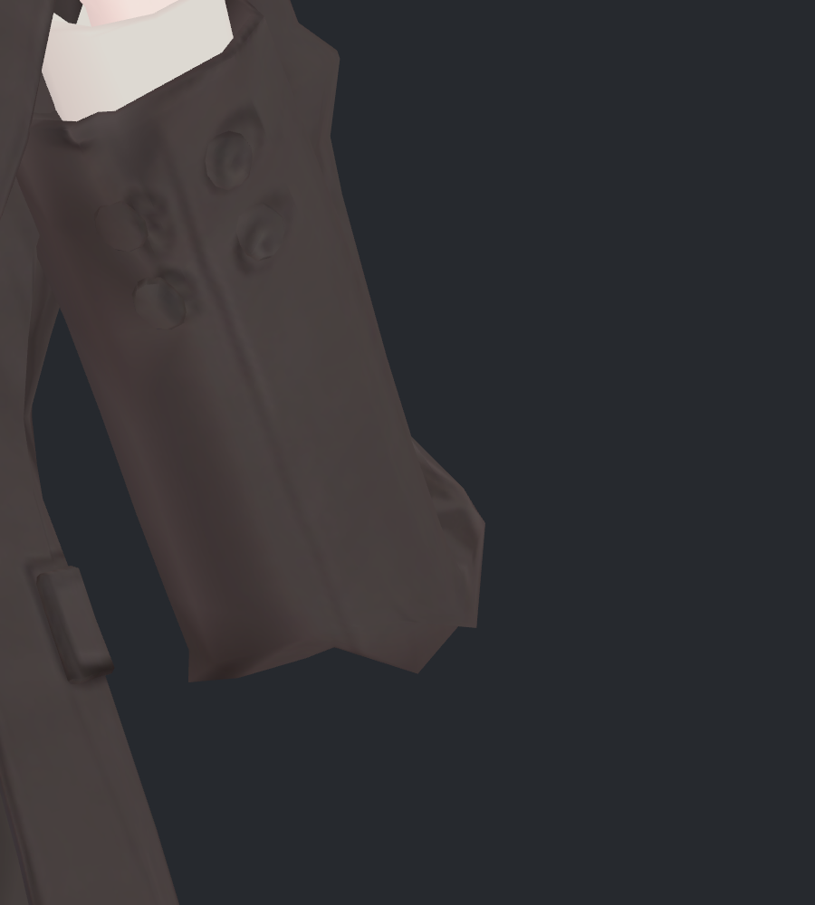
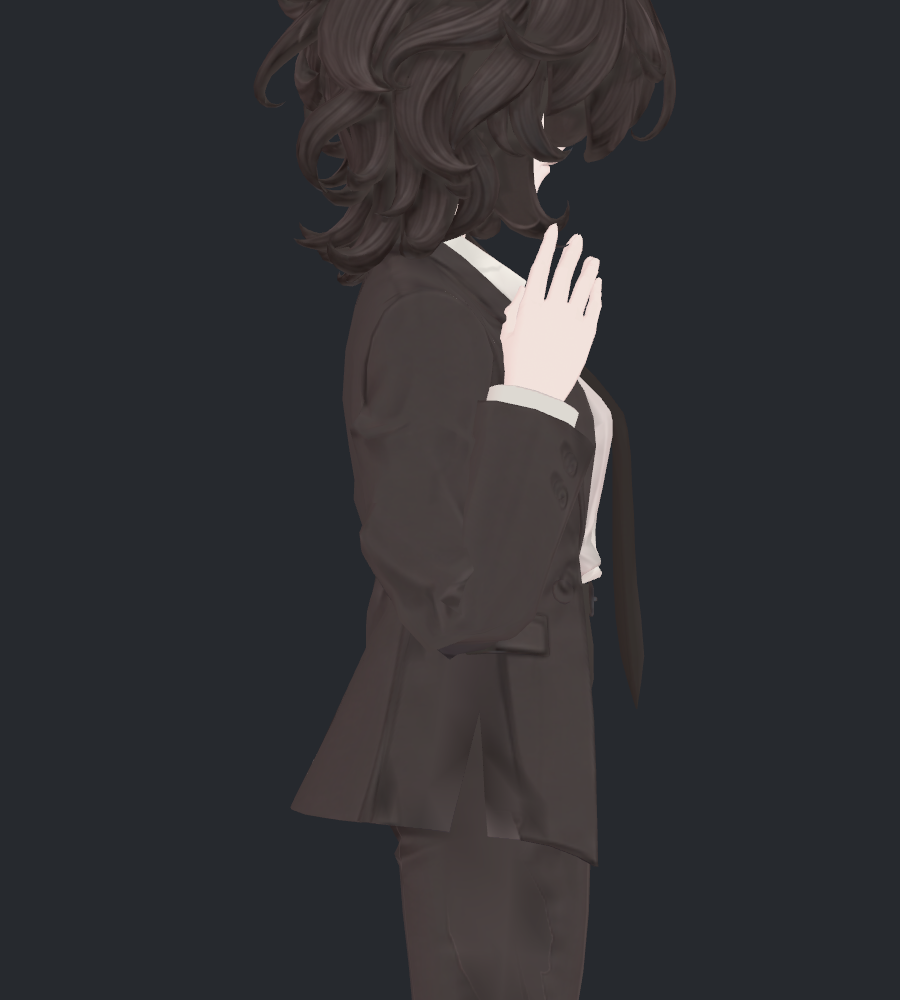
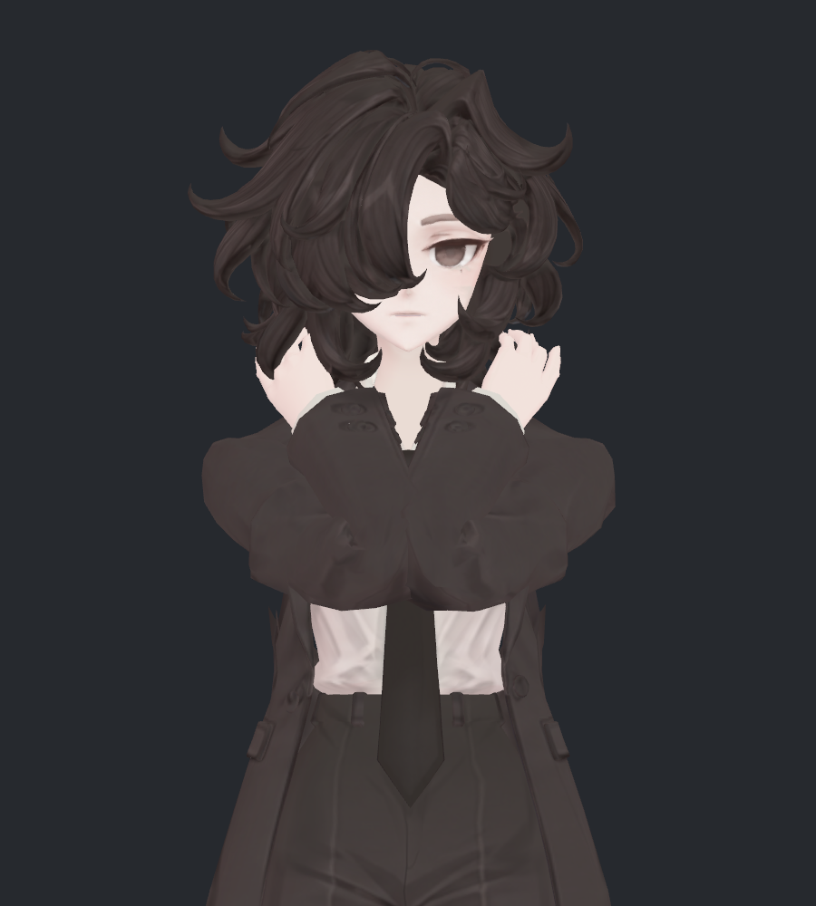
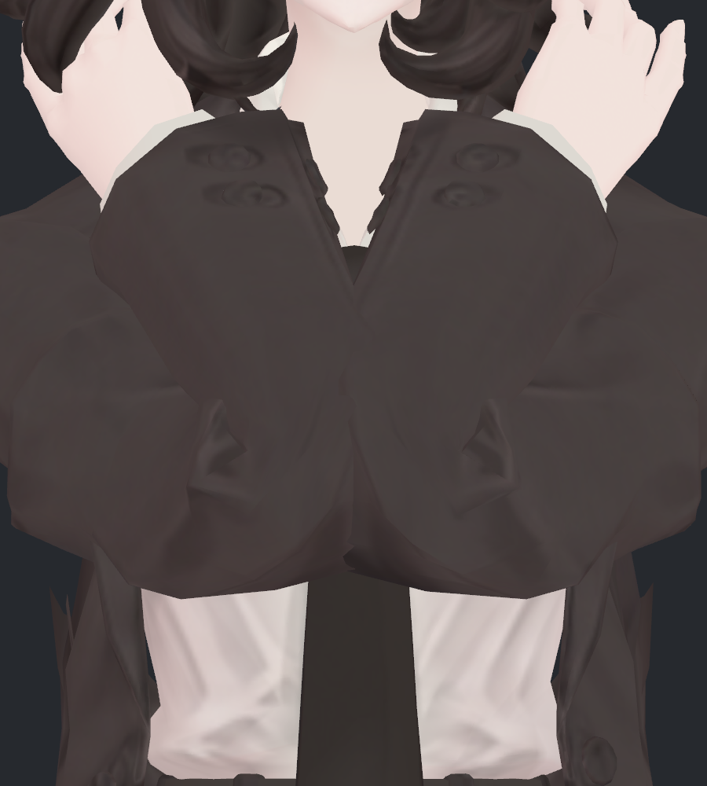
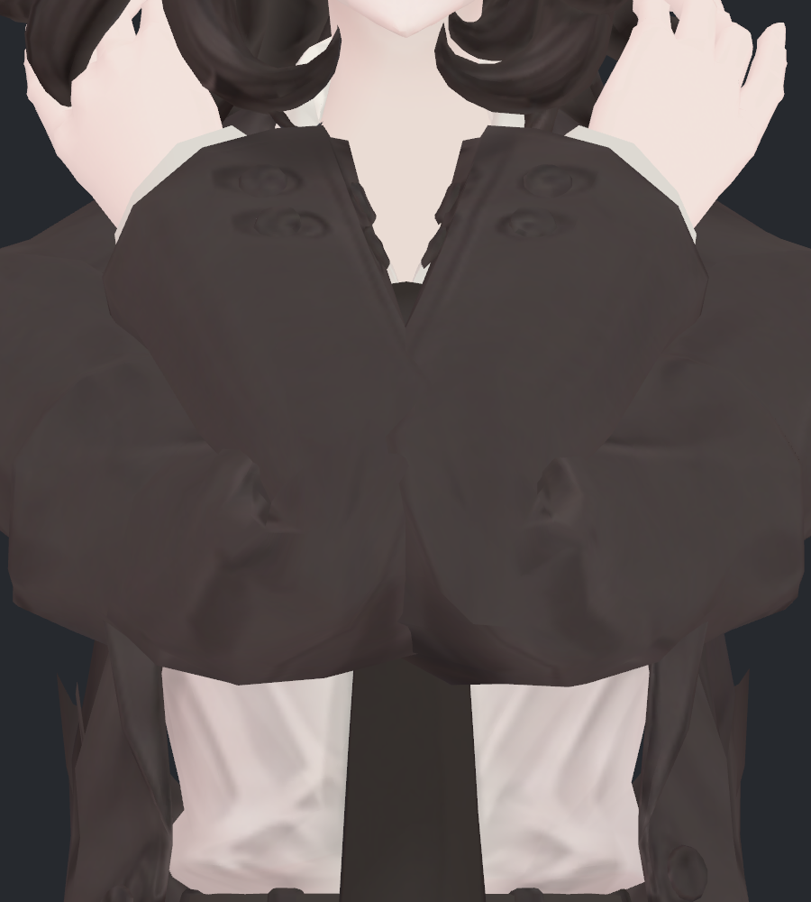
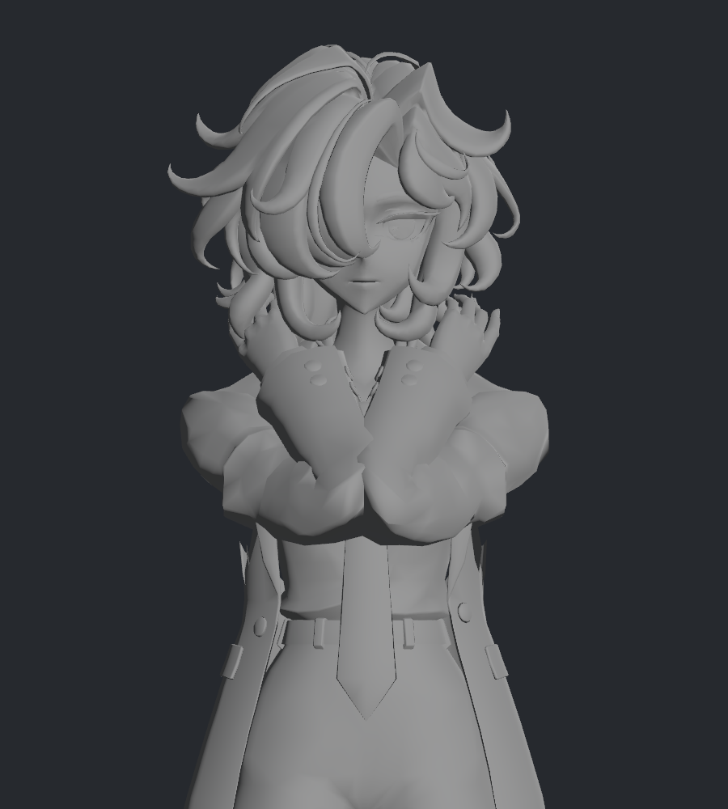
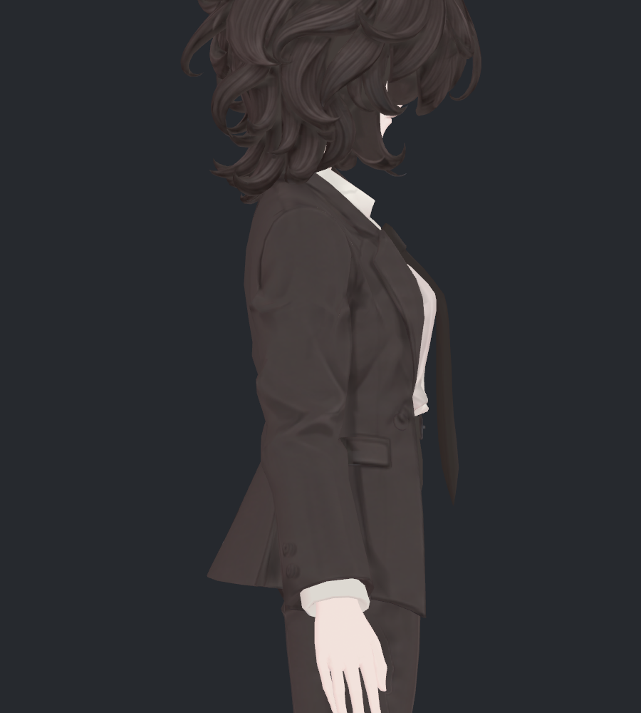

> **기록 시점 안내:** 아래는 해당 단계 당시의 보고서입니다. 후속 결정은 [최신 상태](../../STATUS.md)를 기준으로 읽어주세요. 모델·원본 텍스처·검증 원시 데이터는 이 문서 공유본에 포함하지 않습니다.

# v332 · ② 정면 각짐과 ③ 모으기 접힘 수정

사용자 요청에 따라 **② 정면 팔꿈치 아래 각짐과 ③ 강한 모으기의 접힘 뭉침**을 별도 사본에서 수정했습니다. ① 작은 비틀림 교차는 보류한 결정을 유지하며, 이번에는 새 악화 여부만 확인했습니다.

결과는 **v330 대비 부분 개선을 확인할 검수 후보**입니다. 정면 돌출을 작게 줄이고 모으기의 큰 접힘을 완화했습니다. 다만 아래쪽의 각진 끝과 작은 삼각형 주름은 사진에 남아 있어 두 문제가 완전히 사라진 최종본으로 표시하지 않습니다. 실제 전후 사진14장을 직접 열어 확인했습니다.

## ② 정면 팔꿈치 아래·바깥 모서리

| 수정 전 · v330 | 수정 후 · v332 |
|---|---|
|  |  |
|  |  |

확대 사진 오른쪽의 바깥 돌출을 안으로 줄였습니다. 이 자세에서 v330 대비 실제 정점 이동 최대 **3.278mm**입니다. 아래쪽 끝의 각 자체는 남았고, 전체적인 변화는 작습니다. 이를 매끈한 둥근 팔꿈치로 바꾸는 방향은 선택하지 않았습니다.

### 선호한 측면 유지

| 수정 전 · 기준 깊은 굽힘 측면 | 수정 후 · 같은 자세·카메라 |
|---|---|
|  |  |

기준 자세에서 측면 투영 좌표의 변화는 최대 **0.000120mm**입니다. 기본 윤곽은 사실상 유지되며 작은 음영 차이는 있습니다. 이 수치는 모든 방향의 복합 자세에서 측면이 동일하다는 뜻은 아닙니다.

## ③ 강하게 앞으로 모을 때의 접힘 뭉침

| 수정 전 · v330 | 수정 후 · v332 |
|---|---|
|  |  |
|  |  |

팔꿈치 아래쪽의 큰 덩어리가 조금 더 넓게 이어지도록 접힌 면을 재배치했습니다. 이 자세의 v330 대비 실제 정점 이동 최대는 **12.939mm**입니다. 모든 점이 그만큼 이동한 것은 아니며, 작은 국소 표면의 최대값입니다.

**두 군데 삼각형처럼 모이는 주름과 일부 꺾임은 남았습니다.** 원래 재질에서는 주름 명암도 함께 보여 회색 진단보다 개선이 작게 느껴질 수 있습니다. 텍스처와 원형 디테일은 이번에 수정하지 않았습니다. 남은 주름의 원인을 전부 텍스처로 단정하지도 않습니다.

### 형상 변화 확인 · 회색 진단

| 수정 전 · 회색 | 수정 후 · 회색 |
|---|---|
|  |  |

같은 정점·노멀을 회색 재질로 렌더한 진단입니다. 뾰족하게 겹친 큰 면 덩어리는 완화됐지만, 모든 접힘을 제거한 모양은 아닙니다. 회색 그림만으로 실제 재질의 미관 합격을 판정하지 않았습니다.

## 두 보정을 분리한 이유와 구동

한 보정으로 두 자세를 다루면 정면 모서리를 줄이는 대신 모으기의 안쪽 접힘이 더 몰리거나, 선호한 측면이 다시 둥글어졌습니다. 그래서 보정의 작동 조건을 나눴습니다.

| 보정 | 켜지는 조건 | 역할 |
|---|---|---|
| 정면 보정 · 좌우2키 | 실제 팔꿈치135°부터, 약164.54°에서 최대 | 기존 측면을 보호하며 정면 돌출 감소 |
| 모으기 보정 · 좌우2키 | 위 굽힘 조건에 더해, 양 팔꿈치 거리가18cm 이하에서 시작·6cm 이하에서 최대 | 팔을 가까이 모은 상태의 접힘 분산 |

Unity SDK Contacts6개와 중첩 BlendTree로 실제 구동했습니다. 기본 굽힘에는 모으기 키0, 중간 모으기에는 약33.60%, 강한 모으기에는 약100%가 적용됐습니다. 120° 이하에서는 이번 키가0입니다. Blender도 같은 거리·굽힘 조건을 드라이버로 구현했고 실제 본 회전40기록에서 기대값과 최대 오차0.000002 이내였습니다. 아바타용 사용자 런타임 C#은 추가하지 않았습니다.

이 조건은 검사한 양팔 자세에서 확인했습니다. 한 팔만 움직이는 모든 생활 동작이나 VRChat 클라이언트의 전체 추적 동작을 검증한 것은 아닙니다.

## 중립·원형 보존

| 수정 전 · 중립 측면 | 수정 후 · 중립 측면 |
|---|---|
|  |  |

중립에서 이번4키는 모두0이며, 복귀 시 Coat와 BodyHair 정점 오차0mm입니다. 기본 좌표·면·UV·노멀·웨이트·129본·기존26보정키를 보존했습니다. v330의 팔꿈치2키는 새 후보에서 수정된 정면2키로 대체했고, 모으기2키를 추가해 총30키입니다. 원래 v330 파일은 별도로 그대로 보존했습니다.

최종 네 키의 영향 정점 합집합은 **Blender 기존194개 / Unity 경계 분리점401개**입니다. 새 메시·리메시·컷·새 본은 없습니다. 측정용 오브젝트6개를 사용합니다. 팔 길이·몸 비례·텍스처·무릎·손가락은 이번 범위에서 유지했습니다.

## 검증 결과 · 부피와 교차

실제 Unity SDK 구동 **정적23 + 연속181 + 최종복귀1 = 205기록**에서 좌표가 모두 유한했고, 비대상 BodyHair의 정적 전후 좌표 변화는0mm입니다. 교차 검사는 네 키 모두가 영향을 주는 면 범위를 대상으로 정적23자세에서 수행했습니다.

| 자세 | 검사 영역의 기존 교차쌍 → 수정 후 | 새 교차쌍 |
|---|---:|---:|
| 기준 깊은 굽힘 |120 →118 |0 |
| 중간 모으기·깊은 굽힘 |356 →345 |0 |
| 강한 모으기·깊은 굽힘 |422 →374 |0 |
| 음의 비틀림·깊은 굽힘 |126 →126 |0 |
| 양의 비틀림·깊은 굽힘 |120 →120 |0 |

정적23자세 전체에서 **새 소매–몸 교차0, 새 소매 자기 교차0**입니다. 기존 자기 교차는 여전히 많습니다. 이 결과는 ①을 해결했다는 뜻도, 모든 기존 교차선의 길이가 같다는 뜻도 아닙니다. 이전 v330의35쌍과 이번422쌍은 검사 면 범위가 달라 직접 비교할 수 없습니다. 각 행은 같은 범위의 전후 비교입니다.

공유 정점이 없는 삼각형 사이의 비공면 교차선0.05mm 초과를 검사했습니다. 공면 겹침·전체 아바타·연속181프레임 교차 전수까지 합격한 것은 아닙니다.

부피는 같은 본 구간의 닫힌 단면으로 확인했습니다. 위팔55–85%, 전완15–50% 구간의 수정 후/전 부피 비율은 기본 깊은 굽힘에서 **99.77–99.91%**, 강한 모으기에서 **102.17–103.63%**입니다. 검사한 구간을 얇게 줄이는 해결은 피했지만, 이 구간이 국소 접힘 전체를 포함하지는 않습니다. 별도 방향성 변화 부피는 양팔 합계 기본 굽힘 **−6.36cm³**, 강한 모으기 **−5.36cm³**입니다. 전체 부피 정확 보존이나 미관 점수로 해석하지 않습니다.

## 남은 부분과 전달

- ② 아래쪽의 각진 끝은 남아 있으며, 이번에는 바깥 돌출을 작게 줄인 수준입니다.
- ③ 큰 겹친 면은 완화됐지만 삼각형 주름·국소 꺾임·기존 자기 교차는 남습니다.
- ①은 사용자 요청대로 보류합니다. 이 문서의 교차 검사 결과를 근거로 자동 재수정하거나 해결됐다고 판단하지 않습니다.

전달 파일은 `bianca_v332_ELBOW_FOLD_REVIEW.blend`와 `Bianca_v332_ElbowReview.unitypackage`입니다. Unity prefab은 `Assets/BiancaElbowFoldReview/Bianca_v332_ElbowReview.prefab`입니다. **완성·최종 채택본이 아닌, 실제 구동까지 확인한 별도 수정 후보**로 전달합니다.

[시도와 미채택 이유](v332_ATTEMPTS.md) · 이슈 위치 원문 (공유본 미포함: `v331_ISSUE_ATLAS.md`)
