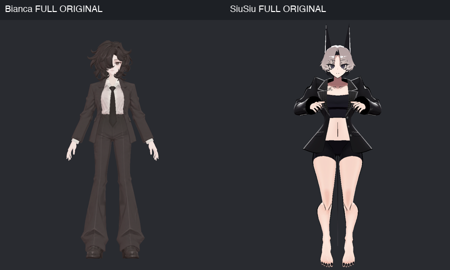
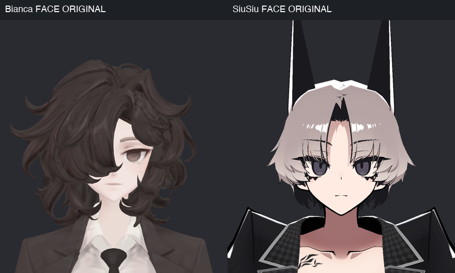
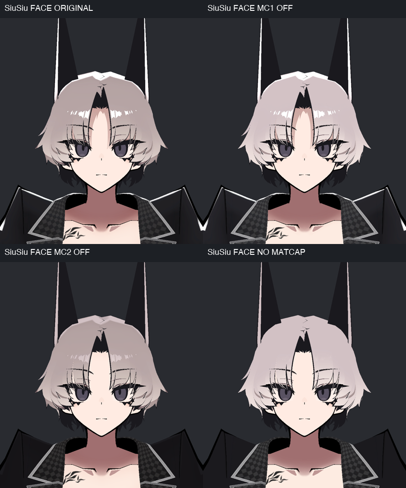
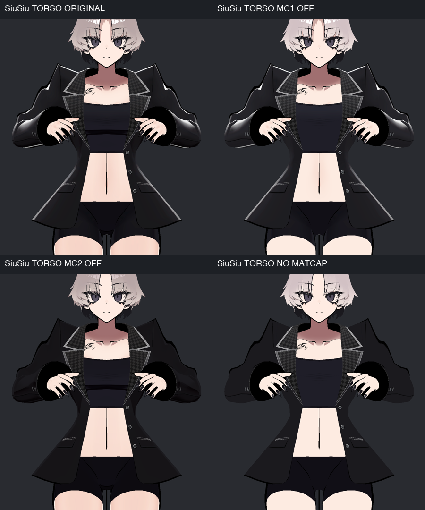
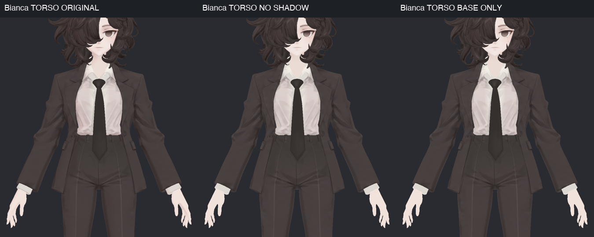
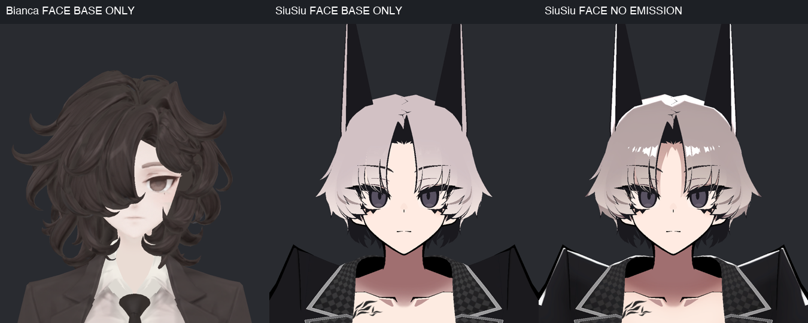
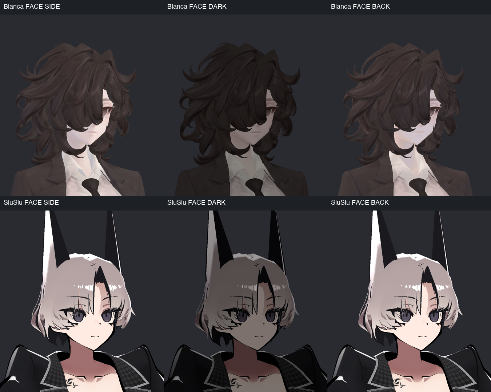
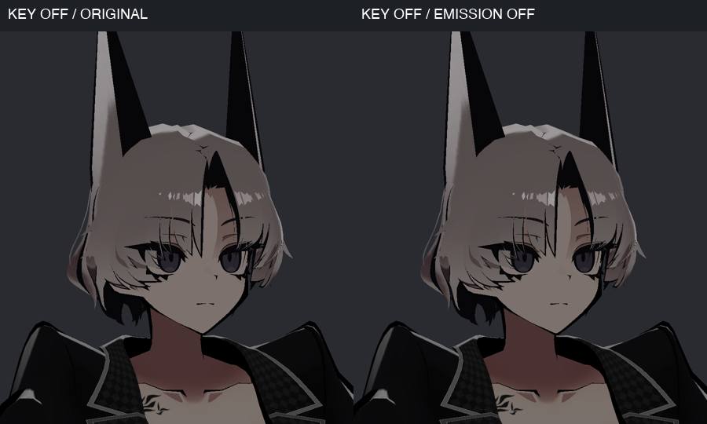

> **기록 시점 안내:** 아래는 해당 단계 당시의 보고서입니다. 후속 결정은 [최신 상태](../../STATUS.md)를 기준으로 읽어주세요. 모델·원본 텍스처·검증 원시 데이터는 이 문서 공유본에 포함하지 않습니다.

# v332 · SiuSiu는 어떻게 예쁘게 보이는가 — 셰이더 분석

2026-09-12 · **비앙카 셰이더 제작 전 조사. 실제 제작·적용·사용자 채택은 아직 아니다.**

## 먼저 정리한 방향

SiuSiu에서 참고할 핵심은 **정돈된 기본색, 영역별 마스크, MatCap 두 층의 역할 분리**다. 이번에 확인한 원본 재질은 툰 그림자·림라이트를 켜서 만드는 방식이 아니었다. 얼굴·피부에는 곱셈 MatCap으로 색과 음영을 다듬고, 머리·의상에는 곱셈 음영에 더해 가산 MatCap으로 밝은 윤곽을 만든다.

비앙카는 lilToon 연결과 공통 검수 설정은 있지만, 얼굴·머리·천·가죽의 반응을 나눈 본격적인 셰이더 작업은 아직 하지 않았다. 원래 텍스처에 머릿결·주름·입체 명암이 이미 많으므로 **기존 디테일을 보존하면서, 비앙카 전용 마스크로 필요한 빛 반응만 추가**하는 방향을 권한다. SiuSiu의 밝은 테두리를 정장 전체에 같은 세기로 입히지는 않는다.

왼쪽은 비앙카 v324의 현재 재질, 오른쪽은 SiuSiu Kisekae의 블레이저 표시 상태다. 비앙카는 갈색 정장과 조밀한 명암, SiuSiu는 넓고 단순한 색면과 밝은 가장자리의 대비가 눈에 띈다. **자세·체형·색상·옷 형태가 다르므로 이 두 사진만으로 셰이더의 기여율이나 우열을 계산할 수는 없다.** 아래 동일 모델의 ON/OFF 비교로 기능의 기여를 분리했다.

## 실제로 확인한 자료와 조건

| 항목 | 확인 내용 |
|---|---|
| 참고 입력 | 보관된 MH_SiuSiu v1.0.2 패키지의 Kisekae 프리팹·재질 |
| 원본 일치 | 사용 중인 SiuSiu 재질10개를 원본 unitypackage와 대조해 모두 바이트 단위 일치 |
| 비앙카 입력 | v324 DetailReview 프리팹, Head/Paint 아틀라스 각4096² |
| 엔진 | 실행 중 Unity 2022.3.22f1, Linear, 설치된 lilToon 2.3.4, Windows 빌드 대상 |
| 그림 | Unity Editor의 별도 일회성 Preview Scene, 900×1000, 정사영, 후처리 없음 |
| 주광 | 백색 Directional 1개, 강도1. 캐스트 그림자 OFF. SIDE/BACK은 방향 변경, DARK는 주광 강도0 |
| 고정 조건 | 동일 모델의 기능 비교는 동일 자세·카메라·광원. 원본 재질을 메모리에 복제한 뒤 지정 기능만 OFF |
| 애니메이션 | Animator·Behaviour 비활성, SiuSiu 블레이저 표시 클립만0초 샘플. FX·물리·VRChat 실행 검증 아님 |
| 직접 검수 | 최종34장 캡처 중24개 서로 다른 뷰를 아래8개 비교 그림, 총26칸으로 직접 확인 |
| 보존 | 참고 자산·v324 자산·Blender 기준본·기존 ProjectSettings 변경 등441파일 해시 유지. 사용자 장면 경로/dirty/루트 목록 동일 |

DARK는 **주광 OFF**라는 뜻이다. 주변광·밝기 하한·기존 셰이더 보정까지 제거한 완전 암실 검사는 아니다. 활성 사용자 장면의 주변광 설정은 Flat/0.35로 기록했으나 Preview Scene의 환경 SH를 별도 측정하지 않았으므로 광도·실제 월드 밝기 비교로 해석하지 않는다. 모든 비교는 구매 패키지의 현재 표시 조건에 한정되며 제작자 홍보 이미지의 촬영 조건을 재현한 것은 아니다.

## SiuSiu 원본의 재질 구성

전체 프리팹에서 참조하는 고유 재질은10개다. 현재 블레이저 표시에서는 Cloth1이 비활성이고9개가 활성 Renderer에 연결된다. 활성 SkinnedMeshRenderer10개/슬롯15개를 관찰했지만 이것을 GPU draw call15회나 성능등급으로 간주하지 않는다.

| 재질 | 실제 켜진 표현 | 분석 |
|---|---|---|
| Face | MatCap1 곱셈 + MatCap2 곱셈, 각각 별도 마스크 | 두 층 모두 색을 더 밝게 더하는 용도가 아니라 선택적인 색·음영 조절 |
| Skin | MatCap1 곱셈 + MatCap2 곱셈, 각각 별도 마스크 | 얼굴과 다른 두 번째 피부 MatCap 사용 |
| Hair / HairStencil | MatCap1 곱셈 + MatCap2 가산, 머리 마스크 | 전체 색을 유지하면서 밝은 머릿결·가장자리 강조 |
| Cloth2, Cloth1, Acc | MatCap1 곱셈 + MatCap2 가산, 영역 마스크 | 의상의 넓은 면과 밝은 윤곽 분리. Cloth1은 설정 조사만, 이번 사진에는 비활성 |
| Nail | MatCap1 곱셈 | 손톱 재질을 별도로 제어 |
| FaceStencil | 마스크된 Emission, 스텐실 기록 | 일부 얼굴 표현의 밝기 보조 및 머리와의 표시 관계 |
| Alpha | 투명 lilToon, 위 주요 효과 OFF | 투명 부위용 별도 재질. 이번에는 세부 면 역할을 모두 추적하지 않음 |

**10개 모두 `_UseShadow=0`, `_UseRim=0`, `_UseReflection=0`, `_UseBumpMap=0`이다.** `_ShadowColor`나 `_OutlineWidth=0.08`, 머리의 Rim 마스크가 파일에 남아 있어도 활성 효과라는 뜻은 아니다. 이번 사용 셰이더는 일반 `lilToon`과 `Hidden/lilToonTransparent`이며 Outline 변형이 아니고 조회한 패스에도 OUTLINE이 없다. 사진의 밝은 테두리를 lilToon Outline/Rim 효과라고 설명하면 틀린다.

MatCap1/2의 Blend는 켜진 층에서 모두1이지만, 실제 픽셀에는 **MatCap 그림의 색·알파 × 마스크 × 합성 방식**이 작용한다. 강도1이라는 숫자를 비앙카에 그대로 복사해도 같은 모습이 되지 않는다. 설치 코드에서 합성값3=Multiply, 1=Add를 직접 확인했다. MatCap의 카메라 방향 의존·마스크·합성 방식은 [lilToon 공식 MatCap 문서](https://lilxyzw.github.io/lilToon/ja_JP/reflections/matcap.html)와도 대조했다.

### 얼굴과 머리

SiuSiu는 단순한 피부색, 뚜렷한 눈선, 넓은 머리 색면과 좁은 하이라이트가 함께 작동한다. 비앙카는 눈·머릿결·코 주변이 이미 부드러운 명암으로 그려져 있다. **얼굴 디자인과 헤어 형상 차이를 셰이더 하나로 바꿀 수 있다고 보지 않는다.** 비앙카의 얼굴 인상·앞머리 가림을 유지한 상태에서 반응만 다듬는 것이 이번 후속 방향이다.

위 왼쪽 원래 설정, 위 오른쪽 MatCap1만 OFF, 아래 왼쪽 MatCap2만 OFF, 아래 오른쪽 두 층 OFF다. 모든 활성 재질에서 해당 층을 함께 껐으므로 얼굴과 머리가 동시에 변한다.

- MatCap1을 끄면 머리의 넓은 면이 밝아진다. 첫 층의 곱셈 음영을 확인할 수 있다.
- MatCap2를 끄면 머리와 귀·옷깃의 강한 밝은 가장자리가 크게 줄어든다. 머리의 두 번째 층은 가산이다.
- 두 층을 꺼도 눈선, 목의 어두운 영역, 일부 머릿결 표시는 남는다. 화면의 모든 어두운 부분이 동적 셰이더 그림자는 아니다.
- 얼굴 재질의 두 번째 층은 곱셈이므로, 머리 하이라이트가 줄었다는 관찰을 얼굴에도 같은 합성 방식이라고 확대하지 않는다.

얼굴은 `SiuSiu_skin1_mat`/`SiuSiu_skin3_mat`, 피부는 `skin1`/`skin2`, 머리·옷은 `SiuSiu_base1_mat`/`base2_mat` 조합이다. 모두 런타임256² MatCap이며, 원본 파일이나 마스크를 비앙카에 이식하지 않고 역할만 참고한다.

### 블레이저의 선명한 면 읽힘

같은 순서의 네 조건이다. 두 번째 MatCap을 끄면 소매 바깥쪽·어깨·자락의 밝은 표현이 크게 줄고 검은 천이 평평하게 읽힌다. 반면 옷깃의 체크무늬와 얇은 장식선은 남는다. 첫 번째 MatCap OFF의 변화는 이 시점에서 두 번째보다 작아 보인다. 이것은 **이 자세·카메라에서의 관찰**이며 다른 각도나 월드에서의 기여율은 아니다.

Cloth2의 마스크 연결도 이름만 보고 추측하면 안 된다. MatCap1에는 `cloth2_mat2_mask`, MatCap2에는 `cloth2_mat1_mask`가 실제로 연결돼 있다. 시각 결과는 효과와 마스크의 조합에서 나오므로 파일 번호를 세팅 순서로 간주하지 않는다.

비앙카의 정장은 SiuSiu 블레이저보다 천 명암이 이미 강하다. 소매 끝·옷깃을 얇게 살리는 점은 참고하되, 현재 접힘마다 가산 밝은 띠가 생기면 광택 있는 가죽처럼 바뀔 수 있다. 첫 후보에서는 원단 영역의 가산을 약하게 제한하고 신발·단추 같은 부위만 별도로 더한다.

## 비앙카의 현재 상태와 차이

비앙카는 Renderer2개에 재질4개가 연결된다. 다만 Coat의 Head 서브메시는0삼각형이고, 실제 삼각형이 있는 슬롯은3개다. 이 상태에서 재질 수를 늘리는 것을 첫 작업으로 삼을 필요는 없다.

| 항목 | 비앙카 현재 공통값 | SiuSiu에서 확인한 방식 |
|---|---|---|
| 기본색 | Head/Paint 각4096², MainTex만 연결 | 부위별 기본색·마스크·256² MatCap |
| 툰 그림자 | ON, Strength0.5 / Border0.5 / Blur0.55 | 모두 OFF |
| 그림자색 | RGBA(0.72, 0.69, 0.72, 1) | 저장된 색이 있어도 Shadow OFF이므로 직접 활성값으로 해석하지 않음 |
| 밝기 보정 | AsUnlit0.1, Min0.2 / Max1 | AsUnlit0, Min0.2 / Max1 |
| MatCap·Rim·Reflection·NormalMap·Emission | OFF | 위 재질 표처럼 필요한 MatCap/국소 Emission만 ON |
| Outline / 스텐실 | Outline 없음, Stencil Keep | Outline 없음, 얼굴·앞머리 표시용 스텐실 연결 |

왼쪽 현재, 가운데 툰 그림자만 OFF, 오른쪽 BASE_ONLY다. BASE_ONLY는 추가 색층·MatCap·Emission·툰 그림자 등을 끄고 AsUnlit을1로 만든 진단 조건이다. 알파·스텐실 등 표시 구조를 유지하므로 원본 PNG를 그대로 펼친 것과는 다르다.

비앙카는 그림자를 꺼도 소매·셔츠·바지의 명암이 상당히 남는다. 셰이더 추가 전에 **텍스처 자체의 고정 명암과 새 조명 음영이 겹치지 않는지** 확인해야 한다. v324에서 복원한 신발 장식·천 주름·머릿결을 전역 평탄화로 다시 없애지 않는다. 셰이더만으로 충분하지 않으면 해당 부위의 큰 명암만 별도 텍스처 사본에서 비교할 수 있지만, 이번 조사에서 텍스처 수정은 하지 않았다.

왼쪽 두 칸은 BASE_ONLY, 오른쪽은 SiuSiu 원래 효과 중 Emission만 OFF다. 기본색 중심 상태에서도 두 모델의 스타일 차이는 크다. 따라서 SiuSiu 느낌을 얻는 작업은 ‘같은 셰이더로 바꾸기’보다 **기존 그림과 어울리는 효과의 범위·세기를 정하는 작업**에 가깝다.

## 스텐실·발광·조명 변화는 별도로 검수

SiuSiu Face는 Queue2000 / Ref59 / Always / Replace, FaceStencil은 Queue2001 / Ref58 / Always / Replace, HairStencil은 Queue2002 / Ref58 / NotEqual / Keep이다. 얼굴 쪽에서 기록한58을 머리 재질이 읽는 연결은 [공식 스텐실 문서](https://lilxyzw.github.io/lilToon/ja_JP/advanced/stencil.html)의 얼굴 파츠 표시 방식과 부합한다. 이번에는 해당 삼각형을 전부 의미별 분류하거나 스텐실 OFF 비교를 하지 않았으므로 눈·눈썹 중 어떤 면까지 관여하는지는 후속 확인 사항이다.

비앙카는 앞머리로 한쪽 눈을 가리는 인상이 현재 디자인의 일부다. 스텐실을 자동 추가해 가려진 눈을 드러내는 것을 기본 계획으로 삼지 않는다. 먼저 기존 표시 구조와 마스크 안에서 작업한다.

위 비앙카, 아래 SiuSiu. 각 행은 같은 사선 카메라에서 주광 측면/SIDE, 주광 OFF/DARK, 역방향/BACK이다. 주광을 껐을 때 두 모델 모두 어두워진다. **SiuSiu의 Shadow OFF가 ‘월드 조명을 전혀 안 받는 완전 Unlit’이라는 뜻은 아니다.** MatCap의 음영 방향과 별개로 전체 밝기는 조명에 반응한다. 밝기 하한·상한과 Unlit 보정의 역할은 [공식 라이팅 문서](https://lilxyzw.github.io/lilToon/ja_JP/base/lighting.html)를 따랐다.

같은 사선·주광 OFF에서 Emission만 끄면 주로 눈 부근의 작은 차이가 보인다. 얼굴 전체를 밝히는 강한 발광 효과로 해석하지 않는다. 렌더 픽셀 차이는3051픽셀에서 확인됐지만 미관 점수나 얼굴 면적 비율은 아니다. 비앙카에도 필요하다면 눈의 작은 보조만 나중에 검토한다.

## 텍스처와 성능에서 참고할 점

SiuSiu에서 조회한 런타임 기본색은 얼굴1024², 머리512², 블레이저1024², 몸2048²다. MatCap은256², 주요 마스크는512–1024²였다. 원본 이미지 크기나 PC 빌드 VRAM 실측과는 구분한다. 비앙카가 이미4K를 쓰는데도 다른 느낌인 이유를 단순히 해상도 부족으로 단정할 수 없다.

현재 SiuSiu의 조사 대상 마스크는 Importer sRGB가 켜져 있었다. 이는 원본 상태의 기록이지 새 비앙카 마스크에 그대로 따라야 할 규칙이 아니다. 새 효과 강도용 마스크는 선형 데이터로 설계하고, 텍스처 색공간과 실제 중간값을 확인해 사용할 계획이다. 기존 마스크를 sRGB OFF로 바꾸면 같은 파일도 강도가 달라질 수 있다. [Unity 선형 텍스처 문서](https://docs.unity3d.com/2022.3/Documentation/Manual/LinearRendering-LinearTextures.html)

또한 lilToon은 일부 텍스처의 샘플러를 고정하거나 MainTex와 공유하므로, 마스크 Importer의 Wrap/Filter만 바꿔 모든 샘플링이 달라진다고 가정하지 않는다. [lilToon 텍스처 Import 문서](https://lilxyzw.github.io/lilToon/ja_JP/other/textures.html)

SiuSiu의 많은 Renderer·슬롯을 그대로 복제하지 않는다. 우선 비앙카 기존 아틀라스와 슬롯에서 효과별 마스크로 분리하고, 추가 슬롯은 실제로 독립 설정이 필요할 때만 검토한다. 셰이더 비용은 슬롯뿐 아니라 패스·투명 겹침·켜진 기능에도 좌우되므로 SDK 지표와 실제 PC의 GPU 시간을 함께 확인해야 한다. 이번에 성능등급·FPS는 측정하지 않았다. [VRChat 최적화 지침](https://creators.vrchat.com/avatars/avatar-optimizing-tips/), [성능등급 문서](https://creators.vrchat.com/avatars/avatar-performance-ranking-system/)

## 다음 작업과 이번 결론의 범위

[구체적인 제작 순서·초기 실험값·검수 기준은 v332 작업 계획](v332_IMPLEMENTATION_PLAN.md)에 정리했다. 추천 첫 비교는 현재 비앙카를 보존한 채 **얼굴 그림자 마스크 + 머리의 약한 MatCap 하이라이트 + 정장 천의 제한된 밝은 반응**이다. 새 메시·본·노멀 편집 없이 시작한다.

이번에 완료한 것은 원본 대조, 실제 Unity 재질/사진 분석, 작업 계획과 문서 게시다. 비앙카 셰이더 제작본·최종 preset·Unitypackage를 새로 전달한 것이 아니다. v324는 재질 비교 입력이며 형상 기준을 자동 회귀시키는 결정이 아니다. v327 보류/v330 미채택, 팔 길이·무릎·손가락 유지 판단을 그대로 보존한다.

남은 검증은 실제 비앙카 마스크 제작, 사선·회전·근접·원거리와 색 조명, cast shadow, 거울/양안 VR, VRChat 클라이언트·성능·셰이더 차단 시 표시다. Shader fallback은 정상 셰이더 표시와 다른 경로이므로 따로 확인한다. [VRChat Shader Fallback 문서](https://creators.vrchat.com/avatars/shader-fallback-system/)
