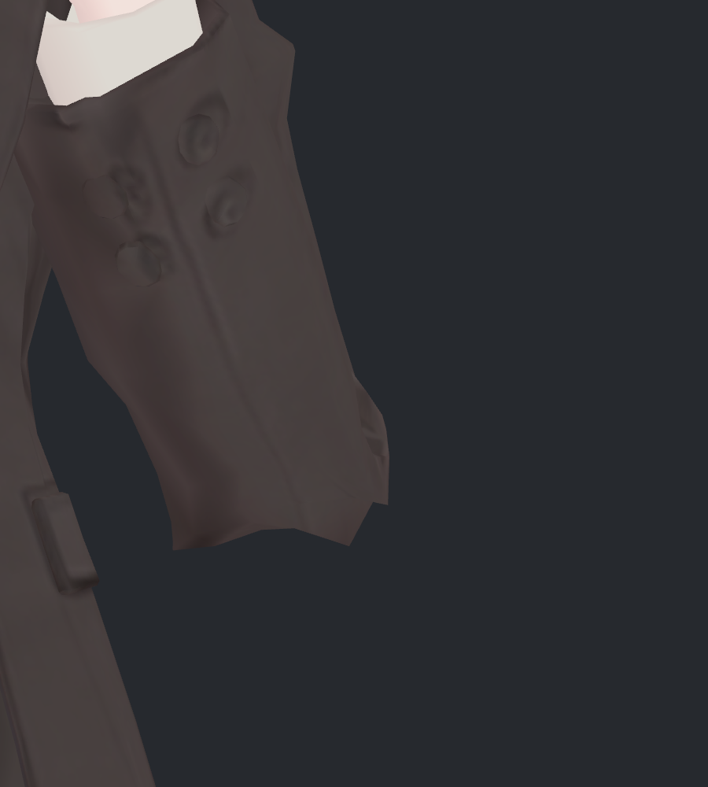
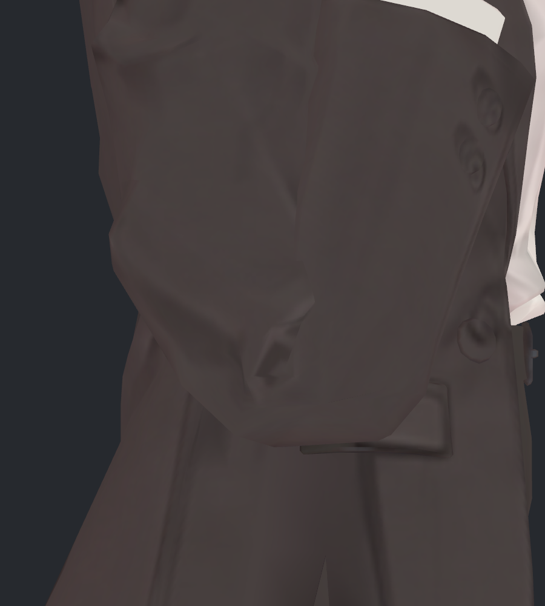
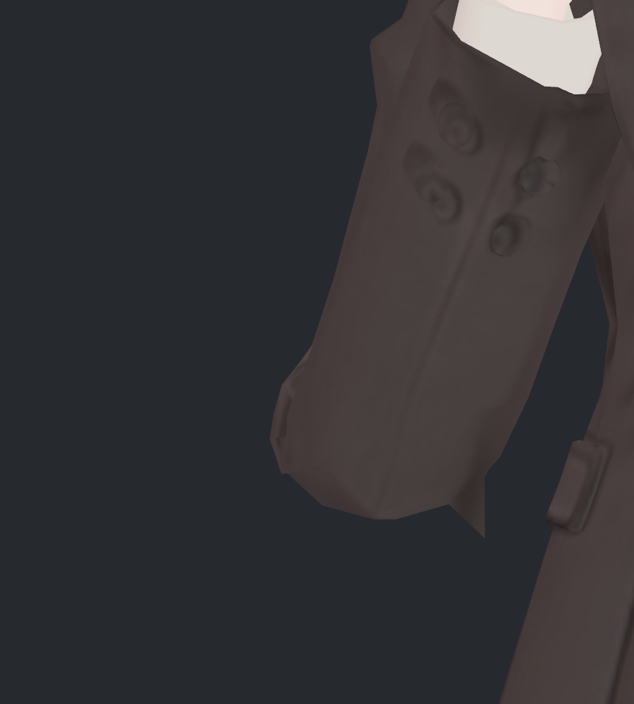
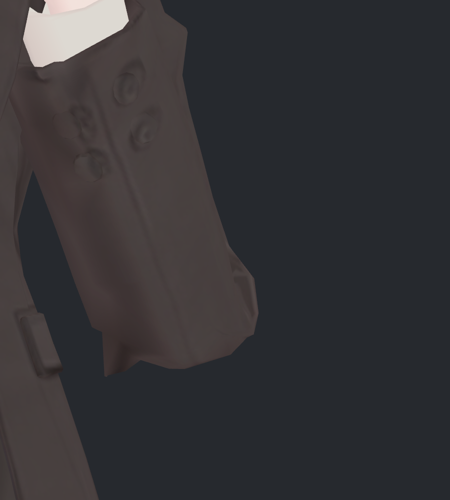

> **기록 시점 안내:** 아래는 해당 단계 당시의 보고서입니다. 후속 결정은 [최신 상태](../../STATUS.md)를 기준으로 읽어주세요. 모델·원본 텍스처·검증 원시 데이터는 이 문서 공유본에 포함하지 않습니다.

# v333 · 팔꿈치 각짐: 문제, 시도, 미채택 이유

[원본·직전·최종 비교](v333_CONTOUR_REVIEW.md)

## 왜 직전 수정 뒤에도 남았나

v332는 정면의 바깥 돌출을 줄였지만, 하단 중앙의 패임과 주변 정점이 만드는 외곽선은 거의 그대로 남았습니다. 실제 형상의 V자 깊이도 왼쪽 5.26mm, 오른쪽 5.73mm였습니다. 따라서 텍스처 명암만의 문제가 아니었습니다.

처음에는 아래 끝들을 올려 둥근 호로 만드는 방향을 시험했습니다. 한 자세에서 보기 좋아져도 접힌 안쪽 면의 상대 위치가 바뀌어 새 교차가 생겼고, 이를 막으려고 특정 점을 고정하면 뾰족한 꼬리가 돌아왔습니다. 웨이트 분산도 따로 시험했지만 원래 하단 패임을 안정적으로 지우지 못했습니다.

최종적으로 **끝을 올리는 대신 가운데 패인 부분을 채우는 방향**으로 목표 형상을 바꿨습니다. 기존 면과 정점을 유지하면서 바뀌어야 할 부위와 접촉 면 사이의 관계를 함께 조절했고, 실제 비틀림·한쪽 팔 자세를 포함해 확인했습니다.

## 시험한 방법과 판정

아래 초기 수치는 원래 23기록의 영향 범위, 확장 시험은 63기록의 더 넓은 영향 범위를 사용합니다. 검사 범위가 다르므로 서로 동일한 점수처럼 비교하지 않습니다. ‘새 교차 쌍’은 자세별 누적 수이고 사람 눈에 보이는 구멍 개수는 아닙니다.

| 방법 | 실제 시험 | 미채택 이유 / 판정 |
|---|---|---|
| 표면 평균화 | Laplacian 6/12회, 축별 강도 분리 | 소매가 줄어들고 V자 윤곽이 남음. 새 자기 교차 누적 121/164쌍 |
| 포물선·공정 곡선 | parabola65/100, fair6/12 | 새 자기 교차 35/54/22/24쌍. 좁은 돌출을 놓친 초기 외곽선 표본도 수정 |
| 정확한 외곽 호 | arc60/100, exactfair | 새 자기 교차 32/57/65쌍. V는 줄지만 끝을 끌어올려 측면 변화가 커짐 |
| 충돌 제약 + 정점 고정 | YZ 보정, XYZ 강체 관계 보정 반복 | 23기록 새 교차 0까지 갔지만 안쪽 끝을 고정하면서 뾰족한 꼬리가 복귀 |
| 분리축 교체·적응형 제약 | 15축 후보 및 현 형상 기준 반복 | 일부 불능·일부 잔여 교차. 수치상 간격만으로 실제 교차 해소를 확정하지 않음 |
| 회전 정렬 조건이 있는 둥근 보정 | 기존 30키 위에 새 2키와 정렬 측정 추가 | 기본 23기록은 새 교차 0, 추가 40기록에서 131쌍 발견 → 제외 |
| 63기록으로 둥근 보정 재최적화 | 총 850개 제약으로 새 교차 0 | 시각적으로 오른쪽의 뾰족한 꼬리가 다시 남아 제외 |
| 가까운 웨이트 평균화 | 강도 35/65/100, 기존 129점 시험 | 상완·전완 외 웨이트 유지 후에도 V자 윤곽이 남음. 최종 웨이트에 반영하지 않음 |
| 관절 길이에 따른 웨이트 재분배 | 폭·보조 비율 6조합, 340점 시험 | 측면의 두께와 접힘 변화, 새 교차 1256/998/1191/721/1127/755쌍 → 제외 |
| 기본 좌표의 미세 조정 병행 | 최대 0.822mm 이동 시험 | 확장 기록 새 교차 75쌍, 뾰족한 끝도 남음. 최종 기본 좌표에는 미반영 |
| **중앙 패임 채우기 + 접촉 제약** | 353개 제약, 반복 보정 후 별도 실제 SDK 실행 | **최종 검수 후보. 실제 원래 23 + 추가 40기록 새 교차 0, 아래 V자 깊이 0.72/1.39mm** |

최종 후보가 아닌 시험 모델은 작업 폴더의 trials에 구분 보존했습니다. 실험용 웨이트·기본 좌표·이전 둥근 보정을 최종 모델에 섞지 않았습니다.

## 미채택 사진

아래는 실제 모델 자료로 계산한 **오프라인 시험 형상**의 렌더입니다. 최종 SDK 구동 사진과 구분하며, 원래 재질을 사용했습니다. 여섯 장을 직접 열어 확인했습니다.

| 표면 평균화 · 하단 패임 잔여 | 원호로 끌어올리기 · 측면 변화 |
|---|---|
|  |  |

| 교차 0까지 제약한 둥근 안 · 오른쪽 꼬리 복귀 | 웨이트 재분배 · 측면 변화 |
|---|---|
|  |  |

| 가까운 웨이트 평균 · V자 잔여 | 기본 좌표 조정 병행 · 안쪽 돌출 잔여 |
|---|---|
|  |  |

## 실행 중 생긴 문제와 수정

- 처음 실행 명령에서 Views가 빠진 진입점 이름을 사용해 Unity 호출이 실패했습니다. 실제 클래스의 진입점으로 수정하고, 오류 기록을 보존했습니다.
- 초기 외곽선은 일정한 간격만 표본화해 매우 좁은 정점 돌출을 놓쳤습니다. 삼각형의 실제 정점 X 위치도 포함한 정확한 하단 외곽선으로 변경했습니다.
- 초기 평균 웨이트 계산에 비대상 본의 비율이 섞이는 문제를 확인했습니다. 상완·전완·보조 외 원래 비율을 보존하도록 고친 뒤 다시 시험했습니다. 이 웨이트 시험 자체는 최종안에서 제외했습니다.
- 회전 정렬 측정점을 실행 중 월드 좌표 그대로 프리팹 기본 좌표로 옮기면 정상 굽힘에서도 보정이 약해졌습니다. 수신·송신 본 각각의 역변환을 사용해 기본 공간의 측정점을 다시 구했습니다. 수정 뒤 실제 정상 깊은 굽힘에서 약 100%, 큰 비틀림과 강한 모으기에서 0%를 확인했습니다.
- Blender의 단순 로컬 X 회전은 Unity Humanoid가 쓰는 굽힘 축과 달랐습니다. 저장한 실제 Unity 본 자세를 Blender에 적용하여 양쪽 46값을 확인했습니다. 이 검증에서 기록에 이미 포함된 본 제약을 중복 적용하지 않도록 임시 검사 장면에서만 비활성화했으며 전달 모델은 덮어쓰지 않았습니다.
- 제약이 많아진 원호 시험에서 기존 QP 풀이가 반복 상한·낮은 정확도를 반환했습니다. [Clarabel 공식 Python 사용 문서](https://clarabel.org/stable/python/getting_started_py/)를 확인해 풀이를 교체했습니다. 풀이 성공 이후에도 실제 삼각형 교차와 사진을 다시 확인해 시각 실패 후보는 제외했습니다.

최종 중앙 채움 안의 제약 반복에서도 새 교차가 한 번에 사라지지 않았습니다. 초기 108 → 188 → 54 → 3 → 0쌍으로 변했으며, 중간에 악화한 안을 완료로 처리하지 않았습니다. 마지막 수치 결과를 Unity 파일로 다시 만들고 독립 실행해 최종 사진과 교차를 검증했습니다.

## 남는 한계와 다음 판단 지점

작은 바깥 모서리와 면 단위 꺾임은 여전히 보입니다. 측면 아래는 v332보다 조금 채워졌으며, 이 정도의 두께·곡률을 사용자가 선호하는지는 최종 비교 사진으로 확인해야 합니다. 강한 모으기와 큰 비틀림은 v332를 그대로 유지하므로 해당 자세의 기존 문제까지 이번에 해결한 것으로 표시하지 않습니다. 전체 VRChat 실행이나 모든 연속 접촉의 보증은 아닙니다.
