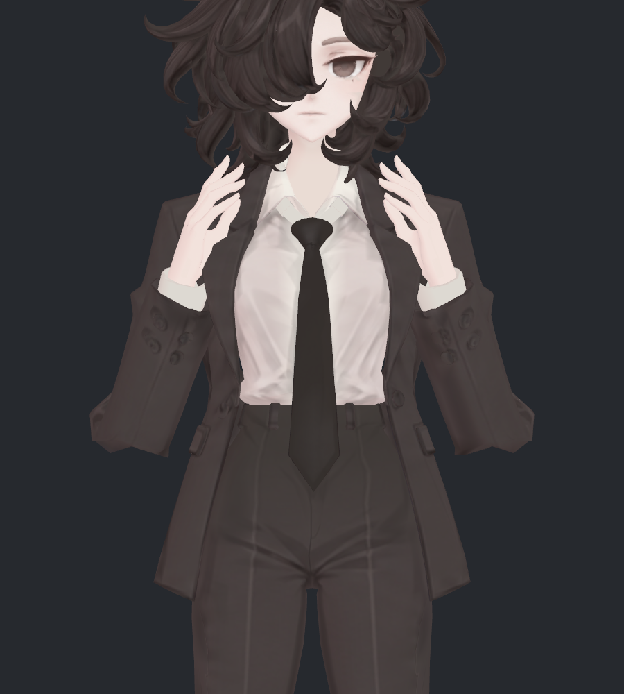
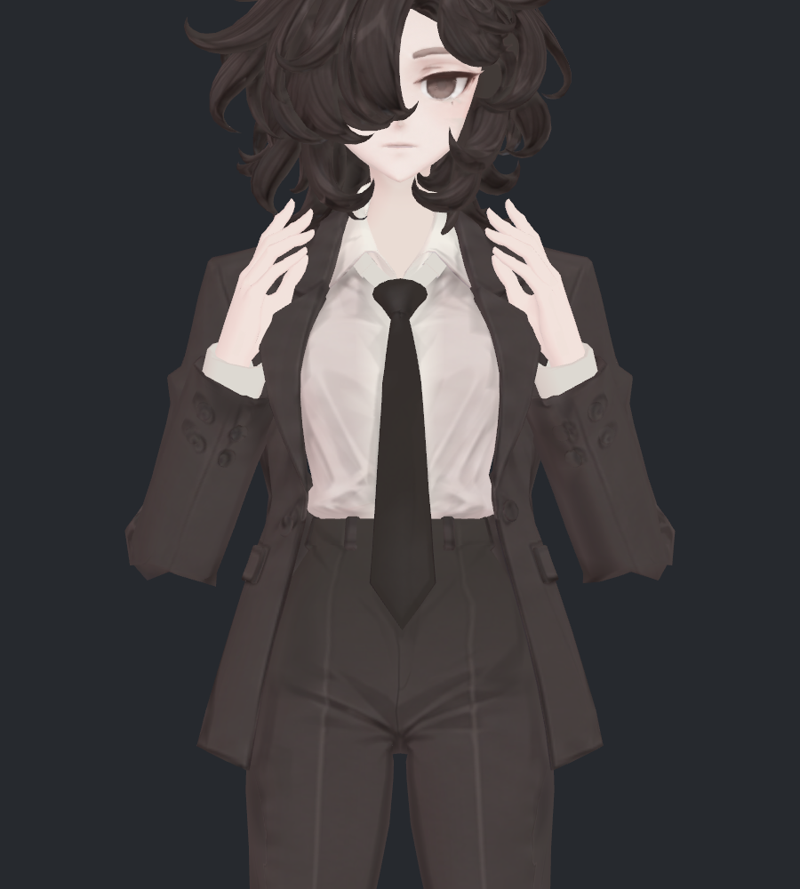
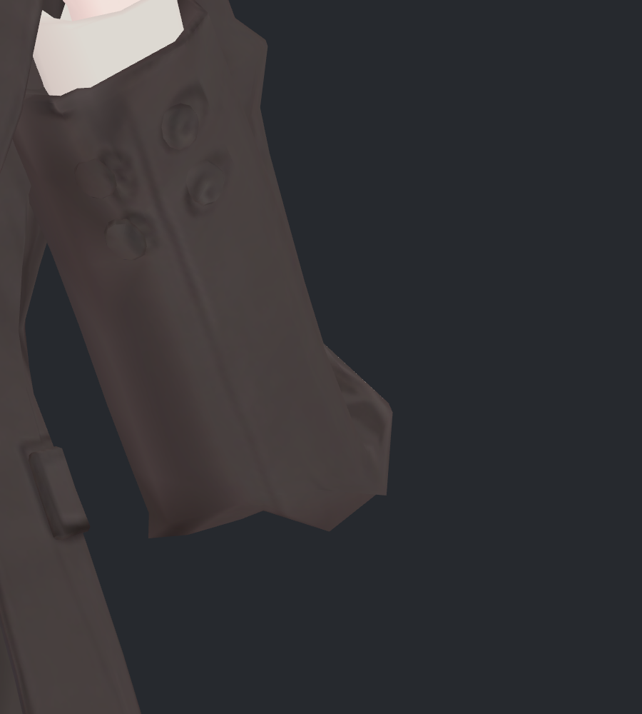
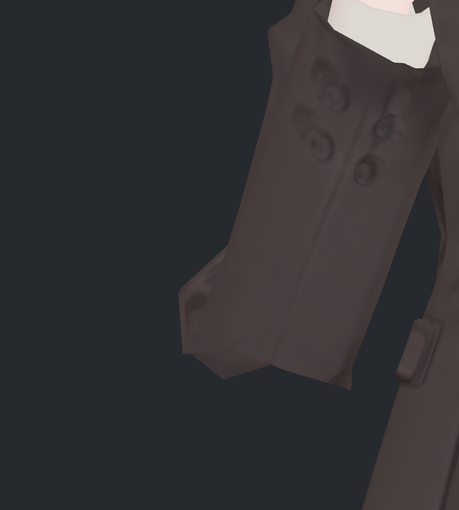
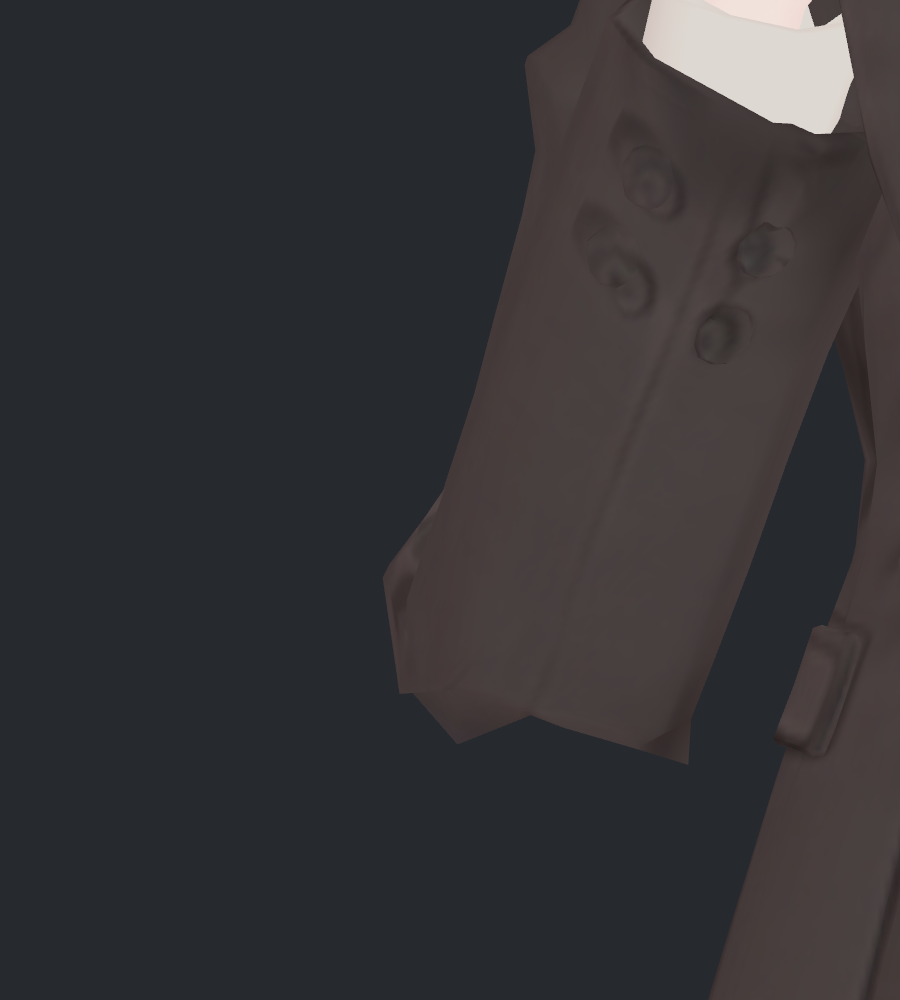
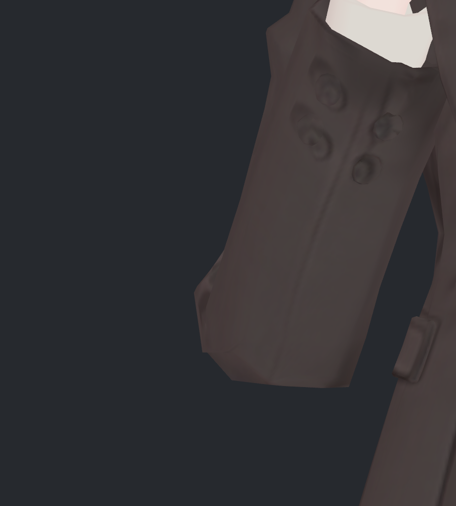
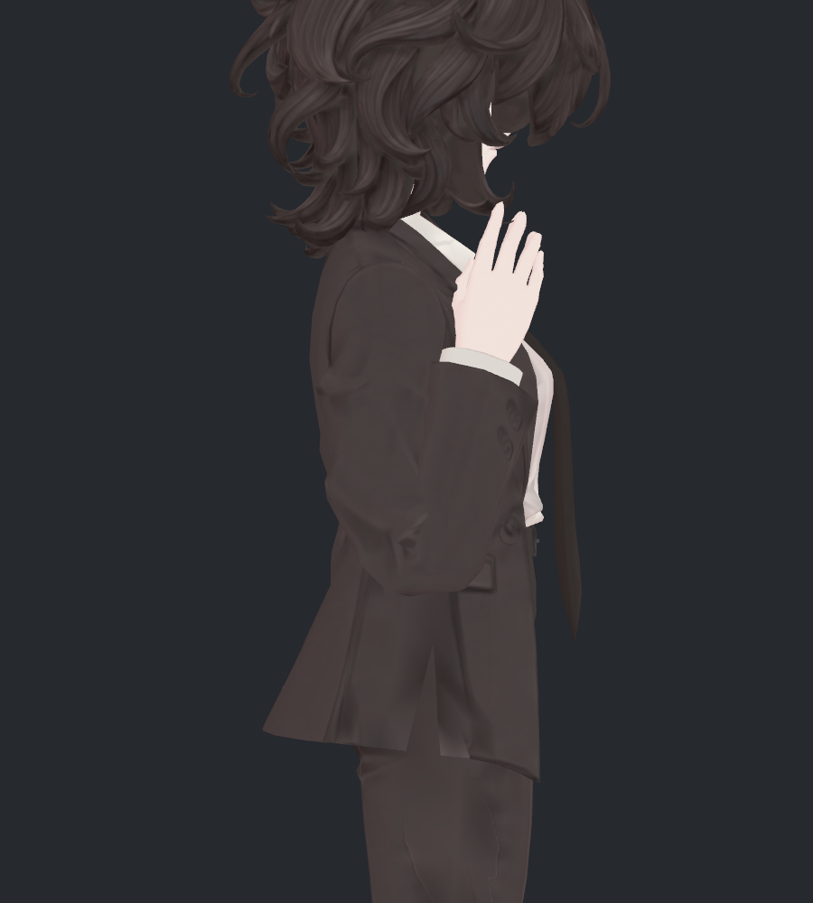
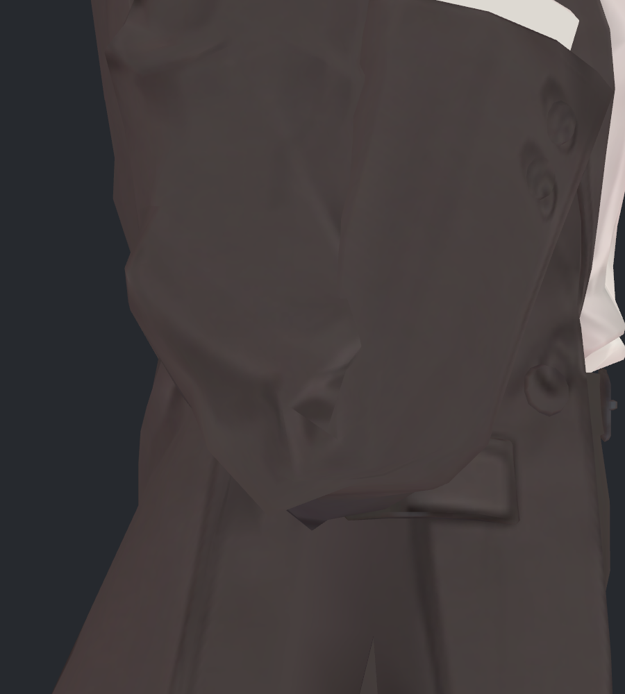
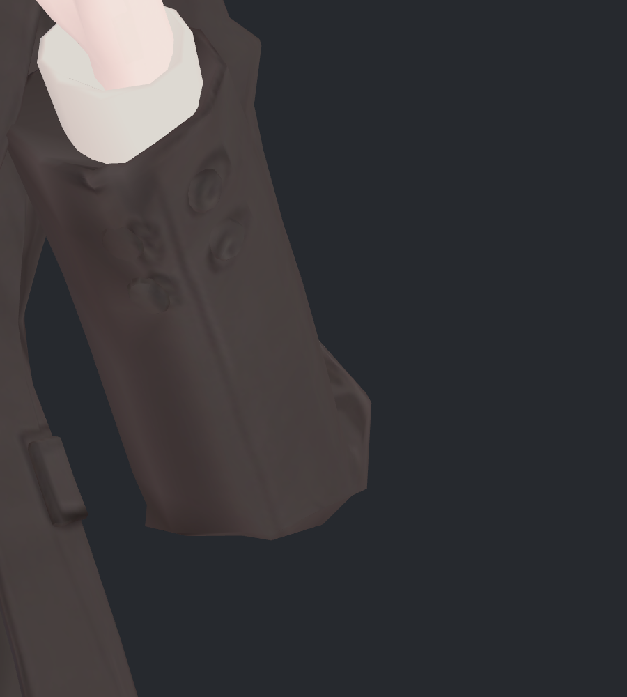
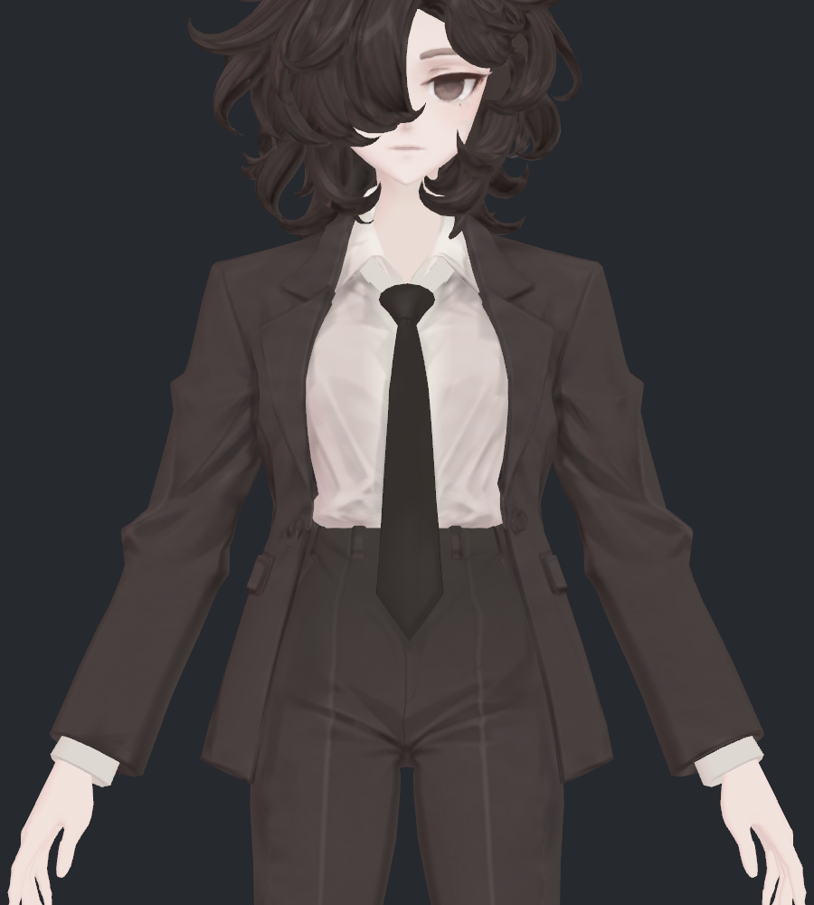

> **기록 시점 안내:** 아래는 해당 단계 당시의 보고서입니다. 후속 결정은 [최신 상태](../../STATUS.md)를 기준으로 읽어주세요. 모델·원본 텍스처·검증 원시 데이터는 이 문서 공유본에 포함하지 않습니다.

# v333 · 팔꿈치 아래 각짐 재수정과 원본 비교

팔을 앞으로 깊게 접었을 때 **소매 아래가 V자로 파이면서 두 개의 뾰족한 끝처럼 보이던 윤곽**을 수정했습니다. 여러 방법을 실제로 시험한 뒤, 움푹 들어간 중앙을 채워 아래 윤곽이 이어지도록 하는 보정을 선택했습니다. v332를 보존한 별도 사본입니다.

원본 v324, 직전 v332, 이번 v333을 같은 자세 입력·카메라·원래 재질로 비교한 **24장의 최종 사진을 직접 열어 검수**했습니다. 아래의 큰 V자 패임은 확실히 줄었지만, 바깥쪽의 작은 다각형 모서리와 원래 접힘 주름까지 모두 없어진 상태는 아닙니다. 사용자 최종 채택 전 검수 후보입니다.

[시도한 방법과 제외 이유](v333_ATTEMPTS.md) · [파일과 재현 안내](README.md)

## 정면 · 양쪽 팔꿈치

사진의 소매 **맨 아래 중앙이 위로 패이는 부분**을 비교해 주세요. 원본과 v332에서는 하단이 올라갔다 내려오며 두 개의 끝으로 갈라져 보이고, v333에서는 더 연속적인 하단으로 이어집니다.

| 원본 · v324 | 직전 · v332 | 이번 수정 · v333 |
|---|---|---|
|  |  |  |

### 왼쪽 팔꿈치 확대

| 원본 · v324 | 직전 · v332 | 이번 수정 · v333 |
|---|---|---|
|  |  |  |

### 오른쪽 팔꿈치 확대

| 원본 · v324 | 직전 · v332 | 이번 수정 · v333 |
|---|---|---|
|  |  |  |

왼쪽 사진의 바깥 돌출, 오른쪽 사진의 바깥 세로 모서리는 아직 각이 있습니다. 중앙 패임을 줄였다는 판정과 모든 각짐이 사라졌다는 판정을 구분합니다. 단추·봉제·주름의 원래 텍스처를 흐리게 지우는 처리는 하지 않았습니다.

### 아래 윤곽의 패임 깊이

| 같은 깊은 굽힘 자세의 측정 | 원본 v324 | 직전 v332 | 이번 v333 |
|---|---:|---:|---:|
| 왼쪽 | 5.2575mm | 5.2558mm | **0.7214mm** |
| 오른쪽 | 5.8975mm | 5.7286mm | **1.3890mm** |

고정한 정면 X 구간에서 실제 삼각형의 아래 외곽선을 구하고, 그 외곽선의 하단 볼록 포락선으로부터 올라간 최대 깊이를 측정했습니다. 전체 관절의 각도·주름 품질 점수는 아닙니다. 수치만으로 미관 합격을 선언하지 않고 위 사진과 함께 판단했습니다.

## 측면 · 부피와 접힘

| 원본 · v324 | 직전 · v332 | 이번 수정 · v333 |
|---|---|---|
|  |  |  |

| 원본 · v324 | 직전 · v332 | 이번 수정 · v333 |
|---|---|---|
|  |  |  |

측면 아래의 작은 뾰족한 꼬리가 줄고 하단이 조금 채워졌습니다. 상완에서 전완으로 이어지는 큰 접힘과 원래 주름은 유지되지만, v332와 측면 좌표가 완전히 같지는 않습니다. 아래가 다소 더 평평하고 풍부해진 차이가 있어 사진으로 확인할 부분입니다.

소매를 전반적으로 수축시키는 안은 제외했습니다. 최대 굽힘에서 선택한 네 구간의 닫힌 단면 적분 부피는 v332의 **100.07–100.37%**였고, 150도에서는 **100.03–100.72%**였습니다. 측정 구간은 상완 길이 55–85%, 전완 15–50%입니다. 전체 팔꿈치나 실제 옷감 부피를 모두 측정한 값은 아닙니다.

기준 깊은 굽힘의 기존 정점 최대 이동은 **7.233mm**입니다. 양쪽 변경 표면의 부호 있는 변화 부피는 **+20.53cm³**로, 이것 역시 실제 옷감 체적과는 다릅니다. 이 결과와 사진을 함께 사용해 ‘얇게 깎아서 각짐만 숨긴 안’이 되지 않았는지 확인했습니다.

## 덜 굽힌 자세와 기본 자세

### 150도

| 원본 · v324 | 직전 · v332 | 이번 수정 · v333 |
|---|---|---|
|  |  |  |

### 기본 자세

| 원본 · v324 | 직전 · v332 | 이번 수정 · v333 |
|---|---|---|
|  |  |  |

새 보정은 깊은 굽힘에 점진적으로 적용됩니다. 기본 좌표·웨이트를 바꾼 모델이 아니므로 기본 자세의 새 보정 값은 0입니다. 기존의 기본형, UV, 노멀, 토폴로지, 본, 텍스처와 재질은 보존했습니다.

## 강하게 앞으로 모으기

| 원본 · v324 | 직전 · v332 | 이번 수정 · v333 |
|---|---|---|
|  |  |  |

강한 모으기는 v332의 기존 보정을 유지합니다. 이 기준 자세에서 v332와 v333의 정점 차이는 **0mm**입니다. 이 사진의 주름이 v324보다 줄어든 부분은 이전 v332에서 이미 반영된 변화이며 이번 성과로 중복 계산하지 않았습니다. 큰 비틀림에서도 새 보정이 꺼지도록 했습니다. 앞서 보류한 ① 작은 비틀림 교차는 수정 대상으로 다시 포함하지 않았습니다.

## 실제 수정 범위와 확인 결과

| 항목 | 결과 |
|---|---|
| 수정 방식 | 기존 메시의 자세 보정 2개 추가, v332의 기존 30키 정확 보존 → 총 32키 |
| 영향 정점 | Blender 기존 172점 · Unity 분리 정점 348점 |
| 기본형 | 정점 좌표·UV·노멀·면·웨이트 유지, 기존 129본 유지 |
| 추가 구조 | 회전 정렬 측정점 4개; Unity Contacts 4개 추가, 팔꿈치 관련 총 10개 |
| 생성·대체 메시 / 컷 / 새 본 | 0 / 0 / 0 |
| Unity 재생 검사 | 정적 23 + 연속 181 + 복귀 1 = 205기록, 유한 좌표·복귀 확인 |
| 추가 실제 자세 검사 | 비틀림 13단계, 중간 모으기, 좌우 단독 굽힘 등을 포함한 40기록 |
| 새 몸 교차·자기 교차 | 원래 23 + 추가 40기록의 변경 영향 범위에서 각 0 |
| Blender 구동 검사 | 실제 Unity 본 자세 23개 × 양쪽 = 46값, 계산식 대비 최대 오차 0.000739 |
| 원본 / 사용자 Unity 장면 | 원본·레퍼런스 10파일 해시 동일 / 장면 경로·수정 상태 동일 |

63은 기본·복귀 중복을 포함한 **검사 기록 수**입니다. 교차 검사는 공유 정점을 제외한 비공면 삼각형의 0.05mm 초과 교차를 대상으로 했습니다. 기존 교차가 모두 없어졌다는 뜻은 아니며, 공면 겹침과 연속 동작의 모든 순간을 전수 검사한 것도 아닙니다. 이번 실행 환경은 Unity SDK Play Mode이며 VRChat 클라이언트 검증은 별도입니다.

최종 사진은 SDK Contacts로 실제 구동한 정점·노멀을 렌더했습니다. 원본 v324는 기존 실제 기록을 사용했고 위치 정밀도 차이 상한은 0.000275mm입니다. AI 보정이나 사진 위에 윤곽을 덧그리는 후처리는 하지 않았습니다. 별도 셰이더 후보는 합치지 않았습니다.

## 최종 판정

큰 V자 패임의 개선을 확인한 **v333 검수 후보**입니다. 양쪽 아래 윤곽이 더 연속적으로 이어지는 점이 이번 변경의 핵심입니다. 작은 바깥 모서리·면의 꺾임·원래 주름은 남아 있으며, 모든 관절이나 모든 비틀림까지 완료했다고 표시하지 않습니다. 최종 모델은 `bianca_v333_ELBOW_CONTOUR_REVIEW.blend`, Unity 전달본은 `Bianca_v333_ElbowReview.unitypackage`입니다.
