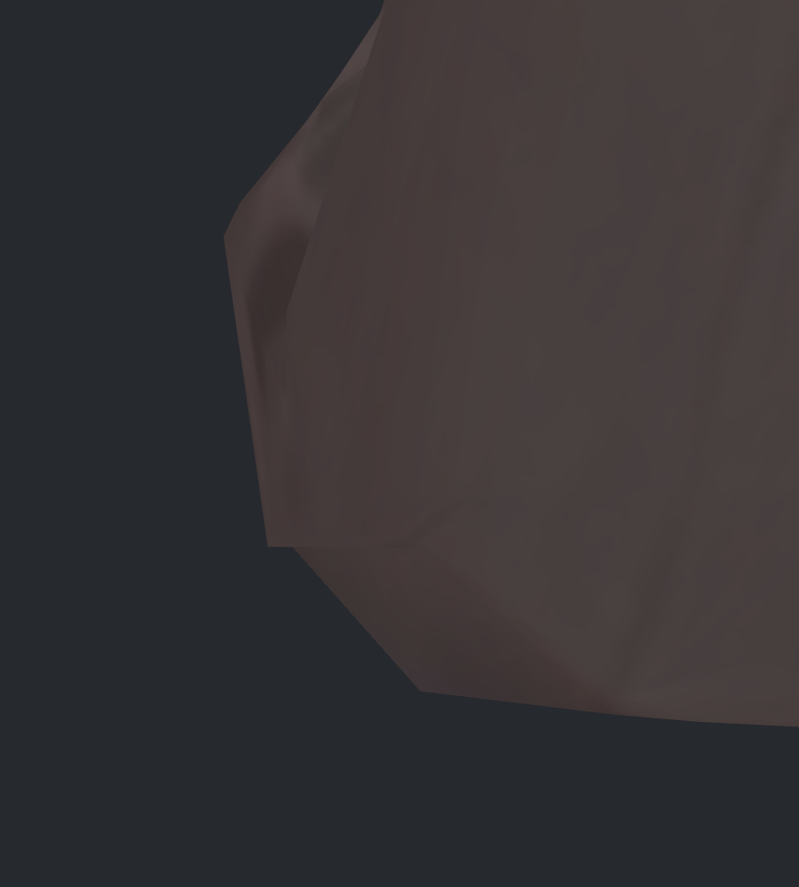
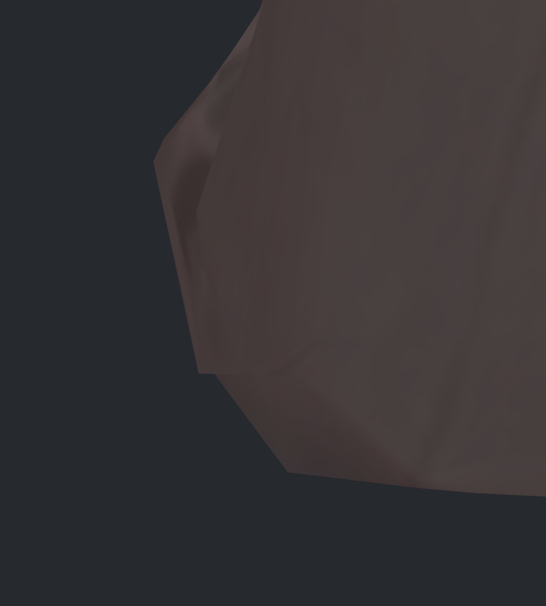
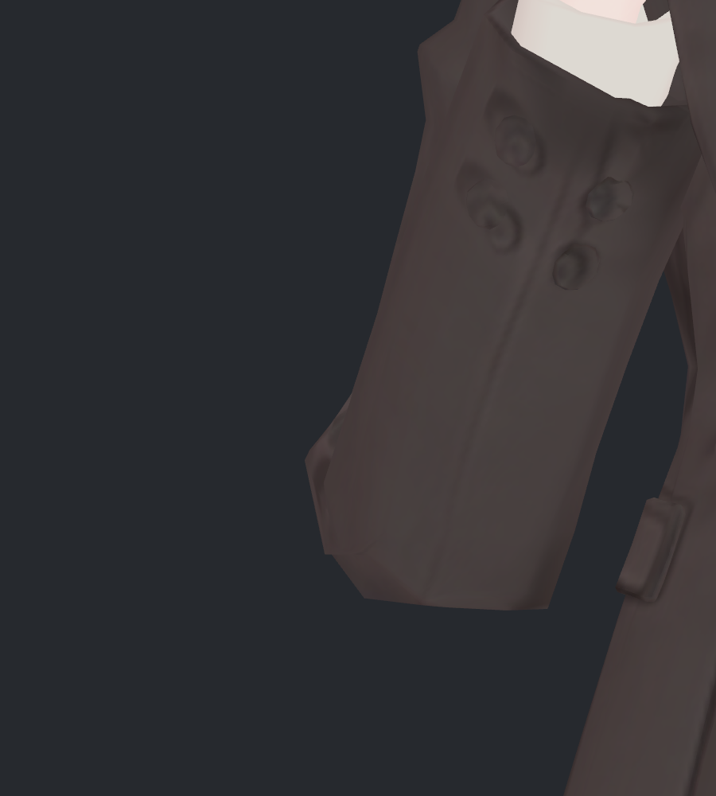
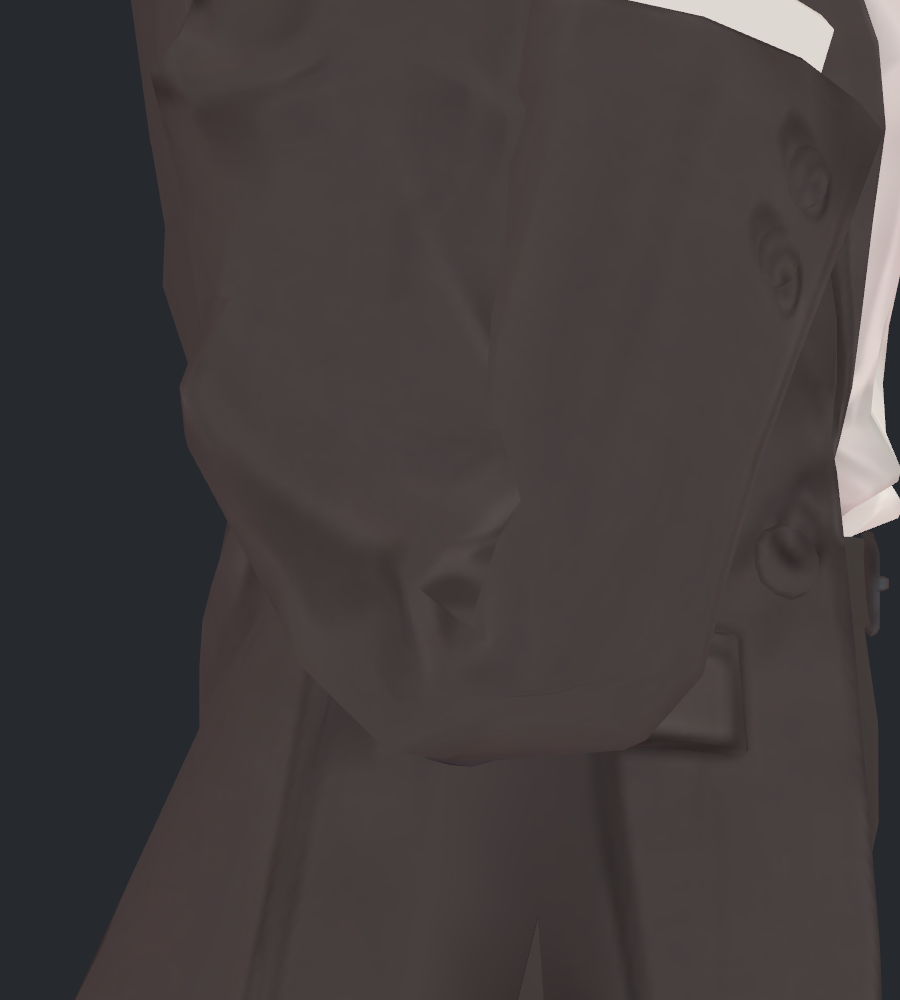
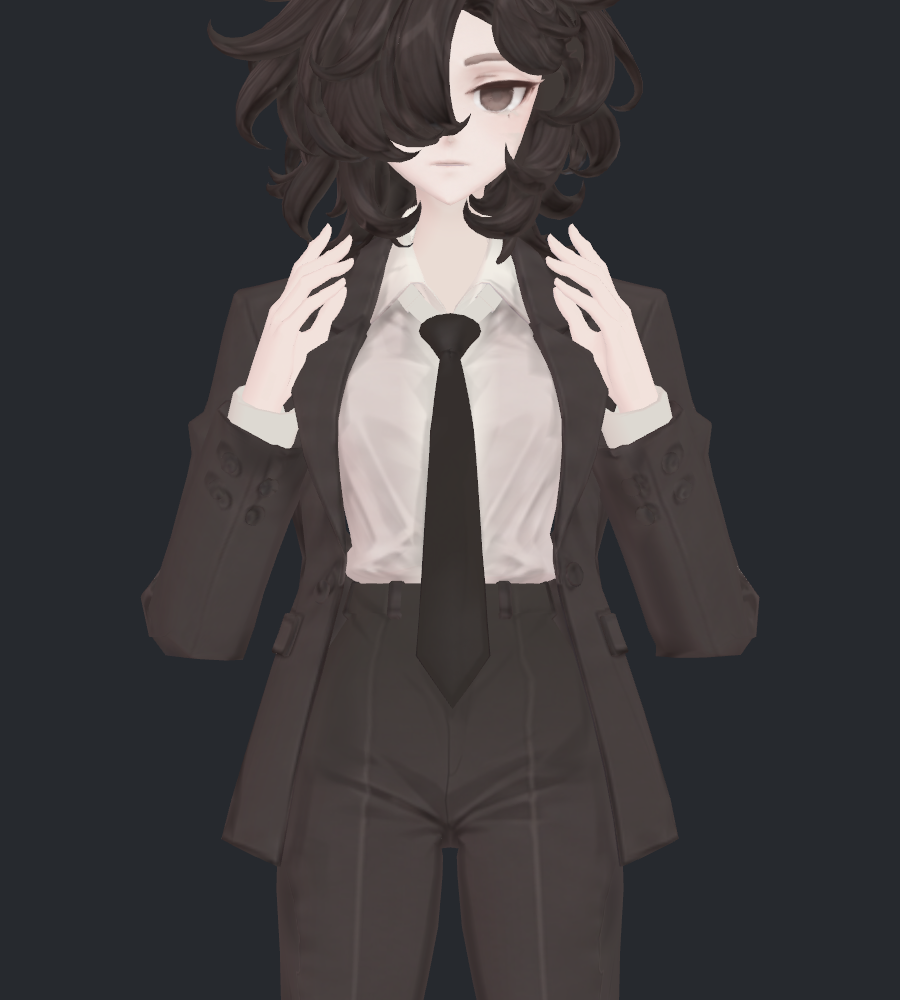
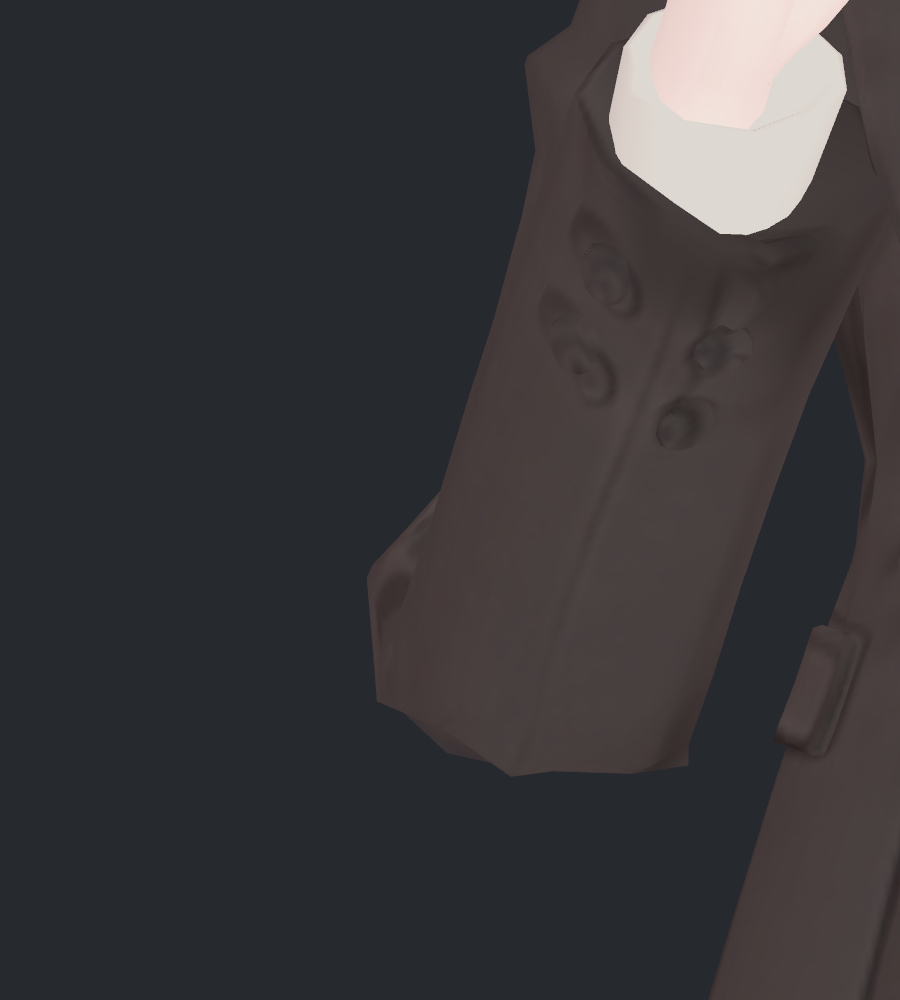
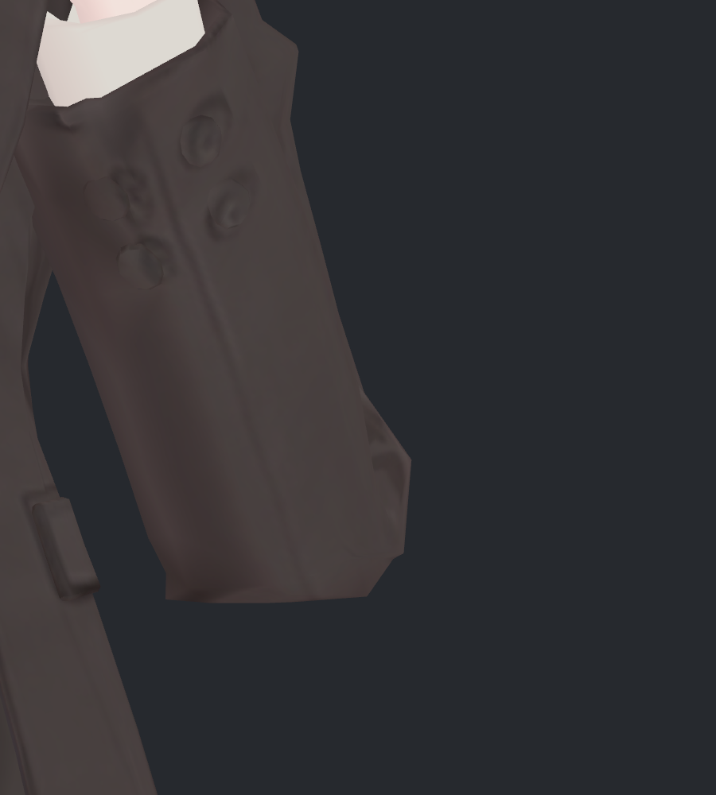

> **기록 시점 안내:** 아래는 해당 단계 당시의 보고서입니다. 후속 결정은 [최신 상태](../../STATUS.md)를 기준으로 읽어주세요. 모델·원본 텍스처·검증 원시 데이터는 이 문서 공유본에 포함하지 않습니다.

# v334 · 오른쪽 팔꿈치 끝의 수직 윤곽 미세 조정

사용자가 표시한 **오른쪽 팔꿈치 바깥 끝의 짧게 수직으로 떨어지는 부분**만 조금 조절했습니다. v333을 별도 보존하고, 해당 구간의 아래쪽을 약간 안으로 기울였습니다. 최대 이동은 **1.396mm**, Blender 기존 **13점**입니다.

아래의 전후 16장을 직접 열어 확인했습니다. 큰 외형 변화가 아니라 끝의 기울기를 조금 완화한 수정입니다. 직선 면 경계와 작은 아래 모서리는 남아 있으며, 둥근 곡면으로 전부 바꾼 상태는 아닙니다.

## 요청 부위 · 같은 확대

| 수정 전 · v333 | 수정 후 · v334 |
|---|---|
|  |  |

확대 화면 왼쪽의 거의 수직인 선을 비교하면, 아래 끝이 살짝 안쪽으로 들어갔습니다. 해당 실제 메시 변의 정면 투영 기울기는 수직 기준 **8.10도 → 12.07도**입니다. 아래 높이는 유지했으며, 작은 수평 턱과 다음 사선으로 이어지는 면 경계는 남겼습니다.

### 원래 사진과 같은 크기

| 수정 전 · v333 | 수정 후 · v334 |
|---|---|
|  |  |

일반 확대에서는 변화가 작습니다. v333에서 정리한 하단 중앙의 패임과 소매 전체 부피를 다시 크게 바꾸지 않는 범위로 맞췄습니다.

## 측면과 부피 확인

| 수정 전 · v333 | 수정 후 · v334 |
|---|---|
|  |  |

기준 깊은 굽힘에서 측면 투영 좌표 차이 최대는 **0.000060mm**로 사실상 같은 윤곽입니다. 옆으로 비틀거나 덜 굽힌 모든 자세에서 투영이 완전히 같다는 뜻은 아닙니다.

선택한 오른쪽 전완 구간의 닫힌 단면 적분 부피는 v333의 **99.976%**였습니다. 왼쪽과 상완의 같은 검사 구간은 **100%**입니다. 오른쪽 전완 15–50%, 상완 55–85% 구간을 측정했으며 전체 옷감 체적을 보증하는 수치는 아닙니다. 변경 표면의 부호 있는 변화 부피는 **−0.768cm³**입니다. 옆모양과 국소 부피 변화가 매우 작은 안으로 확인했습니다.

## 전체 자세 및 유지 확인

### 깊은 굽힘 정면

| 수정 전 · v333 | 수정 후 · v334 |
|---|---|
|  |  |

### 150도 굽힘

| 수정 전 · v333 | 수정 후 · v334 |
|---|---|
|  |  |

### 반대쪽 팔꿈치

| 수정 전 · v333 | 수정 후 · v334 |
|---|---|
|  |  |

### 기본 자세

| 수정 전 · v333 | 수정 후 · v334 |
|---|---|
|  |  |

### 강한 모으기

| 수정 전 · v333 | 수정 후 · v334 |
|---|---|
|  |  |

왼쪽 팔꿈치는 편집하지 않았습니다. 기본 자세·강한 모으기·큰 비틀림에서 새 차이가 생기지 않도록 v333의 기존 구동 조건을 그대로 사용합니다. 강한 모으기 기준 자세의 실제 v333 대비 정점 차이는 0mm입니다.

## 시도와 수정 과정

| 시도 | 결과 |
|---|---|
| 약 0.8mm | 변화가 너무 작아 최종 비교에서 우선하지 않음 |
| 약 1.4mm · 처음 14점 | 정면 기울기는 적당했으나 복합 자세 하나에서 0.071mm 길이의 새 내부 교차 1쌍 발견 |
| 약 1.4mm · 내부 1점 제외, 최종 13점 | 원하는 끝 변화 유지, 실제 SDK의 원래 23 + 추가 40기록에서 새 교차 0 |

초기 내부 교차가 생긴 정점은 윤곽을 직접 만드는 변과 다른 내부 접힘 점이어서 원래 위치로 유지했습니다. 수정 범위를 넓혀 주변 전체를 변형하는 대신 해당 점을 대상에서 제외했고, 최종 모델을 다시 검증했습니다.

검사 스크립트를 복사하는 과정에서는 Unity 실행 상태 식별자가 이전 v333과 겹쳐 실행이 충돌했습니다. v334 전용 이름으로 고친 뒤 본 검사와 추가 검사를 다시 수행했습니다. v333의 현재 비교 캐시는 버전 관리된 원래 정점 증거와 최대 차이 0m였으며, 원본 모델·패키지·키·프리팹 4파일 해시도 그대로입니다. 실행 기록이 없던 상태를 검증 성공으로 사용하지 않았습니다.

## 변경 범위와 검증

- 오른쪽의 기존 자세 키 `V333_ElbowContour_R` 하나만 새 사본에서 수정했습니다. 이름과 구동 조건은 유지하며, 다른 31키는 정확히 보존했습니다. 전체 키 수는 32입니다.
- Blender 기존 13점, Unity 분리 정점 31점에만 위치 델타가 추가됐습니다. 기본 좌표·UV·노멀·면·웨이트·129본은 유지했습니다. 새 메시·컷·본·Contacts·컨트롤러는 추가하지 않았습니다.
- 실제 Unity SDK 재생에서 정적 23 + 연속 181 + 복귀 1 = 205기록을 확인했습니다. 좌표 유한성 통과, 기본 자세 복귀 오차 0mm입니다.
- 비틀림·중간 모으기·한쪽 굽힘을 포함한 추가 40기록도 실제로 실행했습니다. 원래 23 + 추가 40기록의 이번 변경 영향 범위에서 새 몸 교차·자기 교차는 각 0입니다. 기본·복귀 중복을 포함한 기록 수이며 63개의 고유 자세라는 뜻은 아닙니다.
- 교차 판정은 공유 정점을 제외한 비공면 삼각형의 0.05mm 초과 교차입니다. 기존 교차·공면 겹침·연속 동작 모든 순간의 교차가 전부 해결됐다는 뜻은 아닙니다. VRChat 클라이언트 검증은 별도입니다.
- 최종 사진은 실제 SDK 구동으로 얻은 정점과 노멀, 원래 재질을 사용했습니다. 사진 위 윤곽 보정은 하지 않았습니다. Blender 저장 후 재로드와 Unity 장면 보존도 확인했습니다.

검수 후보는 `bianca_v334_ELBOW_TIP_REVIEW.blend`와 `Bianca_v334_ElbowReview.unitypackage`입니다. v333에서 크게 바꾼 하단을 유지하면서 요청한 끝의 기울기만 소폭 다듬은 결과이며, 사용자 최종 채택 전입니다.
