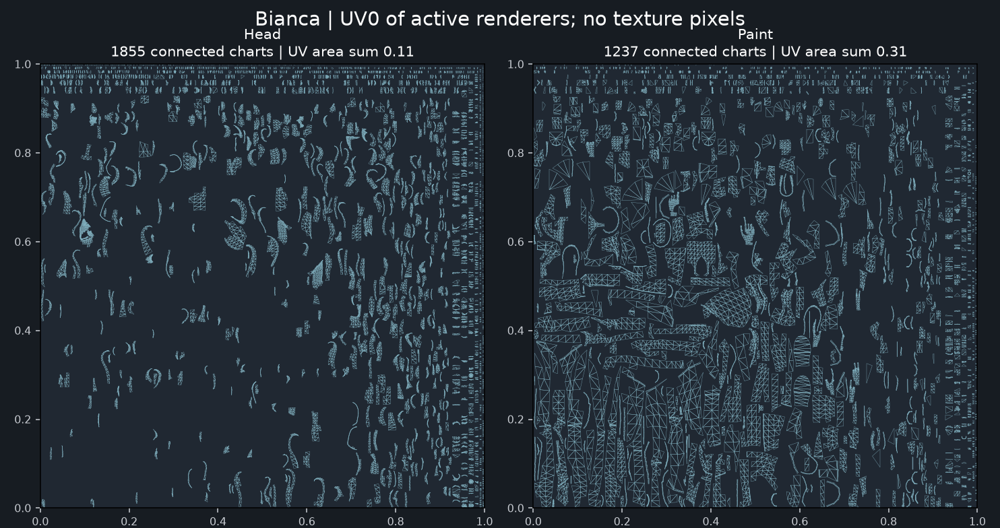
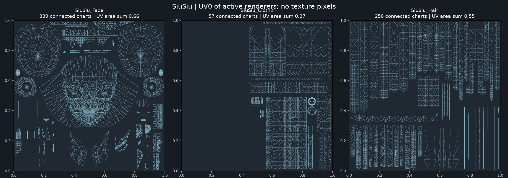
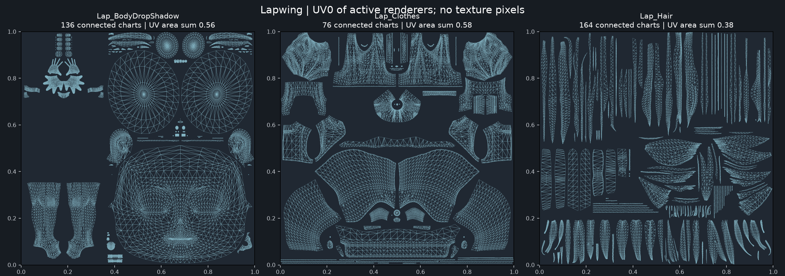
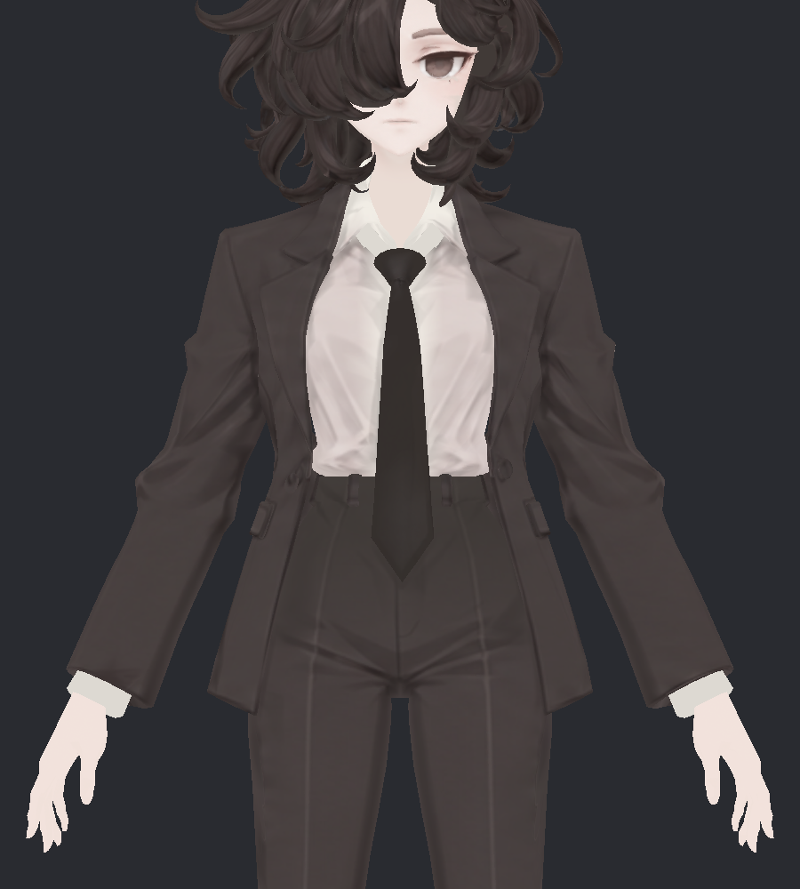
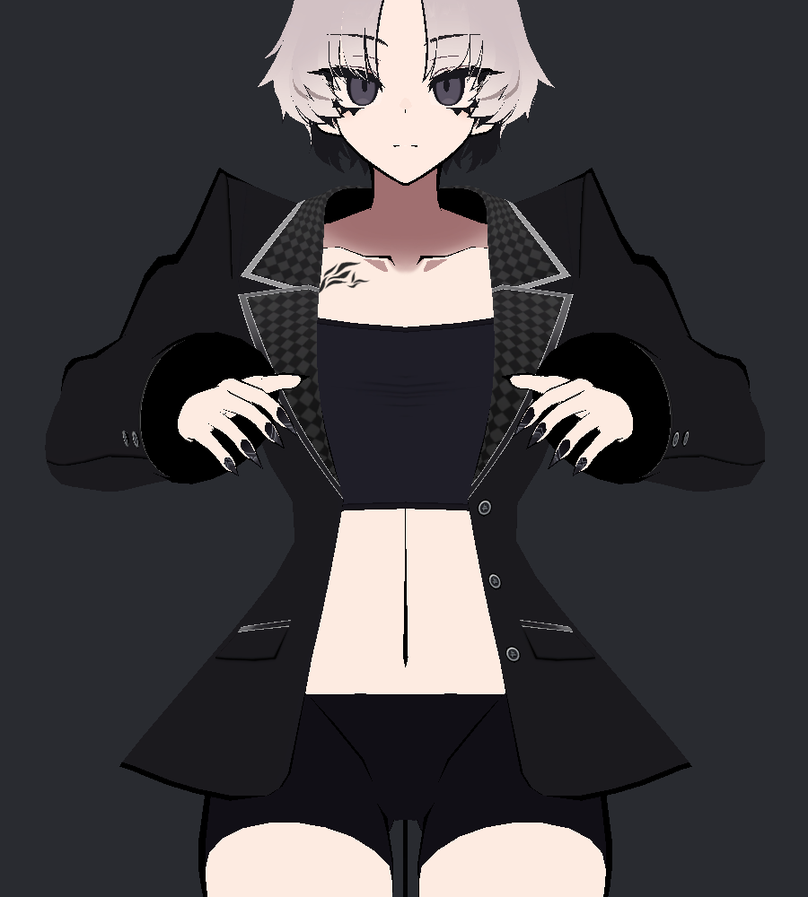
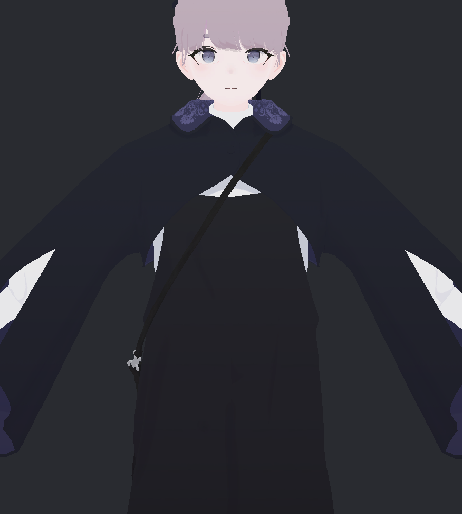

> **기록 시점 안내:** 아래는 해당 단계 당시의 보고서입니다. 후속 결정은 [최신 상태](../../STATUS.md)를 기준으로 읽어주세요. 모델·원본 텍스처·검증 원시 데이터는 이 문서 공유본에 포함하지 않습니다.

# v335 · 비앙카 / SiuSiu / Lapwing UV·텍스처 비교

2026-09-12 · 비교 조사 완료 / 새 UV·텍스처 적용 없음 / 관절 작업 v334에서 일시 중단

현재 비앙카의 개선 우선순위는 **4K보다 큰 이미지를 쓰는 것보다, 잘게 흩어진 UV를 부위별로 정리하고 텍스처에 남길 명암·디테일을 구분하는 것**입니다. SiuSiu는 선명한 무늬·테두리와 재질 광택의 분리가 두드러지고, Lapwing은 큰 색면과 선택한 무늬·그림자를 간결하게 배치합니다. 비앙카의 원래 주름·신발 장식·머리 결까지 지우면 이전 디테일 손실을 반복합니다.

## 1. 실제 비교 범위

비앙카 v334 프리팹(텍스처·재질은 v324), SiuSiu의 BlazerOnly 착장, Lapwing의 기본 착장을 Unity 2022.3.22f1의 별도 미리보기 장면에서 읽었습니다. 원래 재질 렌더와 주요 효과를 끈 렌더, UV0·머티리얼·텍스처 가져오기 설정을 함께 확인했습니다. 비활성 의상도 원시 UV·재질 목록에 포함했지만 아래 합계는 선택 착장의 활성 렌더러 기준입니다.

세 모델의 의상·기본 자세·체형은 다릅니다. 흰 방향광 1개, 그림자·후처리 없는 직교 카메라 900×1000이며 머리–발 높이를 이용해 구도를 맞췄습니다. 실제 cm당 픽셀이나 포즈가 완전히 같은 품질 순위표는 아닙니다. SiuSiu의 신발은 이 착장에서 비활성이라 신발 세 모델 비교를 했다고 주장하지 않습니다.

## 2. 가장 큰 차이

| 항목 | 현재 비앙카 | SiuSiu | Lapwing |
|---|---|---|---|
| UV 구성 | 머리·얼굴 및 몸·의상 아틀라스에 작은 조각이 많이 분산 | 얼굴·피부·머리·의상 등 용도별 구성, 의상 패널과 머리 스트립 | 얼굴·머리·옷·신발/가방 등 구분, 옷 패널이 비교적 연속적 |
| 색 표현 | 주름과 넓은 밝고 어두운 변화가 기본색에 강하게 남음 | 체크·파이핑·단추는 색 정보, 넓은 광택은 재질 효과 의존이 큼 | 큰 색면, 옷깃 무늬, 선택한 그림자·홍조 등이 중심 |
| 가까이 보이는 요소 | 주름·장식은 있으나 신발 윗면과 일부 음영 경계가 부드럽게 뭉쳐 보임 | 체크 패턴·흰 테두리·손톱처럼 구분할 요소가 명확 | 옷깃 무늬·신발 리본과 밑창의 구분이 명확 |
| 재작업 편의 | 연속된 선·재봉선·그림자를 여러 UV 조각에 나누어 수정해야 함 | 부위별 패널을 따라 수정하기 쉬운 배치 | 큰 영역과 장식 영역을 구별하기 쉬운 배치 |

이 차이는 디자인과 메시 형태, 외곽선 효과도 포함합니다. 리본의 선명함을 모두 텍스처의 성능으로 보거나, SiuSiu의 옷 재질을 비앙카 정장에 그대로 복제하는 목표로 삼지 않습니다.

## 3. UV를 실제로 펼쳐 본 차이

비앙카는 Head 1,855조각, Paint 1,237조각입니다. 두 아틀라스 합계 3,092조각 중 1,412개는 삼각형 4개 이하의 작은 조각입니다. 특히 얼굴·머리와 코트·손·바지·신발을 사람이 알아보기 쉬운 큰 영역으로 이어 수정하기 어렵습니다. 이 분산은 재작업과 경계 관리에 불리하지만, 조각 수 자체가 지금 보이는 모든 얼룩의 원인임을 입증한 것은 아닙니다.

| 선택 영역 | UV 조각 수 | 삼각형 UV 면적 합 / 아틀라스 면적 |
|---|---:|---:|
| 비앙카 Head | 1,855 | 10.8% |
| 비앙카 Paint | 1,237 | 31.0% |
| SiuSiu Cloth2 · 현재 블레이저 | 57 | 37.2% |
| SiuSiu Hair · 스텐실 포함 | 250 | 55.3% |
| Lapwing Clothes · 볼레로+오버올 | 76 | 57.9% |
| Lapwing Hair | 164 | 37.6% |

측정은 Unity UV0에서 같은 위치·UV를 공유하는 변으로 연결한 삼각형 묶음입니다(좌표 1e-6 반올림, 렌더러·서브메시 단위). 노멀 때문에 분리된 같은 점은 연결하되 UV 절단은 유지했습니다. 재질·렌더러를 넘는 묶음은 합치지 않았습니다. **면적 합은 겹침을 중복 계산하므로 정확한 점유율이나 빈 공간 비율이 아닙니다.** 선택 의상 밖의 텍스처 영역, 숨은 면·알파 영역 차이도 있습니다.

참고 모델도 얼굴 스텐실·손톱·신발 부품 등 작은 조각을 사용합니다. 머리카락의 좁은 띠 UV 역시 의도된 색 배치일 수 있습니다. 모든 섬을 무조건 합치거나 늘어남 수치만으로 품질을 판정하지 않습니다. 비앙카의 코트 UV 삼각형 늘어남 P95는 약 1.19로, 이번 핵심은 심한 늘어남보다 배치·분절과 채색 구조입니다.

## 4. 해상도 부족인가?

| 현재 로컬 가져오기 | 비앙카 | SiuSiu | Lapwing |
|---|---:|---:|---:|
| 활성 고유 MainTex | 2장 | 7장 | 6장 |
| 주요 가져오기 크기 | Head·Paint 각 4096² | 얼굴·옷 1024², 머리 512², 피부 2048² | 몸·옷 2048², 머리 1024² |
| MainTex 픽셀 합 | 33.55M | 7.93M | 10.81M |
| 활성 재질 / 렌더러 | 4 / 2 | 9 / 10 | 7 / 8 |

SiuSiu의 얼굴·옷·머리 원본 PNG는 각각 4096²지만 현재 프로젝트에서는 위 크기로 축소되어 들어옵니다. 이는 **이 로컬 프로젝트의 현재 설정**이며 제작사 배포 기본값이라고 단정하지 않습니다. 비앙카 두 장은 4K 무압축입니다. 따라서 현 상태의 부드러운 인상을 단순히 텍스처 파일 크기가 작아서라고 설명하기 어렵습니다.

재질 수는 드로콜 실측이 아니고 픽셀 합은 VRChat 메모리나 FPS 실측이 아닙니다. 조사 데이터의 Editor 런타임 메모리는 CPU 사본·백엔드 형식 등의 영향을 포함하므로 실제 VRAM 수치로 제시하지 않습니다. 압축·크기 최적화는 디테일을 보존하는 별도 비교 실험이 필요합니다.

## 5. 텍스처와 재질 효과 분리

아래는 **원래 lilToon의 투명도·컬링·스텐실을 유지하며 주요 조명·반사·외곽선 효과를 끈 진단**입니다. 순수 원본 텍스처 픽셀만 표시한 화면은 아닙니다. 원래 재질 사진과 얼굴 확대는 [사진 문서](v335_GALLERY.md)에서 나란히 볼 수 있습니다.

| 비앙카 · 효과 해제 | SiuSiu · 효과 해제 | Lapwing · 효과 해제 |
|---|---|---|
|  |  |  |

비앙카 셔츠·소매의 명암이 강하게 남습니다. SiuSiu는 넓은 흰 광택이 줄어도 체크·파이핑·단추가 남습니다. Lapwing은 옷깃 무늬와 기본 색면이 유지됩니다. 이 결과로 비앙카의 개선은 색면을 전부 평평하게 만드는 방식보다, **원래 구조를 설명하는 주름은 남기고 의미 없는 번짐만 국소 정리하는 방향**이 적절하다고 판단합니다.

## 6. 부위별 후속 목표

| 부위 | 이번 확인 / 다음 개선 |
|---|---|
| 코트·소매·셔츠 | 밝은 주름과 어두운 접힘이 기본색에 많이 남음. 소매 또는 코트 한 패널부터 연속 UV 시험, 봉제선·라펠·주름 구분 보존 |
| 머리 | 결·골의 명암이 강하게 남음. 가닥 방향에 맞는 UV 정리와 명암 폭 조절을 검토하되 웨이브와 머리 볼륨 유지 |
| 얼굴·손 | 얼굴 주변과 손의 안정적인 색 경계·손톱 분리가 목표. 표정·이목구비와 원래 색조를 먼저 보존하고 새 UV 전사 오차부터 확인 |
| 바지·신발 | 바지 접힘과 신발 띠·밑창이 원래 디자인. 사진에서 신발 윗면의 부드러운 얼룩과 구조선이 섞여 보이므로 띠·앞코·밑창별로 분리 검수 |
| 코트 안·가려진 피부·옆/뒤 | 데이터 목록은 포함. 이번 정면 중심 사진으로 전부 시각 합격한 것은 아님. 후속에는 가림을 푼 사본에서 앞뒤·안쪽 및 밉 경계까지 검사 |

비앙카 원래 방향별 레퍼런스와 v324를 보존 기준으로 삼습니다. v323의 전체 평활화와 새 UV에서 일부 의상 면적 축소로 디테일이 줄었던 접근은 반복하지 않습니다. v324에서는 원래 밀도로 돌아가 작은 겹침만 조정했으므로, 이번에는 연속 패널 UV의 이점을 국소 사본으로 다시 확인할 수 있습니다.

## 7. 시도한 방법과 제한

처음 공통 무조명 셰이더로 치환했을 때 SiuSiu의 얼굴·앞머리 표시가 깨졌습니다. 원래 컬링·스텐실 처리를 잃은 **진단 실패**여서 UV나 텍스처 결함의 증거로 채택하지 않았습니다. 원래 셰이더를 유지하고 효과만 끄는 방식으로 다시 렌더해 확인했습니다. 실패 사진·스크립트는 작업 기록에만 분리 보존했습니다.

최종 공유 사진 17장과 UV 도식 3장을 직접 열어 확인했습니다. SiuSiu 하퇴 확대는 발이 잘려 공유 비교에서 제외했습니다. 세 프리팹의 기록된 의존 파일 해시, v334 전달 4파일 해시, 미리보기 전후 사용자 장면 상태가 유지되었습니다. 모델·UV·텍스처·본 수정 0입니다. 정확한 밉 번짐, 모든 숨은 면의 시각 품질, 압축 후 품질과 VRChat 실행 성능은 이번에 검증하지 않았습니다.

다음 실행 순서와 합격 기준은 [개선 계획](v335_IMPROVEMENT_PLAN.md)에 정리했습니다.
