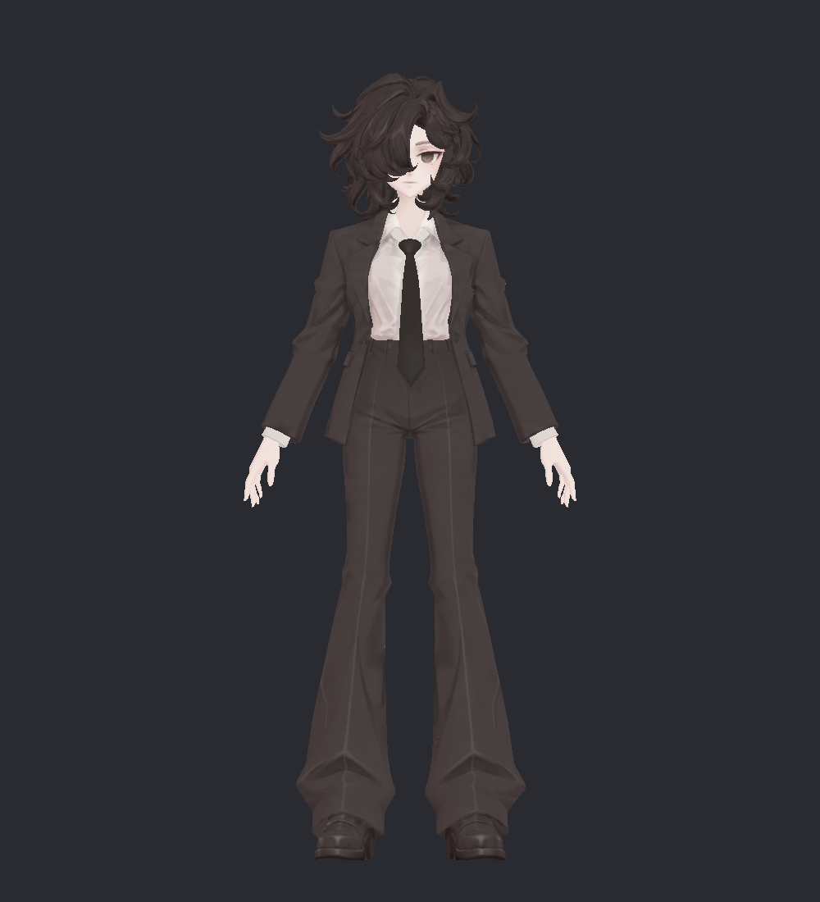
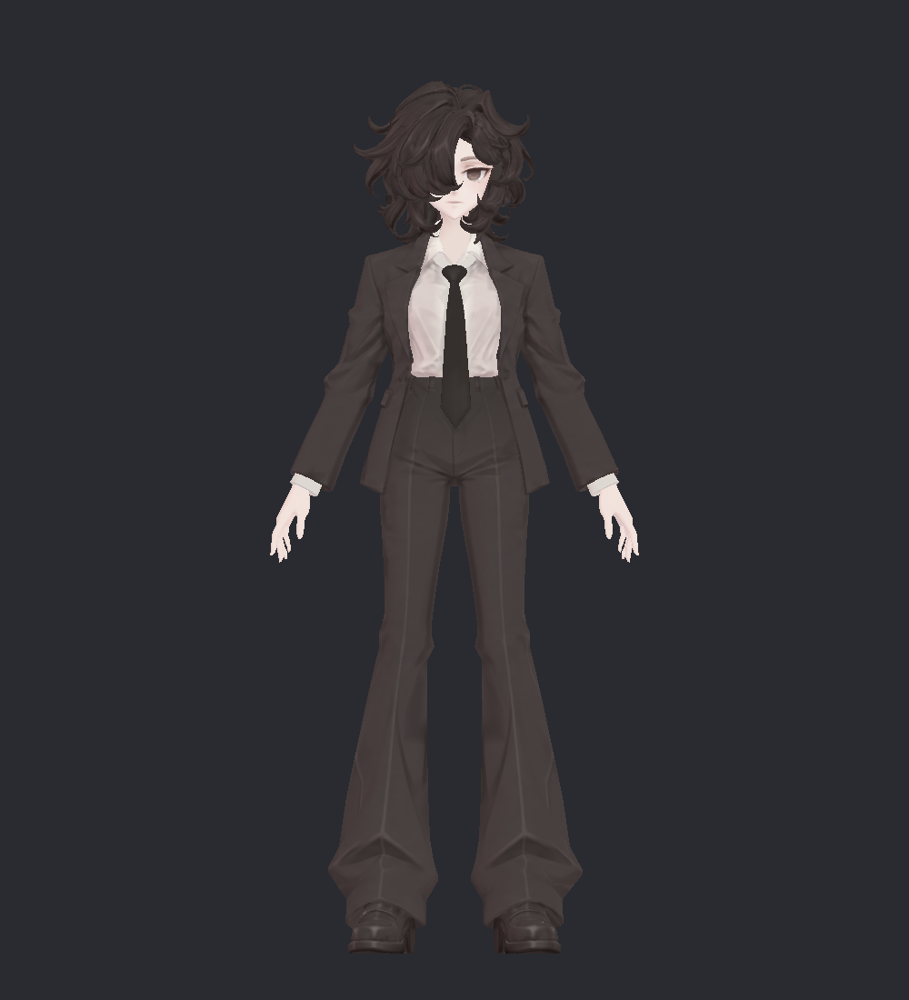
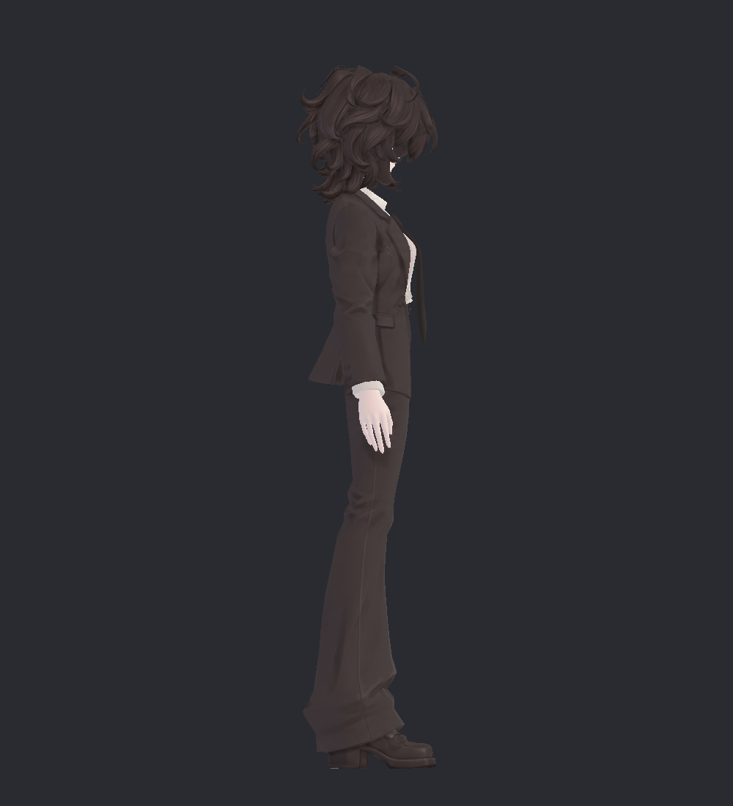
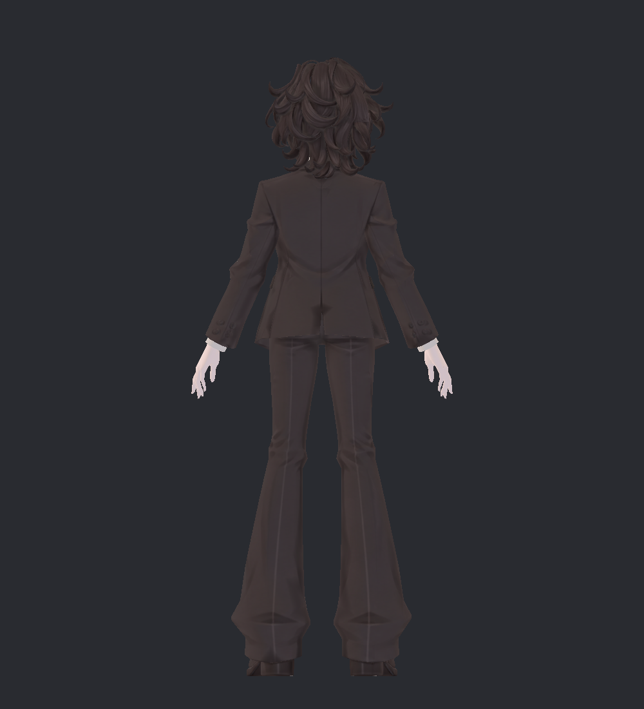
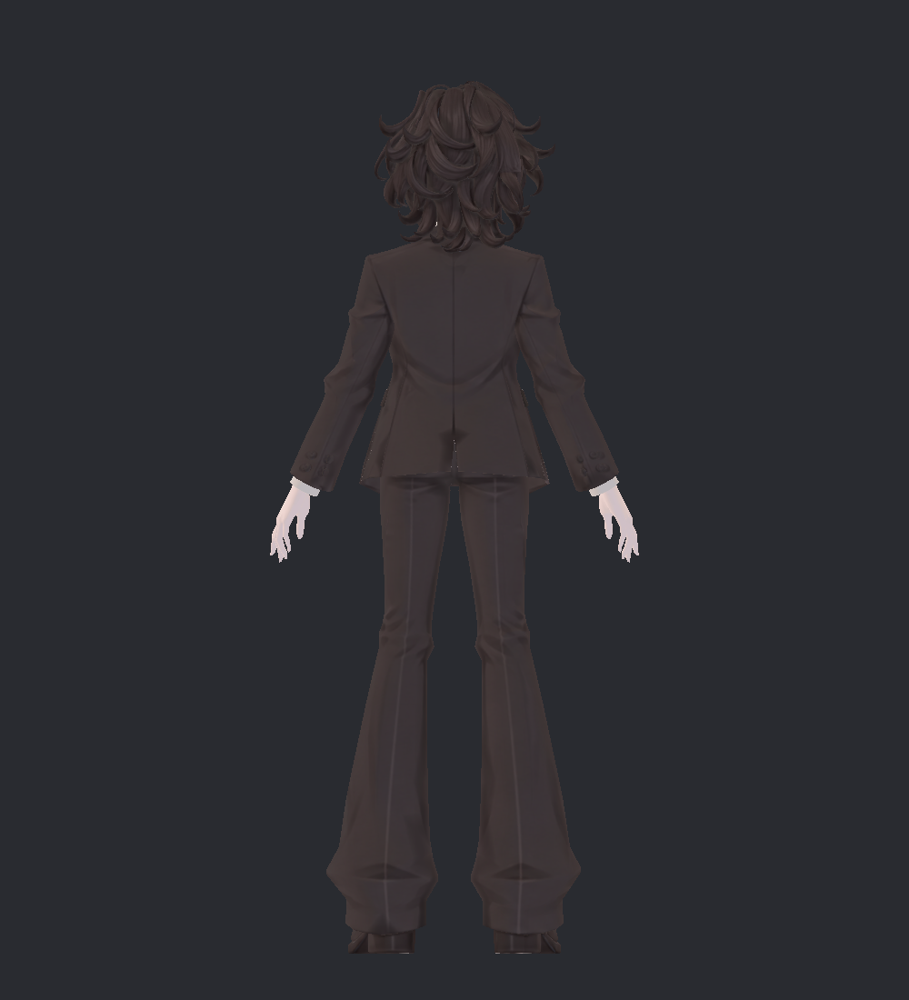
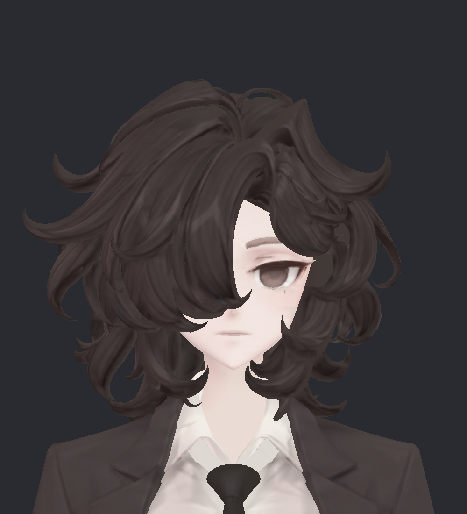
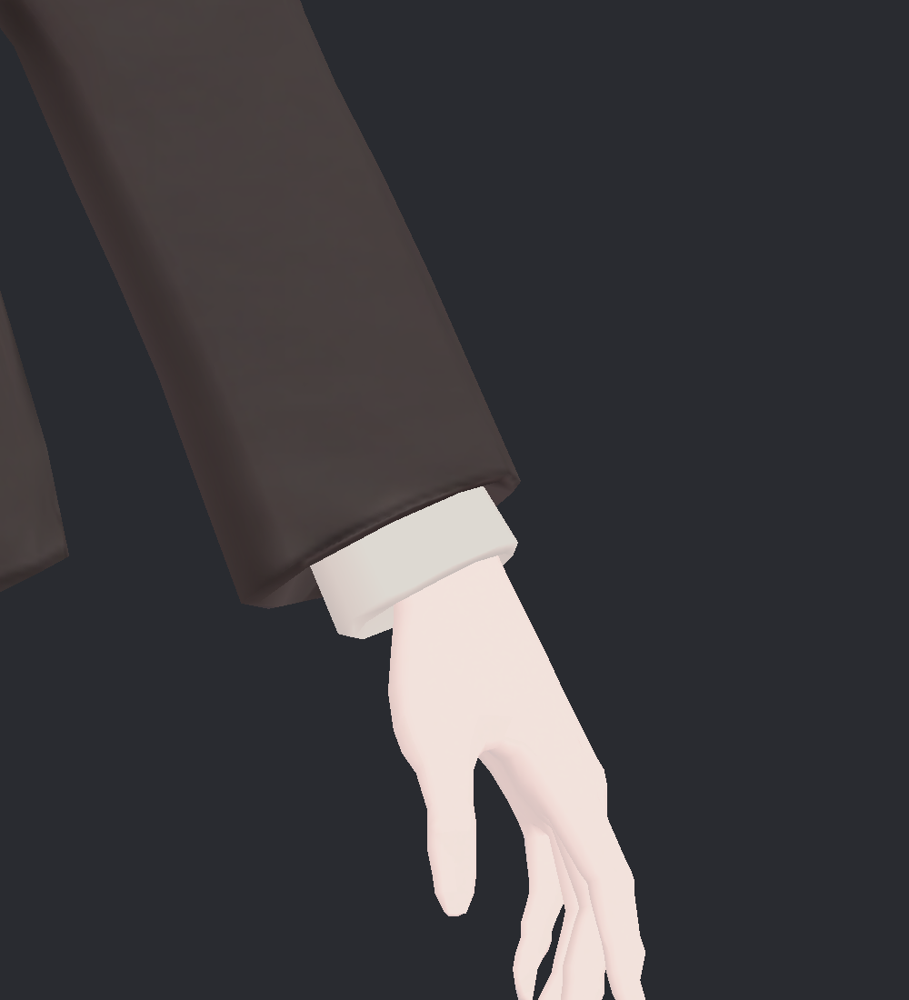

> **기록 시점 안내:** 아래는 해당 단계 당시의 보고서입니다. 후속 결정은 [최신 상태](../../STATUS.md)를 기준으로 읽어주세요. 모델·원본 텍스처·검증 원시 데이터는 이 문서 공유본에 포함하지 않습니다.

# v336 · Unity 실제 재질 전후 비교

왼쪽은 v334 기하와 v324 텍스처, 오른쪽은 v336 새 UV·전사 텍스처입니다. Unity 2022.3.22f1에서 원래 재질 설정, 동일 직교 카메라·흰 방향광·1000×1100 해상도로 촬영했습니다. 새 Paint 텍스처는 4096², sRGB, 무압축, 밉맵 켬입니다. 기존 Head는 유지했습니다.

Animator와 동작 컴포넌트를 끈 별도 미리보기 장면입니다. 기존 관절의 모든 자세를 다시 검사하거나 VRChat 클라이언트에서 검증한 화면은 아닙니다. 손목 확대는 손가락 끝이 잘리므로 전체 손은 별도 [부위 사진](v336_SURFACE_GALLERY.md)에서 확인합니다.

## 전신 정면

| v334 · 전 | v336 · 후 |
|---|---|
|  |  |

## 전신 측면

| v334 · 전 | v336 · 후 |
|---|---|
|  |  |

## 전신 후면

| v334 · 전 | v336 · 후 |
|---|---|
|  |  |

## 옷깃·소매·단추

| v334 · 전 | v336 · 후 |
|---|---|
|  |  |

## 코트 등·뒤트임

| v334 · 전 | v336 · 후 |
|---|---|
|  |  |

## 신발

| v334 · 전 | v336 · 후 |
|---|---|
|  |  |

## 얼굴·머리

| v334 · 전 | v336 · 후 |
|---|---|
|  |  |

## 손목·커프스

| v334 · 전 | v336 · 후 |
|---|---|
|  |  |
