> **기록 시점 안내:** 아래는 해당 단계 당시의 보고서입니다. 후속 결정은 [최신 상태](../../STATUS.md)를 기준으로 읽어주세요. 모델·원본 텍스처·검증 원시 데이터는 이 문서 공유본에 포함하지 않습니다.

# v336 · 가림을 풀어 확인한 표면 비교

검수용 사본에서 부위별로 다른 면을 숨기고 같은 기본색/무조명 조건으로 렌더했습니다. 실제 전달 모델의 메시를 자르거나 삭제하지 않았습니다. 각 시트는 위쪽 앞·옆·뒤, 아래쪽 반대 옆·위·아래의 6방향입니다. 부위에 따라 안쪽 면이 뒤집혀 보이는 것은 가림을 해제한 검사 조건입니다.

전후 시트를 직접 열어 주름·장식·피부 색의 유지 여부와 새 경계 번짐을 확인했습니다. 인접 면에 완전히 가려진 모든 텍셀의 시각 합격이나 모든 거리의 밉맵 품질을 보장하는 검사는 아닙니다. 얼굴과 머리는 보호 범위로 두었으며 두 시트는 전후 픽셀 동일합니다.

## 바지 — 옆·뒤·안쪽

| v334 · 전 | v336 · 후 |
|---|---|
| 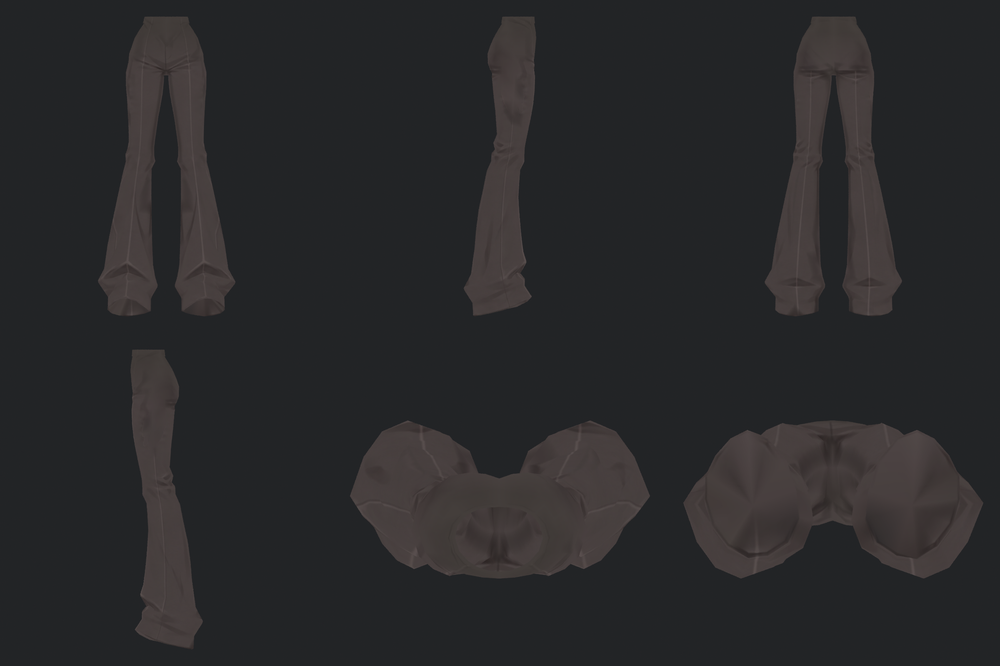 |  |

## 코트 앞쪽 — 다른 부위를 가리고 안쪽까지

| v334 · 전 | v336 · 후 |
|---|---|
|  | 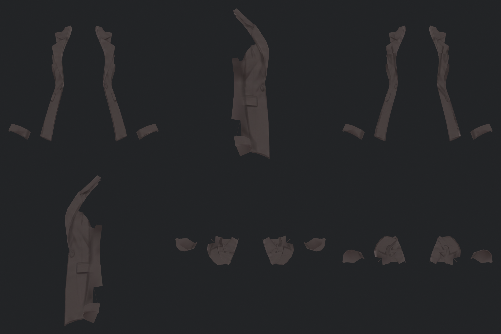 |

## 코트 뒤쪽 — 뒤트임과 안쪽

| v334 · 전 | v336 · 후 |
|---|---|
| 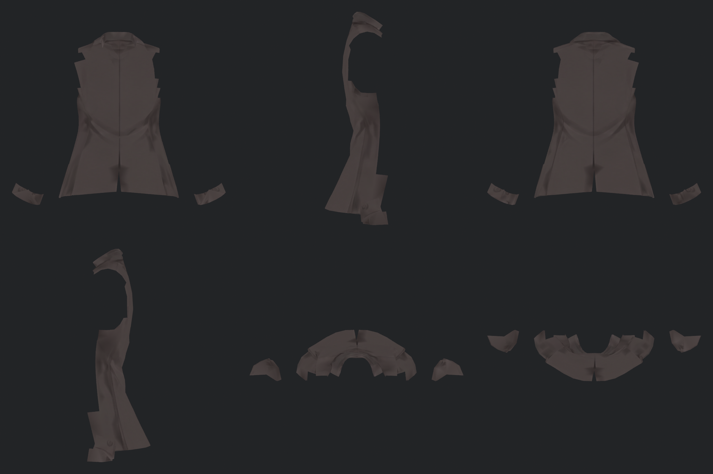 | 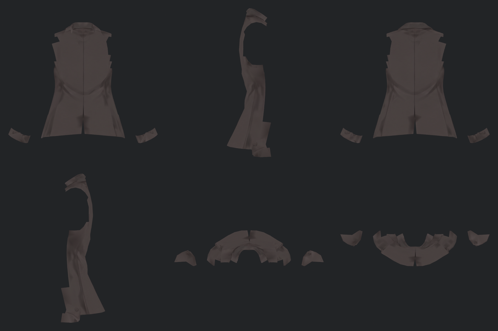 |

## 양 소매 — 주름과 커프스

| v334 · 전 | v336 · 후 |
|---|---|
|  | 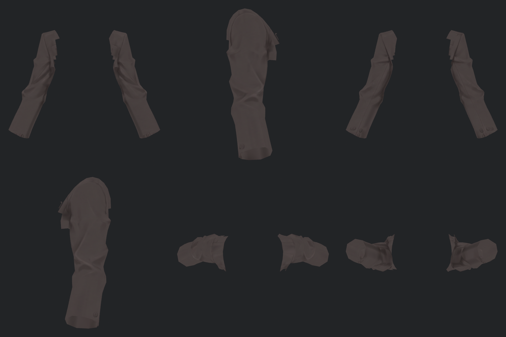 |

## 셔츠 — 깃과 몸통 주름

| v334 · 전 | v336 · 후 |
|---|---|
|  | 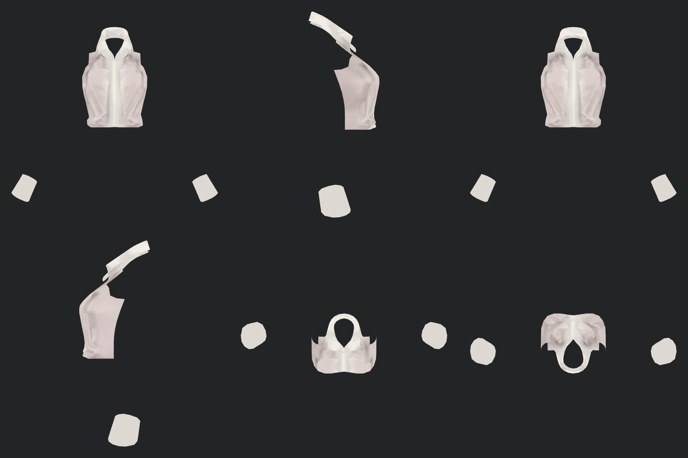 |

## 왼손 — 손등·손바닥·손가락

| v334 · 전 | v336 · 후 |
|---|---|
|  | 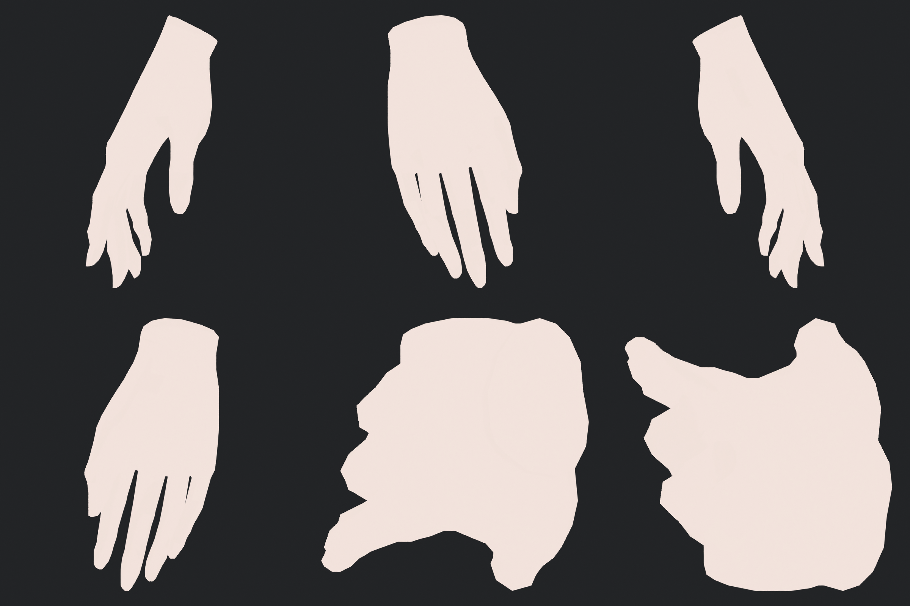 |

## 오른손 — 손등·손바닥·손가락

| v334 · 전 | v336 · 후 |
|---|---|
|  | 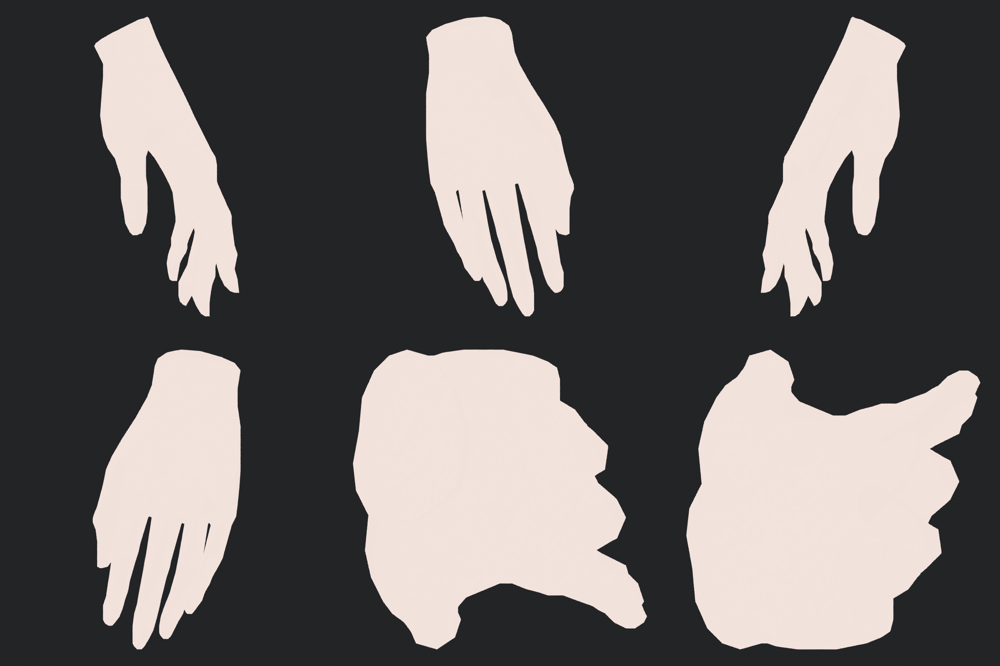 |

## 왼 신발 — 띠·앞코·밑창

| v334 · 전 | v336 · 후 |
|---|---|
| 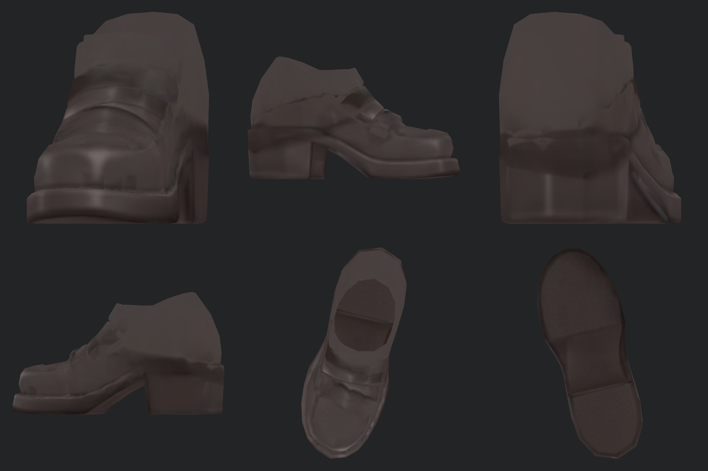 | 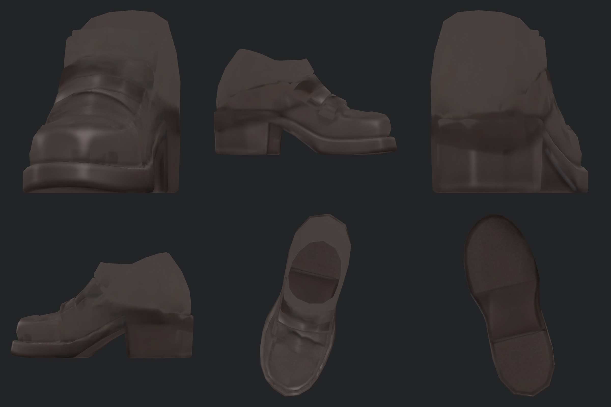 |

## 오른 신발 — 띠·앞코·밑창

| v334 · 전 | v336 · 후 |
|---|---|
| 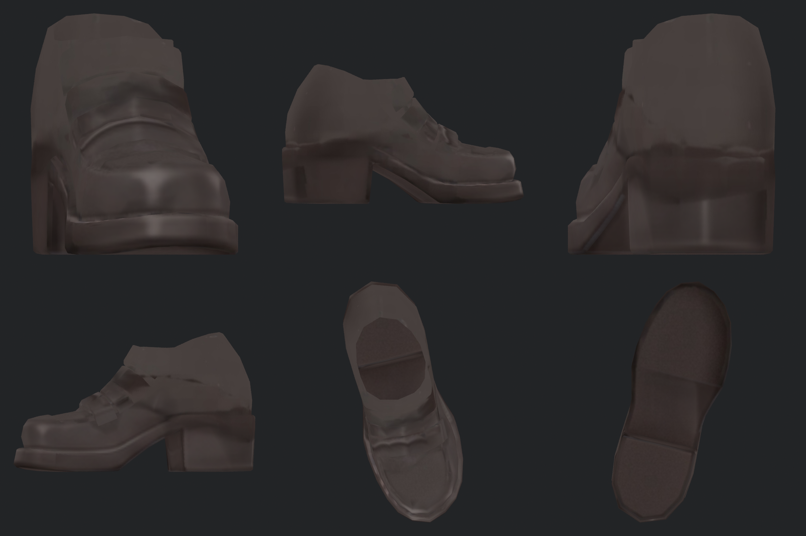 |  |

## 넥타이·단추·장식

| v334 · 전 | v336 · 후 |
|---|---|
|  | 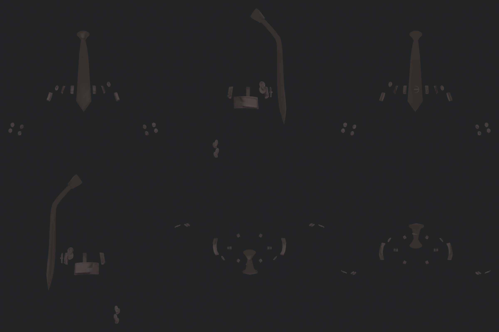 |

## 얼굴 — Head 원래 UV·텍스처

| v334 · 전 | v336 · 후 |
|---|---|
| 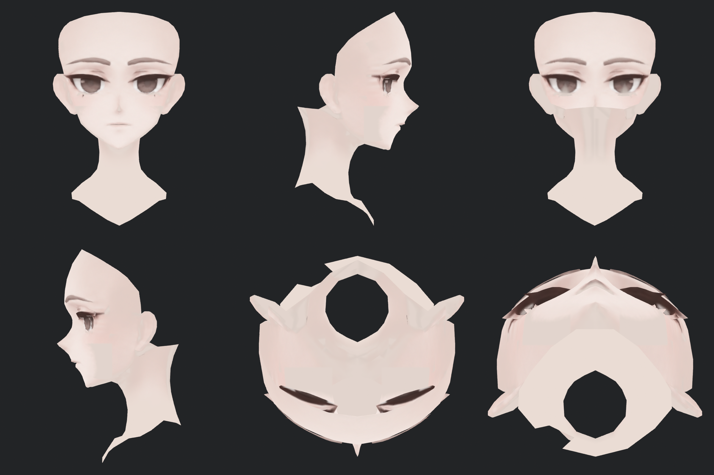 |  |

## 머리 — 웨이브와 결

| v334 · 전 | v336 · 후 |
|---|---|
| 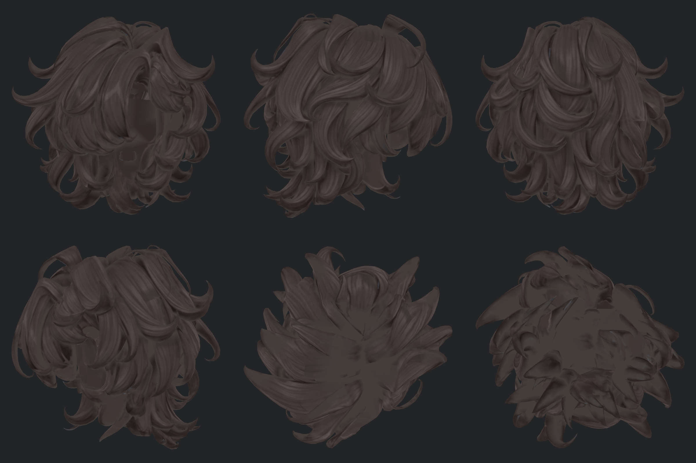 |  |
