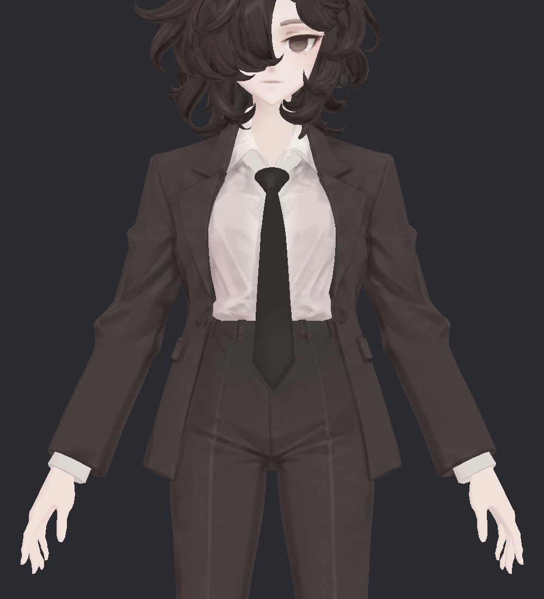
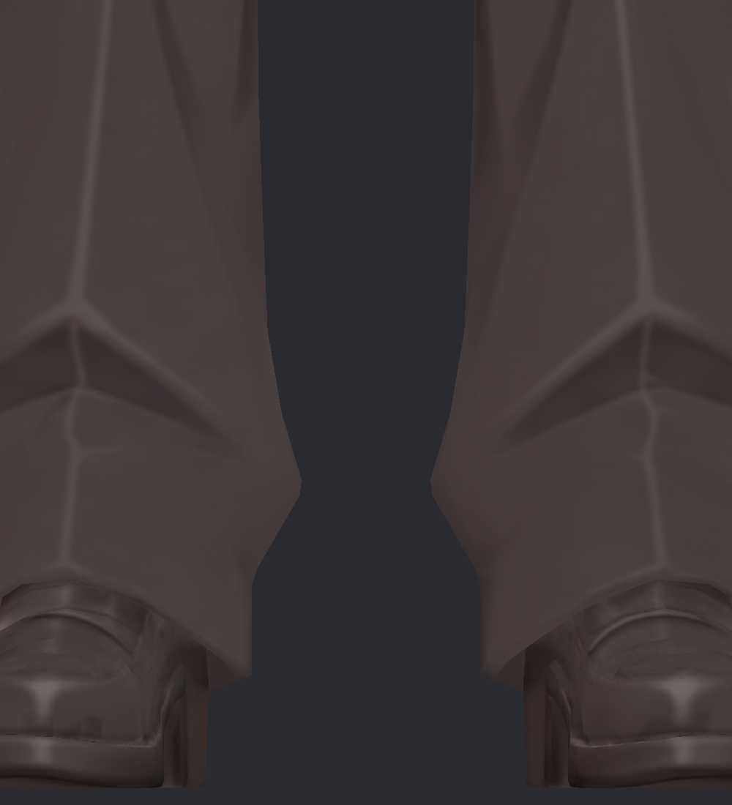
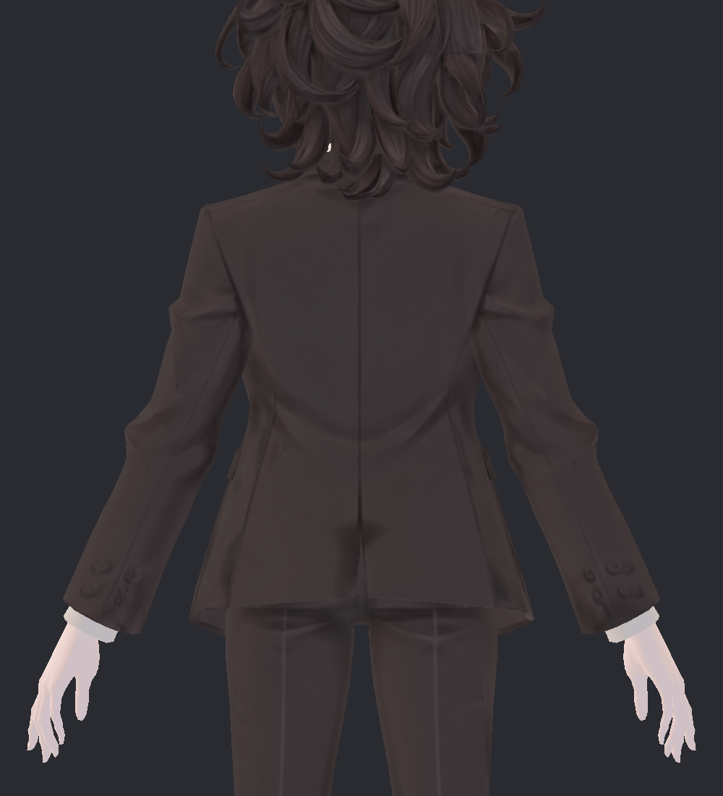
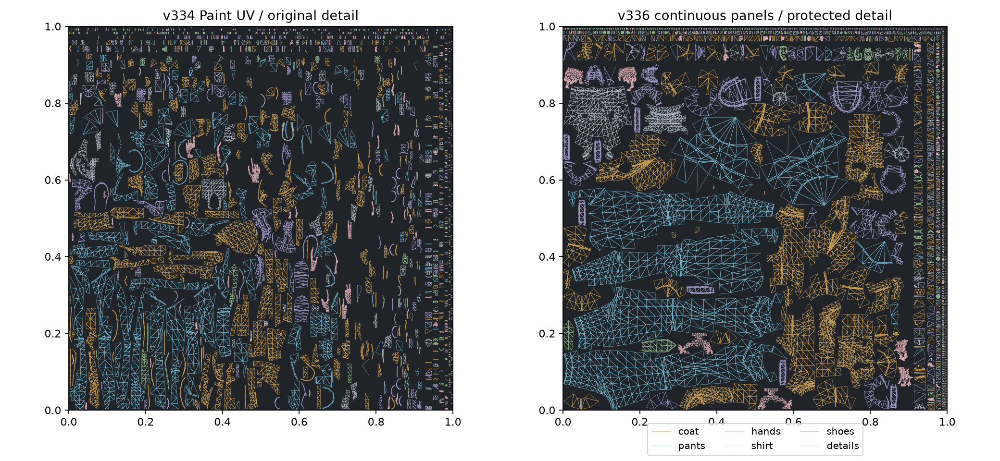

> **기록 시점 안내:** 아래는 해당 단계 당시의 보고서입니다. 후속 결정은 [최신 상태](../../STATUS.md)를 기준으로 읽어주세요. 모델·원본 텍스처·검증 원시 데이터는 이 문서 공유본에 포함하지 않습니다.

# v336 · 디테일을 보존한 UV·텍스처 재작업

2026-09-12 · 새 UV/4K 텍스처 전사 구현 · 미채택 시험본 · 관절 v334 유지

**코트·소매·바지·셔츠·손·신발의 Paint UV를 다시 펼치고, 기존 주름과 장식을 새 4K 텍스처에 옮겼습니다.** 옷깃, 단추, 주머니, 바지 접힘과 신발 띠·밑창을 지우는 전체 평활화는 적용하지 않았습니다. 얼굴·머리는 원래 Head UV/텍스처를 유지했습니다.

이번 결과는 **편집할 UV를 재구성하고 원래 채색을 보존해 전사한 단계**입니다. 원본에 남아 있던 모든 부드러운 얼룩을 새로 그려 정리한 완성 채색본은 아닙니다. 큰 외형 변화가 적은 것이 이번 디테일 보존 비교의 의도입니다.

## 1. 전후를 먼저 확인

| v334 · 원래 UV/텍스처 | v336 · 새 UV/전사 텍스처 |
|---|---|
|  |  |
|  |  |

소매의 접힌 주름, 커프스 단추, 라펠과 셔츠 경계, 신발의 띠·밑창 색 구분이 남아 있습니다. 원래 신발 윗면의 넓고 부드러운 명암도 그대로 남아 있습니다. 새로운 고해상도 세부 묘사를 창작한 것은 아닙니다.

전신 앞·옆·뒤, 얼굴·머리·손목 확대는 [Unity 전후 사진](v336_GALLERY.md), 코트 안쪽·바지 옆/뒤·손바닥·신발 밑면은 [부위별 6방향 사진](v336_SURFACE_GALLERY.md)에 정리했습니다. 공유한 최종 사진은 직접 열어 확인했습니다.

## 먼저 확인할 잔여 문제 — 뒤트임의 밝은 점선

**이번 새 UV 후보를 현재 사용 기준으로 채택하지 않았습니다.** 아래 후면 사진 중앙 아래의 뒤트임에 원본보다 밝은 점선이 보입니다. 코트 자락 가장자리에도 작은 경계 차이가 남습니다. 밉맵 OFF에서는 줄어들지만, 여백 확대와 뒤트임 4개 차트 이동만으로는 해결되지 않았습니다. 이 구도의 국소 차이는 마지막 시험에서 오히려 커졌습니다.

| v334 · 기준 유지 | v336 · 미채택 시험본 |
|---|---|
|  |  |

디테일을 보존한 새 UV/전사 파이프라인과, 엔진에서 경계까지 안정적으로 보이는 최종 모델은 구분합니다. 전자는 구현했고 후자는 미완료입니다. 원래 v334를 사용 기준으로 유지하며 v336을 자동 후속 기준으로 삼지 않습니다.

## 2. 실제 UV 변경

큰 표면을 연결된 패널로 펼친 뒤, 심하게 뒤틀리거나 색 전사에 실패하는 작은 면은 원래 UV 모양을 보존해 분리했습니다. 각 면의 가장 불리한 방향에서도 원래보다 적은 픽셀이 배정되지 않도록 크기를 정하고 다시 배치했습니다. 예전 UV 레이어는 모두 남기고 `V336_UV`를 추가했습니다.

| 같은 Paint 범위로 비교 | v334 | v336 |
|---|---:|---:|
| Paint UV 조각 합계 | 1,237 | 1,124 |
| 그중 코트 메시 UV 조각 | 283 | 201 |
| 4삼각형 이하 작은 조각 | 610 | 896 |
| Paint UV 삼각형 면적 합 | 0.31030 | 0.57576 |
| Paint 해상도 | 4096² | 4096² |
| 전체 활성 기본색 아틀라스 | 2장 | 2장 |

UV 삼각형 면적 합은 여백을 포함한 포장 효율이나 원본 전체 아틀라스 점유율과 다릅니다. 코트·몸통의 큰 패널을 늘렸지만 **작은 조각 수는 증가**했습니다. 참고 모델처럼 모든 부위의 UV가 간결해졌다고 평가하지 않습니다.

전후 삼각형 UV 변환의 가장 작은 특이값, 즉 **최소 방향 픽셀 밀도 비율은 1.00309배**입니다. 전체 평균만 올리고 일부 디테일을 줄이는 배치를 피했습니다. 이것은 원래보다 새로운 그림 정보가 늘었다는 뜻은 아닙니다.

늘어짐의 면적 가중 상위 5% 지표는 BodyHair Paint 1.179→1.384, 코트 1.195→1.460으로 악화했습니다. 중간 영역은 비슷하거나 개선됐지만 일부 패널은 더 늘어납니다. 원래 색을 전사한 화면과 앞으로 이 UV에 직접 선·무늬를 그리기 쉬운 정도를 구분해야 합니다.

## 3. 텍스처를 옮기며 확인한 것

원래 v324 기본색을 Blender의 EMIT 베이크로 새 UV에 전사했습니다. 전체 블러, 평활화, 얼굴 재생성, 레퍼런스의 문양 복사는 하지 않았습니다. 기존 Head는 같은 UV와 이미지를 계속 사용합니다.

Paint의 12,273삼각형에서 양의 면적 UV 겹침 0, 타일 바깥 좌표 0, 분류한 6부위의 퇴화 UV 0을 확인했습니다. 원래와 새 표면을 대응한 294,552개 내부 표본에서 평균 색 차이는 부위별 0.035–0.146/255, 최대는 7.75/255입니다. 경계/모든 텍셀/모든 밉 레벨을 전수 검사한 수치는 아닙니다.

UV 겹침이 없어도 좁은 면이 베이크에서 누락될 수 있어, 작은 차트의 최소 높이를 확보했습니다. 확대된 기본색 사진뿐 아니라 Unity에서 밉맵을 켠 최종 결과도 비교했습니다. 실패했던 배치, 여백과 축소 표시 시험은 [시도와 미채택 사유](v336_ATTEMPTS.md)에 기록했습니다.

## 4. 가려진 표면과 디테일

| 부위 | 직접 확인한 내용 | 남은 부분 |
|---|---|---|
| 코트·소매 | 앞뒤/안쪽, 라펠, 주름, 단추·주머니, 뒤트임 | 원래 채색의 넓은 어두운 음영 유지, 작은 UV 수동 정리 여지 |
| 바지 | 옆·뒤·안쪽, 세로 접힘과 밝은 주름 | 원래 기본색에 구워진 밝은 줄을 재해석하지 않음 |
| 손 | 손등·손바닥·손가락 전후, 피부 색 유지 | 손톱·손바닥에 새로운 묘사를 추가하지 않음 |
| 셔츠·장식 | 깃·접힘·넥타이·버튼의 색 경계 유지 | 강한 밝은 주름과 접힘은 원래 채색 그대로 |
| 신발 | 띠·앞코·옆면·뒤·밑창, 기존 장식 유지 | 윗면의 부드러운 음영과 일부 극소 경계 픽셀 차이 |
| 얼굴·머리 | 기존 인상·웨이브·결 유지, 기본색 시트 전후 픽셀 동일 | Head의 작은 UV 조각 정리는 이번에 시행하지 않음 |

## 5. 모델과 실행 비용

Blender를 다시 열어 기존 정점 좌표·면·기존 UV·모든 보정키·웨이트·본 계층/기준 행렬이 같은지 검사했습니다. 본 행렬 최대 차이 0이며, 기존 129본과 관절 보정 구조를 유지했습니다.

Unity는 새 UV 이음매에서 같은 위치의 정점을 분리해야 합니다. 기존 34,655→38,161개로 **3,506개(약 10.1%) 증가**했습니다. 새 위치나 새 면을 만든 것이 아니라 원래 위치·노멀·웨이트·모든 보정키 델타를 정확히 복제한 UV 정점입니다. 삼각형 원래 정점 대응 오차 0, 위치·노멀·보정키 델타 오차 0, 웨이트 동일을 확인했습니다. Blender 원래 정점 수는 그대로입니다.

렌더러 2개, 재질 슬롯 합계 4개, 기본색 아틀라스 2장을 유지했습니다. v336 Paint는 4K 무압축·sRGB·밉맵 켬입니다. 실제 FPS나 VRChat 클라이언트 성능 측정값은 아닙니다. 원래 탄젠트는 복제 보존했으며, 이후 새 탄젠트 노멀 맵을 도입한다면 새 UV 기준 탄젠트를 별도로 검토해야 합니다.

원본 프리팹 의존 23파일과 v334 전달 4파일 해시 동일, 사용자 Unity 장면 상태 동일, 내보낸 Unity 패키지 자산과 저장된 자산 바이트 일치까지 확인했습니다. 기존 모델을 덮어쓰지 않았습니다.

## 6. 전달과 다음 판단

작업 버전 폴더에 `bianca_v336_UV_DETAIL_REVIEW.blend`, `Bianca_v336_DetailReview.unitypackage`, `Bianca_v336_Paint.png`와 재현 코드/검사 기록을 보존했습니다. Unity 후보는 `Bianca_v336_DetailReview.prefab`입니다. 문서 저장소에는 이 보고서와 직접 검수한 사진만 선별 공유합니다.

이번 후보는 디테일을 보존하며 새 UV를 실제 적용해 본 결과입니다. **전체 채색 재완성과 UV 최적화의 최종 채택은 아닙니다.** 다음 채색은 원래 주름·장식과 분리 가능한 번짐부터 부위별로 정리하는 방향이며, 관절은 계속 v334 상태로 둡니다.
