> **기록 시점 안내:** 아래는 해당 단계 당시의 보고서입니다. 후속 결정은 [최신 상태](../../STATUS.md)를 기준으로 읽어주세요. 모델·원본 텍스처·검증 원시 데이터는 이 문서 공유본에 포함하지 않습니다.

# v337 · 전후 사진 모음

왼쪽은 v334 원래 모습, 오른쪽은 v337 새 UV 전사본입니다. 사진의 형상·조명·구도를 맞췄으며 색 보정이나 점선 지우기를 하지 않았습니다. Unity HAND 구도는 손끝이 잘리므로 아래 손 분리 검수 사진을 함께 봅니다.

## 원래 재질의 Unity 화면

### 전신 정면

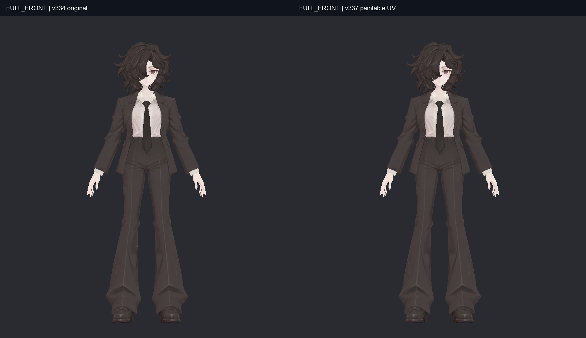

### 전신 측면

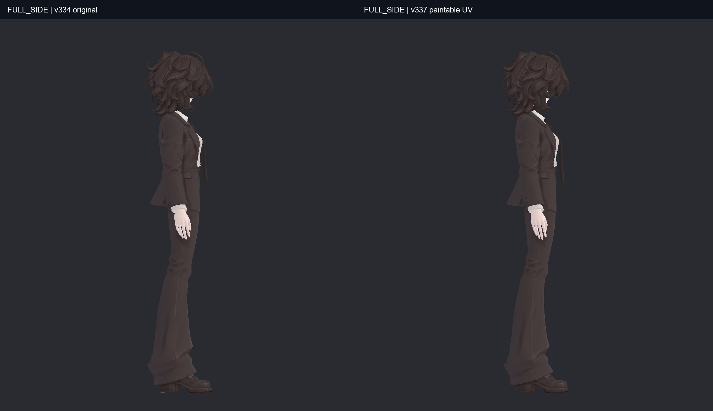

### 전신 뒤

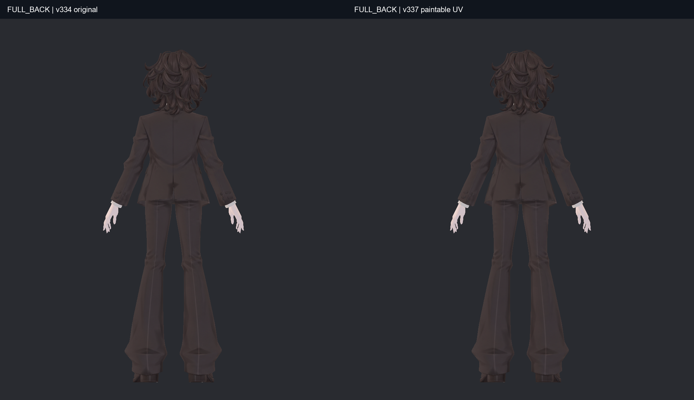

### 얼굴과 머리

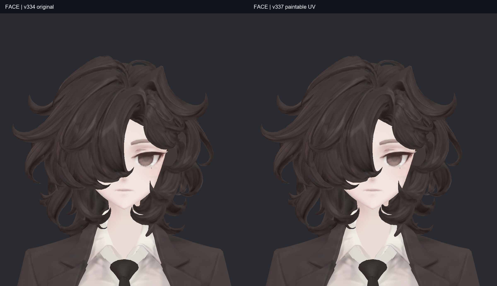

### 코트·셔츠 앞

### 코트 뒤

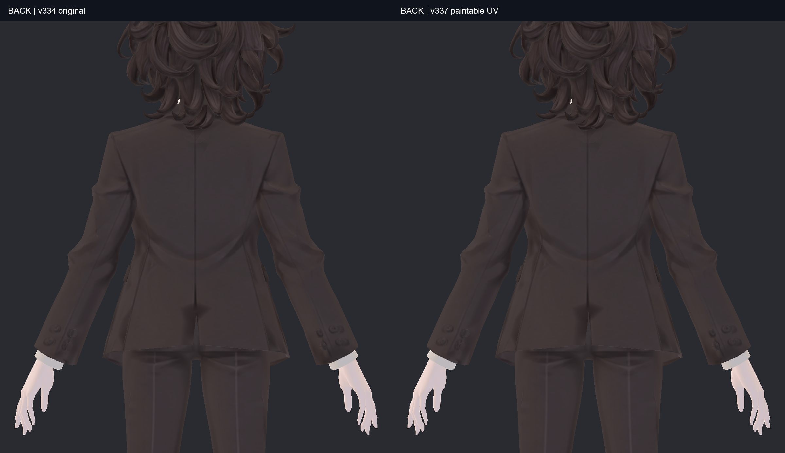

### 신발 확대

### 손목·소매

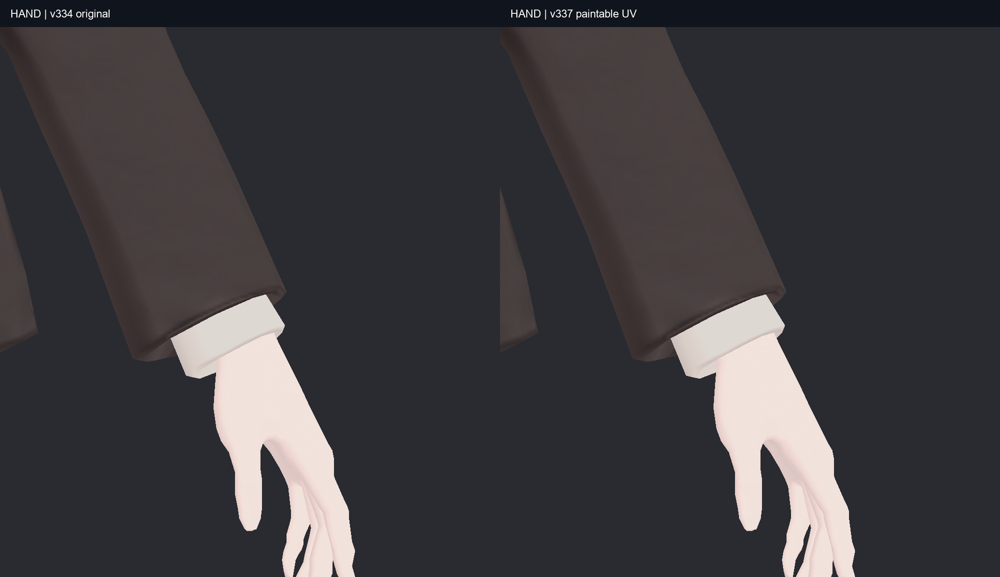

### 뒤 왼쪽35도

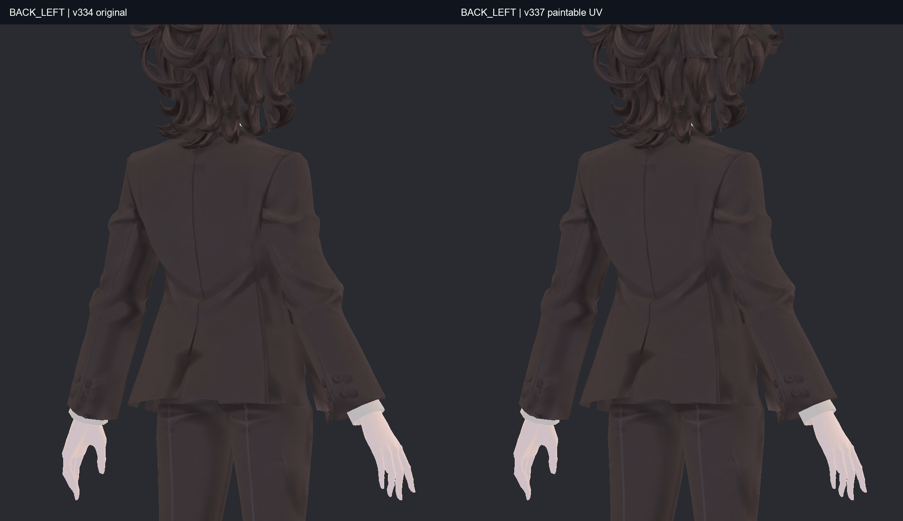

### 뒤 오른쪽35도

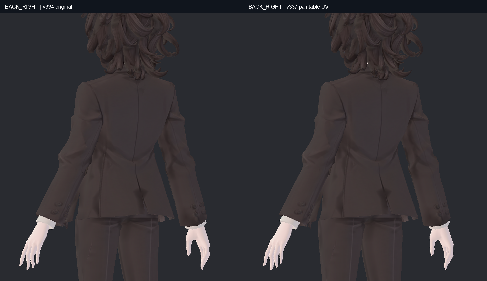

### 뒤 가까이

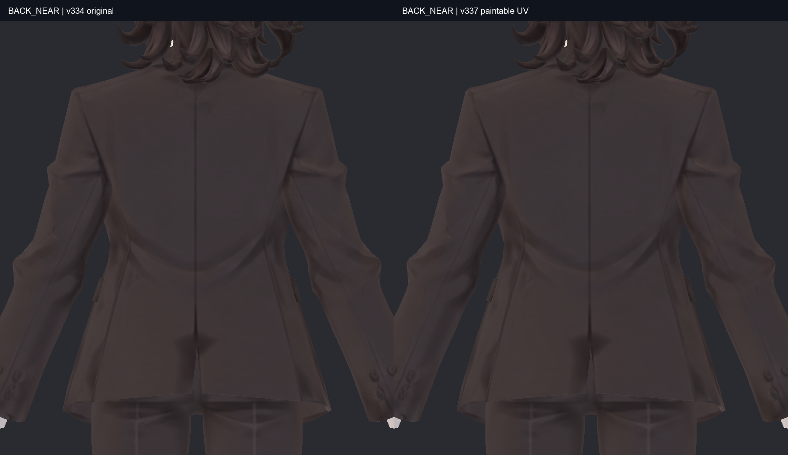

### 뒤 멀리

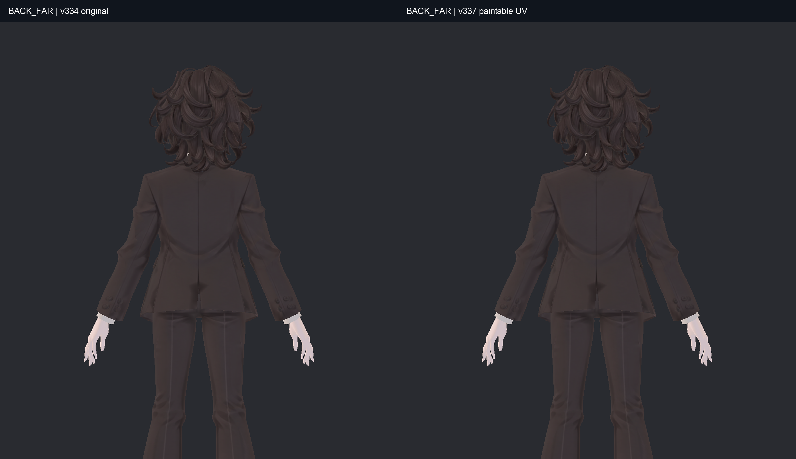

## 가려진 면 확인

각 버전에서 정면·측면·뒤·반대편·위·아래 순으로 배치했습니다. 코트 앞/뒤 분리는 안쪽을 보려는 검수용 사본입니다. 잘린 단면이나 비어 보이는 곳을 전달 모델에서 삭제한 것이 아닙니다. 조명 영향을 줄인 기본색 검수이며 원래 기본색의 명암은 남습니다. v334 비교 사진은 원본 해시가 보존된 v336 검수에서 동일 절차로 만든 사진을 재사용했습니다.

### 바지 옆·안쪽

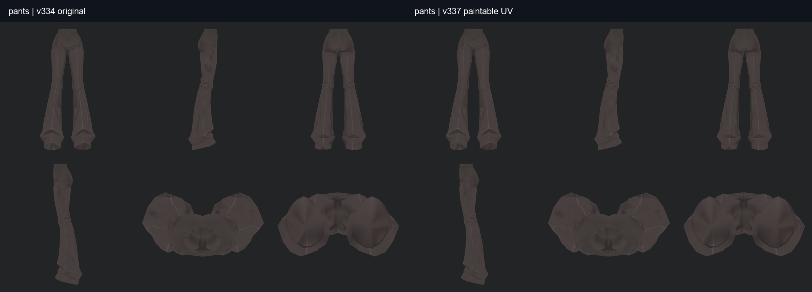

### 코트 앞판 안쪽

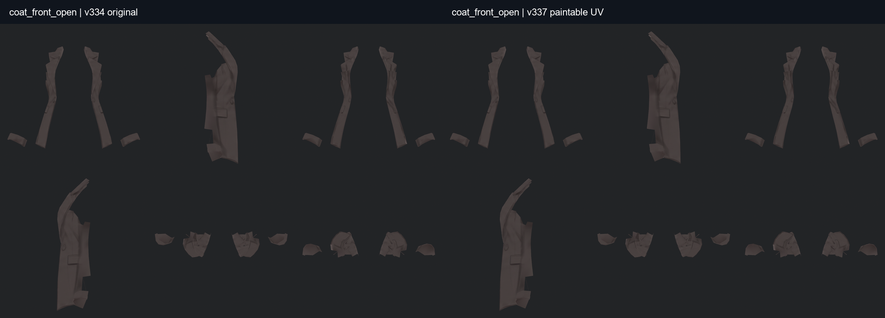

### 코트 뒤판 안쪽

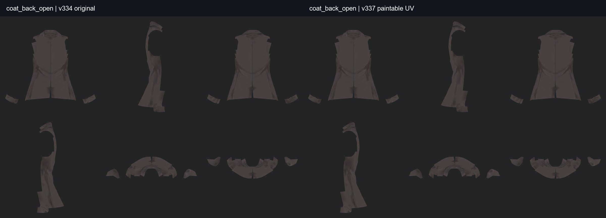

### 소매 안쪽과 끝

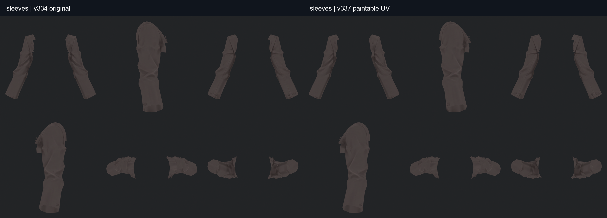

### 셔츠·커프스

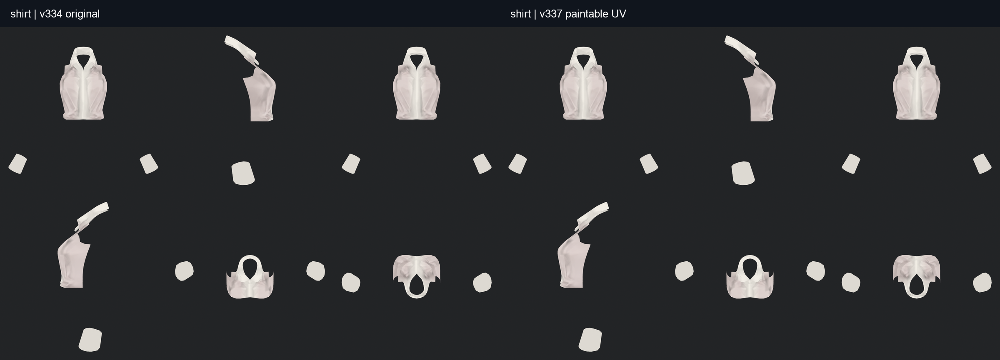

### 왼손 전체

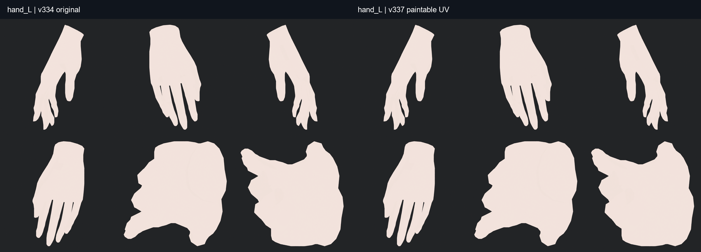

### 오른손 전체

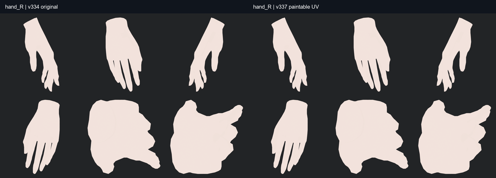

### 왼쪽 신발·밑창

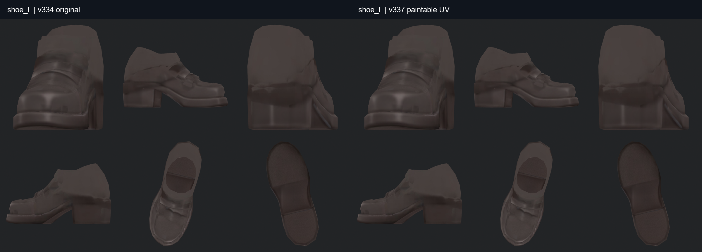

### 오른쪽 신발·밑창

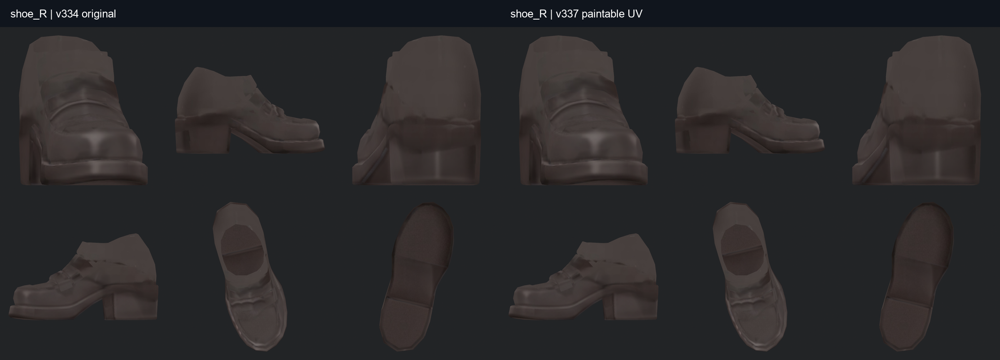

### 넥타이·단추·장식

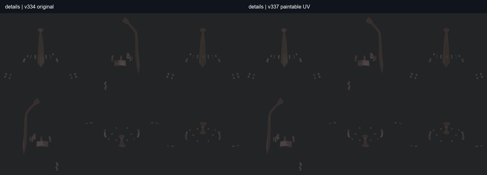

### 가려진 얼굴

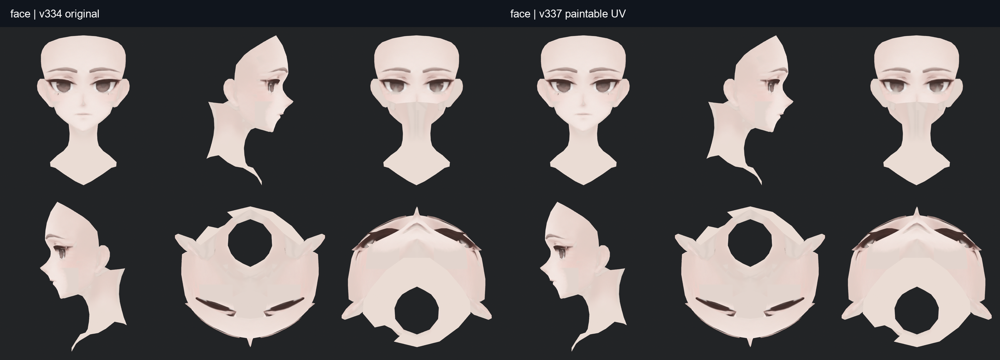

### 머리 뒤·안쪽

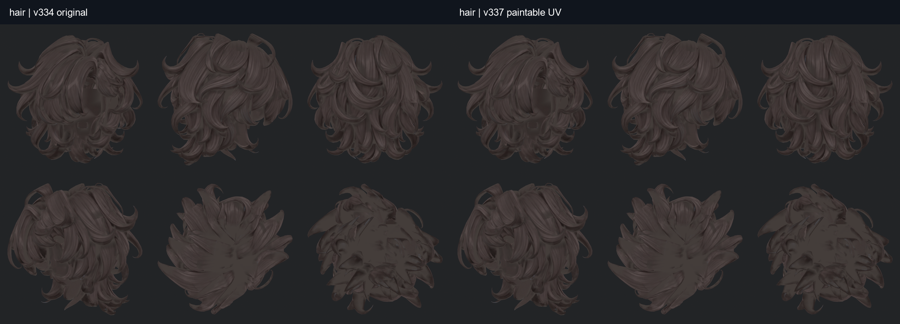

[검증 결과와 남은 한계](v337_UV_WORK_REVIEW.md)
