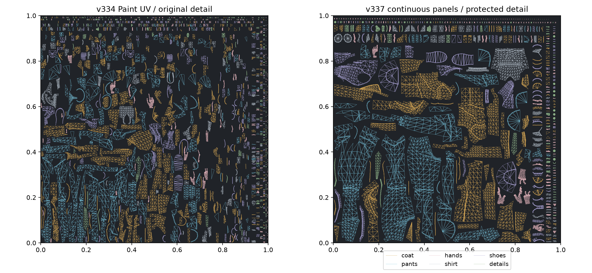
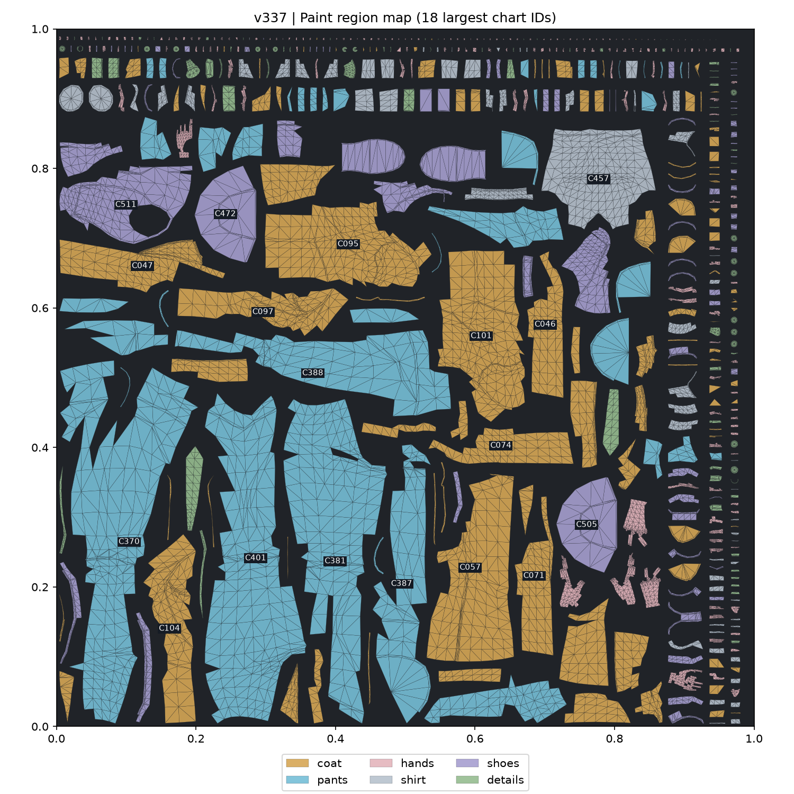
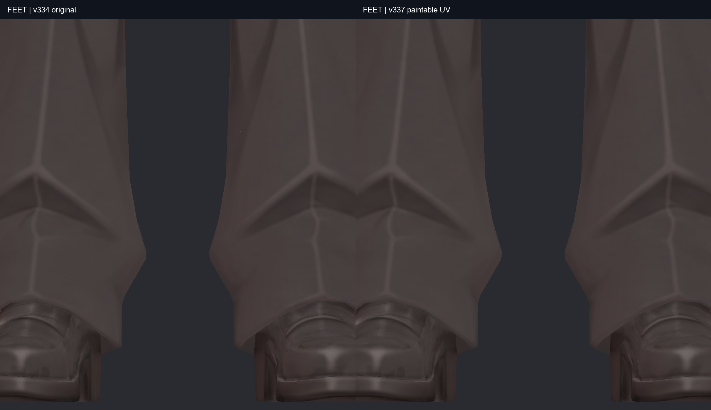
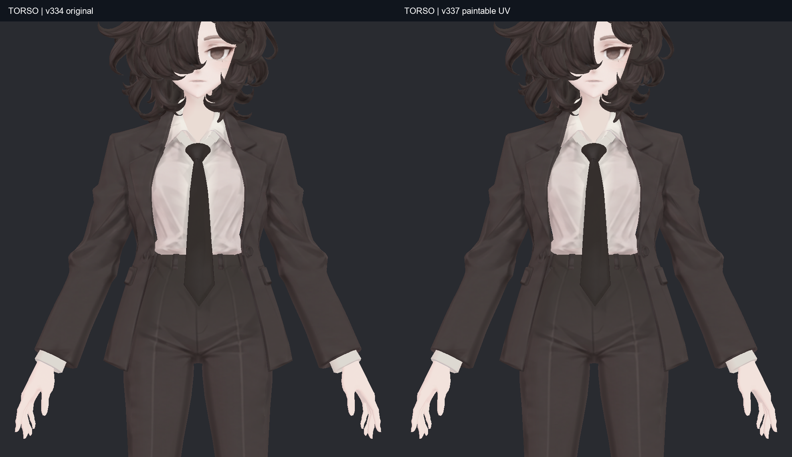
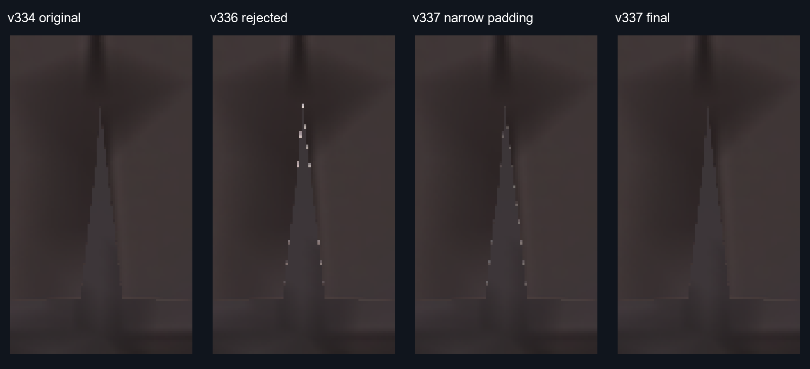

> **기록 시점 안내:** 아래는 해당 단계 당시의 보고서입니다. 후속 결정은 [최신 상태](../../STATUS.md)를 기준으로 읽어주세요. 모델·원본 텍스처·검증 원시 데이터는 이 문서 공유본에 포함하지 않습니다.

# v337 · 채색하기 편한 UV 작업본

2026-09-13. v334의 형상·관절과 v324의 디테일을 보존한 채 **Paint UV를 541개 패널로 다시 정리**했습니다. 코트와 바지의 큰 면을 연속해서 칠하기 쉬워졌고, 부위별 마스크와 UV 안내도를 추가했습니다. 이 파일을 다음 텍스처 작업의 출발점으로 사용합니다. 전체 아바타의 최종 채택이나 채색 완성 판정은 아닙니다.

| Paint 대상 지표 | v334 원래 | v336 미채택 | v337 작업본 |
|---|---:|---:|---:|
| UV 조각 | 1,237 | 1,124 | **541** |
| 4삼각형 이하 작은 조각 | 610 | 896 | **204** |
| 텍스처 해상도 | 4096² | 4096² | **4096²** |
| 원래 대비 최소 방향별 픽셀 밀도 | 1.0 | 1.003 | **1.024** |

Head는 기존 UV·텍스처 그대로입니다. 전체 기본색 텍스처는 계속 4K 두 장, 재질 슬롯은 네 개입니다. 픽셀 밀도 보존은 잃어버린 정보를 생성했다는 뜻이 아닙니다. 원래 단추·주름·신발 장식을 같은 해상도 이상의 공간으로 옮겼다는 의미입니다.

## 바뀐 작업 방식

v336의 면별 분리 방식 대신 실제 면 연결과 곡률로 패널 후보를 나눴습니다. 원래 사각형을 유지하면서 다시 펼쳤고, 손가락·작은 장식 등 합치면 접히는 패널 여덟 곳은 기존 이음선을 유지했습니다. 모델 표면의 새 메시 생성·교체·리메시는 없습니다. 계산용 사본은 결과에 포함하지 않았습니다.

코트·바지·손·셔츠·신발·장식의 여섯 선택 마스크, 원래 해상도의 투명 UV 선, 부위별 SVG 그룹, C001~C541 패널 목록을 작업 폴더의 `paint_guides`에 넣었습니다. 자세한 사용법은 [채색 안내](v337_PAINT_GUIDE.md)에 있습니다.

## 디테일과 뒤트임 확인

단추·솔·갑피의 선과 기존 옷 주름을 유지했습니다. 전체 블러, 디자인 재생성, 얼굴·머리 재채색은 하지 않았습니다. 가려진 면은 부위를 분리한 검수 사본에서 여섯 방향으로 확인했습니다. [전체 비교 사진](v337_GALLERY.md)에 손·소매·코트 안·바지 옆과 안쪽·신발 밑면을 포함했습니다.

v336에서 남았던 밝은 점선을 이번 고정 구도에서 해소했습니다. 같은 40×100픽셀 영역의 v334 대비 최대 채널 차이는 v336 최종 167/255, v337 중간 71/255, **v337 최종 2/255**입니다. 30/255 초과 픽셀은 22→19→0개입니다. 확대는 동일 좌표의 최근접 확대이며 선을 지우거나 사진을 보정하지 않았습니다.

Unity에서 이미 존재하는 메시를 직렬화 복사로 갱신할 때, 저장된 UV·삼각형은 맞아도 화면에 낡은 데이터가 남는 현상을 재현했습니다. 재임포트만으로 해결되지 않았고 UV·면 인덱스를 다시 설정하면 정상화됐습니다. 생성 코드에 기존 메시 버퍼 초기화와 명시적 업로드를 넣고 새로 만든 결과 및 같은 결과의 재생성을 확인했습니다. 최종본에는 UV 패킹 여백 0.004와 32픽셀 색 확장도 적용했습니다. 점선의 감소를 여백 하나의 독립 효과로 단정하지는 않습니다. [실험과 미채택 사유](v337_ATTEMPTS.md)에 분리해 기록했습니다.

## 검증 결과와 남은 한계

- Paint 12,273삼각형: 양의 면적 UV 겹침 0, 범위 이탈 0, 퇴화 0. 겹침 판정 임계값은 UV 면적 1e-11입니다.
- 원래 텍스처와 새 텍스처의 내부 294,552표본: 부위별 평균 절대 채널 차이 0.036~0.150/255, 최대 11.19/255. 모든 텍셀·모든 밉 단계의 동일성을 뜻하지 않습니다.
- Blender 기존 정점 좌표·면 순서·기존 UV 전부·모든 shape key·웨이트·129본·변환 유지. 원래 모델의 두께와 부피도 변경하지 않았습니다.
- Unity 위치·노멀·모든 shape key 델타 오차 0, 웨이트 일치. UV 경계 때문에만 정점 1,215개 복제. Blender 원래 메시의 정점 수를 늘린 것은 아닙니다.
- Unity 원래 재질로 정면·측면·뒷면·확대와 뒤쪽 ±35도·가까이·멀리의 전후를 확인했습니다. 사용자 장면은 유지했습니다. VRChat 클라이언트·움직이는 모든 거리의 검증은 별도입니다.

모든 UV 지표가 좋아진 것은 아닙니다. 면적 가중 95백분위 늘어짐 비율은 코트 1.195→1.141, 바지 1.177→1.114, 손 1.194→1.162로 개선됐지만, **셔츠 1.201→1.365, 신발 1.177→1.434**로 일부 굴곡 면의 늘어짐이 증가했습니다. 이 부분을 더 잘게 자르면 채색 조각 수가 다시 늘어나는 절충이 있어 현재 큰 패널을 유지했습니다. 그 부위의 정밀 선은 3D 화면을 보며 칠하는 편이 낫습니다. 기존 채색에 있는 명암·부드러운 얼룩 자체를 이번 단계에서 전부 재채색한 것은 아닙니다.

전달: `bianca_v337_UV_DETAIL_REVIEW.blend`, `Bianca_v337_Paint.png`, `Bianca_v337_PaintableReview.unitypackage`, `paint_guides/`. 원래 v334와 모든 기존 UV는 보존했습니다. 관절 작업은 계속 일시 중단 상태입니다.
