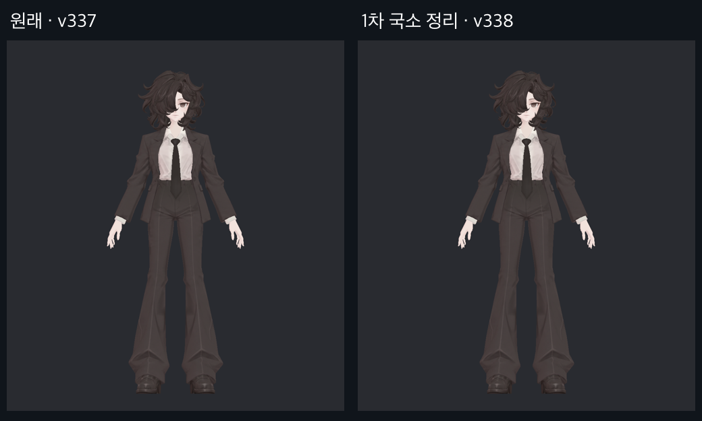
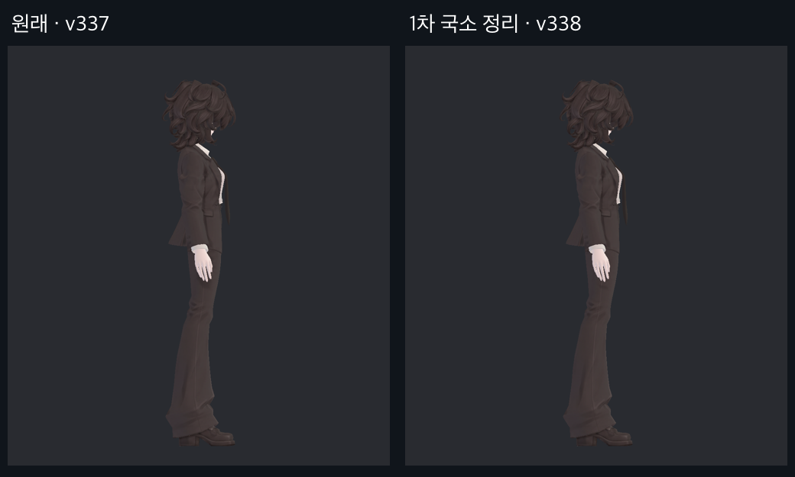
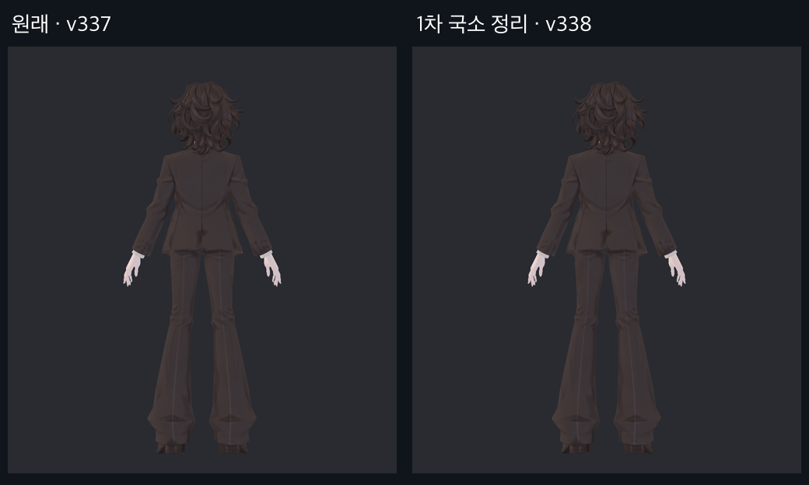
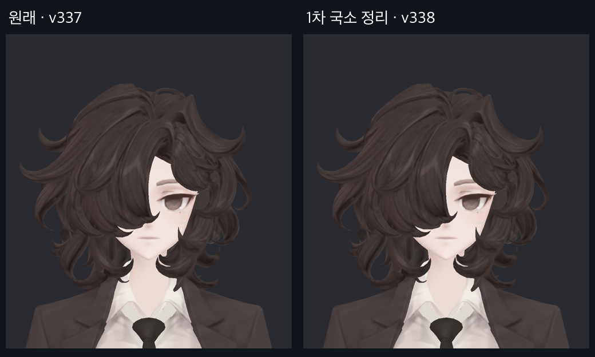
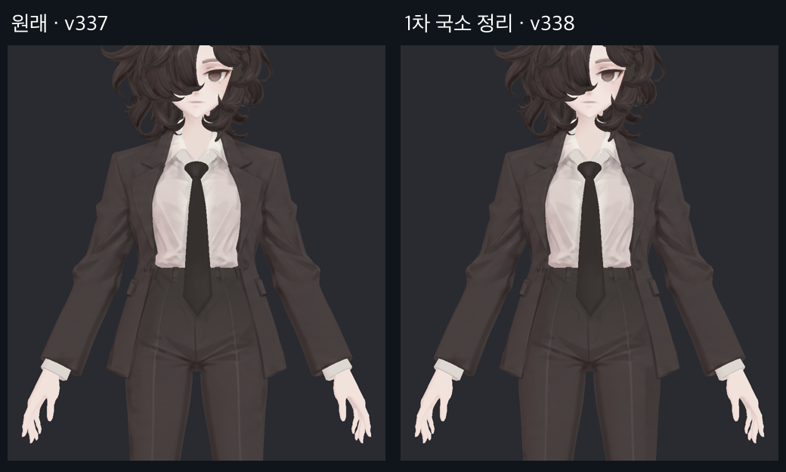
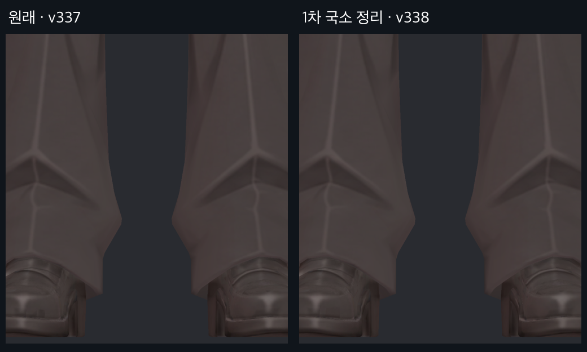
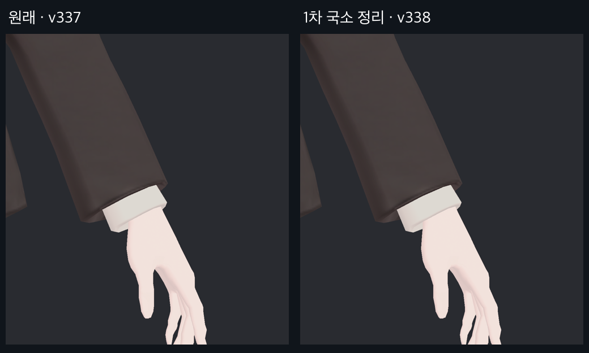
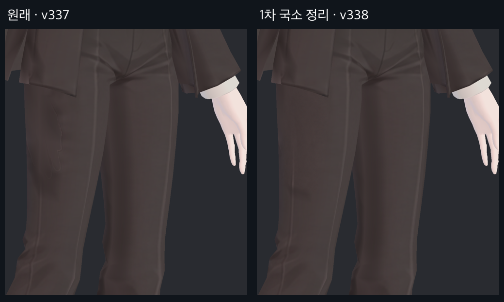
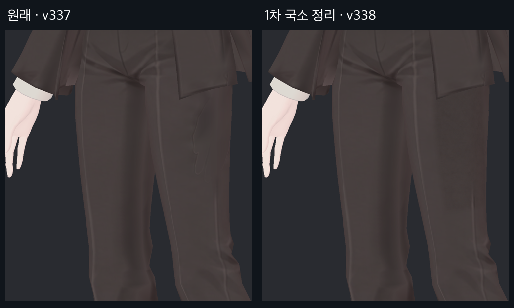

> **기록 시점 안내:** 아래는 해당 단계 당시의 보고서입니다. 후속 결정은 [최신 상태](../../STATUS.md)를 기준으로 읽어주세요. 모델·원본 텍스처·검증 원시 데이터는 이 문서 공유본에 포함하지 않습니다.

# v338 · 실제 렌더 전후 사진

2026-09-13. 각 사진의 왼쪽은 v337, 오른쪽은 v338 첫 국소 수정본이다. 같은 메시·구도·셰이더로 Unity에서 다시 렌더했다. 신발 작은 반점과 바지 손 흔적만 전달 모델에 반영했다.

## 전신 정면

## 전신 측면

## 전신 후면

## 얼굴

## 상체와 바지 윗부분

## 신발

## 손

## 허벅지 사선 1

## 허벅지 사선 2

## 셔츠의 별도 시험

아래는 Blender 부위 분리 렌더다. 약한 25%와 강한 100% 모두 전달 모델에 미반영이다.

[검수 보고로 돌아가기](v338_TEXTURE_REVIEW.md)
