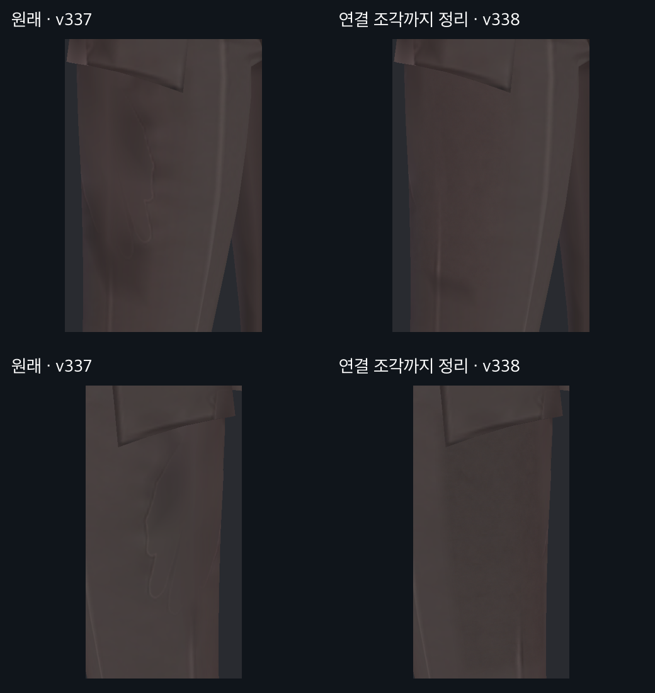
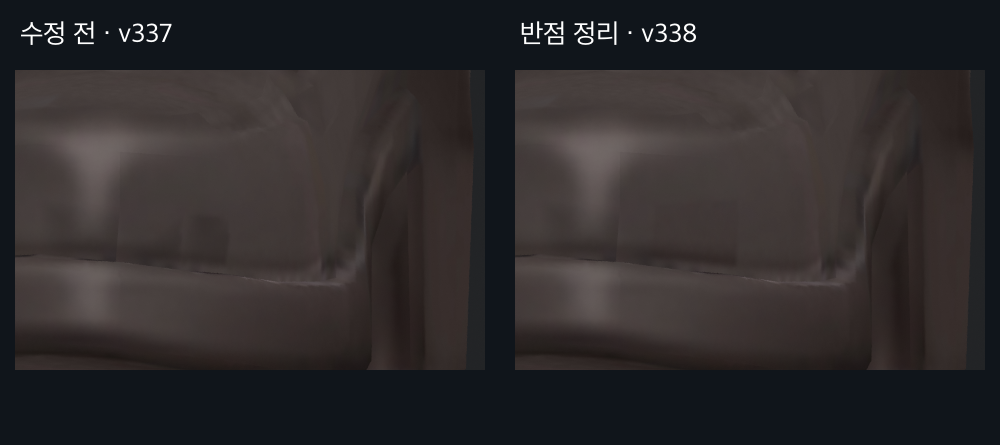
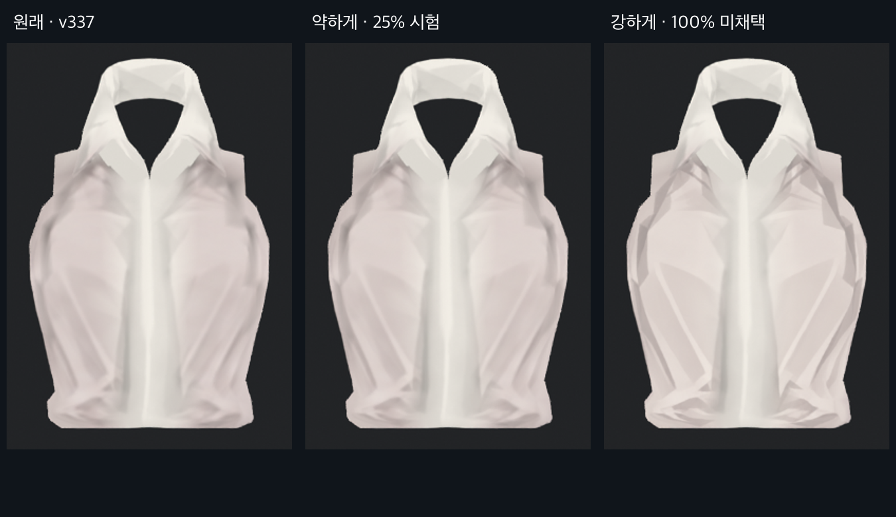

> **기록 시점 안내:** 아래는 해당 단계 당시의 보고서입니다. 후속 결정은 [최신 상태](../../STATUS.md)를 기준으로 읽어주세요. 모델·원본 텍스처·검증 원시 데이터는 이 문서 공유본에 포함하지 않습니다.

# v338 · 디테일을 보존하는 국소 텍스처 정리 — 1차 검수

2026-09-13. v337 채색용 UV 위에서 양쪽 허벅지의 손 모양 흔적과 왼쪽 신발 앞부분의 작은 반점을 정리했다. **전신 채색 완료가 아니라 사용자 피드백을 위한 첫 수정본**이다. 셔츠는 별도 강도 시험만 했으며 전달 모델에는 합치지 않았다. 관절 작업은 계속 중단한다.

## 양쪽 허벅지

왼쪽 열은 v337, 오른쪽 열은 v338이다. 두 사선 구도에서 바지 위에 남아 있던 손가락 형태의 밝고 어두운 윤곽을 제거했다. 세로 주름과 주변의 원래 명암은 유지했다. 넓고 부드러운 얼룩까지 모두 지운 상태는 아니다.

처음에는 앞쪽 두 UV 조각만 수정해 반대쪽 사진에 손 윤곽이 남았다. 실제 Unity 사진을 다시 보고 UV 좌표를 추적한 결과 뒤쪽 연결 조각에도 같은 흔적이 있었다. 해당 조각을 추가 수정한 뒤 양쪽 사선 사진을 다시 렌더하고 직접 확인했다. 앞서 양쪽 제거가 끝났다는 중간 설명은 성급했으며, 위 사진이 보완 후 최종 비교다.

## 신발의 작은 반점

왼쪽 신발 앞부분의 작은 사각 반점을 완화했다. 주변 테두리·주름·장식선까지 넓게 지우지 않았다. 신발 옆면의 끊긴 선과 다른 얼룩은 아직 남아 있으므로 신발 전체 정리 완료로 판단하지 않는다.

## 셔츠는 비교만

새 채색을 100% 반영한 시험은 접힘이 각지고 종이처럼 보이는 변화가 커서 미채택했다. 25% 혼합은 원래 인상을 더 보존하지만 변화가 작다. 약한 시험도 아직 사용자 채택 전이며, v338 전달 모델의 셔츠는 v337 그대로다. 이 사진은 Blender에서 셔츠를 분리한 실제 렌더이며 Unity 최종 적용 사진과 구분한다.

## 보존과 확인

| 항목 | 이번 확인 결과 |
|---|---|
| 기준 파일 | v337 모델과 Paint 텍스처를 보존, Git 기준 해시 동일 |
| 실제 채색 변경 | 4K Paint의 148,876픽셀, 전체 0.8874% |
| 변경 위치 | 바지 147,832픽셀, 신발 1,044픽셀; 지정 영역 밖 0 |
| 다른 Paint 부위 | 코트·셔츠·손·장식 픽셀 변경 0 |
| 모델과 UV | 기존 좌표·면·모든 UV·셰이프키·웨이트·본 계층/기본 변환 동일 |
| Unity | 동일 메시 자산·Head 재질·셰이더 사용, 전후 9구도 확인 |
| 사용자 장면 | 전후 장면 경로·루트·변경 여부 동일 |

머리와 얼굴 텍스처도 교체하지 않았다. 얼굴 렌더에서 4픽셀에 최대 1/255 차이는 있었으므로 모든 사진이 픽셀 단위로 동일하다고 주장하지 않는다. 상체 비교 사진에는 바지 윗부분이 포함되어 그 부위 차이가 함께 보인다. 이번 검사는 텍스처 적용 검수이며 새 관절 동작 시험이나 VRChat 클라이언트 검증은 아니다.

## 파일과 다음 순서

작업 저장소에 `bianca_v338_LOCAL_TEXTURE_REVIEW.blend`, `Bianca_v338_Paint.png`, `Bianca_v338_LocalTextureReview.unitypackage`를 남겼다. 셔츠 25%/100% 파일은 별도 시험용이며 최신 전달 아틀라스를 대체하면 안 된다.

현재처럼 작은 이물 흔적부터 없애는 강도가 적절한지 피드백을 받은 뒤 코트 안쪽·소매·셔츠·신발 옆면의 남은 번짐을 순서대로 다룬다. 원래 주름·장식·머릿결 디테일과 부피는 계속 비교한다.

[시도와 미채택 이유](v338_ATTEMPTS.md) · [숨은 부위 점검표](v338_SURFACE_AUDIT.md) · [전후 사진 전체](v338_GALLERY.md)
